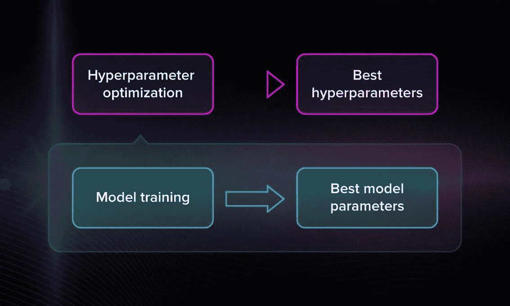
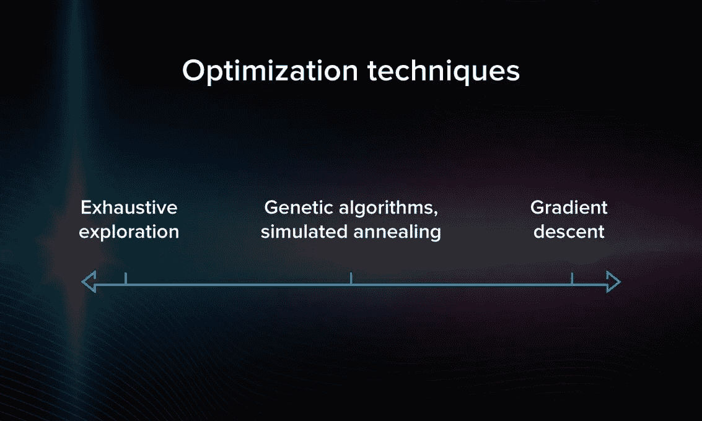
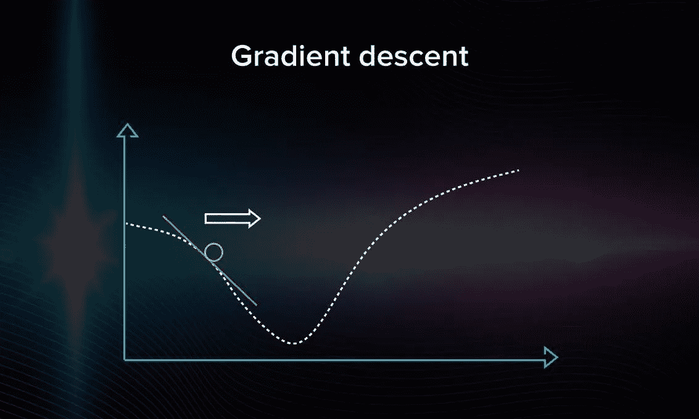
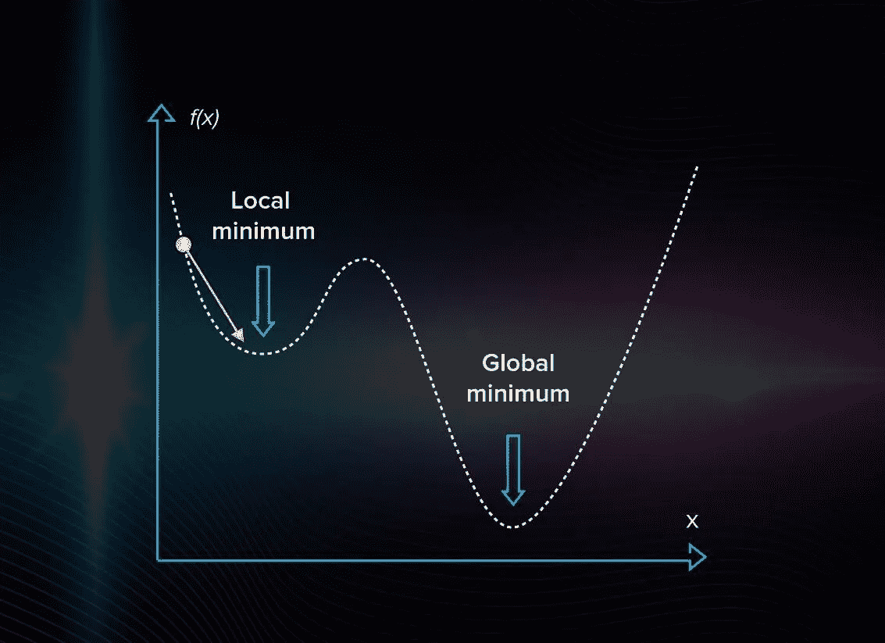
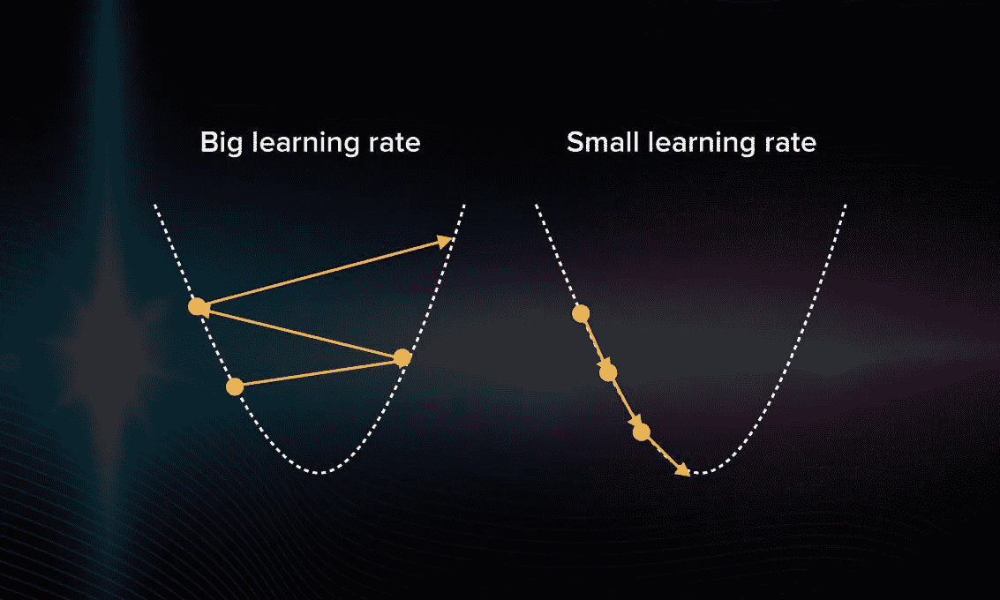
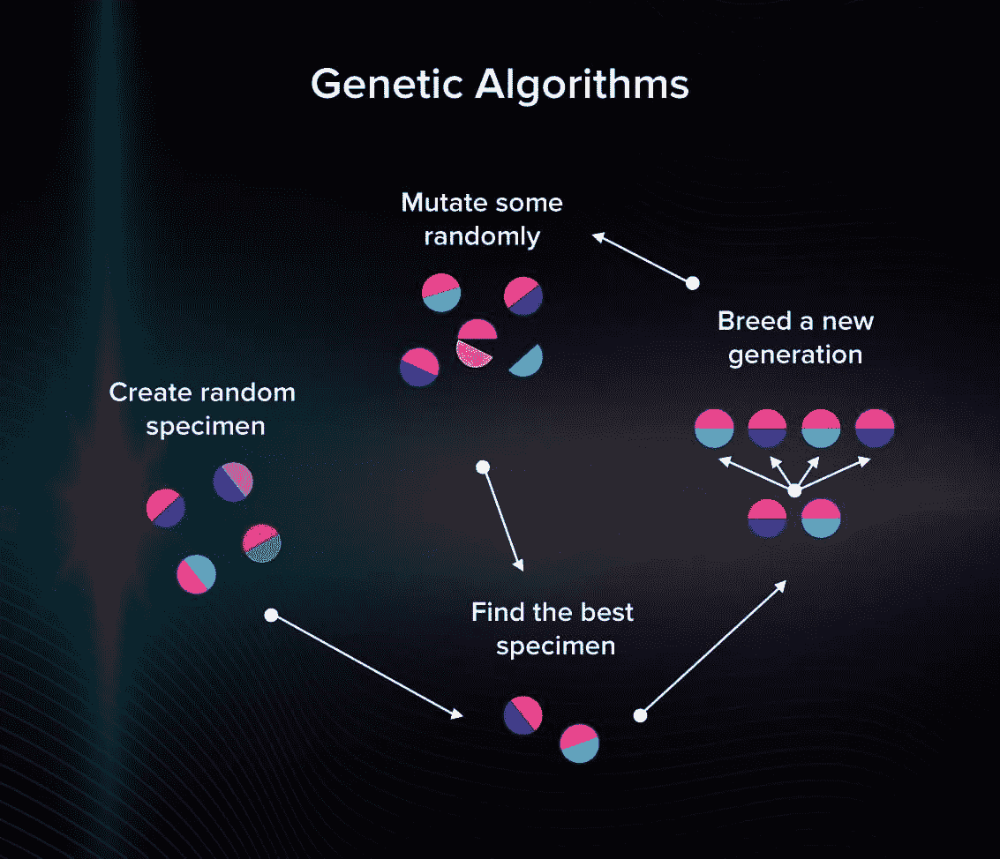

# 机器学习优化方法和技术

> 原文：<https://betterprogramming.pub/machine-learning-optimization-methods-and-techniques-56f5a6fc5d0e>

## 让你的机器学习模型更有效

乔纳森·霍克马克在 [Unsplash](https://unsplash.com/s/photos/perfect?utm_source=unsplash&utm_medium=referral&utm_content=creditCopyText) 上拍摄的照片。

机器学习的主要目标是创建一个在特定情况下表现良好并给出准确预测的模型。为了实现这一点，我们需要机器学习优化。

机器学习优化是通过使用一种优化技术来调整超参数以便最小化成本函数的过程。最小化成本函数很重要，因为它描述了估计参数的真实值和模型预测值之间的差异。

在本文中，我们将讨论 ML 优化技术的主要类型。

# 模型的参数和超参数

在我们进一步深入之前，我们需要了解模型的参数和超参数之间的区别。这两个概念很容易混淆，但我们不应该混淆。

*   您需要在开始训练模型之前设置超参数*。它们包括集群数量、学习率等。超参数描述了模型的结构。*
*   另一方面，模型的参数在训练期间获得。没有办法提前得到它们。例如神经网络的权重和偏差。该数据是模型的内部数据，并根据输入而变化。

作者照片。

为了调整模型，我们需要*超参数*优化。通过找到它们值的最佳组合，我们可以减少误差并建立最精确的模型。

## 超参数调谐的工作原理

正如我们所说，超参数是在训练前设置的。但是你不能预先知道，例如，在给定的情况下，哪个学习率(大或小)是最好的。因此，为了提高模型的性能，必须优化超参数。

每次迭代后，您将输出与预期结果进行比较，评估准确性，并在必要时调整超参数。这是一个重复的过程。您可以手动完成这项工作，或者使用在处理大量数据时会很方便的许多优化技术之一。

# 机器学习中的顶级优化技术

现在，让我们来谈谈可以用来优化模型超参数的技术。

## 穷举搜索

穷举搜索或强力搜索是通过检查每个候选是否是良好匹配来寻找最佳超参数的过程。当你忘记自行车锁的密码时，你会做同样的事情，尝试所有可能的选择。在机器学习中，我们做同样的事情，但是选项的数量通常是相当大的。

穷举搜索法很简单。例如，如果您正在使用 k-means 算法，您将手动搜索正确的分类数。然而，如果有成百上千个选项需要你去考虑，那就变得沉重而缓慢，令人难以忍受。这使得暴力搜索在大多数实际情况下效率很低。

作者照片。

## 梯度下降

梯度下降是最常见的最小化误差的模型优化算法。为了执行梯度下降，您必须在重新调整模型的同时迭代训练数据集。

您的目标是最小化成本函数，因为这意味着您可以获得尽可能小的误差并提高模型的准确性。

作者照片。

在图中，您可以看到梯度下降算法如何在变量空间中行进的表示。要开始，你需要在图上随机取一点，任意选择一个方向。如果看到误差越来越大，说明你选错了方向。

当你不能再改进(减少误差)时，优化就结束了，你找到了一个局部最小值。在下面的视频中，您将逐步了解渐变下降的工作原理:

目前看起来没问题。然而，当有几个局部极小值时，经典的梯度下降将不能很好地工作。当找到第一个最小值时，你将简单地停止搜索，因为算法只找到一个局部的。它不是用来寻找全球的。

作者照片。

注意:在梯度下降中，你以同样大小的步伐前进。如果你选择了一个过大的学习率，算法将会在没有接近正确答案的情况下跳来跳去。如果它太小，计算将开始模仿穷举搜索，这当然是低效的。

作者照片。

所以你必须非常谨慎地选择学习速度。如果做得好，梯度下降会成为一种计算高效且相当快速的优化模型的方法。

## 遗传算法

遗传算法代表了 ML 优化的另一种方法。这些算法逻辑背后的原理是试图将进化论应用于机器学习。

在进化论中，只有具有最佳适应机制的物种才能生存和繁衍。在机器学习模型的情况下，如何知道哪些标本是最好的，哪些不是？

想象一下你有一堆随机算法。这将是你的人口。在具有一些预定义超参数的多个模型中，一些模型比其他模型调整得更好。让我们找到他们！首先，你计算每个模型的精确度。然后，你只保留那些效果最好的。现在，您可以生成一些与最佳模型具有相似超参数的后代，以获得第二代模型。

你可以在这张图片中看到这个算法背后的逻辑:

作者照片。

我们多次重复这个过程，只有最好的模型会在过程结束时存活下来。遗传算法有助于避免陷入局部最小值/最大值。它们通常用于优化神经网络模型。

# 深度学习模型的优化

使用[好的、前沿的算法](http://lipiji.com/docs/li2017optdl.pdf)进行深度学习，而不是通用算法，这很重要，因为训练需要如此多的计算能力。

带有动量的随机梯度下降、RMSProp 和 Adam Optimizer 是专门为深度学习优化而创建的算法。在 [deeplearning.ai](http://deeplearning.ai) 上有一系列关于神经网络优化的视频涵盖了这些算法，我们推荐观看。

## 带动量的随机梯度下降

这种方法的缺点是需要大量的更新，梯度下降的步骤有噪声。正因为如此，梯度可能会走向错误的方向，并变得非常计算昂贵。这就是为什么经常使用其他优化算法的原因。

## RMSProp

RMSProp 对于归一化梯度本身是有用的，因为它平衡了步长。它甚至可以处理最小的批次。

## Adam 优化器

Adam Optimizer 可以处理噪声问题，甚至可以处理大型数据集和参数。

# 进一步阅读

就如何优化每一个 ML 模型给出一般性的建议是很难的，而且在道德上几乎是错误的。这就是为什么最好通过例子来学习:

*   如果你对优化神经网络和比较不同优化器的有效性感兴趣，可以看看 [Sanket Doshi 关于这个主题的文章](https://towardsdatascience.com/optimizers-for-training-neural-network-59450d71caf6)。
*   你也可以通过 [Berkey AI research](https://bair.berkeley.edu/blog/2017/09/12/learning-to-optimize-with-rl/) 研究如何用强化学习优化模型。
*   在我们的博客上阅读更多关于 [DL 算法](https://serokell.io/blog/deep-learning-and-neural-network-guide)的内容。

祝你好运，玩得开心！