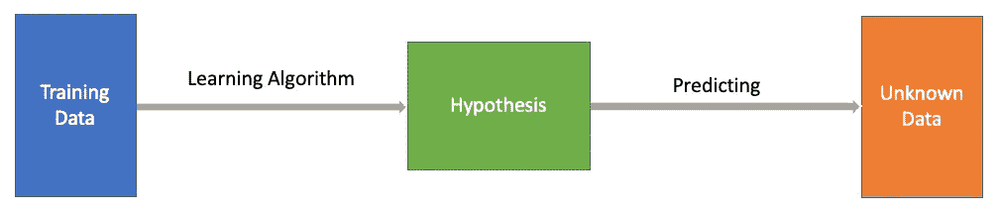
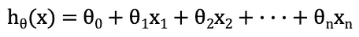
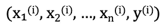
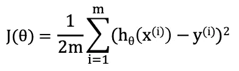
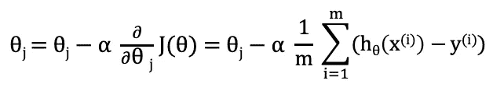
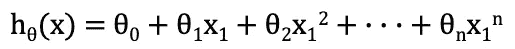
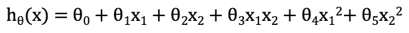
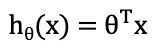
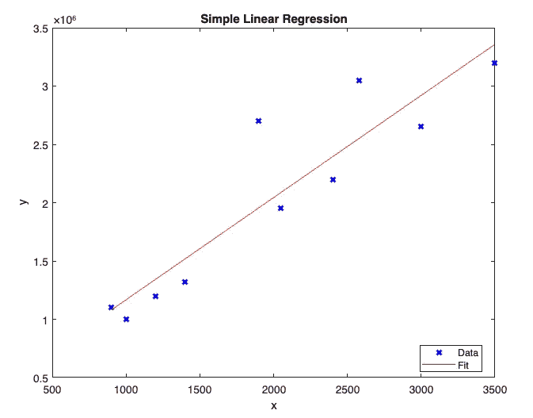
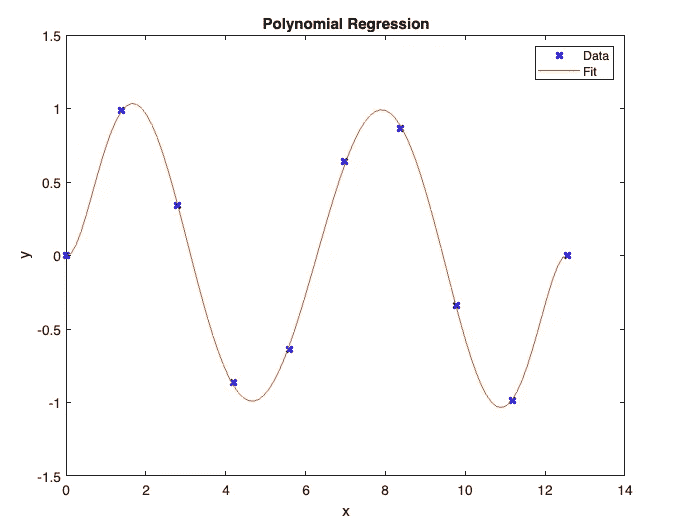

# 机器学习理论与编程—监督学习:回归分析

> 原文：<https://betterprogramming.pub/machine-learning-theory-and-programming-supervised-learning-regression-analysis-8ed2d86f5714>

## 流行的机器学习算法介绍

由[叶戈尔·迈兹尼克](https://unsplash.com/@vonshnauzer?utm_source=medium&utm_medium=referral)在 [Unsplash](https://unsplash.com?utm_source=medium&utm_medium=referral) 拍摄的照片

[机器学习](https://en.wikipedia.org/wiki/Machine_learning)作为人工智能的一部分，是对能够通过经验和通过使用数据自动改进的计算机算法的研究。

1959 年，计算机游戏和人工智能的先驱亚瑟·塞缪尔(Arthur Samuel)将机器学习定义为无需明确编程就能让计算机具备学习能力的研究领域。

在过去的几十年里，机器学习取得了显著的进步。1997 年，IBM 超级计算机“深蓝”击败了俄罗斯国际象棋特级大师加里·卡斯帕罗夫。2016 年，谷歌 DeepMind 人工智能程序 AlphaGo 击败了围棋世界冠军李·塞多尔(Lee Sedol)。机器学习算法已经被用于各种各样的应用中，例如在医学、电子邮件过滤、语音识别、计算机视觉和自动驾驶汽车中。

我们正在写一个关于机器学习理论和编程的入门系列。在本文中，让我们来看看监督学习:回归分析。

# 监督学习

监督学习建立了一个包含输入和正确输出的一组数据的数学模型。这些数据称为训练数据，是一组训练示例。这个数学模型就是一个把输入最好地映射到输出的函数，叫做假设(`h`)。

作者图片

训练之后，我们可以使用假设来预测新数据输入的输出。

监督学习对数据中的每个例子都有正确的答案，而无监督学习则采用一组只包含输入的数据。在没有正确答案的情况下，无监督学习使用更复杂的方法，并专注于在数据中寻找结构，例如数据点的分组或聚类。

还有半监督学习，其中训练样本具有一些输出。当与那些具有输出数据的示例结合使用时，那些没有输出数据的训练示例仍然在学习准确性方面产生相当大的改进。

监督学习收集数据，然后从以前的经验中产生一个输出。它基于计算算法解决现实世界的问题。

监督学习有以下常见类型:

*   **回归**:它使用一种算法来计算相关(目标)和独立(预测)输入之间的关系。流行的回归算法有线性回归和多项式回归。
*   **分类**:使用一种算法将测试数据准确地分配到特定的类别中。流行的分类算法有[逻辑回归](https://enlear.academy/logistic-regression-in-machine-learning-672c0e8c8053)，线性分类器[，支持向量机](https://javascript.plainenglish.io/machine-learning-theory-and-programming-supervised-learning-support-vector-machine-d6cc7a5747f1)，决策树，随机森林。

# 回归分析理论

回归分析是一种统计方法，对因变量(`y`)和一个或多个自变量(`x`)之间的关系进行建模。

线性回归是最简单和最流行的机器学习算法之一。它显示了因变量和自变量之间的线性关系。线性回归方程的假设定义如下:

例如，它可以是一个预测房屋价值(`h`)的模型，其中输入特征是平方英尺(`x₁`)、卧室号(`x₂`)、浴室号(`x₃`)、……和房主协会费(`xₙ`)。

对于每个`i = 1, 2, …, m`，训练数据集定义如下:

`(x₁, x₂, …, xₙ)`是一套房屋特征，`y`是实际评估的房屋价值。

成本函数(`J`)是一种返回预测结果和实际结果之间的误差的机制。

梯度下降是一种优化算法，用于计算系数以最小化成本函数。对于每个`j = 0, 1, …, m`，使用下面的等式迭代计算`θⱼ`，其中`α`是学习率。

由于`J(θ)`是凸函数，梯度下降应该收敛到全局最小值。对于足够小的`α`，每次迭代`J(θ)`都会减少。但是如果`α`太小，梯度下降可能需要很长时间才能收敛。

有了计算出的系数，`θ`，假设就可以训练新数据了。

当有一个输入变量时，称为简单线性回归。当有多个输入变量时，称为多元线性回归。

简单的线性回归算法更有可能欠拟合，这是指模型不能捕捉数据的潜在趋势。一个可能的解决方案是增加变量的数量。当然，使用更多的变量会增加计算的复杂性。

多项式回归是一种回归算法，将因变量(`y`)和自变量(`x`)之间的关系建模为 n 次多项式(非线性)。一元多项式回归方程定义如下:

多项式回归也可以是多个变量。这里有一个例子:

高阶多项式算法更有可能过度拟合，这是指模型对训练数据建模得太好，因此失去了通用性。当训练数据中的噪声或随机波动被模型拾取并学习为真实数据时，会发生过拟合。

总的来说，假设可以写成矩阵格式:

# 回归分析程序设计

从回归分析理论中，我们可以看到计算算法涉及到高等数学。如果我们使用普通的编程语言来训练模型，这是很复杂的。

幸运的是，我们被机器学习编程语言所赋能，比如 [MATLAB](https://matlab.mathworks.com/) 、 [Octave](https://www.gnu.org/software/octave/index) 、 [R](/exploring-the-ai-programming-language-r-102d25af9646) 等。对于一些通用编程语言，如 Python，它们提供了机器学习库。因此，训练一个模型可能只需要一次函数调用。

MATLAB 是 MathWorks 开发的专有多范式编程语言和数值计算环境。它提供了简单线性回归(`fitlm`)和多项式回归(`polyfit`)的内置函数。

## 简单线性回归示例

假设我们有十套房子，它们的评估值(`y`)是`$999,998, $1,320,000, $1,200,500, $2,650,000, $1,950,000, $3,200,000, $2,700,500, $2,200,400, $3,050,000, and $1,100,000`。我们使用一个变量，平方英尺，作为输入数据(`x`)。他们是`1,000ft², 1,400ft², 1,200ft², 3,000ft², 2,050ft², 3,500ft², 1,900ft², 2,400ft², 2,580ft², and 900ft²`。

下面是一个 MATLAB 程序:

第 1 行指定了函数名`houseAppraisal`和返回值`houses`。

第 2 行使用一个内置函数`fitlm`，来拟合带有特定参数的线性回归模式。`fitlm(X,y)`返回符合数据矩阵`X`的响应的线性回归模型`y`。

第 3 行是数据矩阵`X`，它列出了房屋评估值。

第 4 行是响应，`y`，它是平方英尺值的向量。

第 2–4 行有效地使用了一行代码来训练线性回归并将结果赋给返回值`houses`。

第 5 行绘制了线性回归`houses`，其中`linewidth`设置为 2。

第 6 行关闭了置信下限。默认情况下，该图显示`95%`置信界限。

第 7 行关闭了置信上限。

第 8 行标记 x 轴。

第 9 行标记了 y 轴。

第 10 行定义了绘图标题。

第 11 行定义了图例标签。

第 12 行终止该函数。

在 MATLAB 命令控制台，我们运行函数:

有很多关于线性回归模型的信息。它为我们的用例假设生成系数:`y = 290560 + 876.36x`。

它绘制如下:

作者图片

如果我们用这个模型去测算一套`2000ft²`的房子，那么预测的房子价值就是`$2,043,280` ( `290560 + 876.36 * 2000`)。

## 多项式回归示例

以下是多项式回归的 MATLAB 程序:

第 1 行指定了函数名`polynomialExample`。

第 2 行调用一个内置函数`linspace`，返回一个从 0 到`4π`的行向量(`x`，其中包含 10 个均匀分布的点。是`[0 1.3963 2.7925 4.1888 5.5851 6.9813 8.3776 9.7738 11.1701 12.5664]`。

第 3 行生成一个向量(`y`)，它是每个`x`的正弦函数。就是`[0 0.9848 0.3420 -0.8660 -0.6428 0.6428 0.8660 -0.3420 -0.9848 -0.0000]`。

第 4 行绘制了 10 个点的`(x, y)`值，其中`marker`设置为十字(`x`)，`color`设置为蓝色(`b`)，而`linewidth`设置为 2。

第 5 行调用`hold on`来保留当前轴中的图形，这样添加到轴中的新图形不会删除现有图形。

第 6 行使用内置函数`ployfit`，返回最适合`y`中数据的`n`次多项式`p(x)`的系数。它返回一个向量，`[-0.0001 0.0028 -0.0464 0.3702 -1.3808 1.9084 -0.1141 0.0002]`。意味着训练好的模型的假设是`y = -0.0001x⁷ + 0.0028x⁶ - 0.0464x⁵ + 0.3702x⁴ — 1.3808x³ + 1.9084x² — 0.1141x + 0.0002`。

第 7 行生成了一个向量`x₁`，默认为 100 点。

第 8 行调用一个内置函数`polyval(p, x₁)`，在`x₁`中的每一点计算多项式`p`。结果是`y₁ = -0.0001x₁⁷ + 0.0028x₁⁶ - 0.0464x₁⁵ + 0.3702x₁⁴ — 1.3808x₁³ + 1.9084x₁² — 0.1141x₁ + 0.0002`。

第 9 行绘制了连续观察的 100 个点的`(x₁, y₁)`值。

第 10 行标记 x 轴。

第 11 行标记了 y 轴。

第 12 行定义了绘图标题。

第 13 行定义了图例标签。

第 14 行调用`hold off`将保持状态设置为关闭。

第 15 行终止该函数。

在 MATLAB 命令控制台，我们运行函数`polynomialExample`。它绘制了训练数据以及训练的多项式回归曲线。

作者图片

如果我们使用这个模型来预测输出，输入值`10`将生成`-0.5703` ( `polyval(p, 10)`)的输出。

# **结论**

有很多机器学习算法。我们已经介绍了监督学习中的线性回归和多项式回归。

机器学习编程语言设计有预建的库和对数据科学和数据模型的高级支持。我们已经展示了使用 MATLAB 实现线性回归和多项式回归的例子。

以下是其他机器学习算法的列表:

*   [逻辑回归](https://enlear.academy/logistic-regression-in-machine-learning-672c0e8c8053)
*   [神经网络](https://medium.com/geekculture/machine-learning-theory-and-programming-supervised-learning-neural-networks-74a598cb9e42)
*   [支持向量机](https://javascript.plainenglish.io/machine-learning-theory-and-programming-supervised-learning-support-vector-machine-d6cc7a5747f1)
*   [多类分类](https://javascript.plainenglish.io/machine-learning-theory-and-programming-supervised-learning-for-multiclass-classification-ee0d9d32150e)
*   [K-均值聚类](https://javascript.plainenglish.io/machine-learning-theory-and-programming-unsupervised-learning-k-means-clustering-52eeea41cba0)

感谢阅读。我希望这有所帮助。如果你有兴趣，可以看看[我的其他媒体文章](https://jenniferfubook.medium.com/jennifer-fus-web-development-publications-1a887e4454af)。

*特别感谢 Josh Poduska、Andrew Ziegler、Subir Mansukhani 推荐机器学习资源！还有，感谢吴恩达教授的* [*机器学习课*](https://www.coursera.org/learn/machine-learning) *。*