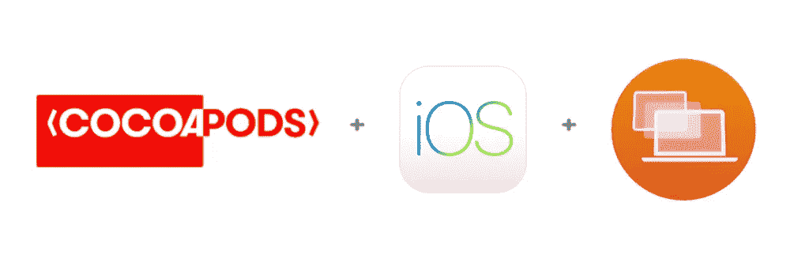
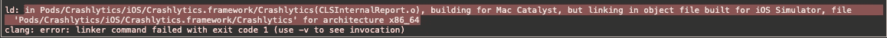
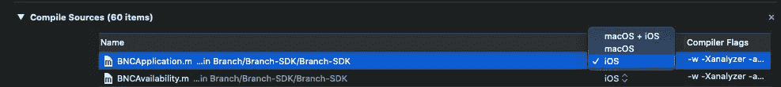

# 在你的 iOS 应用中支持 macOS Catalyst:使用不是为 macOS 编译的 pod

> 原文：<https://betterprogramming.pub/macos-catalyst-debugging-problems-using-catalyst-and-cocoapods-579679150fa9>

## 在 Podfile 中创建一个脚本，以便在编译时跳过不兼容的 pods



# 介绍

你是否正在尝试使用 [Catalyst](https://developer.apple.com/mac-catalyst/) 并将你的应用移植到 macOS，但是在编译 [CocoaPods](https://cocoapods.org/) 依赖关系时遇到了麻烦？您是否想知道通过添加新目标和复制方案来更改项目配置是否值得？如果是这样，继续读下去，因为这是为你准备的。

在本文中，我将告诉您如何通过向您的`Podfile`添加一个脚本来配置您的 Pods 项目，以便它可以与 Catalyst 一起使用，从而轻松地解决这个问题。

我们将从理解问题开始，我将让您知道如何手动修复它，最后，我将分享脚本以及您可以采取的一些其他方法。

请注意，您仍然需要使用:

```
#if !targetEnvironment(macCatalyst) 
// code to be excluded at compilation time from your macOS app
#endif
```

在您导入 pod 的那些文件中。

# 概观

那么，我们遇到了什么问题？嗯，有很多我们日常使用的库在 iOS 上运行良好，但不支持 x86_64 架构，即 macOS。

目前，这些 pod 或库的一些示例如下:

*   [防撞系统](https://github.com/firebase/firebase-ios-sdk)
*   [布料](https://get.fabric.io/)
*   [基火/核心](https://github.com/firebase/firebase-ios-sdk)
*   [FBSDKCoreKit](https://github.com/facebook/facebook-ios-sdk)

但是为什么他们不支持呢？他们很可能依赖于:

*   Cocoa 框架:[资产库](https://developer.apple.com/documentation/assetslibrary)， [OpenGL ES](https://www.khronos.org/opengles/) ， [WebKit](https://developer.apple.com/documentation/webkit) ，…
*   第三方库:Google [AppMeasurement](https://firebase.google.com/docs/reference/android/com/google/android/gms/measurement/AppMeasurement) ，FIRAnalyticsConnector， [GoogleUtilities](https://cocoapods.org/pods/GoogleUtilities) ，…

也就是说，macOS 不支持或不推荐使用的库。如果依赖项是静态的，则链接依赖项时会出现错误:



```
ld: in Pods/Crashlytics/iOS/Crashlytics.framework/Crashlytics(CLSInternalReport.o), building for Mac Catalyst, but linking in object file built for iOS Simulator, file 'Pods/Crashlytics/iOS/Crashlytics.framework/Crashlytics' for architecture x86_64clang: error: linker command failed with exit code 1 (use -v to see invocation)
```

如果是动态的，则在编译时出现错误:


```
Undefined symbols for architecture x86_64:
    "_OBJC_CLASS_$_UIWebView", referenced from:
    objc-class-ref in BNCDeviceInfo.o
    objc-class-ref in BranchViewHandler.o
ld: symbol(s) not found for architecture x86_64
clang: error: linker command failed with exit code 1 (use -v to see invocation)
```

# 解决办法

解决方案是告诉 Xcode 跳过那些不支持 macOS 架构的库的链接和编译阶段。让我们看看如何为静态和动态框架手动完成这项工作。

## 动态框架

动态框架带有要在客户端编译的源代码。要跳过这个框架的编译，我们要做的就是:

*   转到 Pods 项目。
*   找到框架目标。
*   进入构建阶段，编译源代码。
*   将平台过滤器更改为 iOS。



## 静态框架

静态框架不需要编译(它们已经被编译了)，只需要链接就可以了。每次我们运行`pod install`或`pod update`时，CocoaPods 都会为我们生成一个配置文件。这些文件保存在您的项目目录下:

```
${PODS_ROOT}/Target Support Files/Pods-*MyAppTargetName*/Pods-*MyAppTargetName.my_configuration.xcconfig*
```

现在，如果你打开其中一个，你会看到这样的东西:

```
OTHER_LDFLAGS = $(inherited) -framework "Crashlytics" -framework "Fabric" -framework "FrameworkThatSupportsCatalyst"
```

你需要做的就是修改这一行，让那些与 macOS 架构不兼容的框架只为 iOS 和 iPadOS 编译:

```
OTHER_LDFLAGS = $(inherited) -framework "FrameworkThatSupportsCatalyst"OTHER_LDFLAGS[iphone*] = $(inherited) -framework "Crashlytics" -framework "Fabric"
```

## 附加步骤

如果框架也需要一个脚本，你需要做如下事情:

```
if [[$ARCHS != "x86_64"]]; then
  # run the script
fi
```

例如，对于 Fabric 或 Crashlytics 来说，这很好，因为它们不包含任何依赖关系。但是，比如说，依赖于谷歌工具的 Firebase 怎么样呢？

您需要在以下位置找到该目标的配置文件:

```
${PODS_ROOT}/Target Support Files/macCOS_*INCOMPATIBLE_FRAMEWORK*/macCOS_*INCOMPATIBLE_FRAMEWORK.xcconfig*
```

并应用相同的更改。这个依赖项可能已经被添加到框架目标或`Pods-MyAppTarget`目标中。

# 自动化流程

这听起来工作量很大，不是吗？有许多手动步骤要做，很容易遗漏一些东西。记住，这些步骤应该应用于每一个直接或间接的依赖项，也就是你的依赖项的依赖项。

如果你对 Ruby 有一些基本的了解，或者你愿意学习这种美丽的语言，你可以看看 Ruby 中的 [Xcodeproj](https://www.rubydoc.info/gems/xcodeproj) 和 [CocoaPods](https://rubydoc.info/gems/cocoapods/Pod/Installer/) 并创建一个脚本来实现这一点。

我想出的脚本采取以下步骤:

1.  转到每个 pod 目标的构建阶段，过滤其依赖项并编译源代码。
2.  确定这些框架添加了哪些依赖项，并且仅当 SDK 是 iOS 时才链接它们。

现在，考虑到脚本与您的`Podfile`在同一个目录中，您只需在您的`Podfile`的末尾添加一个调用:

```
# Podfile
load 'remove_unsupported_libraries.rb'target 'My target' do   
    use_frameworks!   
    # Install your pods   pod 
    ...
enddef unsupported_pods   
    ['Fabric', 'Crashlytics', 'Firebase/Analytics', ...]
enddef supported_pods   
    ['SwiftLint', 'Firebase/Auth', 'KeychainSwift', ...]
endpost_install do |installer|   
    $verbose = true # remove or set to false to avoid printing
    installer.configure_support_catalyst(supported_pods, unsupported_pods)
end
```

## 更新

有关更新和文档，请参见此存储库:

[](https://github.com/fermoya/CatalystPodSupport) [## 氧化亚铁/催化剂载体

### 如果你正在使用 CocoaPods 并且你的应用支持 macCatalyst，你可能会遇到这个错误:ld: in…

github.com](https://github.com/fermoya/CatalystPodSupport) 

# 其他方法

我会给你留下一些其他值得考虑的方法。

## 手动添加依赖项

您可以添加您的依赖老式风格，即，手动。问题是依赖树是疯狂的。另外，很容易在同一个库的不同版本之间产生冲突。

请注意，这可能暂时解决了您的问题，但是当您想要更新您的依赖项时，这将是一个痛苦的过程。

## 创建新目标

这是一个很好的解决方案:创建一个只为 macOS 编译的新目标，并让 CocoaPods 从 Podfile 管理每个目标的依赖项。

你可能会发现的唯一问题是，你将不得不重复你先前已有的目标和你可能有的所有计划。

在正常情况下，每个环境都需要一个方案，所以这个解决方案不能很好地扩展，因为很容易忘记对 macOS 目标应用相同的更改。

## Swift 软件包管理器

在我看来，这是最好的解决办法。如果框架支持 Swift Package Manager，至少您将能够从项目的构建阶段添加依赖性并管理平台过滤器。

# 资源

*   [Mac Catalyst:使用 Crashlytics / Firebase 移植应用](https://www.bitbuildr.com/tech-blog/mac-catalyst-porting-an-app-using-crashlytics-firebase)
*   [Xcodeproj](https://www.rubydoc.info/gems/xcodeproj)
*   [椰子](https://rubydoc.info/gems/cocoapods/Pod/Installer)