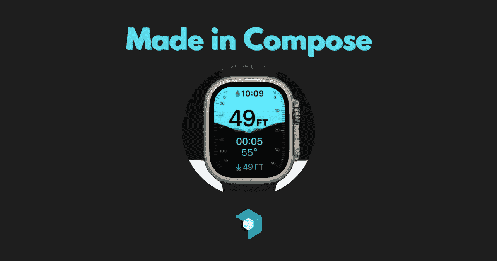
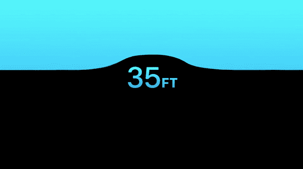

# 使用 Jetpack Compose 重新创建 Apple Watch 超高水位动画

> 原文：<https://betterprogramming.pub/made-in-compose-apple-watch-ultra-water-level-animation-9dc7cab099ac>

## 在组合#1 中制造



欢迎来到我的 Made in Compose 系列的第一篇文章，我尝试在 Jetpack Compose 中重新创建 UI 和动画，并分享我的过程。在这第一篇文章中，我将在新的 Apple Watch Ultra diving 应用程序中重现水位动画。



来源:苹果 keynote

这是苹果主题演讲中对我来说最突出的动画之一(除了动态岛)。这是一个简单的动画，通过外观来传递信息，看起来令人惊叹。

# 选择我的画布

首先，我必须决定用什么在屏幕上展示我的元素。不幸的是，就混合模式而言，普通组件在屏幕上绘制时没有提供很多定制。我选择使用`Canvas` composable 并在那里绘制元素，并且可以绘制复杂的路径以及调整它们的混合模式。

# 绘图文本

遗憾的是，在`Canvas` composable 中，没有直接的方法在屏幕上绘制文本。为了解决这个问题，我使用了`Canvas`视图互操作来使用它的`drawText`函数。

```
Canvas( 
    onDraw = {
  val paint = Paint().asFrameworkPaint()  
  paint.apply {  
      isAntiAlias = true
      color = android.graphics.Color.parseColor("#41E0E0")  
      textAlign = android.graphics.Paint.Align.CENTER
  }  

  drawIntoCanvas {  
      it.nativeCanvas.apply {  
          drawText(text, x, y, paint)  
      }  
  }
 }
)
```

# 动画波浪

`Canvas`允许我们在屏幕上绘制各种路径。在测试了几个变体之后，结果最好的是使用`cubicTo`函数的立方路径。
立方路径由四个点定义。一个起点和终点，以及两个控制点。我的立方路径是由一个函数定义的，它接受任意大小的 y 位置列表，并将它们均匀地分布在画布的宽度上。然后，我根据之前计算的点来计算控制点。

```
Path().apply {  
    moveTo(0f, 0f)  
    lineTo(0f, animatedY)  
    val interval = size.width * (1 / (aYs.size + 1).toFloat())  
    aYs.forEachIndexed { index, y ->  
        val segmentIndex = (index + 1) / (aYs.size + 1).toFloat()  
        val x = size.width * segmentIndex  
        cubicTo(  
            x1 = if (index == 0) 0f else x - interval / 2f,  
            y1 = aYs.getOrNull(index - 1)?.toFloat() ?: currentY,  
            x2 = x - interval / 2f,  
            y2 = y.toFloat(),  
            x3 = x,  
            y3 = y.toFloat(),  
        )  
    }  

    cubicTo(  
        x1 = size.width - interval / 2f,  
        y1 = aYs.last().toFloat(),  
        x2 = size.width,  
        y2 = animatedY,  
        x3 = size.width,  
        y3 = animatedY,  
    )  
    lineTo(size.width, 0f)  
    close()  
}
```

# 混合模式

在苹果的动画中，你会注意到，只有被波浪覆盖的文本部分才会切换颜色。为了实现这一点，我们将在画布中使用混合模式。混合模式允许我们操作。
有关所有可用混合模式的概述，请查看[此处](https://developer.android.com/reference/android/graphics/BlendMode)。在这个动画中，`BlendMode.Xor`给了我们想要的效果。
所以对于侧面的渐变线，我应用了这样的混合模式:

```
drawLine(  
    start = Offset(0f, y),  
    end = Offset(lineWidth, y),  
    brush = Brush.verticalGradient(  
        colors = listOf(  
            Color(0xFF41E0E0),  
            Color(0xFF279ED5),  
        )  
    ),  
    blendMode = BlendMode.Xor,  <----
    strokeWidth = strokeWidth,  
)
```

对于文本，我不得不使用与旧画布兼容的混合模式。

```
val paint = Paint().asFrameworkPaint()  
paint.apply {  
    isAntiAlias = true  
    textSize = 100.sp.toPx()  
    typeface = Typeface.create(Typeface.DEFAULT, Typeface.BOLD)  
    color = android.graphics.Color.parseColor("#41E0E0")  
    textAlign = android.graphics.Paint.Align.CENTER  
    blendMode = android.graphics.BlendMode.XOR  <----
}
```

这两者最终都会给我们同样的结果。

在 Compose 中使用混合模式的一个小警告:我必须在获得效果之前添加这一行。

```
Canvas(  
    modifier = Modifier  
        .graphicsLayer(alpha = 0.99f)  <----
        .fillMaxSize(),  
    onDraw = {
     ...
```

有了这些，我就可以创建一个水动画的基本版本了。以下是我的最终结果:


composable 的完整代码可从[这里](https://gist.github.com/sinasamaki/ce6160e7a8c0b8be4e060030bea2f194)获得。

这是我在 compose 中计划的一系列娱乐活动的第一篇文章。如果你有任何 UI 或动画的想法，在构图上做起来会很酷，让我在[推特](https://twitter.com/sinasamaki)上知道。

感谢阅读，祝你好运！

【https://www.sinasamaki.com】原载于[](https://www.sinasamaki.com/made-in-compose-apple-watch-ultra-water-level-animation/)