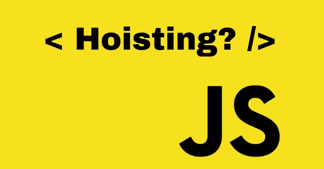

# 提升的魔力

> 原文：<https://betterprogramming.pub/magic-of-hoisting-3fec34978fd8>

## 探索 JavaScript 中的范围



*提升*是一种 JavaScript 机制，JavaScript 一编译完所有代码，使用`var` 的变量声明就被提升/提升到其作用域的顶部(如果在函数内声明，则提升到其函数/局部作用域的顶部，如果在函数外声明，则提升到其全局作用域的顶部)。

需要注意的一个关键点是提升只是移动了声明。作业留在原处。

我们举个例子来演示一下吊装的影响。

```
console.log(hoist);
var hoist = 'This variable has been hoisted.';
```

你认为输出会是什么？

1.  `Uncaught ReferenceError: hoist is not defined`
2.  `This variable has been hoisted.`
3.  `undefined`

大多数人会选择第一个选项，但事实证明第三个选项是正确的，因为提升会将声明移动到顶部，而赋值则留在原处。

上述代码与以下代码相同:

```
var hoist;
console.log(hoist); // undefined
hoist = 'This variable has been hoisted';
```

让我们来看另一个例子，看看函数范围内的变量是如何提升的:

```
function hoist() {
  console.log(message);
  var message = 'Hoisting is done.';
}hoist();
```

如果你猜对了`undefined`，你就对了。

解释器是这样看待上面的代码的:

```
function hoist() {
  var message;
  console.log(message); // undefined
  message = 'Hoisting is done';
}hoist(); // undefined
```

变量声明`var message`，其作用域是函数`hoist()`，被提升到函数的顶部。

正确的做法如下:

```
function hoist() {
  var message = 'This avoids the above pitfall.';
  console.log(message);
}hoist(); // This avoids the above pitfall.
```

# 提升功能

提升也移动了函数声明，但是这些声明位于最顶端，因此将位于所有变量声明之上。

如果你曾经想知道为什么你能在你的代码中写函数之前就调用它们，神奇的是通过提升实现的。

```
hoisted(); // This function has been hoisted.function hoisted() {
  console.log('This function has been hoisted');
}
```

但是，函数表达式不会被提升。

```
expression(); // TypeError: expression is not a function.var expression = function() {
  console.log('This function has been hoisted');
}
```

让我们来看另一个例子:

```
function foo() {
  function bar() {
    return 'bar1';
  } return bar(); function bar() {
    return 'bar2';
  }
}foo();
```

猜测产量？

输出是`bar2`。`foo`内的第一个函数将被提升。类似地，第二个函数声明也将被放在顶部。因为两个函数同名，所以第二个函数声明将替换第一个函数声明。因此，在执行时，将调用第二个函数`bar`。

# 但是 let 和 const 呢？

它们也被吊起—事实上，`var`、`let`、`const`、`function`和`class`申报被吊起。

## 让

用关键字`let`声明的变量是块范围的，而不是函数范围的。这只是意味着变量的作用域被绑定到声明它的块，而不是声明它的函数。

```
console.log(hoist); // ReferenceError: hoist is not defined
let hoist = 'This variable has been hoisted';
```

类似于关键字`var`，我们期望日志的输出是`undefined`。

`var`和`let`的实例可以在没有值的情况下初始化(如果你试图调用它，它将返回`undefined`)。

```
let hoist;
console.log(hoist); // undefined
hoist = 'This variable has been hoisted.';
```

## 常数

`const`关键字是在 es6 中引入的，以允许不可变的变量。使用`const`，就像使用`let`一样，变量被提升到程序块的顶部。

```
console.log(hoist); // ReferenceError: hoist is not defined
const hoist = 'This variable has been hoisted';
```

但是与`let`和`var`不同，我们不能在没有值的情况下初始化`const`。如果您尝试这样做，它将抛出一个`Error`。

```
const hoist;console.log(hoist); 
// SyntaxError: Missing initializer in the const declaration;hoist = 'This variable has been hoisted';
```

因此，`const`和`let`必须在使用前声明并初始化。

```
const foo = 'Hey, I'm foo!';
console.log(foo); // Hey, I'm foo!let bar = 'Hey, I'm bar!';
console.log(bar); // Hey, I'm bar!
```

# 吊装等级

## 类别声明

JavaScript 类声明也被挂起。但是，在评估之前，它们保持未初始化状态。

```
var foo = new bar();
foo.height = 100;
foo.weight = 100;
console.log(foo); // Guess the output?class bar {
  constructor(height, weight) {
    this.height = height;
    this.weight = weight;
  }
}
```

如果你猜对了`undefined`，这次你错了。输出为`ReferenceError: foo is not defined`。为什么？`bar`在声明之前被使用，这对于类变量是非法的。

```
class bar {
  constructor(height, weight) {
    this.height = height;
    this.weight = weight;
  }
}var foo = new bar();
foo.height = 100;
foo.weight = 100;
console.log(foo); // { height: 100, weight: 100 }
```

## 类别表达式

类表达式不被提升。

```
var Square = new Polygon();
Square.height = 10;
Square.width = 10;
console.log(Square); // TypeError: Polygon is not a constructor

var Polygon = class Polygon {
  constructor(height, width) {
    this.height = height;
    this.width = width;
  }
};
```

正确的做法是:

```
var Polygon = class Polygon {
  constructor(height, width) {
    this.height = height;
    this.width = width;
  }
};

var Square = new Polygon();
Square.height = 10;
Square.width = 10;
console.log(Square);
```

# 结论

我们应该养成习惯，在使用之前声明和初始化 JavaScript 变量、类和函数。

参考:[https://scotch . io/tutorials/understanding-raising-in-JavaScript](https://scotch.io/tutorials/understanding-hoisting-in-javascript)