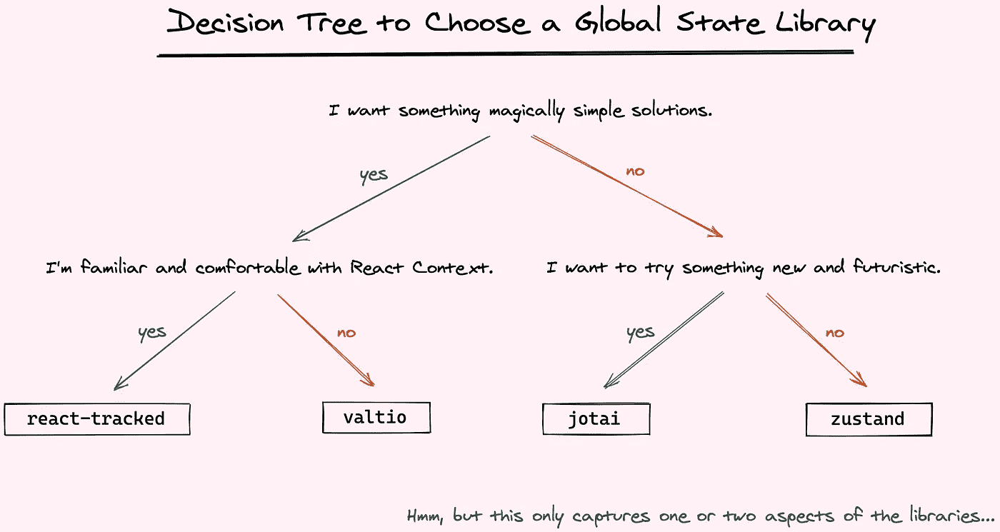
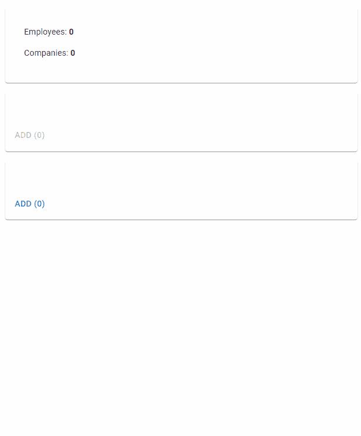
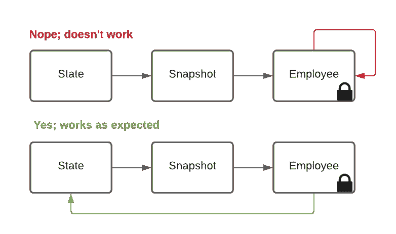
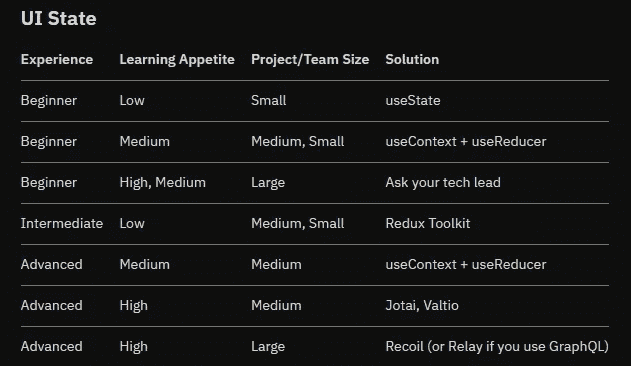

# React With Valtio 中应用程序状态管理的探索

> 原文：<https://betterprogramming.pub/magical-experiments-in-react-state-with-valtio-2b40cf159120>

## 使用 Valtio 库在反应状态下进行(神奇的)实验

valtio 项目的启动画面

[Lee Robinson](https://medium.com/u/c729ed050916?source=post_page-----2b40cf159120--------------------------------) 有一篇名为[*React 状态管理的过去、现在和未来*](https://leerob.io/blog/react-state-management) 的精彩文章，其中他探讨了 React 应用程序状态管理的当前状态。

一个突出的 React 州管理库是 [Daishi Kato](https://medium.com/u/70508c010e42?source=post_page-----2b40cf159120--------------------------------) 的`[valtio](https://github.com/pmndrs/valtio)`，领先于 Lee 的文章中列出的多个州库，包括:

*   约泰
*   祖斯坦德
*   还有其他人！

根据他的推文，Kato 总结了 React 应用程序状态管理的决策树:

加藤的决策树用于哪个库。

报名参加“ ***神奇简单的解决方案*** ”。

如果你读过我之前关于 YAGNI 的文章，你就会知道我是“简单”解决方案的倡导者；当它们“神奇地简单”时就更好了。

为了探索`valtio`以及它如何处理状态管理，我构建了一个简单的应用程序:

1.  随机增加了一个`Company`
2.  随机添加一个`Employee`并将`Employee`分配给一个`Company`
3.  按需进行服务呼叫，以检索`Employee`的补偿金额
4.  合计给定`Company`的所有`Employee`的总薪酬

GitHub 回购可在处[获得。](https://github.com/CharlieDigital/react-valtio-example)

花点时间看看下面的实际情况，特别注意`Company`之后的美元金额:

一个简单而巧妙的反应，valtio，MUI，Vite 应用程序。特别注意公司名称和员工数后的美元金额。

Redux 基于不可变状态的概念运行，`valtio`使用*代理状态*。

如果你使用过 Vue，那么你已经熟悉了代理状态。至少对我来说，代理状态看起来更自然、更容易推理，而且在实践中也不那么冗长。

> 与不可变状态不同，我们改变状态并保持相同的对象。因为 JavaScript 对象本质上就是可变的，所以可变状态更容易处理。
> 
> —加藤大司

用`valtio`来看看 app 状态是什么样子的吧:

保存我们公司和员工的 AppState

就是这样；很简单。我们所需要做的就是在出口前用`proxy`包装它。

在显示公司的 UI 模型中，我们可以通过调用`useSnapshot(appState)`来使用状态:

请特别注意第 44、51 和 62 行

在第 27 行，对`appState.companies.push()`的调用将以一种被动的方式改变我们的状态，并导致 UI 呈现。

在第 34 行，我们使用一个*快照将状态拉入组件。*注意这一点很重要，因为从快照中检索到的对象实例是不可变的。在 valtio 中，突变必须直接针对状态发生(第 27 行)。我们一会儿会深入探讨这个问题。

记住第 45 行。属性`c.salaries`表示一个计算值，它是给定公司的所有雇员的工资总和。

让我们来看看`Employee`是如何添加到`Company`中的:

`valtio`的关键在于，我们可以通过不张扬地更新`appState`来直接操纵状态，并且我们得到的相应更新完全符合我们在 UI 中的预期。

在第 45–50 行，我们添加了一个新的`Employee`，然后将该实例插入到一个`Company`中……一切正常。

第 78 行开始变得有点有趣。单击按钮`“GET$$”`将对 web 服务进行服务调用，以检索`Employee`的补偿。然后将该值分配给`Employee`并在`Company`上汇总。

让我们来看看`Employee`类:

注意第 40 行的注释

在第 35 行，我们进行了一个 web 服务调用来检索一个随机值，作为补偿分配给`Employee`。

值得注意的是，因为我们已经从`EmployeeGenerator.tsx`的`useSnapshot`中检索到了`Employee`的这个实例，所以它的属性`compensation` *不能使用`this.compensation = compensation`直接变异*(老实说，这只是下一级魔法)。

下图显示了上面清单中的第 37–47 行:

更新属性需要我们直接突变状态！

为了更新补偿，我们需要从 state 中获取原始值，并对那个进行变异(在这个例子中我使用全名，但是在现实世界中，我们会使用 ID)。

更有趣的是当我们看`Company`时:

还记得上面的薪水吗？

看一看`salaries`。它是使用 getter 计算出来的值。

但是当我们更新与这个`Company`相关联的`Employee`的实例时，这个 getter *的值会在组件中自动更新。*

在一个层面上，`valtio`似乎让 React 状态管理变得愚蠢简单*。另一方面，它是如何做到这一点的，这是相当神奇的。*

与 Tommy Groshong 的 React MVC 相比，valtio 使得在 React 上构建 MVC 应用程序变得非常简单。

我觉得李·罗宾逊对选择标准的看法很有趣:

至少对我来说，`valtio`感觉绝对，简单得可笑，而且确实相当神奇。

# 进一步阅读

[Daishi Kato 关于 valtio](https://blog.axlight.com/posts/how-valtio-proxy-state-works-vanilla-part/) 内部的博文。

Riccardo Giorato 的文章比较了 valtio 和另一种基于代理的方法 mobx。