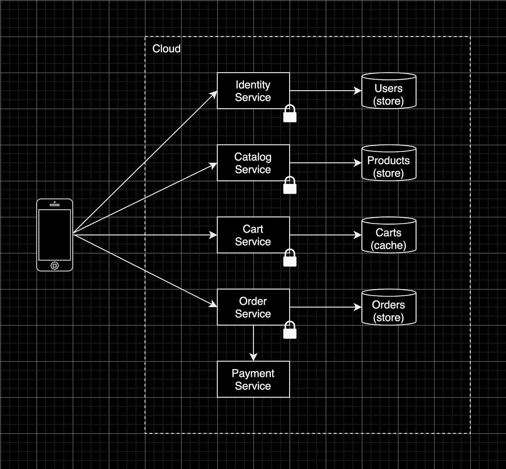
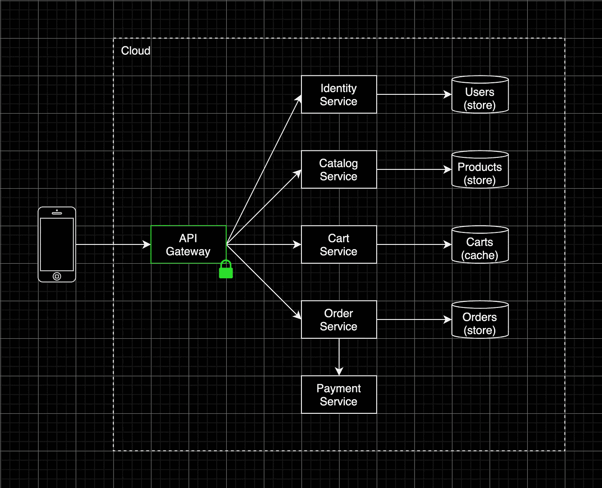
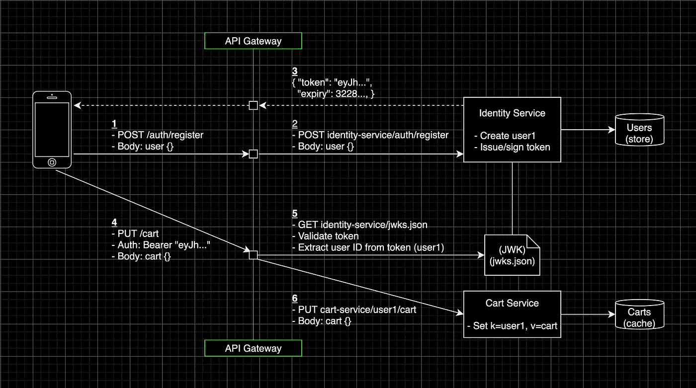

# 面对 API 复杂性的可维护性

> 原文：<https://betterprogramming.pub/maintainability-in-the-face-of-api-complexity-e23531e2d322>

## API 网关的内容、原因和方式


Denys Nevozhai 在 [Unsplash](https://unsplash.com/s/photos/highway-los-angeles?utm_source=unsplash&utm_medium=referral&utm_content=creditCopyText) 上拍摄的照片

API 网关是一个组件，它将流量路由到后端，并将客户端从 API 契约中分离出来。它通过一个内聚的 API 接口封装了一个复杂的应用架构。除了封装和反向代理之外，它们还可以从单个服务中卸载横切关注点，比如身份验证、速率限制和请求日志。

## 身份危机

近年来出现了许多用于请求管理和处理的工具。与数据系统一样，数据存储被用作消息队列，消息队列具有类似数据库的持久性保证，代理、网格和网关之间的界限正在变得模糊。

为了避免混淆，本文假设每个解决方案都有以下主要职责:

*   **服务网状。**一个专用的网络基础设施，覆盖在您的服务之上，卸载*服务间的通信功能*，例如加密、可观察性和弹性机制。
*   **API 网关。**提供跨应用架构的内聚抽象的组件，同时代表单个服务卸载*边缘功能*。

我们现在来看看 API 网关的“为什么”,稍后再看一个代码示例。

# 发展就是维护


照片由[古伊列梅·崔林](https://unsplash.com/@guiccunha?utm_source=unsplash&utm_medium=referral&utm_content=creditCopyText)在 [Unsplash](https://unsplash.com/?utm_source=unsplash&utm_medium=referral&utm_content=creditCopyText) 上拍摄

众所周知，软件的大部分成本都花在日常维护上。交付后的所有增强和修复都被视为“维护工作”——保持系统运行、分析故障、适应不同的平台、修复 bug，以及偿还[技术债务](https://en.wikipedia.org/wiki/Technical_debt#:~:text=Technical%20debt%20(also%20known%20as,approach%20that%20would%20take%20longer.)。我们应该设计能够轻松适应不断变化的需求的系统，使维护模式不那么痛苦。

> 总是这样编码，就好像最终维护你的代码的人会是一个知道你住在哪里的暴力精神病患者――约翰·伍兹

# 变化是不可避免的

业务优先级变化、底层平台变化、法律法规要求变化、您的用户变化！绝大多数设计原则都专注于让事情“更容易改变”，这并不是巧合无论是隔离模块间的关注点([解耦](https://en.wikipedia.org/wiki/Coupling_%28computer_programming%29))，屏蔽简单[表象](https://en.wikipedia.org/wiki/Facade_pattern)背后的复杂交互，还是干脆不重复自己([干](https://en.wikipedia.org/wiki/Don%27t_repeat_yourself))；我们的目标应该是能够进化的系统，以便于将来的适应。


泰勒·拉斯托维奇在 [Unsplash](https://unsplash.com/?utm_source=unsplash&utm_medium=referral&utm_content=creditCopyText) 上的照片

> 对于每一个关键的决策，项目团队都致力于选择更少的现实版本。

# API 维护

随着组织从单一架构过渡到更加分布式或"[无共享](https://en.wikipedia.org/wiki/Shared-nothing_architecture#:~:text=A%20shared%2Dnothing%20architecture%20%28SN,to%20eliminate%20contention%20among%20nodes.&text=A%20SN%20system%20can%20scale,central%20resource%20bottlenecks%20the%20system.)"架构，其中服务是自我管理的，[云管理的](https://en.wikipedia.org/wiki/Mobile_backend_as_a_service)或"[无服务器功能](https://en.wikipedia.org/wiki/Serverless_computing)"，操作复杂性增加，提供可靠的 API 体验变得具有挑战性。这种复杂性降低了项目团队的速度，进一步增加了维护成本。



直接的客户端到服务的通信(由[本人](https://portfolio.fabijanbajo.com/)绘制)

在 API 管理中，直接的客户端到服务的通信往往会增加 API 的复杂性，并可能带来意想不到的后果:

*   **紧耦合。**客户端应用直接依赖于后端服务不断变化的 API 契约。
*   **知识重复。**每个公开的服务实现它自己的边缘功能，比如 SSL 终止和速率限制。
*   **多次往返。**由于复杂的 API 组合流，过多的网络往返可能会降低性能。
*   **增加了攻击面。**现在开放了更多的端口，公开了更多的服务，身份验证也变成了一个分布式问题。

> 提高可维护性并不一定意味着减少功能；这也意味着降低复杂性。

# 后端的外观

正确设计的抽象可以在简单的外观后面隐藏大量的实现细节。API 网关通过封装复杂的后端架构来提供这种抽象，同时公开一个一致的、客户端友好的 API 接口。



通过 API 网关进行通信(由[本人](https://portfolio.fabijanbajo.com/)绘制)

为了将(分布式)系统的 API 复杂性保持在可管理的水平，API 网关通过以下方式提供帮助:

*   **将客户与后端合同分离。** API 路由通过单独的请求路由配置进行管理，保持客户端接口的一致性。
*   **将跨领域问题整合到一个层级。**网关通过集中关键边缘功能的职责来减少重复并简化每项服务。
*   **跨服务聚合数据。**我们现在可以通过将单个客户端请求分派给几个内部服务并使用聚合的有效负载进行响应来应用“服务器端”API 组合。
*   **对外界隐藏内部服务。**仅暴露网关减少了网络攻击面，并允许集中式 API 安全管理。

# 带有 KrakenD 的声明式 API 网关

本文的剩余部分通过一个示例项目演示了 API 网关执行的一些常见任务。

目前一些流行的(开源)API 网关包括:

*   [孔](https://github.com/Kong/kong)
*   [Tyk](https://github.com/TykTechnologies/tyk)
*   克拉肯德

我选择 KrakenD 是因为它:

*   **简约。**一个 [docker 映像](https://hub.docker.com/r/devopsfaith/krakend/)和一个配置文件就足够了。
*   **无国籍和不变性。无状态、不可变和独立于周围的工作负载简化了维护并减少了耦合。**
*   **性能。**带一个附加网络跳，每个请求都必须经过，你希望它快。KrakenD 的构建考虑到了性能( [~每秒 18，000 个请求](https://www.krakend.io/docs/benchmarks/overview/))。

它遵循大多数[十二因素应用实践](https://12factor.net/)，是容器环境的理想候选。

# 该项目



项目工艺流程示例(由[本人](https://portfolio.fabijanbajo.com/)绘制)

示例应用程序代表了一个大型电子商务微服务项目的一部分，我正在试验一个 iOS 前端。我们将只使用以下部分:

应用:

*   **推车服务。**用 GO 写的 REST 服务，为注册客户管理购物车。
*   **身份服务。**用 Typescript 编写的 REST 服务，管理客户账户并发布 JSON Web 令牌(jwt)。
*   **网关**。一个 KrakenD(社区版)API 网关，处理请求路由、授权、有效负载验证和速率限制。

我为本文扩展了存储层，使其不依赖于 Postgres 和 Redis，并保持简洁。

基础设施:

*   库伯内特，赫尔姆&斯卡福德。所有工作负载都通过 Kubernetes Helm charts 打包。Skaffold 处理*工作流*来构建整个项目并将其部署到集群中。
*   **码头工人作曲。代替 Kubernetes，这个项目也可以通过 Docker Compose 来构建和部署。**

为了简单起见，我们将在下面几节中使用 Docker Compose 来构建我们的网关清单，尽管存储库中提供了一个完全可用的 Kubernetes 配置。

```
Project:.
├── [identity-service/ (nodejs microservice)](https://github.com/Bajocode/article-apigateways/tree/master/identity-service)
│ ├── src/
│ ├── Dockerfile
│ └── Makefile
├── [cart-service/ (golang microservice)](https://github.com/Bajocode/article-apigateways/tree/master/cart-service)
│ ├── src/
│ ├── Dockerfile
│ └── Makefile
├── [kubernetes-helmcharts/](https://github.com/Bajocode/article-apigateways/tree/master/kubernetes-helmcharts)
│ ├── identity-service/
│ ├── cart-service/
│ └── gateway/
├── krakend.yaml
├── docker-compose.yaml
└── skaffold.yaml Versions:Kubernetes:  1.21.2
Helm:        3.3.3
Skaffold:    1.27.0
Docker:      20.10.5
Go:          1.15.2
NodeJS:      12.19.0
KrakenD:     1.2
```

> 示例应用程序的完整源代码可以在 [GitHub](https://github.com/Bajocode/article-apigateways) 上找到。

## 使用 [Docker Compose](https://docs.docker.com/compose/install/) 构建和部署

安装[对接器](https://docs.docker.com/get-docker/)并运行:

```
$ docker compose up
...
[+] Running 3/3
 ⠿ Container cart-service      Started  4.0s
 ⠿ Container identity-service  Started  5.8s
 ⠿ Container gateway           Started  7.0s
```

docker——构建和运行容器的配置

## 用[库伯内特](https://docs.docker.com/desktop/kubernetes/#:~:text=The%20Kubernetes%20server%20runs%20within,not%20affect%20your%20other%20workloads.)、[赫尔姆](https://helm.sh/)和[斯卡福德](https://skaffold.dev/)建造和部署

在本地或云中创建一个 Kubernetes 集群。

> Docker 桌面包括一个独立的 Kubernetes 服务器和运行在您机器上的客户端。要启用 Kubernetes，请转到 **Docker** > **首选项** > **Kubernetes** ，然后点击**启用 Kubernetes** 。

[安装 Skaffold](https://skaffold.dev/docs/install/) 和[舵](https://helm.sh/docs/intro/install/)，展开所有舵图:

```
$ skaffold run --port-forward=user --tail
...
Waiting for deployments to stabilize...
 - deployment/cart-service is ready.
 - deployment/gateway is ready.
 - deployment/identity-service is ready.
Deployments stabilized in 19.0525727s
```

Skaffold 配置用于构建容器并通过舵图部署它们

## 作为代码的 API 配置

在`project-root/krakend.yaml`创建一个新的 KrakenD 清单，内容如下:

```
krakend.yaml
---
version: 2
endpoints: []
```

我在这里做的只是指定文件格式的版本。

## 按指定路线发送

在`endpoints`数组下添加一个端点对象，并公开`GET /users`身份服务端点:

```
krakend.yaml
---
...
endpoints:- endpoint: /users
  method: GET
  output_encoding: no-op
  backend:
  - url_pattern: /users
    encoding: no-op
    sd: static
    method: GET
    host:
    - [http://identity-service:9005](http://identity-service:9005)
```

*   `no-op`(无操作)编码确保客户端请求像一样被转发到后端*，反之亦然。*
*   `static` resolution 是默认的服务发现设置，也是我们将用于 Docker Compose 网络的设置。

对于 Kubernetes 部署，将`*sd*`设置为`*dns*`(启用 [DNS SRV](https://kubernetes.io/docs/concepts/services-networking/dns-pod-service/) 模式)

重启网关并执行一个`GET /users`请求:

```
$ docker compose restart gateway$ curl '[http://0.0.0.0:8080/users'](http://0.0.0.0:8000/users') \
  --request GET \
  --includeHTTP/1.1 401 Unauthorized
...
{
  "status": 401,
  "message": "No Authorization header"
}
```

我已经为身份服务编写了[自定义 JWT 授权中间件](https://github.com/Bajocode/article-apigateways/blob/master/identity-service/src/middleware/authMiddleware.ts)，用于解码和验证 [JWT](https://en.wikipedia.org/wiki/JSON_Web_Token) 有效负载，可通过以下方式配置:

```
docker-compose.yaml
---
...
identity-service:
    environment:
    - JWT_VALIDATION_ENABLED=true
    - JWT_PATHS_WHITELIST=/auth/register,/auth/login,/jwks.json
```

保持上面的原样，用`register`和`login`路由扩展`krakend.yaml`,以从身份服务发布 JWT 令牌:

```
krakend.yaml
---
...
endpoints:- endpoint: /users
  ...- endpoint: /auth/register
  method: POST
  output_encoding: no-op
  backend:
  - url_pattern: /auth/register
    encoding: no-op
    sd: static
    method: POST
    host:
    - [http://identity-service:9005](http://identity-service:9005)- endpoint: /auth/login
  method: POST
  output_encoding: no-op
  backend:
  - url_pattern: /auth/login
    encoding: no-op
    sd: static
    method: POST
    host:
    - [http://identity-service:9005](http://identity-service:9005)
```

通过注册新用户来颁发 JWT 令牌，并将其导出到您的 shell 环境中供以后使用:

```
$ docker compose restart gateway$ curl '[http://0.0.0.0:](http://0.0.0.0:8000/auth/register')[8080](http://0.0.0.0:8000/users')[/auth/register'](http://0.0.0.0:8000/auth/register') \
  --request POST \
  --header "Content-type: application/json" \
  --include \
  --data '{
    "email": "som@ebo.dy",
    "password": "pass"
  }'HTTP/1.1 201 Created
...
{
  "token": "eyJhbGciOiJIUzI1NiIsInR5cCI6IkpXVCIsImtpZCI6InVzZX...",
  "expiry": 1623536812
}$ export TOKEN=eyJhbGciOiJIUzI1NiIsInR5cCI6IkpXVCIsImtpZCI6InVzZX...
```

将您的令牌插入到`Authorization`头中，并再次尝试获取所有用户:

```
$ curl '[http://0.0.0.0:](http://0.0.0.0:8000/users')[8080](http://0.0.0.0:8000/users')[/users'](http://0.0.0.0:8000/users') \
    --request "GET" \
    --header "Authorization: Bearer ${TOKEN}" \
    --includeHTTP/1.1 401 Unauthorized
...
{
  "status": 401,
  "message": "No Authorization header"
}
```

默认情况下，KrakenD 不会将客户端头发送到后端。

在`/users`端点对象下添加一个`headers_to_pass`属性，将`Authorization`请求头转发到后端:

```
krakend.yaml
---
...
endpoints:- endpoint: /users
  ...
  headers_to_pass:
  - Authorization
  backend:
  ...
```

随着`Authorization`头的转发，我们现在可以检索所有用户:

```
$ docker compose restart gatewaycurl '[http://0.0.0.0:](http://0.0.0.0:8000/users')[8080](http://0.0.0.0:8000/users')[/users'](http://0.0.0.0:8000/users') \
    --request "GET" \
    --header "Authorization: Bearer ${TOKEN}" \
    --includeHTTP/1.1 200 OK [{
   "id":"f06b084b-9d67-4b01-926b-f90c6246eed9",
   "email":"[som@ebo.dy](mailto:somebody@nobody.com)"
}]
```

目前为止我们的克拉肯清单:

## 卸载授权

我们不要为 cart 服务编写定制的 GO 授权中间件，而是通过将这个横切关注点卸载到网关来屏蔽它的端点。

[JSON Web 密钥集](https://datatracker.ietf.org/doc/html/rfc7517#section-4.1)格式用于向网关公开我们的令牌完整性验证密钥。为了简单起见，在编写身份服务(我们的[身份提供者](https://en.wikipedia.org/wiki/Identity_provider))时，我使用了 HS256 算法(HMAC-SHA256)生成对称签名:

```
$ echo -n 'secret' | openssl base64
c2VjcmV0
```

🤫

我们的 JWKS 包含相同的对称密钥，静态托管在`identity-service/jwks.json`:

```
# identity-service/jwks.json{
  "keys": [
    {
      "kty": "oct",     # key type (octet string)
      "kid": "userid",  # key id (identify the key in the set)
      "k": "c2VjcmV0",  # key
      "alg": "HS256".   # algorithm
    }
  ]
}
```

> 有关 JWK 标准的更多信息，请参考 [RFC 文件](https://datatracker.ietf.org/doc/html/rfc7517)。

将一个`PUT /cart`端点附加到清单上，并通过`krakend-jose`验证器插件屏蔽掉未注册的客户:

```
krakend.yaml
---
...
- endpoint: /cart
  method: PUT
  output_encoding: no-op
  extra_config:
    github.com/devopsfaith/krakend-jose/validator:
      alg: HS256
      jwk-url: [http://identity-service:9005/jwks.json](http://identity-service:9005/jwks.json)
      disable_jwk_security: true
      kid: userid
  backend:
  - url_pattern: /cart                   
    encoding: no-op
    sd: static
    method: PUT
    host:
    - [http://cart-service:9002](http://cart-service:9002)
```

这里我们指定“密钥 ID”，并通过将`disable_jwk_security`设置为`false`来允许 HTTP 访问我们私有的 jwk。

> 如果您关闭了您的 shell 会话，执行一个`/login`请求并将您的令牌重新导出到 shell 的环境中:
> `curl ‘[http://0.0.0.0:8080/auth/login'](http://0.0.0.0:8080/auth/login') -H “Content-type: application/json” -d ‘{“email”: “[som@ebo.dy](mailto:som@ebo.dy)”,”password”: “pass”}’`

使用有效令牌执行`PUT /cart`请求，以更新用户的购物车:

```
$ docker compose restart gateway$ curl '[http://0.0.0.0:](http://0.0.0.0:8000/cart')[8080](http://0.0.0.0:8000/users')[/cart'](http://0.0.0.0:8000/cart') \
  --request "PUT" \
  --header "Content-type: application/json" \
  --header "Authorization: Bearer ${TOKEN}" \
  --include \
  --data '{
    "items": [{
      "productid": "94e8d5de-2192-4419-b824-ccbe7b21fa6f",
      "quantity": 2,
      "price": 200
    }]
  }'HTTP/1.1 400 Bad Request
...
{
  "message": "Bad request: no userID"
}
```

cart 服务希望将客户端的用户 ID 添加到所有路径的前面。用户 ID 可以手动从 JWT 有效载荷中提取，因为我自己将它嵌入在用户 id JWT 声明下。

幸运的是，我们可以通过 KrakenD `JWT`变量访问经过验证的 JWT 有效负载，并将其传递给购物车端点的后端对象:

```
krakend.yaml
---
...
- endpoint: /cart
  ...
  backend:
  - url_pattern: /{JWT.userid}/cart                   
    ...
```

如果我们再次执行`PUT /cart`请求，它应该会成功地创建或更新`cart`:

```
$ docker compose restart gateway$ curl '[http://0.0.0.0:](http://0.0.0.0:8000/cart')[8080](http://0.0.0.0:8000/users')[/cart'](http://0.0.0.0:8000/cart') \
  --request "PUT" \
  --header "Content-type: application/json" \
  --header "Authorization: Bearer ${TOKEN}" \
  --include \
  --data '{
    "items": [{
      "productid": "94e8d5de-2192-4419-b824-ccbe7b21fa6f",
      "quantity": 2,
      "price": 200
    }]
  }'HTTP/1.1 201 Created
...
{
  "items": [
    {
      "productid": "94e8d5de-2192-4419...",
      "quantity": 2,
      "price":200
    }
  ]
}
```

下一步将是重构`GET /users`，将 JWT 验证也从`identity-service`中卸载。

我将把这作为一个练习。不过，在开始之前，请确保在身份服务中禁用服务级别 JWT 验证:

```
docker-compose.yaml
---
identity-service:
  ...
  - JWT_VALIDATION_ENABLED=false    # offloaded to the gateway!
  ...$ docker compose down && docker compose up
```

## 确认

下面的例子纯粹是为了说明，展示了 KrakenD 如何执行基于[模式](https://json-schema.org/)的 JSON 验证。明智的做法可能是不要将网关与业务逻辑耦合在一起(不像这个例子)，确保服务保持在它们的边界内。

出于说明的目的，让我们指定`/register`端点的`email`和`password`字段是`required`，并且必须是类型`string`:

```
krakend.yaml
---
...
- endpoint: /auth/register
  method: POST
  output_encoding: no-op
  extra_config:
    github.com/devopsfaith/krakend-jsonschema:
      type: object
      required:
      - email
      - password
      properties:
        email:
          type: string
        password:
          type: string
  backend:
  ...
...
```

首先，更改`email`键以发送无效有效载荷:

```
$ docker compose restart gateway$ curl '[http://0.0.0.0:](http://0.0.0.0:8000/auth/register')[8080](http://0.0.0.0:8000/users')[/auth/register'](http://0.0.0.0:8000/auth/register') \
    --request POST \
    --header "Content-type: application/json" \
    --include \
    --data '{
      "emai": "[no@ebo.dy](mailto:no@ebo.dy)",
      "password": "pass"
    }'HTTP/1.1 400 Bad Request
```

更正您的有效负载并验证请求是否成功:

```
$ curl '[http://0.0.0.0:](http://0.0.0.0:8000/auth/register')[8080](http://0.0.0.0:8000/users')[/auth/register'](http://0.0.0.0:8000/auth/register') \
    --request POST \
    --header "Content-type: application/json" \
    --include \
    --data '{
      "email": "[no@ebo.dy](mailto:no@ebo.dy)2",
      "password": "pass"
    }'HTTP/1.1 201 Created{
  "token":"eyJhbGciOiJIUzI1NiIsInR5cCI6IkpXVCIsImtpZCI6InVzZXJ...",
  "expiry":1625254416
}
```

## 限速

最后，我们将关注交通管理。为了保护我们的服务不被过度使用——无论是有意还是无意，我们可以对关键路径或未屏蔽路径进行速率限制，并为我们的客户建立使用配额。

首先，用 100 个请求轰炸我们的`/register`端点，看看会发生什么:

```
for i in {1..100}; do curl '[http://0.0.0.0:](http://0.0.0.0:8000/auth/login')[8080](http://0.0.0.0:8000/users')[/auth/register'](http://0.0.0.0:8000/auth/login') \
  --request POST \
  --header "Content-type: application/json" \
  --include \
  --data '{
    "email": "d[@d.](mailto:somebody@nobody.com)os",
    "password": "pass"
  }';
doneHTTP/1.1 201 Created
HTTP/1.1 409 Conflict
HTTP/1.1 409 Conflict
...
HTTP/1.1 409 Conflict # 100
```

每个请求都由身份服务处理，导致过多的处理和数据库通信。

现在为`/register`端点添加每秒 5 个请求的限制(每个 IP 地址)和每秒 100 个请求的上限:

```
krakend.yaml
---
...
- endpoint: /auth/register
    ...
    github.com/devopsfaith/krakend-jsonschema:
    ...
    github.com/devopsfaith/krakend-ratelimit/juju/router:
      maxRate: 100
      clientMaxRate: 5
      strategy: ip
    ...
...
```

注意网关是如何短路所有超过我们配额的请求的:

```
$ docker compose restart gatewayfor i in {1..100}; do curl '[http://0.0.0.0:](http://0.0.0.0:8000/auth/login')[8080](http://0.0.0.0:8000/users')[/auth/register'](http://0.0.0.0:8000/auth/login') \
  --request POST \
  --header "Content-type: application/json" \
  --include \
  --data '{
    "email": "d[@d.](mailto:somebody@nobody.com)os",
    "password": "pass"
  }';
doneHTTP/1.1 201 Created
HTTP/1.1 409 Conflict
...
HTTP/1.1 429 Too Many Requests
...
HTTP/1.1 429 Too Many Requests
```

## 知道什么时候停下来

随着 API 市场中的供应商不断添加特性来区分他们的产品，知道何时停止将责任推卸到边缘很重要。臃肿和过于雄心勃勃的网关很难测试和部署。

除了责任过多之外，其他可能的顾虑包括:

*   **单点故障。**作为后端层的单一入口点，我们必须确保网关具有弹性。通过[冗余](https://en.wikipedia.org/wiki/Redundancy_(engineering))、[弹性](https://en.wikipedia.org/wiki/Elasticity_(cloud_computing))和[故障恢复机制](https://en.wikipedia.org/wiki/Recovery-oriented_computing)避免单点故障。
*   **需要维护的额外服务。维护网关的工作会招致技术债务吗？这对开发团队的职责意味着什么？**
*   **一个额外的网络跳。**由于到后端的额外网络跳跃，网关可能会增加响应时间。虽然这比直接的客户端到后端的请求影响要小，但是持续地对系统进行负载测试仍然是至关重要的，这可以确保我们满怀信心地满足我们的 SLO。

## 最终的克拉肯清单

# 包扎

API 网关为客户端提供了一个可靠的接口，也是管理请求和响应的中心点。

在分布式架构中，它们可以用来卸载那些原本必须复制的横切功能。API 网关有很多优点，但是它也增加了另一个组件来维护和优化性能和可靠性。

感谢阅读。

*本文最初发布于:*[https://portfo lio.fabijanbajo.com/api-gateways](https://portfolio.fabijanbajo.com/api-gateways)