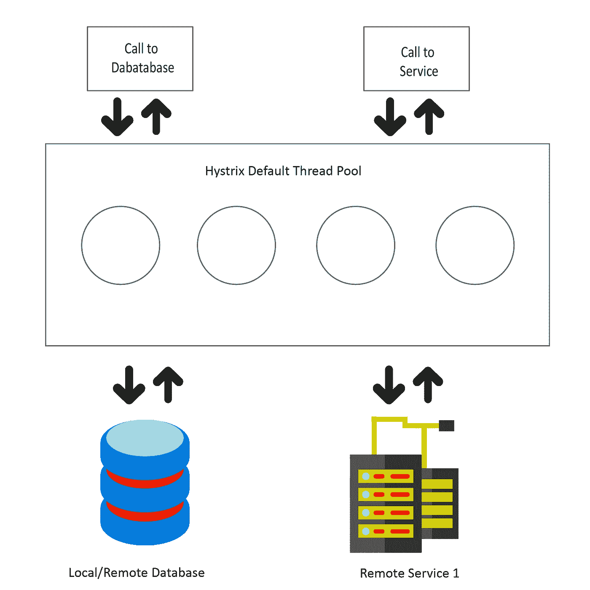
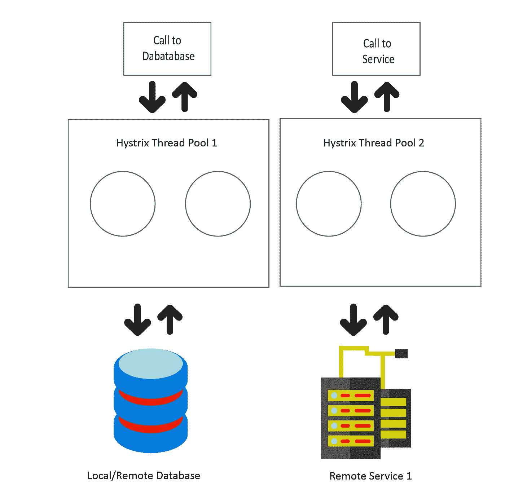

# 维护微服务架构中的弹性

> 原文：<https://betterprogramming.pub/maintaining-resiliency-in-a-microservice-architecture-729021f5369a>

## 通过利用隔板图案


由[马文·迈耶](https://unsplash.com/@marvelous?utm_source=unsplash&utm_medium=referral&utm_content=creditCopyText)在 [Unsplash](https://unsplash.com/search/photos/bulkhead?utm_source=unsplash&utm_medium=referral&utm_content=creditCopyText) 上拍摄的照片

微服务架构最重要的一个方面是*弹性*。如果服务失败，使用远程服务的客户机的可用资源永远不会耗尽，相反，它们应该被快速释放以供将来使用。网飞的 Hystrix 是一个久经考验的库，它实现了常见的弹性模式，如断路器和隔板，帮助我们设计了一个高度弹性的微服务架构。

使用一个或多个远程服务的客户端可以通过在服务无法交付时提供回退策略来利用 Hystrix 的强大功能。在多个远程服务调用的情况下，Hystrix 可以帮助隔离它们，以确保出现问题的服务不会导致整个系统停机。

任何用`@HystrixCommand`标注的方法都由 Hystrix 管理，因此，由一个代理包装，该代理通过一个单独的、最初固定的线程池管理对该方法的所有调用。下图高度概括了 Hystrix 的默认线程池，该线程池管理对它所管理的方法的所有调用。



Hystrix 默认池线程

Hystrix 的线程池的默认实现包含十个线程，用于处理 Hystrix 包装的调用。如果客户端是一个具有大量 Hystrix 包装调用的重型应用程序，这些调用可能是对远程数据库或服务的调用，会发生什么情况？答案很简单:可用线程将在短时间内耗尽，客户端将会失败。

解决办法？Hystrix 提供了实现隔板模式的方法，并为“每个”远程资源调用创建单独的线程池。如果一个资源调用可能会使用所有可用的资源，那么只有相关的线程池可能会失败，而客户端的其他部分则保持不变。隔板图案显示在下图中。



舱壁图案

如果数据库运行缓慢，它将影响线程池 1 中的其他远程调用，而由 Hystrix 管理的其他线程池保持不变，并继续执行它们各自的远程调用。

假设您已经建立了一个通过`FeignClient`调用另一个服务的服务，如下所示:

代码最初可能看起来很复杂，但真正的复杂性是由 Hystrix 自己管理的。在本例中，我为远程服务调用定义了一个定制线程池。关键字`threadPoolKey`为线程池定义了一个惟一的名称。

当指定新创建的线程池的大小时，默认情况下是 10，我们需要添加属性`coreSize`，在我们的例子中它被设置为 15。最后一个属性`maxQueueSize`的缺省值为-1，如果相应线程池中没有线程可供处理，Hystrix 将阻塞所有传入的请求。当该值大于 1 时，Hystrix 使用一个 [LinkedBlockingQueue](https://docs.oracle.com/javase/7/docs/api/java/util/concurrent/LinkedBlockingQueue.html) 对请求进行排队，直到有一个线程可供处理。

除了隔板模式，上面的例子还包括断路器模式。

每当对远程服务的调用失败或超时时，就会调用`getAssociatedInstitutionFallback`方法。请注意，这个回退方法与 Hystrix 包装的方法具有完全相同的签名。

如果一个 Hystrix 包装的方法连续 pings 一个不可用的、有问题的或资源耗尽的远程服务，会发生什么？回退方法会被持续调用吗？

除了提供实现断路器和隔板模式的方法之外，Hystrix 还提供了一个调用监控功能，该功能持续监控一个包装方法在一个可配置的 10 秒窗口内失败的次数，如果达到预定义的调用失败阈值，断路器将被触发，所有后续调用将直接失败，直到远程服务启动并运行。

扩展上面的代码，我们可以添加`commandPoolProperties` 来定制默认的‘快速失效’行为。

顾名思义，`circuitBreaker.requestVolumeThreshold`定义了在 10 秒窗口内必须发生的连续呼叫次数。如果达到这个数字，那么下一个属性`circuitBreaker.errorThresholdPercentage`定义了为了触发断路器需要失败的呼叫的百分比。

之后，所有连续的调用直接失败，不调用不可用的服务。现在，在某个时刻，应用程序需要检查远程服务是否已经恢复在线。这也由 Hystrix 处理，并在预定义的超时(当然是 10 秒)后发生，它可以被`commandPoolProperties`中的以下属性覆盖:

```
@HystrixProperty(name = “circuitBreaker.sleepWindowInMilliseconds”, value = “5000”)
```

为了提供完整的回退策略，让我们也包含一个超时属性。此属性控制使用回退策略之前的时间阈值。

尽管五秒钟的阈值并不理想，但对于测试目的来说还是不错的。注意，这些属性也可以添加到一个`application-*.yml`文件中。

# 资源:

[](https://www.manning.com/books/spring-microservices-in-action) [## Spring 微服务正在发挥作用

### 1.1.什么是微服务？1.2.Spring 是什么，为什么和微服务有关？1.3.您将在…中学到什么

www.manning.com](https://www.manning.com/books/spring-microservices-in-action) [](https://github.com/Netflix/Hystrix) [## 网飞/海斯特里克斯

### Hystrix 不再处于开发阶段，目前处于维护模式。Hystrix(版本 1.5.18)是稳定的…

github.com](https://github.com/Netflix/Hystrix)