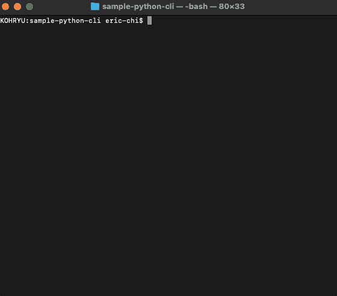
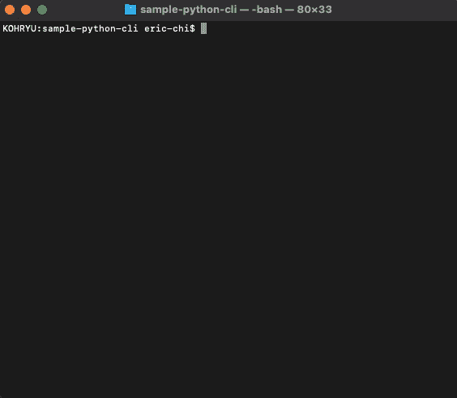

# 用 50 行 Python 代码创建一个 CLI

> 原文：<https://betterprogramming.pub/make-a-cli-in-50-lines-of-python-code-158c378eb4bd>

## 创建命令组、标志等


作者照片。

今天，我们将创建一个用 Python 构建的简单 CLI(命令行界面)。更具体地说，我们将使用一个叫做`click`的流行 Python 包，它允许我们加速这个过程。什么是 CLI？它是一个在你的终端内部做一些事情的工具。使用 CLI 工具，可能性是无限的。

`click`内置了许多特性，所以我将只介绍基本特性来帮助您入门。如果你有兴趣深入研究`click`提供的更复杂的特性，请查看[文档](https://click.palletsprojects.com/en/7.x/)。

# 1.安装点击

本教程假设您知道如何使用 Python。如果你不知道如何使用 Python，我建议在继续学习本教程之前先学习基础知识。

在开始之前，我们需要安装`click`。你可以通过运行下面的命令来安装`click`:

```
pip install click
OR
pip3 install click
```

我在我的环境上运行`pipenv install click`，因为我使用的是虚拟环境，但是如果你没有使用虚拟环境，上面的命令会做同样的事情。请记住，本文中的所有 gif 都将使用`pipenv run`来执行命令，因为我使用的是虚拟环境。


在你的机器上点击安装

运行该命令后，您的环境中应该已经安装了`click`。现在我们准备开始编码了。

# 2.设置文件

像大多数 Python 脚本一样，我们需要某种将要运行的主脚本。我将创建一个`main.py`文件。所以继续创建一个文件。该文件的内容应该如下:

如果您在终端中运行`python main.py`(确保您在同一个目录中)，您将看到如下内容:



运行脚本

这实际上只是一个 Python 脚本。`click`的功能还没用过。在下一节中，我们将通过引入某些特性来使它变得更加令人兴奋。

# 3.创建命令组

现在我们已经建立并运行了我们的文件，我们将开始探索`click`的特性。我们将首先创建一个命令组。命令组是我们创建绑定到单个脚本/标签的多个命令的一种方式。这里有一个例子:

在上面的代码片段中，我们创建了一个名为`main`的新组，它允许我们将多个函数/命令绑定到该组。这使我们可以将多个命令附加到一个脚本中，这样可以:

```
python main.py
```


与小组一起运行脚本

请注意，当我们不带任何参数运行脚本时，它现在会提示我们不同的可用命令——在本例中，是我们创建的两个函数。要调用特定的命令，您可以运行如下命令:

```
python main.py hello
OR
python main.py world
```

如果你想创建一个新的命令，那么就创建一个新的函数吧！运行这两个命令中的任何一个都将执行每个函数中的代码。


在主组中运行每个单独的命令

您可以通过为不同的目的创建不同的组来利用这一特性。您可以有一组特定于它们的命令，或者您可以有一个巨大的脚本，其中包含您希望放在一个组中的所有不同的命令。选择取决于您以及您希望如何构建该工具。

# 4.为命令创建标志/选项

我们将讨论的下一个特性对于 CLI 世界来说非常重要。许多 CLI 工具允许根据您的需要选择不同的选项。例如，`ls`列出了当前目录下的所有文件。但是，如果我们输入`ls -l`，它会以长格式列出它们，显示目录中每个项目的更多信息。这就是 T4 所说的选择。

要在`click`中创建一个选项，我们只需要给函数添加一个注释/装饰，如下所示:

这个选项变成了函数的一个参数，可以做任何你想做的事情。在这种情况下，我们只是根据用户在终端中输入的内容循环 *N* 次。如果用户没有输入任何标志，那么缺省值将决定这个函数的值。

```
python main.py hello
OR
python main.py hello -n 20
```



使用添加的标志运行 hello 命令

# 5.记录您的命令

既然我们已经探索了`click`的基本特性，我想讨论的最后一件事就是添加文档。大多数 CLI 都在程序中内置了文档，帮助用户理解每个命令和标志/选项的作用。`click`的美妙之处在于它可以毫不费力地格式化并显示给用户。你所需要知道的就是把你的帮助信息放在哪里。

请注意帮助消息的位置。命令级帮助消息作为函数注释创建，标志/选项帮助消息放在`click.option()`注释的属性内。要查看您的帮助信息，输入`--help`将显示您上传的信息。

```
python main.py --help
```

像这样显示命令级帮助消息:


命令级帮助消息

```
python main.py hello --help
```

显示命令的标志/选项帮助消息，如下所示:


标志/选项级帮助消息

# 结论

本教程向您介绍了如何使用 Python 制作 CLI 的基础知识。其他的包都允许你这么做，但是我感觉`click`用起来很简单，也很有效。

如果你想部署你的代码，我[写了一篇文章](https://medium.com/better-programming/publishing-your-python-packages-to-pypi-e48c169f4f09)，讲述了如何打包和部署代码到`pip`。这将允许您与世界各地的其他人共享您的 CLI。

如果你有任何问题或希望有一个讨论，随时评论！

完整的源代码可以在 GitHub 上找到[。](https://github.com/ericjaychi/sample-python-cli)

编码快乐！