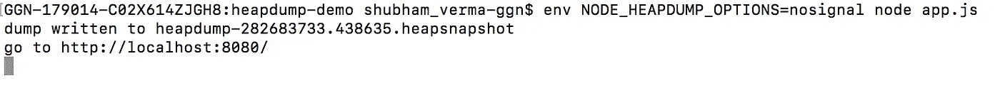
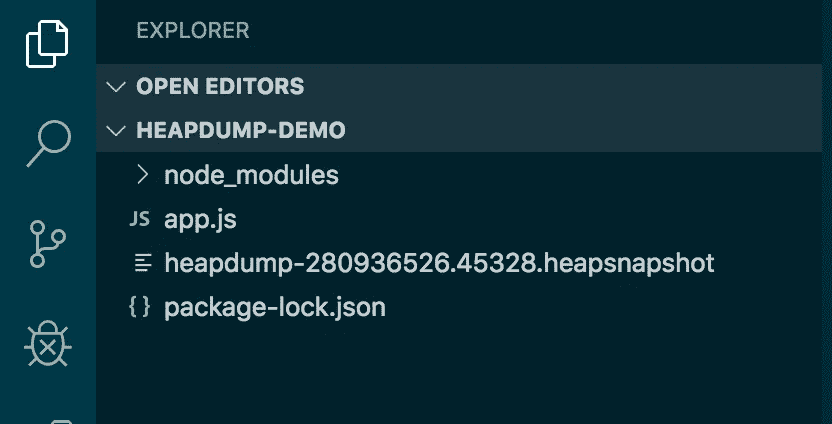
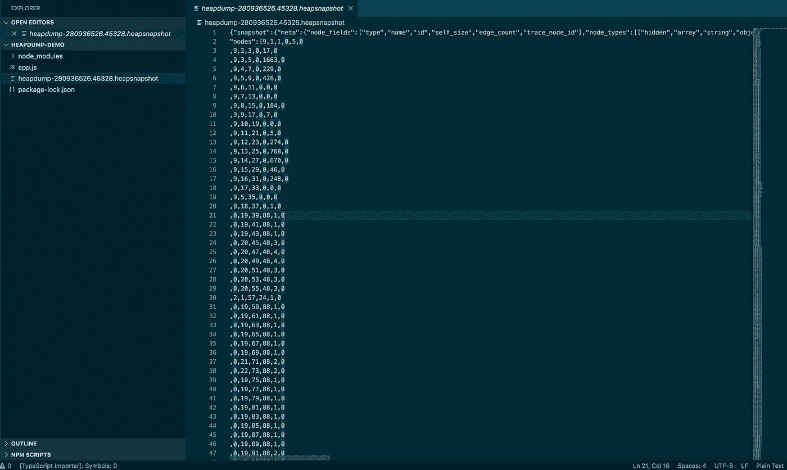
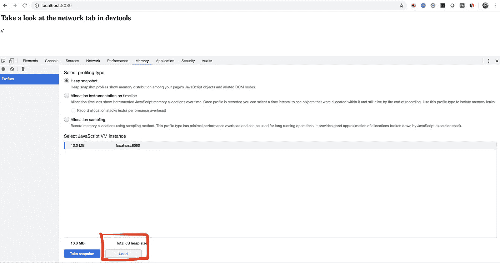
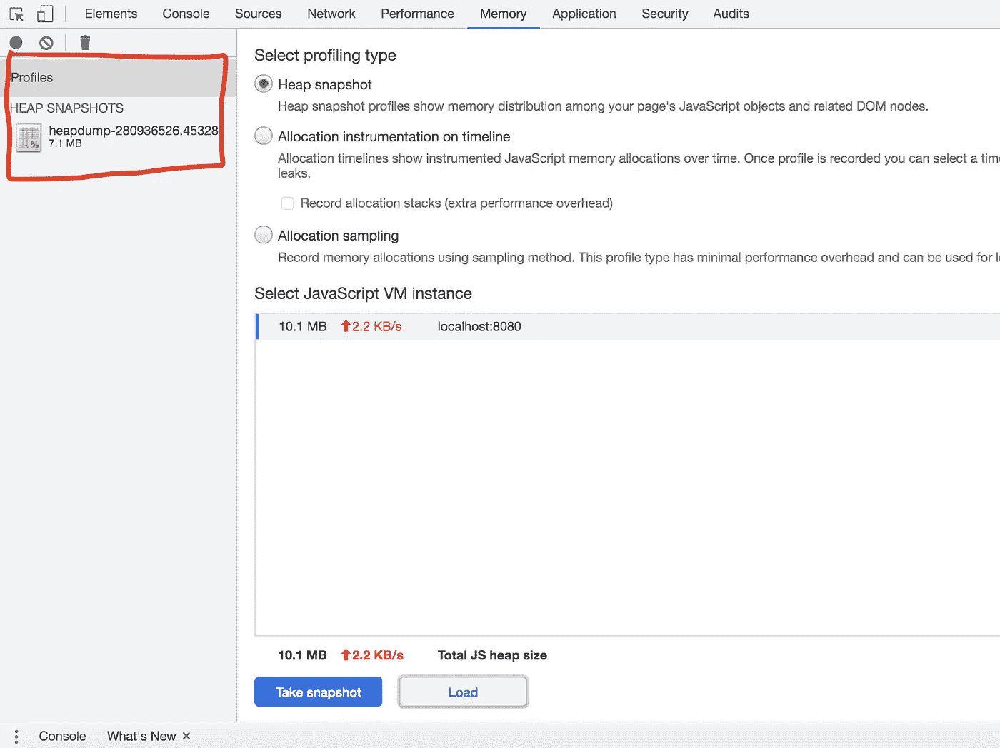
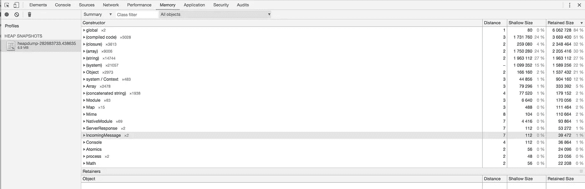
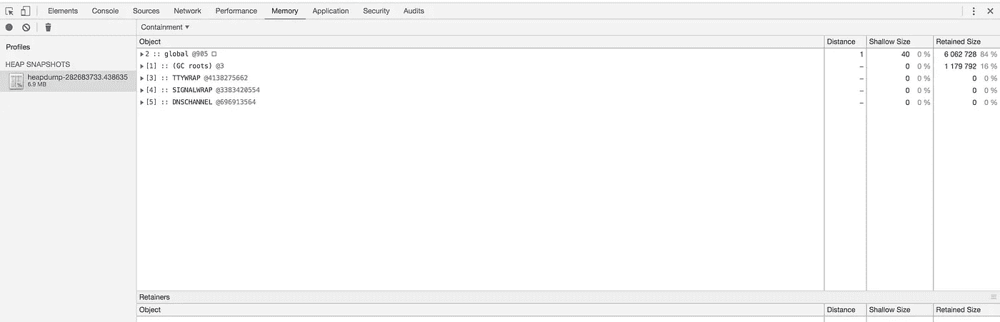
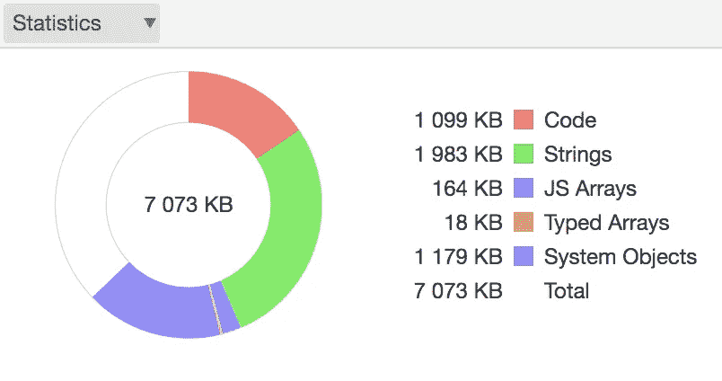

# 在 Nodejs 中创建 V8 堆的转储

> 原文：<https://betterprogramming.pub/make-a-dump-of-the-v8-heap-and-inspect-for-your-node-app-b69f7b68c162>

## 获取 V8 堆的转储，检查它，并学习如何用 DevTools 记录快照


凯文·布茨在 [Unsplash](https://unsplash.com/s/photos/v8?utm_source=unsplash&utm_medium=referral&utm_content=creditCopyText) 上的照片

在本文中，我们将学习如何转储 V8 堆并检查该堆，我们还将学习如何使用 Chrome[DevTools](https://developers.google.com/web/tools/chrome-devtools)heap profiler 记录堆快照并发现内存泄漏。

[Node.js](https://nodejs.org/) 越来越受欢迎，各种类型的应用程序都在使用 Node.js 作为后端解决方案，因此我们需要确保我们的应用程序没有内存泄漏。

为了确保我们的应用程序没有内存泄漏，我们将采用堆转储。堆转储可以包含有助于发现内存泄漏的数据。因此，为此，我们将把 [npm](https://www.npmjs.com/) 模块[堆转储](https://www.npmjs.com/package/heapdump)集成到我们的应用程序中。

为了进行演示，我们将创建一个小节点应用程序，它有一个文件`app.js`，并遵循下面的步骤。

# **步骤 1。创建节点应用程序**

创建一个名为`heapdump-demo`的文件夹，并在其中添加一个文件。

`app.js`:

```
**const** express = require('express')**var** heapdump = require('heapdump');**const** app = express();app.get('/', (req, res) **=>** { res.send(`<h2>You are at the best place to learn</h2>`);
})heapdump.writeSnapshot('/' + Date.now() + '.heapsnapshot');heapdump.writeSnapshot(**function** (err, filename) { console.log('dump written to', filename); });app.listen(8080, () **=>** {console.log(`go to http://localhost:8080/`)});
```

# **步骤二。安装依赖项**

打开您的终端并转到文件位置。使用下面的命令安装依赖项:

```
npm install express heapdump
```

# **第三步。运行应用程序**

使用以下命令运行应用程序:

```
env NODE_HEAPDUMP_OPTIONS=nosignal node app.js
```



命令“env NODE _ heap dump _ OPTIONS = no signal NODE app . js”的快照

打开浏览器，点击网址`http://localhost:8080/`。(保持开放。)

现在，在终端里，有一条消息`dump written to heapdump-280936526.45328.heapsnapshot`。这意味着您的堆快照已经创建。现在你需要使用这个转储。

您还可以在 [VS 代码](https://code.visualstudio.com/)中看到这个堆转储文件。(我用的是 VS 代码。)



文件“heap dump-280936526.45328 . heap snapshot”的快照

现在，打开 VS 代码中的文件`heapdump-280936526.45328.heapsnapshot`。它看起来像下面的图像:



# 第四步。将堆转储上传到 Chrome DevTools

要上传此堆转储，您需要遵循以下说明。

打开 Chrome 浏览器= >打开 Chrome DevTools = >转到内存= >点击加载按钮= >从特定位置加载文件`heapdump-280936526.45328.heapsnapshot`。



Chrome 开发工具

成功加载后，你可以在 Chrome 工具的左侧 *Profile* 和*HEAP snapshot*下看到这个文件，如下图:



显示上传的快照

# 步骤 5:检查数据

点击上传的文件`heapdump-280936526.45328.heapsnapshot`并检查数据。

你可以在这里看到一个总结:



摘要

你可以看到容器:



包含

你可以看到统计数据:



统计数字

如果您想了解更多关于内存泄漏或节点应用程序分析的信息，或者想了解更多关于堆转储及其内存的信息，请阅读下面的文章:

*   [为您的 Node app | Profiling Node.js app 创建火焰图](https://medium.com/@svsh227/create-a-flame-graph-for-your-node-app-profiling-nodejs-app-e0a91e5ed585)
*   [检测节点应用程序中的内存泄漏|分析节点应用程序](https://medium.com/swlh/profiling-node-app-detect-the-memory-leak-in-your-node-app-3663f61cb02f)
*   [检测节点应用程序的内存使用情况](https://medium.com/@svsh227/profiling-nodejs-application-detect-the-memory-uses-of-node-app-use-of-inspect-d3f6a723c513)

# **结论**

本文的结论是，您可以使用下面的代码根据条件创建堆转储，并比较数据:

```
heapdump.writeSnapshot('/' + Date.now() + '.heapsnapshot');heapdump.writeSnapshot(**function** (err, filename) {console.log('dump written to', filename);});
```

这段代码负责创建堆转储。现在您可以将它添加到您的项目中，创建一个堆转储，并检查它。

恭喜你，你正在成为 Node.js 的专家。感谢阅读！