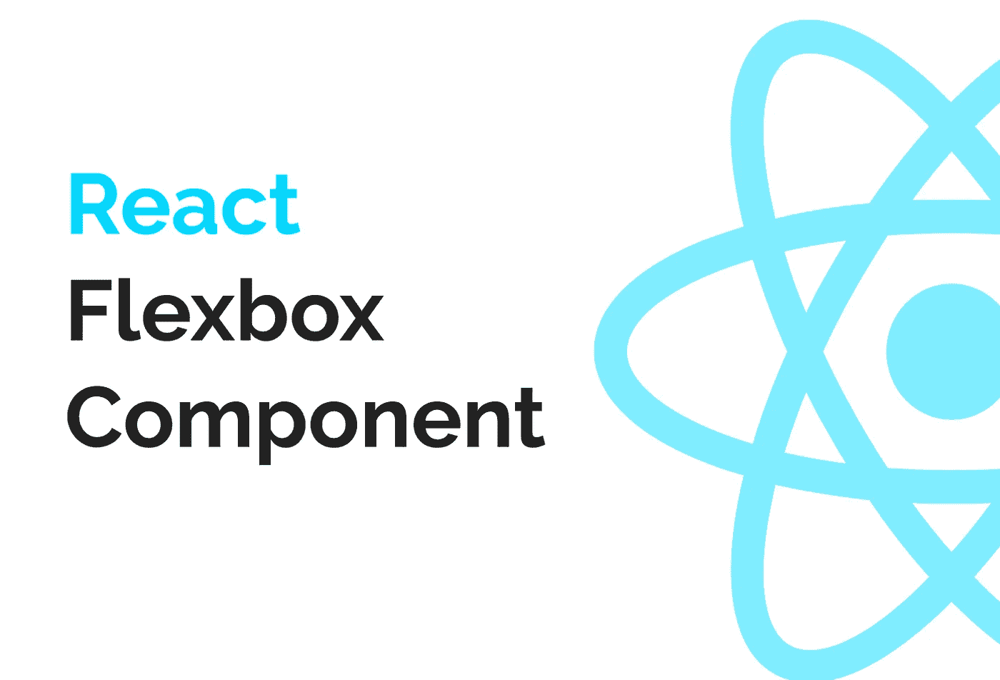

# 使 Flexbox 反应组件

> 原文：<https://betterprogramming.pub/make-a-flexbox-react-component-e96a038da7ec>

## 仅用 27 行代码就可以扩展窗口大小的组件

我们自己做一个吧

Flexbox 是一个无价的工具。许多组件库如 [Material-UI](https://material-ui.com/) 和 [Semantic UI](https://semantic-ui.com/) 提供了使用 Flexbox 的组件。

有一些较小的库试图将 Flexbox 打包成一个组件，但是大多数已经非常过时或者 API 不够… *Flexbox* 足够*。*

# 包装纸 div 的黑暗时代

你有没有写过一个容器 div，然后意识到它只是一个带有 flex 属性的 div？

你是否曾经用 flex 属性一次性制作了一个完整的样式组件，然后费劲地给它命名？也许你把它叫做`FlexWrapper`或者`FlexColumn`。

这是一个 div 用于布局的例子。

如果你从事过一个大项目，你会知道这会很快变得一团糟。

理想情况下，我们想要这样的东西:

# 那么，我们如何建造它呢？

我们会让事情变得非常简单。您将能够复制和粘贴代码，并根据您的需要对其进行修改。我们的目标是使它可以普遍使用，并且是纯 React。

准备好了吗？

不，说真的…这会很快…你在听吗？

在这里！

它如此简单…却又如此有用

有时候，你真的要去欣赏生活中简单的事情。谁知道这样的组件会是其中之一？

这里缺少一些功能，比如散布道具、交换元素(例如:将`div`换成`button`或`header`标签)，以及其他你可能会觉得方便的东西。

但是因为太简单了，所以从这里修改起来很容易。对于 80%的用例来说，这应该足够了。

# 我们在这里得到了什么？

*   对应于 [Flex API](https://www.ooaccess.com/products/flex-api/) 的 API。我们唯一的额外道具是`container`来决定是否使用`display: flex`，也许还有一些有用的属性，比如`className`、`width`、`height`、`padding`和`margin`。
*   代码更少。我们只使用`Flex`组件，而不是为每个 div 编写一堆单独的、一次性的样式。需要管理的样式更少！
*   更快的原型制作。有时候，你只是想尽快建立一个原型。`Flex`组件完全是为了节省时间。
*   更容易阅读。当你看到一个`Flex`组件，你就看到了道具，你就知道它到底是做什么的。你不必担心想出晦涩难懂的名字。
*   免费且普遍可用的图书馆。除了 React 之外，我们没有使用任何东西，也没有任何东西增加我们的代码库。

# 打字稿和流程

我没有忘记我的 Typescript 和 Flow 用户。为了方便起见，这里有两种类型。

# 沙盒示例

这里有一个完整沙盒例子的链接，你可以用它来玩。