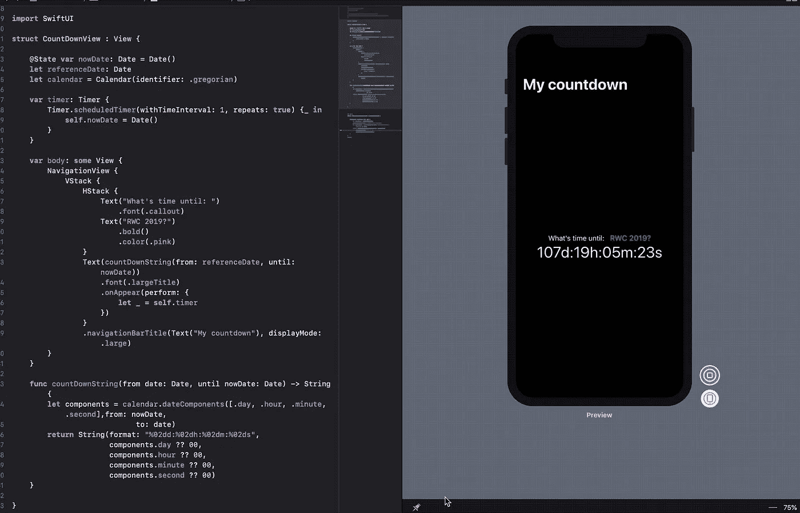
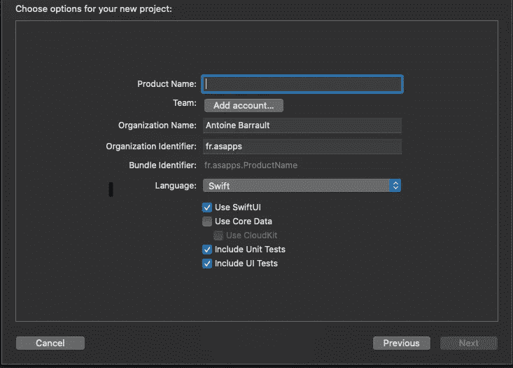

# 如何用 SwiftUI 制作一个简单的倒计时器

> 原文：<https://betterprogramming.pub/make-a-simple-countdown-with-timer-and-swiftui-3ce355b54986>

## 如何使用 SwiftUI 框架构建的分步说明



昨天，苹果发布了一个名为 SwiftUI 的新框架，允许我们以一种全新的、100%快捷的方式制作应用程序界面。我用它做了一些实验，在这篇文章中，我将向你展示如何制作一个倒计时器。

# 先决条件

从 SwiftUI 开始，访问[https://developer.apple.com/download/](https://developer.apple.com/download/)并下载 Xcode 11 和 macOS Catalina 10.15 的最新版本。SwiftUI 在 Mojave 上也能与 Xcode 一起工作，但预览版无法工作。还有，需要注意的是，SwiftUI 框架仅在 iOS 13、macOS 10.15、watchOS 6 和 iPadOS 13 上可用。

# 创建 SwiftUI 项目

使用 Xcode 11 创建一个新的 iOS 项目，并确保选中 SwiftUI 框:



现在您已经创建了项目，请看一下 ContentView.swift 文件和 body 变量实现，这是您将在 SwiftUI 中实现视图的地方。它应该是这样的:

```
**var** body: **some** View { Text("Hello World")}
```

# 制作定时器逻辑

为了能够每秒刷新我们的界面，我们将使用一个计时器并声明一个日期来创建我们的倒计时。

注意这里的 *@State* 会在每次日期更新时重新创建我们的界面，并准确地显示当计时器触发时我们要在程序块中做什么。

# 在标签中添加倒计时逻辑

随着我们的计时器每秒启动，我们可以根据当前日期更新界面。让我们创建一个返回倒计时字符串的函数:

然后调用函数来代替“hello world”文本:

```
**var** body: **some** View {
     Text(countDownString(from: **referenceDate**, until: **date**))
}
```

但是等等，为什么不更新？这是因为定时器是懒惰的，所以在它被调用之前，定时器是不存在的，也不能被触发。

# 让计时器启动

初始化计时器的一种方法是向文本元素添加 onAppear 闭包，这样当文本出现时，它将创建计时器，循环可以开始:

我不知道这是否是最好的方法，但它工作得很好。当视图消失时，您可能希望使计时器无效，以避免内存泄漏。

# 完整的代码