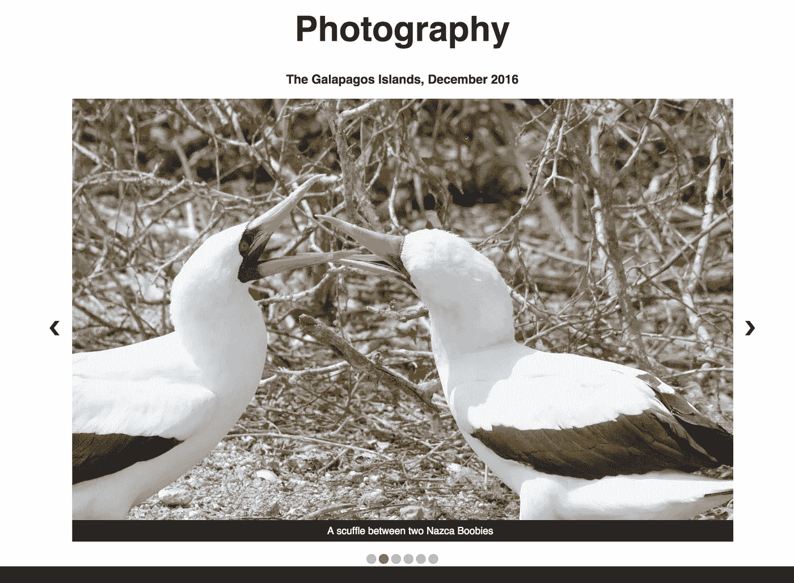

# 如何建立一个自动和手动控制的旋转木马

> 原文：<https://betterprogramming.pub/make-a-slideshow-with-automatic-and-manual-controls-using-html-css-and-javascript-b7e9305168f9>

## 给你的照片和网站一些生命



图片由作者提供

我正在制作我的个人作品集，我想为摄影页面制作一个幻灯片。我首先倾向于使用一个库，比如 [Bootstrap Carousel](https://getbootstrap.com/docs/4.0/components/carousel/) 。虽然我喜欢语义，但我找不到幻灯片组件/库。虽然我会推荐 Bootstrap，但我决定用更简单的自制幻灯片。我不完全确定我想要它的外观或功能，但我知道我想要两样东西:

1.  自动运行时间(每隔几秒自动更换图片)
2.  手动控制(这样用户可以选择后退/前进)

我以前制作过自己的幻灯片，但我从未制作过既能自动播放又能手动播放的幻灯片。我过去遇到的问题是，虽然您可以将幻灯片设置为自动间隔更改，但每当我引入手动操作(如下一个/上一个选择)时，间隔会保持不变，不会根据手动操作重新调整。

这意味着如果自动间隔设置为 4 秒——在新媒体中，幻灯片中图片改变的推荐最佳时间至少是[3 到 4 秒](http://psgphotosolutions.com/good-slide-show/)——并且用户在 3 秒后决定点击下一步，图片将会改变，但是一秒后图片再次改变(自动)。

这不利于用户体验。如果他们回到一张图片，或者比当前图片更想看下一张图片，可以肯定地说他们想这样做的时间超过一秒钟。重置间隔是有意义的，这样他们就可以在与其他图片相同的时间内看到下一张/上一张图片。我实际上在使用库的时候遇到过这个问题，这些库通常有点难以覆盖(以免你开始抛出*！重要的* s 无处不在)。

# 创建幻灯片

这是我制作的幻灯片，包含了自动和手动功能。

正如你所看到的，幻灯片会自动播放，但是如果用户选择转到下一张/上一张图片，它不会中断播放间隔。那我是怎么做到的呢？如果你读过我以前的作品，你就会知道我是怎么做的。

神奇！

好吧，虽然魔法是 150%真实的，但我做了一些不同的事情。

我最后做的是这个:HTML。

我创建了一个容器，将它放在中心，在这个容器中(实际上只是一个`**<div>**`)，我放了六个子容器`**<div>**`。在这些`**<div>**`中，我放了一个`****`，当然还有另一个`**<div>**`作为标题。这就像电影《盗梦空间》,但有了`**<div>**` s。

下面是代码的样子。

```
<div class="slideshow-container"><div class="mySlides fade">
    <div class="text">Sally Lightfoot Crab</div>
  </div><div class="mySlides fade">
    <div class="text">A scuffle between two Nazca Boobies</div>
  </div><div class="mySlides fade">
    <div class="text">A waterfall discovered on a hike in Otovalo</div>
  </div><div class="mySlides fade">
    <div class="text">Pelican</div>
  </div><a class="prev" onclick='plusSlides(-1)'>&#10094;</a>
  <a class="next" onclick='plusSlides(1)'>&#10095;</a>
</div>
<br/>
```

这段代码由幻灯片容器、四个幻灯片图像和上一个/下一个箭头组成。当然，神奇之处在于 JavaScript。

# **JavaScript**

我先介绍的功能是`plusSlides`。

```
function plusSlides(n){
  clearInterval(myTimer);
  if (n < 0){
    showSlides(slideIndex -= 1);
  } else {
   showSlides(slideIndex += 1); 
  }
  if (n === -1){
    myTimer = setInterval(function(){plusSlides(n + 2)}, 4000);
  } else {
    myTimer = setInterval(function(){plusSlides(n + 1)}, 4000);
  }
}
```

我一会儿解释初始化和`**clearInterval**` 。但是`**setInterval**` 是我使用的函数，因为它本质上是重复间隔的东西。您可以`setTimeout` 执行 plus slides 功能，但之后您必须再次重复该功能。避免不必要的冗余，`setInterval` 正是你所需要的。它设置了您确定要执行的功能的时间间隔，以及您希望执行该功能的时间/频率。

本质上，这个函数初始化幻灯片，并决定是否在序列中前进或后退。什么决定了向前/向后功能？传入函数的`**n**`。如果 n 为负，所选的幻灯片索引将是当前索引之前的索引。因此，如果您在第四张图片上(在索引 3 处)，并单击后退箭头，您将选择索引处的幻灯片作为要显示的当前幻灯片。如果 n 是正数，你将进入序列中的下一个索引。因此，如果您在索引 2 处的幻灯片上，单击“下一页”,您将调出索引 3 处的下一张幻灯片。这对应于我写的另一个函数，叫做`**showSlides**`。

```
function showSlides(n){
  var i;
  var slides = document.getElementsByClassName("mySlides");
  var dots = document.getElementsByClassName("dot");
  if (n > slides.length) {slideIndex = 1}
  if (n < 1) {slideIndex = slides.length}
  for (i = 0; i < slides.length; i++) {
      slides[i].style.display = "none";
  }
  for (i = 0; i < dots.length; i++) {
      dots[i].className = dots[i].className.replace(" active", "");
  }
  slides[slideIndex-1].style.display = "block";
  dots[slideIndex-1].className += " active";
}
```

该函数收集滑动元素和点元素。这些将存储在数组中。这些数组中的项目将根据它们与`slideIndex`的关系进行选择。`showSlides` 确定当您选择下一张或上一张时，或者当您让幻灯片显示自动运行时，显示哪张幻灯片以及隐藏哪张幻灯片。可以看到，这里有上`setInterval` 或下`clearInterval` 。该函数仅用于在给定当前幻灯片索引的情况下应用适当的 CSS 类和样式。网上还有其他代码片段做着和`showSlides`*一样的事情，但是改变职业太复杂了。我简化了点的类分配过程(实际上有显著的样式变化，如颜色和不透明度)，并简单地将幻灯片的显示改为*块*或*无*。我加入了一个循环来删除当前索引中没有的所有幻灯片/点的样式/类别。由于点的数量与图片的数量相对应，因此`slideIndex` 可以作为幻灯片和点的当前索引。*

*现在是启动一切的时候了。*

```
*window.addEventListener("load",function() {
    showSlides(slideIndex);
    myTimer = setInterval(function(){plusSlides(1)}, 4000);
})*
```

*我们同时初始化`**myTimer**` 和`**slideIndex**`。`slideIndex` 设置为 1(在整个函数中，我们将索引称为`slideIndex-1`)。`myTimer`将被分配我们为幻灯片设置的时间间隔。当页面加载时，它首先运行`showSlides(n)`函数，以确定首先显示哪张幻灯片。然后，它重新分配`myTimer` 一个函数和该函数(`plusSlides`)应在特定时间(每 4000 毫秒)执行的时间间隔。*

*但是那些点呢？它们仅仅是一种审美选择吗？*

*没有。*

*它们还有一个功能目的。让我们看看 HTML。*

```
*<div style='text-align: center;'>
  <span class="dot" onclick='currentSlide(1)'></span>
  <span class="dot" onclick='currentSlide(2)'></span>
  <span class="dot" onclick='currentSlide(3)'></span>
  <span class="dot" onclick='currentSlide(4)'></span>
</div>*
```

*你可以看到，每个点都有一个`onclick` 功能，叫做`**currentSlide**`。`currentSlide`接受 number 的参数。这个数字代表什么？*

*你猜对了，`**slideIndex**`。下面是`currentSlide` 功能。*

```
*function currentSlide(n){
  clearInterval(myTimer);
  myTimer = setInterval(function(){plusSlides(n + 1)}, 4000);
  showSlides(slideIndex = n);
}*
```

*该功能允许用户选择幻灯片中的特定图片。如果您在第一张幻灯片上，并想看第三张，而不是点按下一张或上一张两次，您可以简单地选择第三个点。这将清除已经存在的间隔，从而不会在先前的间隔和新的间隔之间产生重叠。一旦间隔被清除，它就可以在用户方便的时候被重新分配。这发生在`myTimer`的重新分配上。这是很重要的，因为用户应该能够在间隔中的任何点选择任何点，而不会改变幻灯片的时间。因此，如果您在第三张幻灯片上看了三秒钟，并想回到第一张幻灯片，您可以单击第一个点并重置间隔，而不会导致任何幻灯片跳过。这将根据点击的点执行`plusSlides(n+1)`。*

*在下一行，您可以看到我们执行了`showSlides` 并将`slideIndex` 重新分配给`n`，这是从点传递的索引，它将决定幻灯片数组中该索引处要显示的幻灯片。该功能现已重新分配`myTimer` 以符合用户的新选择，并在对应于所选点的索引处显示幻灯片。*

*本质上，您拥有的是一组设置时间间隔的函数，如果用户手动交互，还可以重置时间间隔。当由用户点击按钮或简单地由间隔时间触发时，设置间隔和幻灯片允许手动控制和自动执行我们的幻灯片。这确保了自动和手动控制的连续性。通过允许这两者，我们给了用户交互和选择他们所看到的内容的选项，或者只是坐下来享受(幻灯片)放映。*

*我有一个[代码笔](https://codepen.io/macro6461/pen/MdJwOa)，包括这个幻灯片 UI 的 HTML、CSS 和 JavaScript。*

# *更新-2019 年 9 月 18 日*

*Medium reader [Tony Pero](https://medium.com/@apero_32378) 评论了这篇关于实现用户悬停在幻灯片上时的播放/暂停功能的文章。作为回应，我能够自己实现它。为了允许用户在幻灯片容器上悬停时暂停幻灯片，您需要添加一个`[mouseenter](https://developer.mozilla.org/en-US/docs/Web/API/Element/mouseenter_event)`事件监听器。如果您希望当用户停止悬停在幻灯片容器上时幻灯片继续播放，您需要实现一个`[mouseleave](https://developer.mozilla.org/en-US/docs/Web/API/Element/mouseleave_event)`事件监听器。我在加载文档事件监听器的末尾添加了下面的代码。*

```
*var slideshowContainer = document.getElementsByClassName('slideshow-container')[0];slideshowContainer.addEventListener('mouseenter', pause)
slideshowContainer.addEventListener('mouseleave', resume)*
```

*这是我的暂停功能。*

```
*pause = () => {
   clearInterval(myTimer);
}*
```

*如你所见，我使用`clearInterval`来停止自动幻灯片切换的定时间隔。将鼠标悬停在容器上，`myTimer`将被清除，幻灯片只能通过点击上一个/下一个箭头或圆圈指示器来移动。*

*接下来是我的简历功能。这将在用户将鼠标从幻灯片容器上移开时执行。*

*我们再次使用`clearInterval`来说明其他可能与新间隔产生冲突的因素(比如与箭头和指示器的交互)。在`clearInterval`之后，我们立即将`myTimer`的值重置为新的间隔，执行`plusSlides`功能，并向其传递当前的`slideIndex`。这造成了幻灯从用户上次停止的地方继续播放的错觉，并且用户的体验没有被中断。*

```
*resume = () =>{
   clearInterval(myTimer);
   myTimer = setInterval(function(){plusSlides(slideIndex)}, 4000);
}*
```

*[*点击此处，将您的免费媒体会员升级为付费会员*](https://matt-croak.medium.com/membership) *，每月只需 5 美元，您就可以收到各种出版物上数千名作家的无限量无广告故事。这是一个附属链接，你的会员资格的一部分帮助我为我创造的内容获得奖励。谢谢大家！**

# *参考*

*[如何制作幻灯片](https://www.w3schools.com/howto/howto_js_slideshow.asp)*

*[传送带](https://getbootstrap.com/docs/4.0/components/carousel/)*

*[JavaScript 计时事件](https://www.w3schools.com/js/js_timing.asp)*

*什么是好的幻灯片？— PSG 照片解决方案*