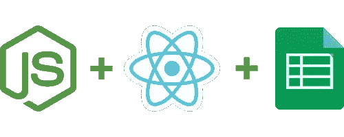
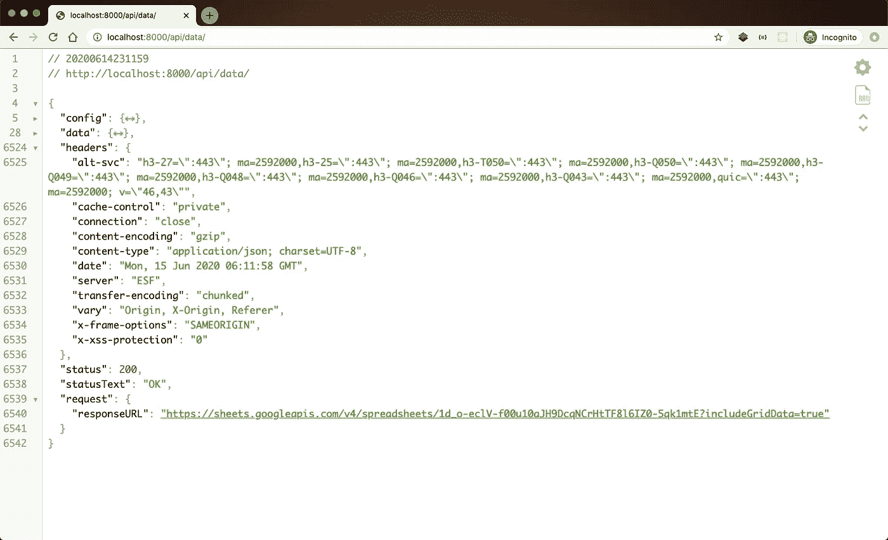
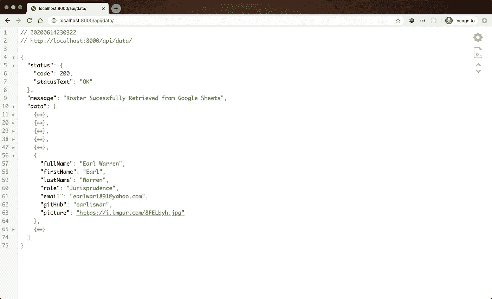

# 使用 Node.js、React 和 Google Sheets 创建团队花名册

> 原文：<https://betterprogramming.pub/make-a-team-roster-with-node-react-and-google-sheets-305b9f9ebbb1>

## 轻松创建和更新您团队的页面

没有开发人员喜欢做管理工作。他们宁愿发展。

考虑到这一点，我将向您展示如何通过使用 Google Sheets API，Node 制作一个简单的团队花名册来避免重复的人事变动。JS、Express 和 React.JS。

# **但是为什么呢？**

大多数开发人员都是非常了不起的人。不轻易发怒，乐于助人，是每个人最好的朋友——那就是我们。但是如果有一件事让我们恼火的话，那就是不得不做多余的工作。在这些疯狂的请求中，最主要的是对原本应该保持静态的内容进行更新。

因为事实是，我们*知道*这个信息在别的地方。无所事事，坐在 word 文档或电子表格中，而它应该为我们填充网站信息。这就是我们发明 CMSs 的原因。改变它可能是我们的工作，但它不应该是。

然而，即使你没有在你的项目中使用 CMS，也很有可能有人在使用 Google Drive 来保持秩序。也很有可能有人，比如说你的项目经理，也在使用 Google Sheets 来跟踪事情。一个看似合理的用例是一个包含姓名、角色、电子邮件等的团队花名册。

简单地查询花名册，以填充球队花名册页面，而不是在阵容发生变化时自己更新它，这不是很好吗？这将为开发人员腾出时间，并消除他们和总理之间沟通不畅的风险，以及两组信息而不是单一来源的事实之间可能存在的差异。

我的朋友们，这正是我们要做的。

在本文的最后，我们将有一个简单的、本地运行的 web 应用程序，显示我们团队的成员，信息来自 Google Sheets 上的电子表格。

在 GitHub [找到完成的代码](https://github.com/timmalstead/teamRoster)

我希望你的团队和我的一样甜蜜

# 1-准备和安装

重要的事情先来。创建一个新文件夹，在终端中导航到该文件夹，输入`npm init -y`创建一个新的`Node`项目。

接下来，在您的终端中输入`touch index.js .env`来创建我们的主 JavaScript 文件和一个环境变量`.env`来保存我们的敏感信息。如果你决定分享到 GitHub 或类似的网站，不要忘记在你的`.gitignore`中包含`.env`文件。

在开始真正的编码之前，让我们先做一些快速安装。输入`npm i express googleapis dotenv`安装以下内容:

*   **Express** :在 Node 中创建服务器和 API 的轻量级、非个性化框架。
*   **Google APIs**:用于访问 Google API 的节点包，包括我们将要使用的表单和 Oauth 服务。
*   **Dotenv**:`dotenv`包是在节点中配置和使用环境变量的常用选项。这将允许我们在代码中使用这些敏感信息，但在共享时仍然保持匿名。

之后，在你选择的编辑器中打开它(我喜欢 VSCode ),开始使用它！

# 2-准备 Express 服务器

我们将在`index.js`中创建一个本地运行的 quick Express 服务器，以确保一切正常运行。

在您的`.env`文件中，创建一个名为`PORT`的变量，并将其设置为您想要的任何本地端口。对于这个演示，我用了 8000。

将这段代码复制到您的`index.js`文件中:

索引. js

让我们来分解一下我们正在做的事情:

*   在第一行，我们调用 express 包用于我们的节点项目。
*   在第二行，我们正在设置要使用的`dotenv`包。这将允许我们访问`process.env`,其中包含我们稍后将使用的所有敏感信息。
*   在第三行，我们将一个变量设置为`p`来访问`process.env`，这样我们就不必在每次需要访问的时候都输入这个变量。相信我，以后会节省时间的。

接下来，我们有一个简单的`get`路线。这个函数调用将是我们今天的大部分工作。当您导航到`[http://localhost:8000/](http://localhost:8000/)api/data/`或您设置服务器运行的任何端口时，可以访问它。现在我们只想确保一切正常，所以我只是使用`response`参数发回一段简单的文本。

最后，我们设置了一个 listen 函数，将我们的`PORT`变量作为第一个参数，将在服务器监听时执行的回调函数作为第二个参数。同样，这给了我们一个机会来测试我们的`.env`变量，并确保一切正常工作。

在您的终端中键入`node index.js`，几秒钟后您应该会看到`console.log`消息。然后，在浏览器中导航到适当的本地主机端口。您应该看到您输入的文本作为`response.send`的参数。

祝贺您——您已经用 11 行代码创建了一个工作服务器！尽管它还没有做很多事情。别担心，我们将在下一步中解决这个问题。

# 3-设置谷歌表 API 和花名册表

你可以在这里找到我将要使用的信息。你可以随意把它复制到你自己的硬盘上，或者使用你自己的数据。我还在 GitHub 的 [repo](https://github.com/timmalstead/teamRoster) 中的 CSV 中包含了这些数据。

复制工作表或创建一个新工作表，并将其命名为`TeamRoster`。从顶部的导航栏复制工作表 ID。这是在`[https://docs.google.com/spreadsheets/d](https://docs.google.com/spreadsheets/d/)/`和正斜杠之间找到的 URL 的一部分，它将是一个长哈希，类似于`1BxiMVs0XRA5nFMdKvBdBZjgmUUqptlbs74OgvE2upms`。将这个 ID 放在名为 SPREADSHEET_ID 的`.env`文件中。

进入 [Google 的 Sheet API 节点 Quickstart](https://developers.google.com/sheets/api/quickstart/nodejs) 页面，点击蓝色的“启用 Google Sheets API”按钮(你可能需要设置一个账户，它应该会启动一个名为 Quickstart 的项目)。当询问如何配置您的 0auth 客户端时，选择“Web 服务器”并输入您的本地主机 URL。下载`credentials.json`并把它放在你的项目的根文件夹中。将以下值从`credentials.json` 复制到您的`.env`文件中——标准的命名约定是使用 spinning _ SNAKE _ CASE，不带引号。

这就是你的。env 文件应该关注这一点

创建一个名为`authorize.js`的文件，并复制以下代码。这是在 Google 的 Node Quickstart 文件的第三步中找到的代码的修改版本。

我还没能让他们的代码按原样工作。以下是有效的方法。我猜这些错误是由于 API 或 NPM 包的更新导致的，而文档中没有相应的更新:

呃，有很多试镜。

在您的终端中输入`node authorize.js`开始授权过程。之后，应该会出现一个提示，上面写着`Authorize this app by visiting this url.`单击它并转到授权屏幕。它应该提示您授权此应用程序访问您的工作表信息。不要担心警告告诉你应用程序还没有被批准——你相信自己，不是吗？

之后，它会把你送回你的重定向 URL，在 URL 窗口的端口上附加一个巨大的查询字符串。获取代码信息，它将位于`[http://localhost:8000/?code=](http://localhost:8000/?code=)`和以`&`字符开头的查询字符串的另一部分之间。你猜对了，这段代码将是另一个长散列。获取代码并将其输入到终端的 readline 提示符中。如果一切顺利，它应该会返回一个姓名和专业的列表。

恭喜，您已经将 Node 应用程序配置为从您的 Google Sheets 帐户中读取。

# 4-从你自己的谷歌表单中获取信息

现在，你可能会说:“哎呀，蒂姆，与层叠式回调搏斗很有趣，但我希望我在实际规划路线时不必做太多”。你是对的，你*不应该*通过回调地狱来访问你的数据。上面代码的不透明性是我决定写这篇文章的主要原因之一。有更简单的方法来完成上一步中所做的事情，我们将会这样做。自然，我说的是`async`和`await`。

`async`和`await`是 2017 年引入 JavaScript 的句法糖。简单地说，它们允许我们编写看起来像同步代码的异步代码。他们是伟大的 T21。

完成最后一步后，您的目录中应该有一个`token.json`文件。将`"refresh_token"`值复制到您的`.env`文件中。然后将您的`index.js`更改为以下内容:

那么，我们做了什么？

*   我们为 Google 的 API 包添加了一个导入。
*   我们将`get`路由的回调函数改为`async`。这告诉程序，在这个函数中的某个点，我们将调用一个以`await`开头的操作，在这个操作完成之前，不应该发生任何事情。
*   我们使用`Oauth`创建了一个新的 auth 对象，并设置了它的安全凭证。
*   我们使用那个`Oauth`对象来授权一个新的`Sheets`对象。
*   我们用 sheets 对象建立了一个异步请求，使用了`await`关键字。这个请求的参数是一个对象，包含电子表格的惟一 id 和一个布尔值，表明我们需要网格数据。网格数据是电子表格中实际包含的数据。
*   我们将从`Sheet` s 请求的`JSON`对象发送给客户端。

太好了！继续启动您的服务器并导航至`[http://localhost:8000/](http://localhost:8000/)api/data/`。

我应该提到，在测试我的 API 时，我使用了一个名为 [JSON Viewer](https://chrome.google.com/webstore/detail/json-viewer/gbmdgpbipfallnflgajpaliibnhdgobh?hl=en-US) 的 Chrome 插件。它很简单，有一个干净的布局，并提供语法突出。我经常发现它比 Postman 或类似的 API 测试工具更容易、更快捷，尤其是对于简单的`get`请求。或者，从版本 53 开始，Firefox 默认启用 JSON 查看。不过我不喜欢 Firefox 浏览器的布局，所以我不经常使用它。

您应该会看到类似这样的内容:

6542 行！？

对于八列九行的文本来说，这是一个很大的数据量。不过请记住，这包括*电子表格*中的所有*数据和*与电子表格相关联的所有*数据。这包括元数据和样式信息。那些东西加起来很快。*

肯定有什么办法能让我们把它剪下来吧？首先，不要叫我雪莉。第二，*我们当然可以！这正是我们下一步要做的。*

# 5.减少你的信息

您可能已经注意到，被发回的 JSON 对象是一团乱麻。让我们深入了解这些数据的结构。

创建一个名为`teamData`的变量来保存我们将从嵌套的 JSON 中提取的数据。

首先，在`rosterSheet`的六个顶级属性中，我们现在唯一感兴趣的是`data`，而在`data`中我们唯一感兴趣的是`sheets`。这是一个数组，用于保存大型电子表格中每个工作表的数据。如果你从我这里复制信息，你应该只有一个表可以选择，所以继续前进，通过括号符号访问它。

到目前为止，我们应该有`const teamData = rosterSheet.data.sheets[0]`。

在`sheets[0]`中，我们有*另一个*数组，名为`data.`，和上一个数组一样，它应该只有一个条目，所以用`.data[0].`访问它。最后，我们还有一个属性要访问，`.rowData.`这样，我们最终得到了相关的数据，我们将发送给客户端:

`const teamData = rosterSheet.data.sheets[0].data[0].rowdata`。

`rowData`本身是一个数组，表中每行有一个条目，包含我们需要的单元格值，以及一大堆我们不需要的东西。将以下代码复制到索引中:

我们在第一行之后获取每一行，如果团队成员的状态是活动的，则将包含团队成员所有属性的对象推入一个数组，如果属性丢失，则为“None”。这种排序的额外好处是过滤掉空行。

我认为这是为什么使用`Sheets`对于像这个花名册这样的小数据集是一个好的解决方案，但是对于大数据集却不是。如您所见，由于 Google 构建数据的方式，我们必须根据数据在数组中的索引来定位数据。这不是最佳选择，很容易搞砸。我的建议是使用`Sheets`,只要你正在处理的电子表格的规模仍然很容易处理。如果不是，那就另想办法。

在我们减少了数据之后，我们将在一个 JSON 对象中把它发送给客户机，从我们最初的`teamRoster`对象借用`status`和`statusText`。

如果一切顺利，当您启动服务器并在浏览器中导航到`/api/data/`时，您应该会看到类似这样的内容。

这还差不多

太棒了。我们成功地向 Sheets 发出了一个安全请求，将它发送到我们的 Express 服务器，从中提取我们需要的数据并发送给客户端。

在我们真正完成我们的服务器之前，我们将在我们的路由中添加一些 JSON 备份和错误处理。首先，让我们建立我们的前端，让我们有一些好看的东西。

# 6.设置 React

`create-react-app`是 React 的开发者脸书提供的一个神奇的工具，它可以让你在几分钟内启动并运行一个实用的 React 应用。虽然这不能代替理解*如何从零开始引导一个 React 项目，但它将非常适合我们这个项目的目的。通过在终端中输入`npm i -g create-react-app`进行全局安装。*

完成后，转到项目的根目录，在终端中输入以下内容:`npx create-react-app client`。这将在名为 client 的文件夹中安装最新版本的`create-react-app`的实例。我写这篇文章时注意到的一件很酷的事情是，CRA 现在知道如果你在一个已经有 git 的环境中，不需要安装 git。进步！

这可能需要一点时间，但是一旦完成，你的项目中应该有两个`package.json`文件——一个用于 Express 服务器，一个用于 React 客户端。打开它们，我们将对它们做两个微小的改变，当我们运行完整的程序时，这些改变将会产生巨大的影响。

在根目录下的文件中，将以下代码插入`"scripts"`:

`"start": "node index.js -ignore './client' "`

这将确保从一个终端运行我们的服务器不会干扰在另一个终端上运行我们的客户机。

在客户端目录下的文件中，在`"private"`下方插入以下代码:

`"proxy": "http://localhost:8000"`

这将允许我们轻松地调用与客户端同时运行的服务器。

然后将下面的代码复制到`client/src`文件夹中的`App`文件中:

在我们的应用程序中，组件一安装好，我们就在我们的`useEffect`钩子中进行调用。它将对我们的 Express 服务器的`get`路由进行`async`调用，并读取返回的 JSON 数据。如果全部解析成功，它会将数组设置为状态。一旦数组被设置成状态，组件返回将`map`通过数据并为数组中的每一项呈现一个团队成员。

在你的根目录和客户端目录中启动`npm start`，让奇迹发生。如果一切顺利，您应该会看到类似这样的内容。

梦之队

你做到了！

去吧，稍微摆弄一下。当您在电子表格中进行更改时，它应该会在您刷新页面时反映在应用程序上。只要保持命名一致，就应该是金色的。

# 7.添加错误处理和备份

作为有思想的开发人员，我们设置一些错误处理和备份怎么样？

将根目录中的`index.js`文件改为:

让我们来分解我们的变化:

*   我们导入了内置的`Node`包`fs`代表“文件服务”。这是一个在`Node`中创建、读取和修改文件的有用方法的集合。
*   我们添加了一个变量来表示 JSON 文件的路径和标题，我们将用它来备份我们的请求数据。
*   我们把路线包在了`try`和`catch`街区。这些允许我们定义我们想要尝试的行为，以及在抛出错误时要遵循的行为。
*   在第一个`try`块的末尾，我们使用`fs`方法`writeFileSync`在本地服务器上备份一份 JSON。
*   在我们的第一个`catch`块中，我们定义了两个变量来帮助定义对客户端的 JSON 响应。
*   我们定义了另一组`try`和`catch`模块*来进一步定义我们的响应。*
*   在我们的第二个`try`块中，我们访问了用`fs.writeFileSync`和对应的`fs.readFileSync`写的最后一个成功的 JSON 备份。这将作为故障保险发送给客户端。
*   如果*失败，我们用第二个`catch`块将两个错误的信息发送回客户端。*

# 最后的想法

就是这样！您设置了一个 Express 服务器，使用 Google 对其进行授权，进入您的电子表格，将数据带回 Express，对其进行排序和简化，将其发送到您的 React 客户端，并在您的 Express 服务器中设置错误处理和备份。

希望本教程已经足够清楚地分解了我们所做的事情，给你一些在你自己的项目中使用的想法。我很期待看到你做的东西！

请让我知道你是否喜欢这篇文章——我可能会写更多。也许是带有 [Deno](https://deno.land/) 的东西？你怎么想呢?