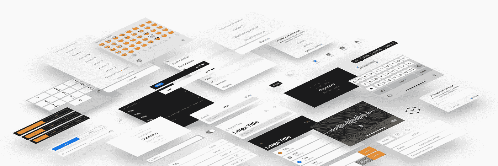
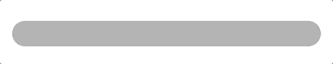
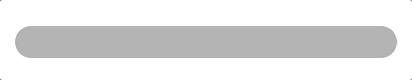
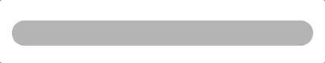

# 像 Apple 一样制作 API——Swift 中的动画视图属性

> 原文：<https://betterprogramming.pub/make-apis-like-apple-animatable-view-properties-in-swift-4349b2244cea>

## 模仿 UIKits 使我们的定制视图感觉更自然

uik it——简单、强大、可动画化

为代码创建自然的 API 并不困难。今天，我们将借鉴苹果的书，设计一个我们可以在 UIKit 中找到的`UIControl`。

正如您可以在`UIView`上制作`backgroundColor`的动画，或者在`UIProgressView`上制作`progress`的动画一样，我们将在视图上创建自定义的、可制作动画的属性，这些属性可以在任何动画环境中制作动画。

# 模拟 UIKit

动画是苹果公司出了名的擅长领域。我们中的许多人都使用过这些 API—`CABasicAnimation`、`UIKit.animate`和关键帧动画，仅举几个例子(所有这些都使用幕后的核心动画)。

[核心图形](https://developer.apple.com/documentation/coregraphics)(又名石英)通过 OpenGL 将 UIKit 的图形绘制到屏幕上。核心动画插入值并与核心图形一起工作，以特定的时间间隔显示变换的视图。

许多 UIKit 控件为我们提供了很好的可动画化的属性，这意味着它们可以放在动画上下文中，比如`UIView.animate(...)`，并且该属性会在动画过程中更新视图。

那么，我们如何模仿这些 UIKits 来使我们自己的定制视图感觉更自然呢？

## ***目标***

*   创建可以在动画环境中制作动画的属性(例如`UIView.animate(...)`)。
*   让这些属性仍然在动画上下文之外显式设置，立即反映在用户界面上(例如`view.backgroundColor = .red`)。

## ***我们将要建设什么***

自定义进度视图

自定义进度视图代码

我们将用一个可动画化的`progress`和`color`属性来构建这个简单的进度加载器。

# 进度视图设置

我们创建了一个`ProgressView`子类，并创建了我们的动画属性，将它们标记为动态分派和对 Objective-C 可用。

# 使 Swift 属性具有动画效果

为了使我们的属性具有动画效果，我们需要根据核心动画(UIKit 底层的动画框架)为它们做一些额外的设置。

为了完成我们的需求，我们必须到比我们的视图更低的一层——支持视图的`CALayer`。

创建一个`CALayer`子类，包含您想要制作动画的属性，如下所示:

在 Swift 中，属性必须用`@NSManaged`进行注释，以防止编译器合成访问器，因此核心动画可以正确处理该值。(更详细的解释见本文。)

这里只能使用核心图形和基础类型，所以像`CGColor`或者`TimeInterval`这样的类型可以，但是`UIColor`不行。

让我们创建层的其余部分来支持动画属性:

好吧。那里发生了很多事。首先，如果键与我们的属性名匹配，我们需要覆盖`needsDisplay`并返回`true`(例如“进步”)。其次，我们覆盖了`action(forKey:)`，为任何匹配自定义属性的事件返回自定义动画。

`action(forKey:)`将被系统调用以获得一个在动画上下文中使用的动画。我们可以通过借用`CALayer`的一些现有属性来获得当前的动画上下文。在这里，我使用`backgroundColor`，因为它一直存在(从 iOS 2.0 开始)。

有了动画上下文，我们制作了动画的副本，并修改了它的 to/from 参数。`presentation()`函数返回一个实例的副本，其属性针对层的动画状态进行了修改。

注意:`presentation()`调用`self.init(layer: self)`复制属性。因此，我们需要覆盖它，并确保我们的自定义属性被复制。

# 显示插值/动画属性

此时，`ProgressLayer`将正确地插入我们的自定义属性的值，但是，我们仍然需要在 UI 上反映这一变化。

我们可以通过覆盖`ProgressView`上的`display(**_** layer:)`、`draw(**_** layer: in ctx:)`或`draw(**_** rect:)`来观察表示层并执行动作。(请注意，在给定的类中，您只能覆盖其中的一个，因为其他的都不会被调用。)

1.  覆盖类函数`layerClass`以表明我们希望我们的`ProgressLayer`被用作视图的支持层。
2.  为`progress`和`color`设置 getters 和 setters。`ProgressView`属性成为支持层属性的包装变量。(注意，我们可以将`UIColor`转换为`CGColor`,这样就有了一个`color`动画，也有了一个更干净的 UIKit API。)
3.  覆盖`CALayerDelegate’s` `display(**_** layer:)`函数，使用来自表示层的插值来更新 UI:

我们现在显示插值！

现在，我们可以在动画环境中为我们的属性制作动画:

曲线动画:。curveEaseInOut

曲线动画:【。curveEaseOut，。自动反转，。重复]

春天动画

# 谢谢！

我希望你喜欢这个深入研究 UIKit 动画。完整版本的源代码和示例项目可以在这里找到:

 [## 长寿花属/中粒植物

### 此时您不能执行该操作。您已使用另一个标签页或窗口登录。您已在另一个选项卡中注销，或者…

github.com](https://github.com/joncardasis/MediumArticles/tree/master/AnimatableProperties)