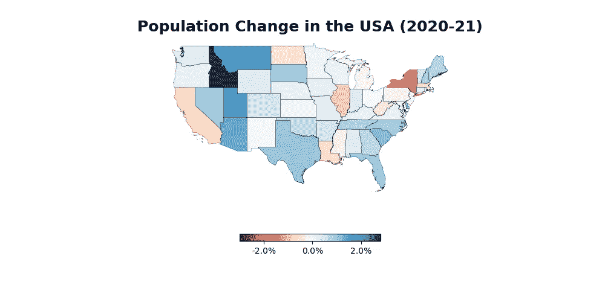
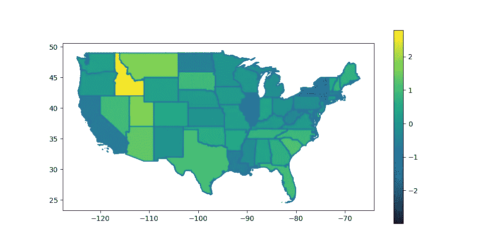

# 用 Python 和 Geopandas 制作出色的地图

> 原文：<https://betterprogramming.pub/make-awesome-maps-in-python-and-geopandas-c8b3c887b284>

## 了解如何用 Python 和 Geopandas 制作美丽的 choropleth 地图

安妮·斯普拉特在 [Unsplash](https://unsplash.com?utm_source=medium&utm_medium=referral) 上的照片

在本教程中，**你将学习如何使用 GeoPandas 和 Matplotlib** 用 Python 制作令人惊叹的地图。地图是一种非常容易理解的数据可视化形式。然而，制作地图的过程并不是最简单的任务。本教程旨在通过指导您使用 GeoPandas 和 Matplotlib 来解决这个问题。

本教程结束时，您将学会:

1.  如何在 GeoPandas 中加载和管理 shapefiles
2.  如何用 Python 创建漂亮的 choropleth 地图
3.  如何使用 GeoPandas 和 Matplotlib 自定义地图

让我们开始吧！

# GeoPandas 是如何工作的？

GeoPandas 结合了 Pandas 使用数据框架的强大功能和 Shapely 处理几何数据的强大功能。这允许您使用 Pandas 熟悉的语法，同时扩展其功能来创建漂亮的地图。

我们将创建下面的地图。首先，你可以从美国人口普查网站下载体形文件。下载州形状(较低的分辨率，如 20m 就可以了)。解压缩文件，并将其放入脚本旁边的文件夹中。

您将在本教程中创建的地图。资料来源:Nik Piepenbreier

让我们开始创建地图吧！

# 将 ShapeFile 加载到 GeoPandas 数据帧中

您可以使用以下代码加载 Geopandas 数据帧:

正在加载我们的 GeoPandas 数据帧

我们可以看到，通过将数据加载到 GeoPandas 数据帧中，它非常类似于普通的 Pandas 数据帧。最棒的是，我们实际上可以使用熊猫的不同功能和方法。

现在让我们加载我们的人口数据，以便进行分析。我们将把它加载到一个熊猫数据框架中，并进行一些计算。

加载和清除群体数据

在上面的代码中，我们加载了数据帧`df`并对其进行了一些清理。因为数据是作为字符串加载的，所以我们首先删除所有逗号并转换值。然后，我们计算两年之间的百分比变化。

现在我们的数据集已经准备好了，让我们创建我们的最终数据集！

# 创建我们的最终数据集

因为 GeoPandas 数据帧可以访问底层数据帧，所以我们现在可以合并两个数据集。我们要合并到我们的形状数据帧中，并做一些最后的清理:

在上面的代码中，我们合并了两个数据集。然后我们删除它们之间任何缺失的值。最后，我们过滤掉非美国大陆的州和地区，以放大我们的地图。

我们现在可以使用以下代码绘制地图:

在上面的代码中，我们创建了一个`ax`对象，这是一个`shape.boundary`样式的绘图。然后我们在坐标轴上绘制人口变化图。这将返回以下可视化结果。

用 GeoPandas 加载我们的第一张地图！资料来源:Nik Piepenbreier

我们已经做了很多。让我们进一步定制我们的图像，使它看起来更好，信息更丰富！

# 使用 Python 定制我们的地图

我们可以通过更改配色方案、移除边框、添加标题等方式进一步定制地图。这将使可视化更加清晰，信息量也更大。

让我们看看如何进行一些定制:

进一步定制我们的地图

在上面的代码中，我们进行了以下定制:

*   我们将`.plot()`函数调用改为使用线宽更小的黑线
*   我们更改数据的颜色映射，并传入一些图例关键字
*   我们关掉了轴和脊椎
*   我们设置了一个标题，使我们的情节更具描述性

这些更改会返回以下图像:

包含所有自定义内容的最终地图。资料来源:Nik Piepenbreier

# 结论

在本教程中，您学习了如何使用 GeoPandas 在 Python 中创建漂亮的 choropleth 地图！因为 GeoPandas 使用 Pandas 数据框架，所以您可以使用熟悉的代码来分析和组合数据。

希望本教程能让你对如何在 Python 中使用地图更感兴趣。地图是一种令人难以置信的数据可视化工具，容易被许多受众理解！