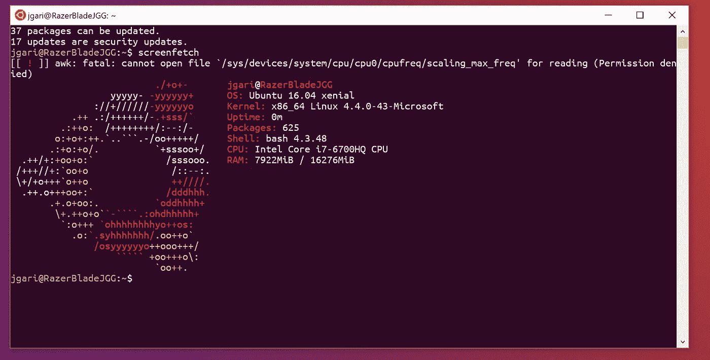
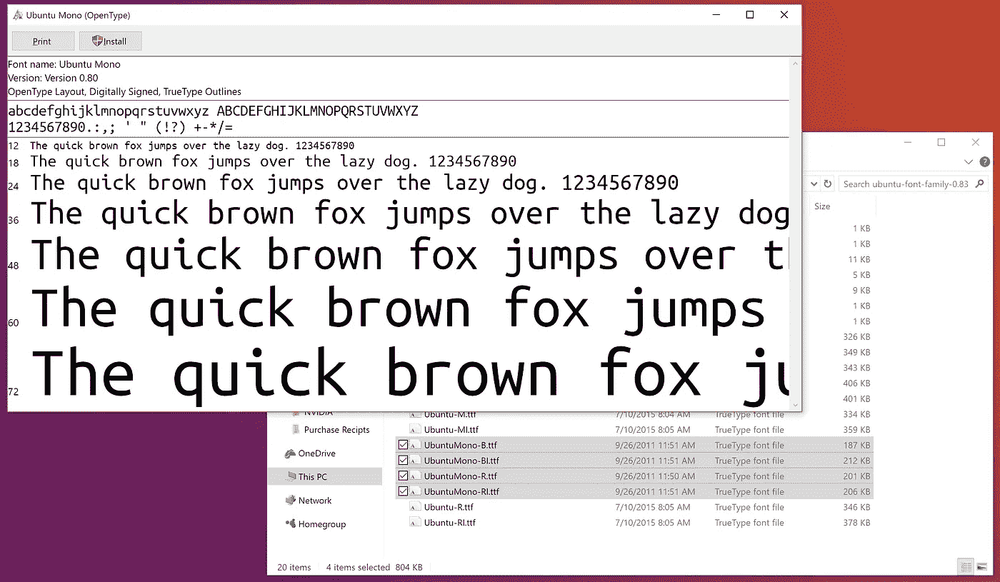
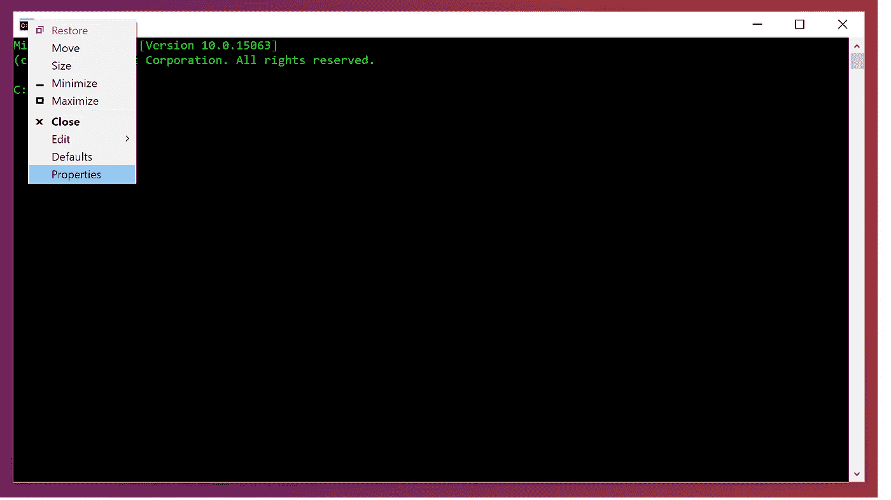
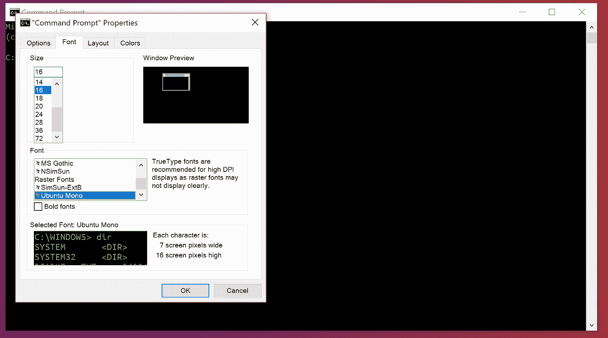
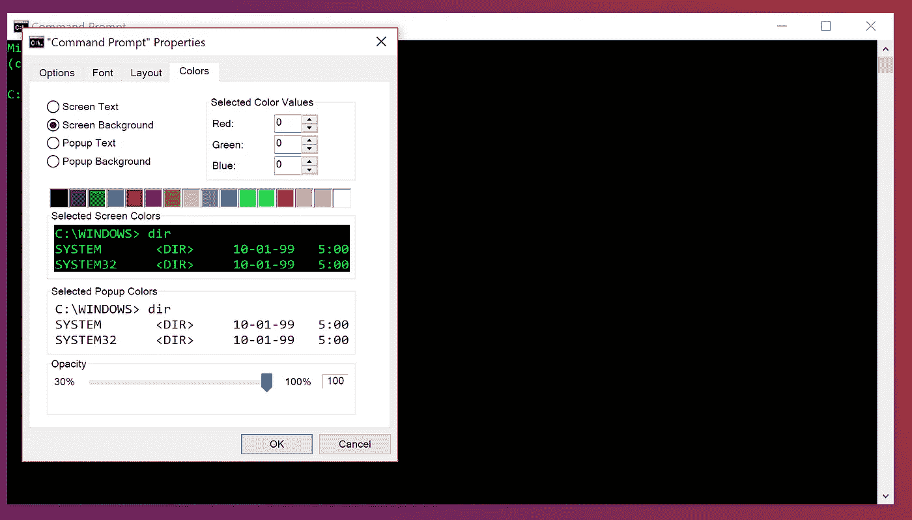
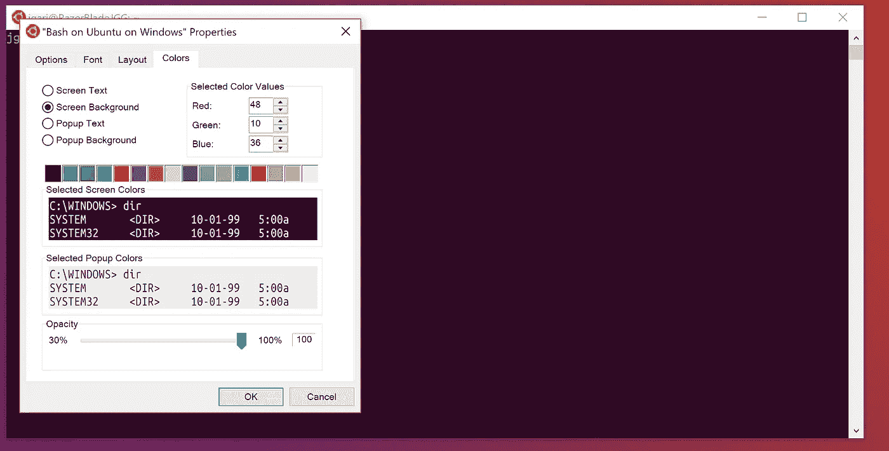

# 让 Windows 10 上 Ubuntu 上的 Bash 看起来像 Ubuntu 终端

> 原文：<https://betterprogramming.pub/make-bash-on-ubuntu-on-windows-10-look-like-the-ubuntu-terminal-f7566008c5c2>

本教程的最终结果将把您的命令提示符式 bash 终端变成一个界面，该界面以其独特的紫色外观匹配 Ubuntu Linux 操作系统的功能。

随着 Windows 10 周年更新，Windows 10 上的 Windows Linux 子系统和 Ubuntu 上的[Bash](https://msdn.microsoft.com/en-us/commandline/wsl/about)的引入代表了使用 Windows 10 平台的开发者和高级用户的巨大收益。我在完成 Windows 更新后不久就迫不及待地[安装了测试版功能](https://www.howtogeek.com/249966/how-to-install-and-use-the-linux-bash-shell-on-windows-10/)。然而，在启动我全新的 bash 终端时，我注意到该终端保留了命令提示符的外观，而不像 Linux 发行版中的终端。

要使您的终端与 Ubuntu 终端的外观相匹配，请遵循以下指南。

首先，我们需要一个官方的 Ubuntu 字体。前往[这个 Ubuntu 网站](http://font.ubuntu.com/)免费下载 Ubuntu 官方字体。

Ubuntu Mono 字体是 Ubuntu 终端应用程序中默认使用的字体。

一旦保存了。zip 文件，提取其中的内容并打开之前在。zip 下载。在那个文件夹里，你会找到四个。名称以“UbuntuMono”开头的 ttf 字体文件:

*   `UbuntuMono-B.ttf`—Ubuntu Mono 字体的粗体变体
*   `UbuntuMono-BI.ttf`—Ubuntu Mono 字体的粗体斜体变体
*   `UbuntuMono-R.ttf`—Ubuntu Mono 字体的常规变体
*   `UbuntuMono-RI.ttf`—Ubuntu Mono 字体的斜体变体

打开这四种字体时，单击 Windows 字体查看器窗口中的“安装”按钮即可安装这四种字体。

接下来，我们将更改 bash 窗口以使用 Ubuntu Mono 字体。

演示如何使用命令提示符找到“属性”选项窗格

在 Windows 10 的 Ubuntu 上打开 Bash。*右键单击窗口左上角的小图标，然后选择“属性”您也可以使用“Defaults”选项来实现这一点，但是这将改变命令提示符窗口以及 Bash 窗口的外观。有些人可能更喜欢这样，但是如果您不确定是否喜欢新的外观，我建议从 Bash 中的“属性”开始。

**如果这是你第一次在 Windows 10 的 Ubuntu 上启动 Bash，你必须完成首次设置。如果您还没有这样做，请先这样做。*

向下滚动到字体列表的底部，选择“Ubuntu Mono”

从应该弹出的新窗口中，选择“字体”选项卡。您将看到一个名为“Font”的部分，其中包含一个字体列表。选择最近安装的“Ubuntu Mono”字体。

接下来，移动到“颜色”标签。

默认的颜色面板应该如下所示:

默认的 Windows 命令提示符配色方案。

我们的目标是让它看起来像这样:

默认的 Ubuntu 终端配色方案。

这部分过程是最繁琐的，但也是最有收获的。

在相应的颜色槽中，将 RGB 值更改为以下值:

槽 1: `Red: 78, Green: 154, Blue: 6`
槽 2: `Red: 52, Green: 101, Blue: 164`
槽 3: `Red: 48, Green: 10, Blue: 36`
槽 4: `Red: 6, Green: 152, Blue: 154`
槽 5: `Red: 204, Green: 0, Blue: 0`
槽 6: `Red: 117, Green: 80, Blue: 123`
槽 7: `Red: 196, Green: 160, Blue: 0`
槽 8: `Red: 211, Green: 215, Blue: 207`
槽 9: `Red: 85, Green: 87, Blue: 83`
槽 10: `Red: 114, Green: 159, Blue: 207`
槽 11: `Red: 138, Green: 226, Blue: 52`
槽 12: `Red: 52, Green: 226, Blue: 226`
槽 13: `Red: 239, Green: 41, Blue: 41`
槽

正如 Piotr Bartnicki 指出的那样，许多人可能更喜欢浅蓝色的目录。如果你属于这个阵营，把槽 10 的值放入槽 2。

现在，确保“屏幕文本”和“弹出背景”设置为插槽 16 的近白色，而“屏幕背景”和“弹出文本”设置为插槽 3 的深紫色。单击“确定”按钮。

你完了！用你最新的彩色 Ubuntu Bash 终端享受你想要的一切！

其他来源:

[https://code yarns . com/2013/01/21/default-background-color-of-terminal-in-Ubuntu/](https://codeyarns.com/2013/01/21/default-background-color-of-terminal-in-ubuntu/)

[https://super user . com/questions/497240/Ubuntu-purple-terminal-colors-in-conemu](https://superuser.com/questions/497240/ubuntu-purple-terminal-colors-in-conemu)