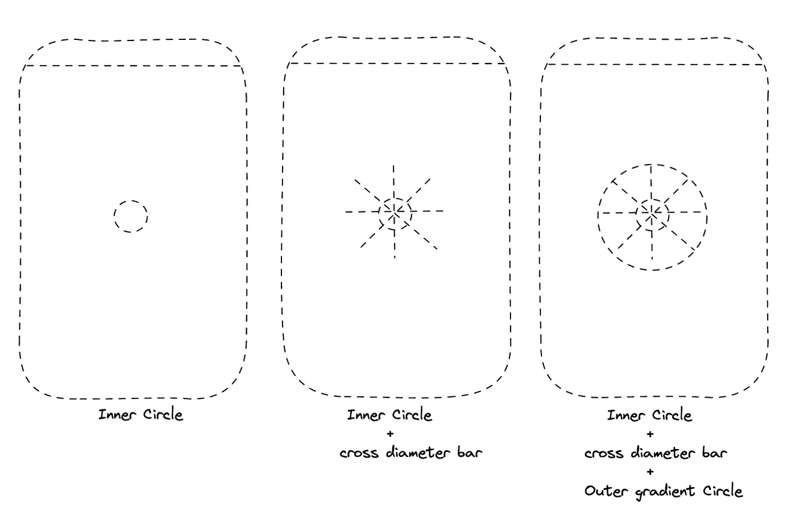
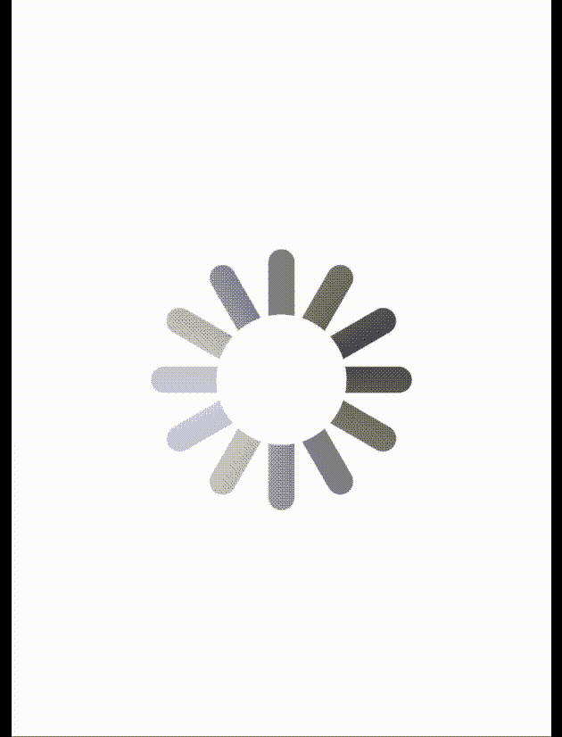

# 如何使用 SwiftUI 重新创建默认 iOS 活动指示器

> 原文：<https://betterprogramming.pub/make-default-ios-activityindicator-from-scratch-using-swiftui-7f31bb2f4493>

## 利用渐变和圆形


照片由[迈克·范·登博斯](https://unsplash.com/@mike_van_den_bos?utm_source=medium&utm_medium=referral)在 [Unsplash](https://unsplash.com?utm_source=medium&utm_medium=referral) 上拍摄

一个`UIActivityIndicatorView` 是显示一个任务正在进行中的视图。
今天我们将使用渐变和圆圈来分解 SwiftUI 中默认的 iOS 活动指示器。

**注 *:*** 我不确定默认的 iOS 活动指示器是否也是这样构建的。



我们将如何分解活动指示器视图的简短图片集

# **我们要如何创造** `**ActivityIndicatorView**` **？**

我们将有两个圆圈。一个内圈一个外圈。

内圆将被用来掩盖交叉直径酒吧。外圆将用于放置一个角度渐变遮罩，该圆将随着动画旋转。交叉直径栏只是活动指示器栏。它将永远保持静止。

现在你可能对我们将如何实现这一活动指标有了一个展望。

# 我们开始吧

我们将从 Z 堆栈开始。我们将在内容视图中创建一个 Z 堆栈。Z 堆栈将包含内圆、外圆和十字直径条。这将从 Z 堆栈中心开始。

我们将首先设置 Z 堆栈，然后我们将创建另一个视图，并用绑定变量输入命名它为`CustomActivityIndicatorBar`，让我们将该输入命名为`rotationAngle`。

这里的`rotationAngle`用于绘制不同位置的`CustomActivityIndicatorBar`。我们将使用那个`rotationAngle`来设置`rotationEffect`角度。确保`CustomActivityIndicatorBar`的`rotationEffect`定位点必须是`centered`。

现在我们的`CustomActivityIndicatorBar`设置好了。我们只需要给出不同的角度，为那些不同的角度设置不同的`CustomActivityIndicatorBar`。

现在让我们创建`OuterGradientCircle`视图。我们只需要创建一个圆，并填充一个角度梯度与梯度:

```
static let gradientColors = Gradient(colors: [Color(UIColor(white: 1, alpha: 0.3)), Color(UIColor(white: 1, alpha: 0.9)), Color(UIColor(white: 1, alpha: 0.3))])
```

使用下面的渐变，用这个渐变填充圆。

现在，一旦我们完成了`OuterGradientCircle`和`CustomActivityIndicatorBar`的创建，我们将转到我们的内容视图，并开始设置我们的核心设置。

这里我们将有两个状态变量一个`isAnimating`告诉视图，它需要动画意味着旋转器外圈将开始旋转。另一个`capsuleAngles`将保存`CustomActivityIndicatorBar`的不同角度值。这将定位多个`CustomActivityIndicatorBar`,每个具有各自的角度，带有一个中心旋转锚。

用`[0, 30, 60, 90, 120, 150]`值输入`capsuleAngles`。

现在我们将创建多个`CustomActivityIndicatorBar`。为此，我们将在 capsuleAngles 上运行一个`ForEach`循环。并且我们将通过`rotationAngle`为`CustomActivityIndicatorBar`传递`capsuleAngle`作为 ForEach 项。

此外，我们将设置内圆和外圆的框架。外圈应该是内圈的两倍大。我们只需要设置动画，砰的一声，一个工作活动指示器出现了，为我们做好了准备。内容视图可参考如下:



最终的代码可以从我的 GitHub 库获得:

[](https://github.com/Nikilicious09/ActivityIndicatorSwiftUI) [## GitHub-nikilicious 09/ActivityIndicatorSwiftUI

### 此时您不能执行该操作。您已使用另一个标签页或窗口登录。您已在另一个选项卡中注销，或者…

github.com](https://github.com/Nikilicious09/ActivityIndicatorSwiftUI) 

我希望你明白如何创建默认 iOS `UIActivityIndicatorView`的副本。如果你有任何疑问或建议，请告诉我。