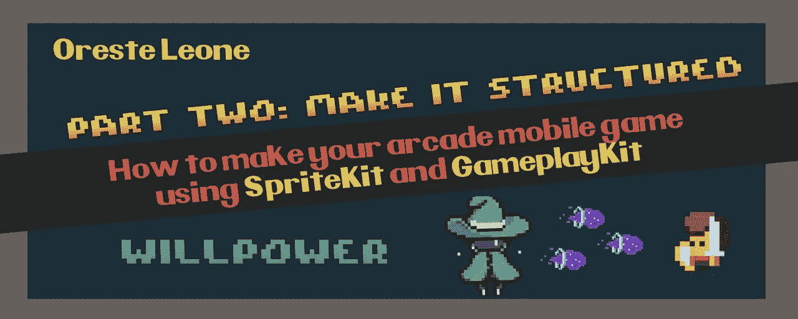
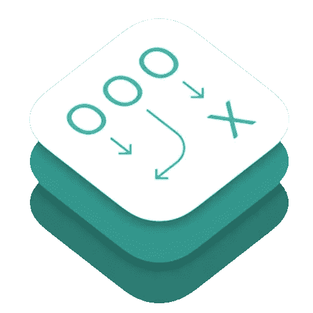
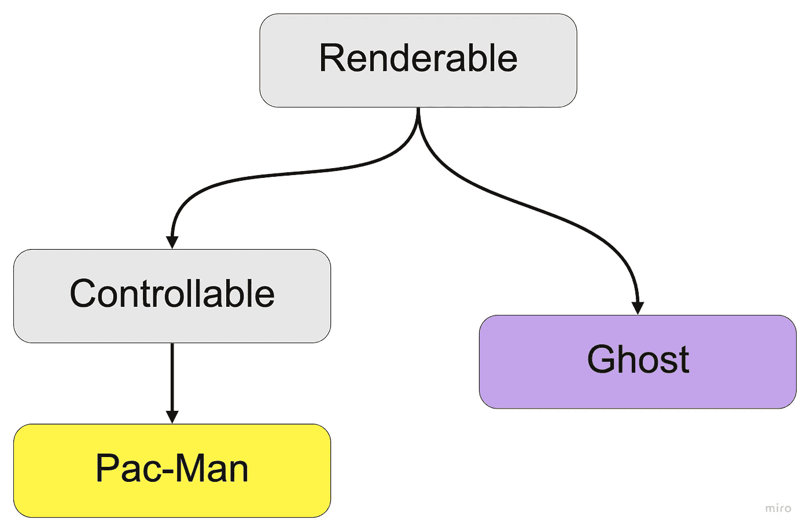
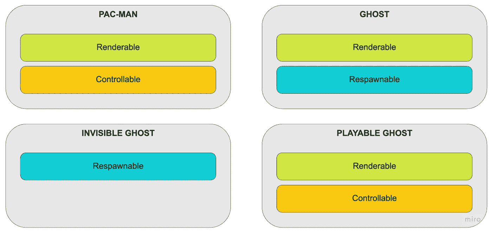
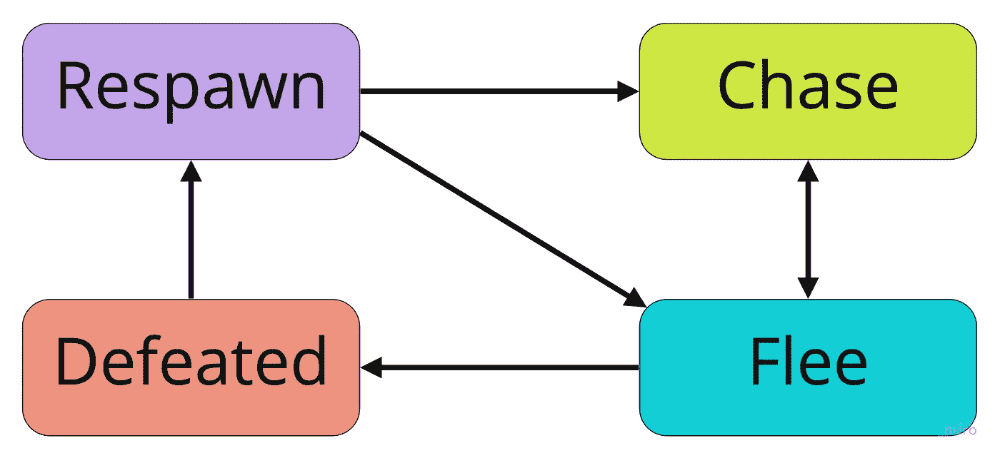
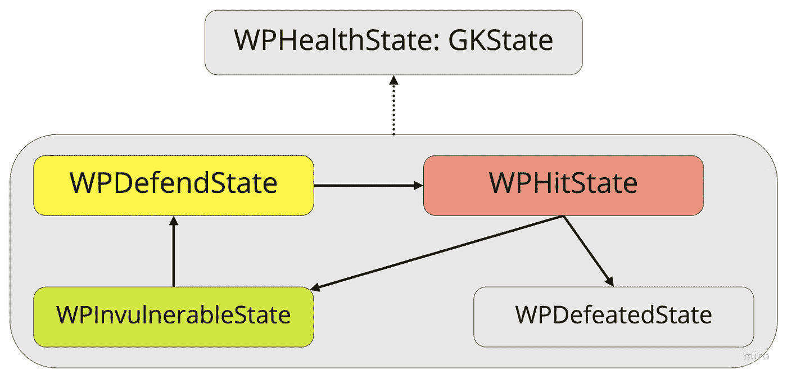

# 如何在街机 iOS 游戏中使用 GameplayKit

> 原文：<https://betterprogramming.pub/make-it-structured-gameplaykit-6d7e79d5a44a>

## 使用 GameplayKit 构建您的游戏



轮到我拿`skScene`！哈哈！没有吗？好吧好吧…

嗨，我是 Oreste，如果你在这里，这可能意味着你有了你的第一个有 SpriteKit 场景的游戏，如果没有，我真的建议你去看看这个教程的[第一部分，作者](https://medium.com/@scaps/how-to-make-your-arcade-ios-game-using-spritekit-and-gameplaykit-make-it-spritey-547a871b690f) [Luigi Minniti](https://medium.com/u/4263bee5b0e3?source=post_page-----6d7e79d5a44a--------------------------------) 关于 SpriteKit。

但是现在，*你能做些什么来更上一层楼呢？你知道如何处理一个完整的游戏，让它足够干净，以确保有效的可扩展性，而不必多次重写你已经在项目中提供的东西吗？*

然后，

# 我们需要谈谈 GameplayKit。



GameplayKit 徽标

GameplayKit 是由 Apple 开发的一个框架，在 iOS 9 和 macOS X.11 中引入，它提供了许多类型的游戏中常见的基础架构。

它让你专注于游戏的玩法和游戏规则，最大限度地减少类似意大利面条的代码编写，它只需要一个基于 Objective-C 或 Swift 的界面。

> *有了 GameplayKit，一切都与结构有关。*

开发人员经常会遇到的一件事是，这种巨大的场景隐藏了一切，使他们的生活变得更加艰难，这是很容易预测的事情，尤其是使用 SpriteKit。

一旦你开始一个新项目，Xcode 会给你一个明确的方向，一个继承自`SKScene`的类已经解决了处理输入、帧更新、节点层次、所有物理管理等等…

但是这些只是小积木，如果你迟早把它们放在一起…

> ***你会过得很不好***

****

**Sans 下层**

**以这种方式开始是可以的，但从长远来看，这不是你想要做的事情。**

**老实说，我并不认为自己是专家，但我想向您展示一些我在研究 GameplayKit 以实现我最近的两个项目时学到的东西，特别是当意志力版本 0.0.1(3)发布时，ECS 和状态机，也使用了我在研究它时寻找的东西，你们都应该熟悉:Pac-Man！**

# **实体-组件系统**

****

****ECS** 是*实体-组件系统*的首字母缩写，这是苹果鼓励我们在开发游戏时在项目中采用的软件工程实践，并无新意，只是游戏开发中的常见实践。**

**你不用把代码放在场景或`SKSpriteNode`子类中，而是用这些更抽象的东西来表示你游戏中的对象(玩家、敌人、墙壁、任何东西),它们只需要很少的数据和信息，而你把其他的东西都放在`Components`中。**

**每个实体都是一个`GKEntity`，或者更可能是它的一个子类，你可以在其中添加你需要的属性，这些属性只是数据，你不希望你的功能放在那里。**

```
**class WPEntity: GKEntity{
	//........
}**
```

**对于它们，您使用组件，即`GKComponent`的子类，然后将它们添加到实体中。您只需编写一次，就可以将该功能赋予您想要的每个实体。**

**意志力健康组件版本 0.0.1(3)**

**这是对独立性、模块化、可伸缩性和可维护性的巨大改进。**

**让我们用一个类似 Pac-man 的游戏来举例，从继承经典的面向对象范例开始:一个 Pac-Man 游戏依赖于玩家、幽灵、水果、小球和能量小球等元素；现在让我们把注意力集中在`player`和`ghost`上。**

****

**作为两者的超类，我们可以想到一个可渲染类，因为我们需要以某种方式显示它们，这是首先要想象的事情之一。吃豆人也受玩家输入的影响，所以我们让它也从一个可控类继承。**

**但是如果我想让我的游戏成为一个多人聚会游戏，也许是通过一个可玩的幽灵？还是用*隐形鬼*让*更难*？随着字符数量的增加，您可能已经看到了一些问题。如何设置继承链？可玩幽灵可以从幽灵继承，但它也需要可控；隐形鬼确实是鬼但是可渲染的呢？**

**让我们尝试切换到 ECS:**

****

**Pac-Man 和 Ghost 是`Entity`的子类，隐形 Ghost 和可玩 Ghost 继承自 Ghost。已经是一个*更简单的概念，因为它遵循语义*。**

**如前所述，我们可以将它们的功能分解为 3 个部分:*可渲染的*、*可控制的、*和*可渲染的*。**

**一旦创建了它们，就可以将它们添加到具有该功能的实体中，这样就万事大吉了！您还可以使用 ComponentSystems 来管理特定功能的每个实例。**

# **状态机**

**每个游戏都要担心游戏状态:这都是关于它们以及它们如何变化的。它们代表着正在发生的事情，影响着一切，比如你如何处理输入，如何显示信息等等…**

**如果您只是将所有代码转储到您的场景中，甚至是一个实体对象中，您可能会以一个庞大的 if-else 链结束，这通常很难调试、扩展和处理。**

**GameplayKit 包括一种处理状态机的方法，这样你就可以处理它们了，所以让我们用 Ghosts 行为来做个例子:**

****

**一只**鬼**有 4 种状态:**

*   ****追逐**，其中它试图到达玩家；**
*   ****逃离**，通过吃一颗能量丸使其逃离吃豆人而不被吃掉；**
*   ****打败了**，玩家吃鬼的时候；**
*   ****重生**，当它回到自己的牢房再次开始追逐状态。**

**为了实现这个结构，我们创建了一个`GKStateMachine`实例，您给出了一个状态列表，每个状态都必须是`GKState`的一个特定子类。这个想法是，每当你必须做出一些决定或做一些依赖于那个状态的功能时，你把那个功能放在你想要处理的状态中，你可以根据你想要发生的事情实现那个覆盖方法，例如在转换、进入、离开等过程中……[`didEnter(from previousState:GKState) ; willExit(to nextState:GKState)`]**

**这是我在意志力中为健康部分使用的状态机的另一个例子:**

****

***健康组件内部声明:***

**版本 0.0.1(3)中意志力健康组件内的健康状态机声明**

***状态类:***

**意志力健康状态 0.0.1 版(3)**

# **包装它**

**我真的鼓励你试试 GameplayKit，它真的简化了我的工作流程，让我可以在短短 3 天内培养意志力！**

**如果我发现了新的东西，我会试着更新这篇文章，不要犹豫，联系我讨论它，继续发展！(大多是游戏！👾 ).**

**[](https://github.com/orleonedev/WillPower-JamVersion) [## GitHub-orleonedev/意志力-JamVersion: NCX 街机游戏 Jam - SpriteKit 和 GameplayKit 街机…

### 此时您不能执行该操作。您已使用另一个标签页或窗口登录。您已在另一个选项卡中注销，或者…

github.com](https://github.com/orleonedev/WillPower-JamVersion) 

如果你想的话，可以看看我的同事兼童年好友 Matteo Morena 写的关于意志力的文章，这是我们一起开发的游戏。

[](https://medium.com/@mmorenanow/making-a-game-in-5-days-willpower-a1b3cf79238d) [## 5 天做游戏:意志力

### 通过试飞下载链接:https://testflight.apple.com/join/HwunISkz

medium.com](https://medium.com/@mmorenanow/making-a-game-in-5-days-willpower-a1b3cf79238d) [](https://medium.com/@scaps/how-to-make-your-arcade-ios-game-using-spritekit-and-gameplaykit-make-it-spritey-547a871b690f) [## 如何使用 SpriteKit 和 GameplayKit 制作你的街机 iOS 游戏——制作它 spritey。

### 你有没有想过在苹果手机平台上开发你的街机游戏？那就和我一起踏上这个旅程，学习两个…

medium.com](https://medium.com/@scaps/how-to-make-your-arcade-ios-game-using-spritekit-and-gameplaykit-make-it-spritey-547a871b690f)**