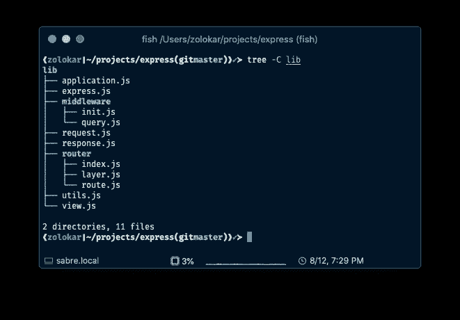

# 构建您已经使用的软件库的自己的版本

> 原文：<https://betterprogramming.pub/make-shitty-versions-of-software-libraries-you-use-e4e86af1cb7f>

## 通过这个练习学习新的技能并加深你的知识

[叶朋昌](https://unsplash.com/@eepeng)在 [Unsplash](https://unsplash.com/photos/FhMSavrbn1M) 上的照片

## 通读你使用的软件项目

在过去的几个星期里，我花了一些时间挑选出我使用的一些软件项目，并试图编写它们的小而简单的版本。这是一种非常简洁的方式来了解某些事情是如何以及为什么会这样。

例如，我多年来一直使用专业版的 [Express](https://expressjs.com/) 。我几乎在所有用 node 构建的 web 项目中都使用过 Express，如果你是后端 Node 开发人员，你可能也用过它。

也许有时你会质疑整个中间件模式是如何工作的，或者为什么你必须使用回调函数而不是返回一个承诺来前进到下一个中间件函数。

也许你一直在浏览你的 web 应用程序，你发现自己在`*node_modules/express/lib/router/index.js*`中，你可以看到矩阵(不知何故你现在知道功夫了)。以一个`node_modules` 文件结束可能有点吓人，但是如果你看得更远一点，你可能会意识到可怕的模块代码对你来说足够容易或足够小，如果你花一点时间阅读它。

例如，Express 只有 12 个文件用于它所拥有的所有请求、响应、路由、视图呈现、嵌套和中间件链接功能。在一个周末内通读《特快专递》是完全可能的。您可能不会马上理解所有的内容，但是您会学到一些简洁的实现细节，并且您可以随时记下您不太理解的部分，以便以后查阅。

所有 Express(不包括测试和元文件)

我第一次阅读路由器逻辑时，遇到了这种奇怪的细节，如果你注册了一个有三个以上参数的中间件函数，Express 只需[悄悄地跳过它](https://github.com/expressjs/express/blob/3ed5090ca91f6a387e66370d57ead94d886275e1/lib/router/layer.js#L89)并继续下一个中间件函数。

如果您处于开发模式，他们不会编写调试消息，甚至在知道第四个参数必须是`undefined`的情况下调用函数(对我来说，这听起来更像是 JavaScript 的事情)。

如果您正在编写一个应用程序库，您会有不同的做法吗？在那之前，我一直在阅读源代码，看着它，就像“是的，我想这是有道理的”或“酷，我不会想到这一点，”但这是我第一次想到我宁愿做一些不同的事情。这就引出了我的下一个观点...

# 重写你使用的软件项目(也就是制作你自己的版本)

我相信通读您使用的软件项目和库有助于更好地理解整个应用程序是如何工作的，但我认为这个旅程的下一步是挑选一些小的库，并制作它们的真正简单的版本。

继续快速示例，您可以创建一个仅实现`app.use`的快速克隆。这样做可以让您的最终产品能够处理框架之外的所有路由和呈现。

为了达到这一点，您需要创建一个可以注册中间件的应用程序对象。您还需要决定如何存储中间件，如何将每个功能链接在一起，以及如何传入最终将调用下一个中间件的下一个功能。

然后，您需要弄清楚如何运行 HTTP 服务器来获取请求和响应对象/流，您将把它们传递给注册的中间件功能。

最后，您可以添加一些默认的中间件功能，如 Express does，来处理查询字符串解析和主体解析。您是希望内置自动解析 JSON 请求体的功能，还是希望让用户自己决定？完全由你决定。也许您可以解析查询字符串，让用户将它作为一个 [SearchParams](https://developer.mozilla.org/en-US/docs/Web/API/URLSearchParams) 实例来访问，而不是一个普通的旧对象。

您还可以复制库的接口，然后将其放入使用参考实现的项目中。您可以从“顺便测试 it ⁠”中获得很多真知灼见——了解哪些部分出了问题或者还没有实现。

我已经用快速克隆的[快速](https://github.com/copperwall/rapid)尝试过了。是要取代快递吗？当然不是。我会在我所有的个人项目中使用它而不是 Express 吗？大概不会。但到目前为止，这很有趣，而且还有更多的功能可以添加或重新创建。另外，如果你想在 Rapid 上做公关，他们似乎非常受欢迎。

但是，不要只是逐字重写项目。复制接口，但是亲自尝试实现，⁠——也许你会有机会和最初的实现者一样面临同样的抉择。你可能最终会做出不同的选择，或者至少欣赏你解决问题的不同方式。你可以在事后对照参考来检查你的工作，如果参考有更好的解决方案，你可以改进它。如果是像 Express 这样的大型项目，可能会。大型项目可能会因维护您可能不需要或不关心的功能的向后兼容性而变得复杂。

另一个很酷的项目是[数据加载器](https://github.com/graphql/dataloader)。数据加载器是一个批量加载和缓存资源的工具。通过用一个批处理函数构造它来创建它的一个实例，该函数接受一些键并返回一个承诺，该承诺解析为与这些键相关的值。批处理函数可以运行 SQL 查询或访问 REST API 或其他数据源。

用户通过用一个键调用一个`load`函数与实例进行交互，当批处理函数成功加载数据时，返回一个将解析为键值的承诺。

酷的部分是数据加载器通过使用一些节点异步原语调度批处理函数在当前执行帧之后运行，并缓存结果。如果您在整个 web 请求生命周期中多次请求相同的资源，Data Loader 将只加载一次。此外，您可以在整个请求生命周期中请求单独的资源，Data Loader 将在每个执行帧结束时批量加载它们。

Data Loader 的实现只有一个文件(不包括测试)，甚至还有一个来自其中一个创建者的 [YouTube 视频](https://www.youtube.com/watch?v=OQTnXNCDywA)，涵盖了整个源代码。

编写您自己的实现意味着您必须涵盖一些概念，如创建承诺、缓存、使用类似于`process.nextTick`的东西进行异步操作，以及决定如何处理来自无效用户条目的错误，如错误的批处理函数。

希望你脑子里有一些经常使用的项目，但并不真正理解它们是如何工作的。