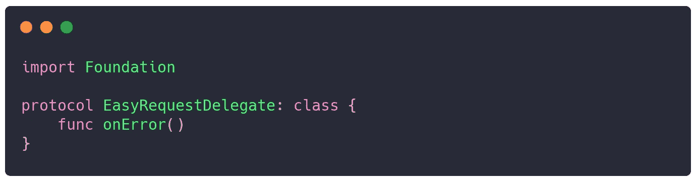
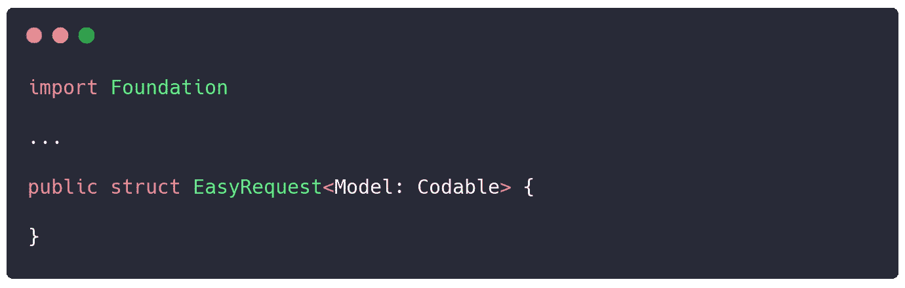
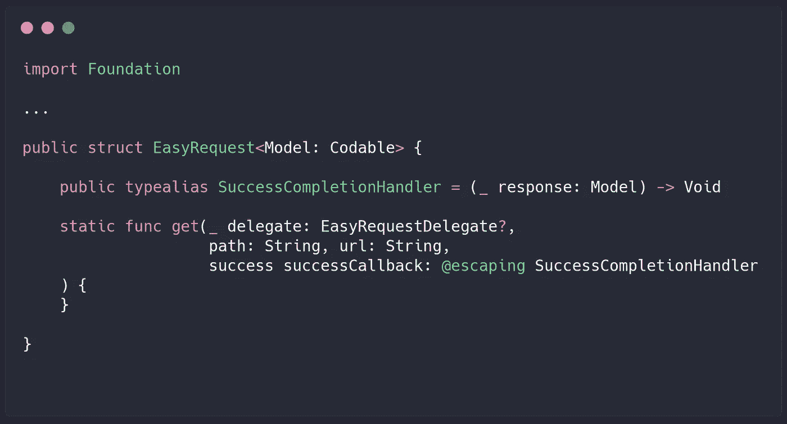
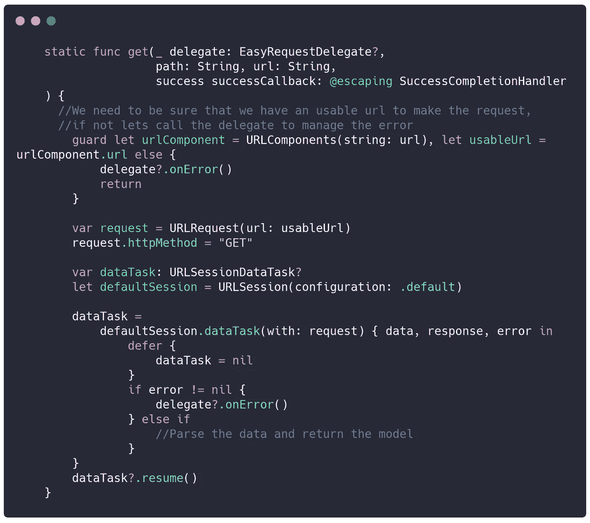
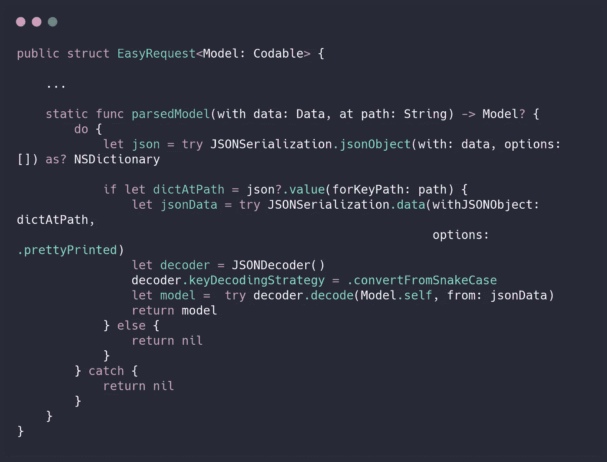
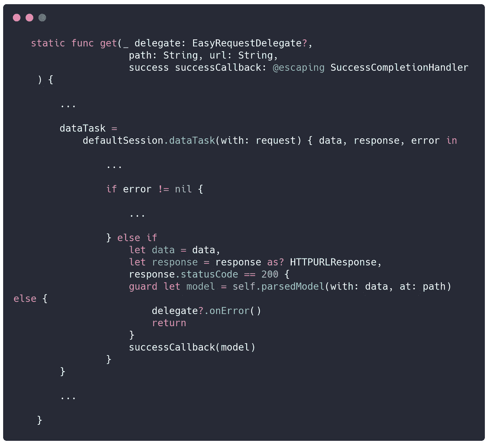
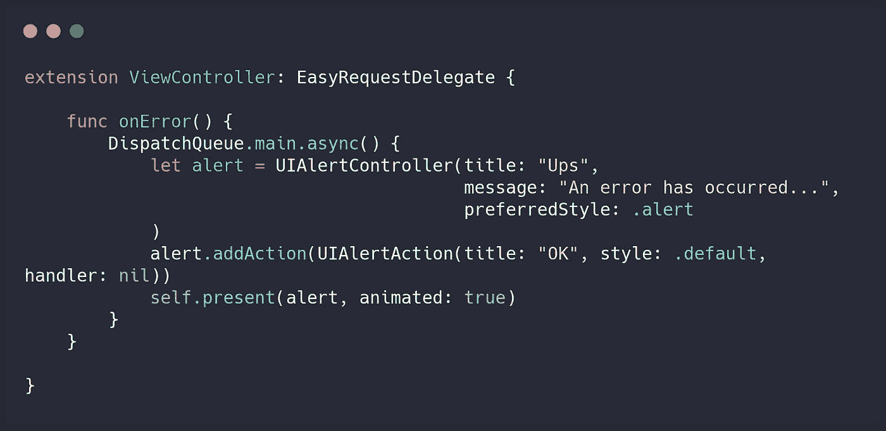
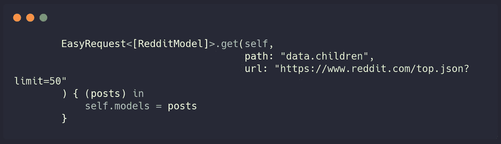

# Swift 5 中一个可重用的简单 HTTP 请求客户端

> 原文：<https://betterprogramming.pub/make-simple-http-requests-on-swift-5-f2f07f57f172>

## 完全在 Swift 中创建自己的 HTTP 请求客户端，无需任何其他库

安妮·斯普拉特在 [Unsplash](https://unsplash.com/s/photos/coding?utm_source=unsplash&utm_medium=referral&utm_content=creditCopyText) 上拍摄的照片

首先，我们将为我们的 HTTP 客户端创建一个`struct`。

但是等等，耶稣，用一个`class`代替！嗯……对于这种方法，我们不需要所有那些只有类提供的特性，比如继承、身份、Objective-C 互操作性。

我们想使它简单，也需要确保这个客户端不能被我们代码的另一部分改变。

让我们创建一个协议来管理所有的错误。

EasyRequest.swift

为什么？正如我之前所说的，我们想让它变得简单，所以我的最终函数将只管理成功响应，所有的错误将通过一个委托来管理，然后您的`View` / `ViewController`将知道当错误发生时该做什么。(稍后我会再多解释一点，我保证。)

现在，让我们开始创建我们的客户端(姑且称之为`EasyRequest`)并添加对`Codable`模型的通用支持。

EasyRequest.swift

此时，我们将只创建一个函数，一个发出 HTTP `GET`请求的函数。如果您愿意，您可以使用这个示例并创建支持所有其他方法(`POST`、`PUT`、`GET`)的函数，并添加诸如头和参数之类的东西。

EasyRequest.swift

也许你熟悉那个函数里面的所有参数，除了一个，`PATH`，这是什么？

同样，我们想让它变得简单。因此，这个参数将帮助我们访问 JSON 响应中的嵌套对象。(我知道，没有人这么做，也许我疯了。)

我们将使用`[URLRequest](https://www.raywenderlich.com/3244963-urlsession-tutorial-getting-started)` [、](https://www.raywenderlich.com/3244963-urlsession-tutorial-getting-started) `[URLSessionDataTask](https://www.raywenderlich.com/3244963-urlsession-tutorial-getting-started)` [和](https://www.raywenderlich.com/3244963-urlsession-tutorial-getting-started) `[URLSession](https://www.raywenderlich.com/3244963-urlsession-tutorial-getting-started)`来发出 HTTP 请求。

EasyRequest.swift

我们差不多完成了，现在我们需要解析 JSON 数据并返回期望的`Codable`对象。

EasyRequest.swift

之后，让我们回到`get`函数，添加一些额外的代码来使用`parsedModel`函数。

EasyRequest.swift

就是这样！现在你可以使用它了

# 错误

但是在此之前…还记得那个代表错误吗？那么，您需要扩展您的控制器/视图/演示器来管理这些错误。

ViewController.swift

太好了，你做到了！现在你有一个简单的方法来提出你的要求。

你可以叫你的`EasyRequest`:

ViewController.swift

你可以在这里[下载一个例子](https://github.com/nievesjesus/EasyRequest-Example)。

就这些了…下次见。