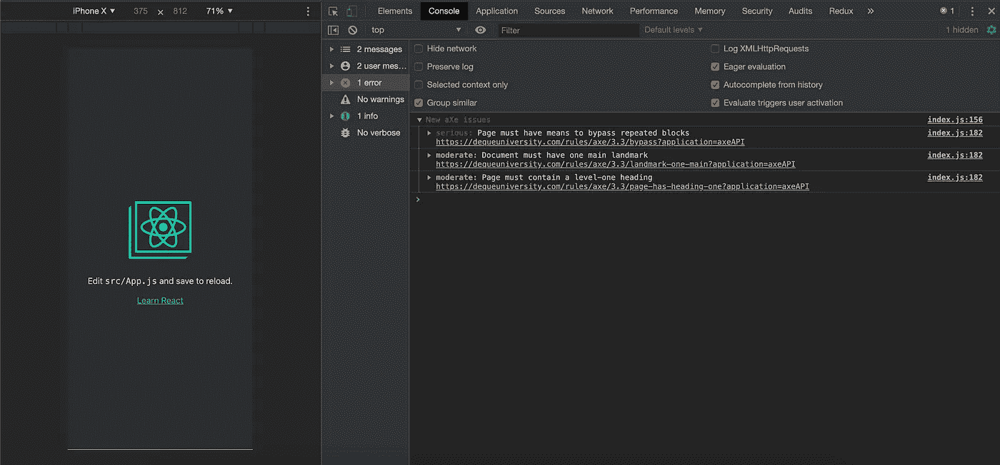
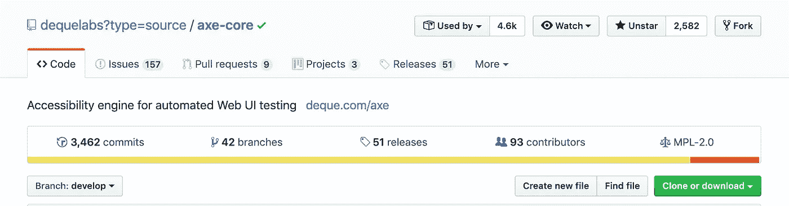
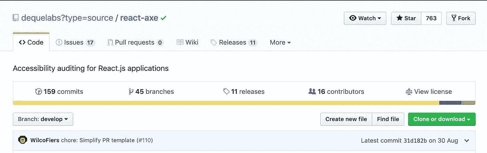
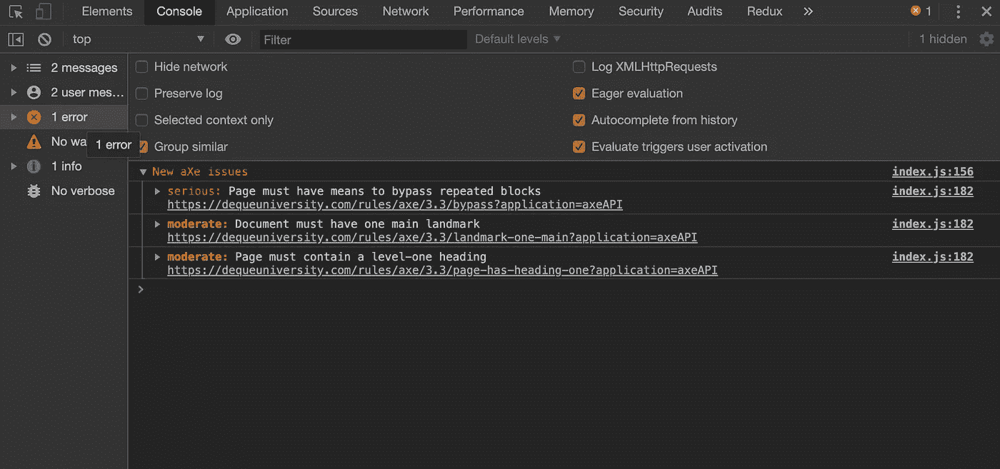
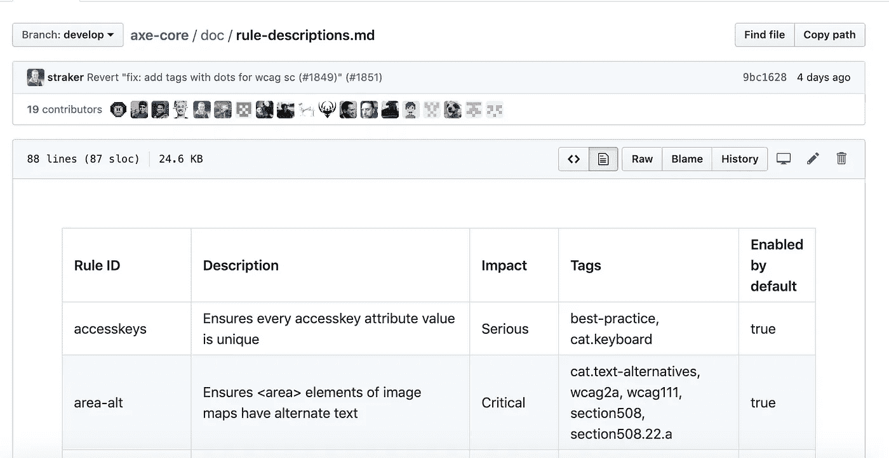

# 使用 Axe 可访问性库使您的 Web 应用程序具有可访问性

> 原文：<https://betterprogramming.pub/make-sure-your-web-application-is-accessible-with-the-axe-accessibility-library-363f667ef99f>

## Axe 是网站和其他基于 HTML 的用户界面的可访问性测试引擎。



react-axe 将在开发工具中显示可访问性结果

伟大的应用和优秀的应用有什么区别？无障碍！

小事很重要。用户希望使用键盘来浏览你的应用程序，盲人用户也希望阅读你的博客，超级用户希望使用快捷键来浏览，比如 tab 键。

这就是 Axe 测试库派上用场的地方。



斧心—[https://github.com/dequelabs/axe-core](https://github.com/dequelabs/axe-core)

# Axe 可访问性测试库理念

只有当开发人员被授权承担可访问性测试和可访问性编码实践的责任时，web 才能成为一个可访问的、包容的空间。

自动化的易访问性测试可以节省大量的时间。它不需要特殊的专业知识，并且允许团队将专家资源集中在最重要的可访问性问题上。不幸的是，大多数可访问性工具应该运行在已经到达开发过程末尾的站点和应用程序上，它们经常不能给出清晰或一致的结果，在您认为您的产品已经准备好发布的时候造成挫折和延迟。

Axe 是为了反映 web 开发的实际工作方式而构建的。它适用于开发团队可能使用的所有现代浏览器、工具和测试环境。使用 Axe，可访问性测试可以作为您的单元测试、集成测试、浏览器测试以及您的团队已经在日常基础上执行的任何其他功能测试的一部分来执行。将易访问性测试构建到早期开发过程中可以节省时间、资源和各种挫折。

# 关于斧头——宣言

*   Axe 是一个开源项目。
*   它返回零误报(尽管有错误)。
*   它被设计成可以在所有现代的浏览器上工作，并且可以使用你今天使用的任何工具、框架、库和环境。
*   它得到了主要的可访问性供应商[德克系统](https://www.deque.com/)的积极支持。
*   它与您现有的功能/验收自动化测试相集成。
*   它会根据评估上下文自动确定要运行的规则。
*   Axe 支持内存 fixture、静态 fixture、集成测试和无限深度的 iframes。
*   Axe 是高度可配置的。

# React 入门



react-axe GitHub 页面—【https://github.com/dequelabs/react-axe 

用 NPM 或纱线安装模块。

NPM:

```
npm install --save-dev react-axe
```

纱线:

```
yarn add react-axe
```

# 初始化模块

调用导出的函数，传递 React 和 ReactDOM 对象，以及在每次组件更改和分析开始之间观察到的时间延迟(以毫秒为单位)。

```
const React = require('react');
const ReactDOM = require('react-dom');

if (process.env.NODE_ENV !== 'production') {
  const axe = require('react-axe');
  axe(React, ReactDOM, 1000);
}
```

# 无框架入门

首先，安装`axe-core`包。

```
npm install axe-core --save-dev
```

# API 包的内容

[axe-core API](https://github.com/dequelabs/axe-core/blob/develop/doc/API.md) 包包括:

*   `axe.js` -应该包含在您的测试网站(API)中的 JavaScript 文件
*   `axe.min.js` -上述文件的缩小版

在夹具或测试系统的每个 iframes 中包含 JavaScript 文件。

```
<script src="node_modules/axe-core/axe.min.js"></script>
```

现在，在测试中新的 UI 变得可见或暴露的每一点插入调用:

```
axe.run(function (err, results) {
  if (err) throw err;
    ok(results.violations.length === 0, 'Should be no accessibility issues');
    // complete the async call
    ...
});
```

在您的开发环境中运行该模块(如上面的代码所示),否则您的应用程序将在生产中使用不必要的资源。您可以使用 [envify](https://www.npmjs.com/package/envify) 来完成这项工作，如这个[示例](https://github.com/dequelabs/react-axe/blob/develop/example/package.json#L35)所示。

一旦初始化，该模块将在每次组件更新时向 Chrome Devtools 控制台输出可访问性缺陷信息。

现在，一旦您运行 React 应用程序，web 控制台应该会向您显示任何可访问性问题，如果存在的话。



Axe 可访问性错误和警告

# 支持的浏览器

[axe-core API](https://github.com/dequelabs/axe-core/blob/develop/doc/API.md) 完全支持以下浏览器:

*   微软 Edge v40 及以上版本
*   谷歌 Chrome v42 及以上
*   Mozilla Firefox v38 及更高版本
*   苹果 Safari v7 及以上版本
*   Internet Explorer v9、10、11

支持意味着我们将修复漏洞，并尝试定期测试每个浏览器。目前只有 Firefox、Chrome 和 Internet Explorer 11 会对每个拉取请求进行测试。

对 JSDOM 的支持有限。我们将尝试让所有规则都与 JSDOM 兼容，但如果这不可能，我们建议关闭这些规则。目前已知`color-contrast`规则不支持 JSDOM。

我们只能支持那些本地支持或正确填充功能的环境。我们不支持过时的 v0 影子 DOM 实现。

# 可访问性规则

由`axe-core`运行的规则的完整列表可以在[doc/rule-descriptions . MD](https://github.com/dequelabs/axe-core/blob/develop/doc/rule-descriptions.md)中找到。



axe rules—[https://github . com/dequelabs/axe-core/blob/develop/doc/rule-descriptions . MD](https://github.com/dequelabs/axe-core/blob/develop/doc/rule-descriptions.md)

# 结论

确保所有用户都可以访问您的应用程序。人那么多，各有各的需求。你能迎合的需求越多，流量就越高。尽你所能利用一切优势。

感谢阅读，编码快乐！