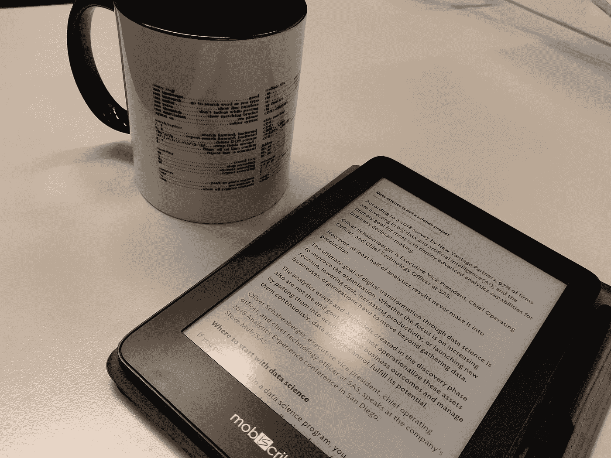

# 如何使用 Platypush 自动将文章发送到你最喜欢的电子阅读器

> 原文：<https://betterprogramming.pub/make-the-web-readable-again-how-to-automatically-deliver-article-and-news-digests-to-your-45dc69773380>

## 让网络来到你身边



没有什么比早晨的咖啡和你的标题自动传送到你的电子墨水显示器更好的了

这个故事的更新版本可以在 [*Platypush 博客*](https://blog.platypush.tech/article/Deliver-articles-to-your-favourite-e-reader-using-Platypush) *上找到。*

如今，RSS 订阅是一个被大大低估的网络功能——至少在极客圈子之外。

他们比许多人想象的更无所不在(每一个值得尊敬的新闻网站都至少提供一个 feed)。他们让用户有可能通过[聚合器](https://feedly.com/)创建自己的新闻提要和公告板，而不依赖于云运行算法的仁慈。它们的结构化本质(在 RSS feed [的引擎盖下，它只是一个结构化的 XML](https://validator.w3.org/feed/docs/rss2.html) )提供了构建自动化管道的可能性，这些管道可以随时随地以我们想要的格式交付我们想要的内容。

IFTTT 是在 RSS 提要上构建定制逻辑的一个流行选项。这使得构建相对复杂的规则变得非常直观，例如“给我发一份最新一期《经济学人》文章的每周摘要”或“每天早上 6 点从 NYT 发一份摘要的电报消息”或者“[每当 *XKCD* 发布新漫画](https://ifttt.com/applets/Tn8ZiwJ4-notification-for-new-xkcd?term=xkcd)时向我的手机发送通知。”

然而，在我看来，多亏了互联网连接的电子阅读器，如 [Kindle](https://www.amazon.com/Amazon-Kindle-Ereader-Family/b?ie=UTF8&node=6669702011) 或 [MobiScribe](https://www.indiegogo.com/projects/mobiscribe-the-e-ink-notepad#/) ，以及像 [Mercury](https://github.com/postlight/mercury-parser) 和 [Instapaper](https://www.instapaper.com/) 这样的网络服务，它们可以将网页转换成干净的、便于打印的格式，RSS 订阅才能真正得到最好的利用。

将我们的新闻来源整齐地组织在一个聚合器中是很棒的。有可能在我们喜欢的时候发布新文章或每日/每周/每月摘要时配置推送通知，这也很好。

但是这些功能仅仅解决了问题的第一部分——内容分发。问题的第二部分——内容消费——是当我们点击一个链接，在任何设备上以任何我们喜欢的格式发送，然后我们开始阅读实际的文章。

如今，这样的体验大多发生在笔记本电脑屏幕上，或者更糟糕的是，在小小的智能手机屏幕上，我们被期望在充满广告和付费墙的非移动优化内容中滚动，而无数其他通知需要我们的注意力。可以说，在智能手机屏幕上阅读冗长的内容就像在 Kindle 上浏览网页一样糟糕。

如果我们能把自己最喜欢的内容自动传送到自己最喜欢的阅读设备上，格式正确，大小易读，没有任何杂乱和干扰，这不是很好吗？没有背光屏幕一直在我们眼前？

在这篇文章中，我们将看到如何通过使用几种技术工具(电子阅读器、Kindle 帐户、Mercury API 和 Instapaper)来实现这一点，以及如何通过 [Platypush](https://medium.com/@automationguru/automate-your-house-your-life-and-everything-else-around-with-platypush-dba1cd13e3f6) 将所有这些部分连接在一起。

# 配置您的 Kindle 帐户

在第一部分中，我假设您有一个 Kindle、一个链接的 Amazon 帐户和一个 Gmail 帐户，我们将使用它们通过电子邮件以编程方式向设备发送文档(我们稍后将了解如何在其他设备上利用 Instapaper)。

首先，你必须创建一个与你的 Kindle 相关联的电子邮件地址，用于远程传送文档:

1.  前往[亚马逊内容和设备门户网站](https://amazon.com/mycd)，使用您的帐户登录。
2.  单击第二个选项卡(“您的设备”)，然后单击您的内容应该发送到的设备旁边的上下文菜单。
3.  您将看到与您的设备关联的电子邮件地址。复制它，或点击“编辑”来更改它。
4.  单击第三个选项卡(“设置”)，滚动到底部标题为“个人文档设置”的部分
5.  滚动到底部名为“批准的个人文档电子邮件列表”的部分，并将您的 Gmail 地址添加为可信来源。

为了检查一切是否正常，你现在可以尝试从你的个人电子邮件地址向你的 Kindle 发送一份 PDF 文档:如果设备连接到 WiFi，那么文档应该会在几秒钟内自动下载。

# 用所需的依赖项安装 Platypush

那些关注我的人可能已经读过我在 [Platypush](https://github.com/BlackLight/platypush) 上的一些文章，这是我在过去几年里建立的自动化平台。不熟悉的可以从我的第一篇媒体文章[开始。](https://medium.com/@automationguru/automate-your-house-your-life-and-everything-else-around-with-platypush-dba1cd13e3f6)

在它所提供的特性中，包含了我们在这件作品中所需要的所有成分。我们尤其需要构建一个自动化管道，以便:

*   定期检查 RSS 源列表中的新内容
*   通过简化网页(通过 [Mercury parser](https://github.com/postlight/mercury-parser) 或 Instapaper)预处理新项目，并可选地将它们导出为 PDF
*   以编程方式向您的设备发送包含新内容的电子邮件

首先，安装 Platypush 和所需的附加组件(任何兼容操作系统的设备都可以:RaspberryPi、未使用的笔记本电脑或远程服务器):

```
pip install 'platypush[http,pdf,rss,google]'
```

你还需要安装`npm`和`mercury-parser`。Postlight 以前曾经为它的解析器提供了一个 web API，[但是他们已经停止了它，选择让这个项目开源](https://postlight.com/trackchanges/mercury-goes-open-source):

```
# Supposing you're on Debian or Debian-derived OS
apt-get install nodejs npm
npm install @postlight/mercury-parser
```

其次，将 Platypush 链接到您的 Gmail 帐户，通过电子邮件发送文档:

*   在[谷歌开发者控制台](https://console.developers.google.com/)上创建一个新项目
*   从上下文菜单> OAuth 客户端 ID 中单击“凭据”
*   生成后，您可以在“OAuth 2.0 客户端 id”部分看到您的新凭证。单击“下载”图标，将它们保存到一个 JSON 文件中
*   将文件复制到您的 Platypush 设备/服务器上，例如`~/.credentials/client_secret.json`
*   在设备上运行以下命令来授权应用程序:

```
python -m platypush.plugins.google.credentials \
    "https://[www.googleapis.com/auth/gmail.modify](http://www.googleapis.com/auth/gmail.modify)" \
    ~/.credentials/client_secret.json \
    --noauth_local_webserver
```

*   在浏览器中复制链接；如果需要，使用您的 Google 帐户登录；并授权该应用程序。

现在一切都准备好了，是时候配置 Platypush 来处理您喜欢的提要了。

# 创建自动将文章发送到 Kindle 的规则

后端是一个灵活的组件，可以配置为轮询和处理来自许多 web 资源的更新——JSON、RSS、Atom 等。

假设你想每天两次在 [*查看每日*](https://www.nytimes.com/2018/07/16/podcasts/the-daily/how-do-i-listen-to-the-daily.html) RSS 订阅源的更新，并向你的 Kindle 发送一个包含新内容的摘要。

您将希望在您的`~/.config/platypush/config.yaml`文件中创建一个如下所示的配置:

```
backend.http.poll:
    requests:
        -
            # This poll will handle an RSS feed
            type: platypush.backend.http.request.rss.RssUpdates # RSS feed URL and title
            url: [http://feeds.podtrac.com/zKq6WZZLTlbM](http://feeds.podtrac.com/zKq6WZZLTlbM)
            title: NYT - The Daily # How often we want to check for updates
            # 12h = 43200 secs
            poll_seconds: 43200 # We want to convert content to PDF
            digest_format: pdf # We want to parse and extract the content from
            # the web page using Mercury Parser
            extract_content: True
```

创建一个对`NewFeedEvent`做出反应的事件挂钩，并通过电子邮件将处理后的内容发送到您的 Kindle:

```
event.hook.OnPdfDigest:
    if:
        type: platypush.message.event.http.rss.NewFeedEvent
        digest_format: pdf
    then:
        action: google.mail.compose
        args:
            sender: your-personal@gmail.com
            to: your-kindle@kindle.com
            subject: ${title} feed digest
            body: Your ${title} RSS feeds delivered directly to your Kindle
            files:
                - ${digest_filename}
```

重启 Platypush。一旦应用程序在目标 feed 中找到尚未处理的项目，它将解析它们，将它们转换为 PDF，触发一个将被您的钩子捕获的`NewFeedEvent`，生成的 PDF 将被发送到您的 Kindle。

只需在`http.poll`后端的`request`属性中添加更多的条目，就可以添加更多受监控的 RSS 源。现在，享受在合适的屏幕上阅读你的文章，每天一次或两次直接发送到你的电子阅读器上——一旦你投入到这种新的体验中，微小的智能手机屏幕、付费墙、弹出窗口和广告会感觉更加过时。

# 将内容即时发送到您的电子阅读器

RSS 提要很棒，但它们不是我们今天发现和消费内容的唯一方式。

很多时候，我们滚动浏览我们最喜欢的社交媒体时间轴，偶然发现一篇有趣的文章，开始在我们的小屏幕上阅读它，我们希望以后在更大的屏幕上继续阅读它。

一些工具和产品已经出现，为“解析它，保存它，并在以后阅读它”的问题提供了解决方案——在那些 [Evernote](https://evernote.com) 、 [Pocket](https://getpocket.com) 和 [Instapaper](https://instapaper.com) 本身中。

然而，他们中的大多数人仍然受到同一个问题的影响:要么他们在以更可读的格式解析和提取内容方面做得不好(除了 Instapaper——Pocket 只保存了原始内容的链接，而 Evernote 的内容解析功能至少还有很大的改进空间)，要么他们仍然局限于运行它们的智能手机或电脑的背光屏幕。

当我们在 Android 设备上滚动脸书时间线时，偶然发现一篇有趣的文章，然后点击一下，以一种漂亮可读的格式将其发送到我们的 Kindle，这不是很酷吗？让我们看看如何在 Platypush 中实现这样的规则。

首先，我们需要运行在我们的移动设备上的东西，以编程方式与安装在我们的 Raspberry/computer/server 上的 Platypush 实例进行通信。

我认为 [Tasker](https://tasker.joaoapps.com/) 是最适合这一目的的应用之一:有了 Tasker(以及 joaoapps 开发的其他相关应用)，就有可能在你的 Android 设备上自动化任何事情，并创建复杂的规则将它与任何事情联系起来。

Tasker 与 Platypush 通信的方式有很多(直接 RPC over HTTP 调用，使用 [Join](https://joaoapps.com/join/) 与外部 MQTT 服务器进行消息调度，使用中间 IFTTT hook，或者 Pushbullet 等。)，并且 Platypush 有许多方法可以与您移动设备上的 Tasker 进行通信(使用 [AutoRemote](https://joaoapps.com/autoremote/) 和 [Platypush 插件](https://platypush.readthedocs.io/en/latest/platypush/plugins/autoremote.html)来发送自定义事件，使用 IFTTT 和连接到您移动设备的任何服务，使用 [Join API](https://joaoapps.com/join/api/) ，或者再次使用 Pushbullet)。

我们将在本文中使用[push pullet](https://platypush.readthedocs.io/en/latest/platypush/plugins/autoremote.html),因为它不需要像其他技术那样多的配置步骤。

*   在您的 Android 设备上安装 [Tasker](https://tasker.joaoapps.com/) 、 [AutoShare](https://joaoapps.com/autoshare/) 和[pull et](https://pushbullet.com)
*   转到您的[push pull et 帐户页面](https://www.pushbullet.com/#settings/account)，点击“创建访问令牌”创建一个新的访问令牌，Platypush 将使用它来监听发送到您帐户的消息。通过将这些行添加到`~/.config/platypush/config.yaml`来启用 Platypush 上的 Pushbullet 后端:

```
backend.pushbullet:
    token: YOUR-TOKEN
    device: platypush-device
```

*   另外，在您的`config.yaml`中添加一个过程，给定一个 URL 作为输入，提取内容，将其转换为 PDF，然后发送到您的 Kindle:

```
procedure.send_web_page_to_kindle:
    # Some apps don't share only the link, but also some
    # text such as "I've found this interesting article
    # on XXX". The following action strips out extra content
    # from the input and only extracts the URL.
    - action: variable.mset
      args:
          url: '${__import__("re").sub(r"^.*(https?://[^\s]*).*", r"\1", ${url})}' # Extract the content and generate a PDF
    - action: http.webpage.simplify
      args:
          url: ${url}
          outfile: ~/outfile.pdf # Use the parsed title as a name for the PDF
    - action: variable.mset
      args:
          OUTFILE: /home/user/${title}.pdf - action: shell.exec
      args:
          cmd: 'mv ~/outfile.pdf "${OUTFILE}"' # Send the file to your Kindle email address
    - action: google.mail.compose
      args:
          sender: your-personal@gmail.com
          to: your-kindle@kindle.com
          subject: ${title}
          body: 'Original URL: ${url}'
          files:
              - ${OUTFILE} # Remove the temporary PDF
    - action: shell.exec
      args:
          cmd: 'rm "${OUTFILE}"'
```

*   重启 Platypush，并从[push pullet](https://pushbullet.com)中检查您的新虚拟设备(上例中的`platypush-device`)是否已经创建
*   在您的手机上，打开 AutoShare，选择“管理命令”，然后创建一个新命令，命名为`Send to Kindle`
*   打开 Tasker，并创建一个新的配置文件。选择事件>自动共享>配置>命令>命令过滤器>发送到 Kindle。这意味着，每当你从共享链接对话框中选择“发送到 Kindle”时，就会触发此配置文件。
*   在与此触发器关联的任务中，点击加号图标添加新操作，并选择“推送通知”(旁边带有绿色推按钮图标的操作)
*   选择“platypush-device”作为目标设备，并粘贴以下 JSON 作为消息:

```
{"type":"request", "action":"procedure.send_web_page_to_kindle", "args": {"url":"%astext"}}
```

*   在上面的例子中，`%astext`是 Tasker 中的一个特殊变量，它包含源应用程序共享的文本(在这个例子中，是发送到 AutoShare 的链接)
*   打开浏览器，转到你想发送到 Kindle 的文章的网络链接。选择共享>自动共享命令>发送到 Kindle。
*   经过解析的文章应该在几秒钟内以优化的 PDF 格式发送到你的电子阅读器上。

# 在其他基于安卓系统的电子阅读器上使用 Instapaper

我已经简单提到了 Instapaper。我真的很喜欢这个服务和应用程序；我认为它在某种程度上实现了 Evernote 应该实现但从未实现的功能。

只需浏览网页上的一篇文章，点击“分享到 Instapaper”，只需点击一下，网页就会被解析成可读的格式，所有杂乱的内容和广告都会被删除，然后它就会被添加到你的帐户中。

然而，让 Instapaper 真正有趣的是，它的 Android 应用程序非常小(但设计非常好)，它也可以在运行旧版本 Android 或功能不那么强大的设备上运行。

如果像 [MobiScribe](https://www.indiegogo.com/projects/mobiscribe-the-e-ink-notepad#/) 这样的产品没有慢慢进入市场，这本身并不是什么大事——我希望它的例子会被其他人效仿。Mobiscribe 既可以用作电子阅读器，也可以用作电子墨水记事本，但真正有趣的是它运行 Android——即使它是古老的 Android Kit-Kat modified release 的[，一个更新的版本迟早会到来。](https://goodereader.com/blog/reviews/mobiscribe-e-reader-review-a-great-first-effort)

Android 操作系统的存在使得这款电子阅读器/平板电脑比其他类似产品更有趣(比如[引人注目的](https://remarkable.com/)，它选择使用自己的操作系统)。即使是运行在动力不足的设备上的旧版本 Android，仍然有可能在上面安装一些应用程序 Instapaper 就是其中之一。

它可以非常容易地增强你的阅读体验:只需浏览网页，将文章添加到你的 Instapaper 帐户，然后将它们即时发送到你的电子阅读器上。如果你愿意，你也可以使用 Platypush 中的 [Instapaper API](https://www.instapaper.com/api/simple) 以编程方式将内容发送到你的 Instapaper 帐户，而不是你的 Kindle。只需创建这样一个过程:

```
procedure.instapaper_add:
    - action: http.request.get
      args:
          url: [https://www.instapaper.com/api/add](https://www.instapaper.com/api/add)
          params:
              url: ${url}
              username: your_instapaper_username
              password: your_instapaper_password
```

并通过在您喜欢的任何后端发送 JSON 请求来调用它:

```
{"type":"request", "action":"procedure.instapaper_add", "args": {"url":"https://custom-url/article"}}
```

你还可以更改之前显示的`event.hook.OnPdfDigest`的内容，这样它就可以将摘要保存到你的 Instapaper 帐户，而不是通过电子邮件发送到你的 Kindle。

# 结论

在过去的几年里，网络上可用的信息和新闻频道的数量呈指数级增长，但分发和消费这些内容的方法，至少在灵活性方面，并没有改善多少。社交媒体和谷歌新闻(Google News)等平台的指数级增长意味着，如今一些大公司决定哪些内容应该出现在你的眼前，这些内容应该如何提供给你，以及你可以在哪里消费这些内容。

技术应该创造更多的机会和灵活性，而不是减少它们，所以如此戏剧性的集中化对于高级用户来说是不可接受的。幸运的是，像 RSS feeds 这样的几十年前的技术可以拯救我们，允许我们调整我们想要阅读的内容，并建立自动化管道，随时随地分发我们喜欢的内容。

此外，电子阅读器正变得越来越普及，这也归功于过去几年电子墨水显示器价格的下降，以及更多的公司和产品进入市场。自动向电子阅读器交付网络内容真的可以创造一种新的更舒适的方式来保持信息——并帮助我们找到 Kindle 的另一个伟大的使用案例，而不是下载小说在沙滩上阅读。