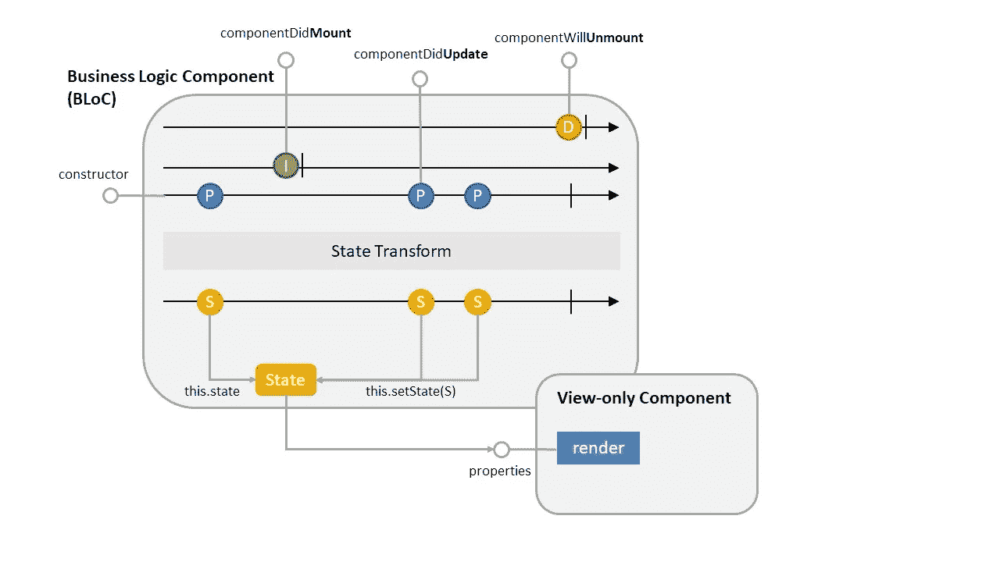
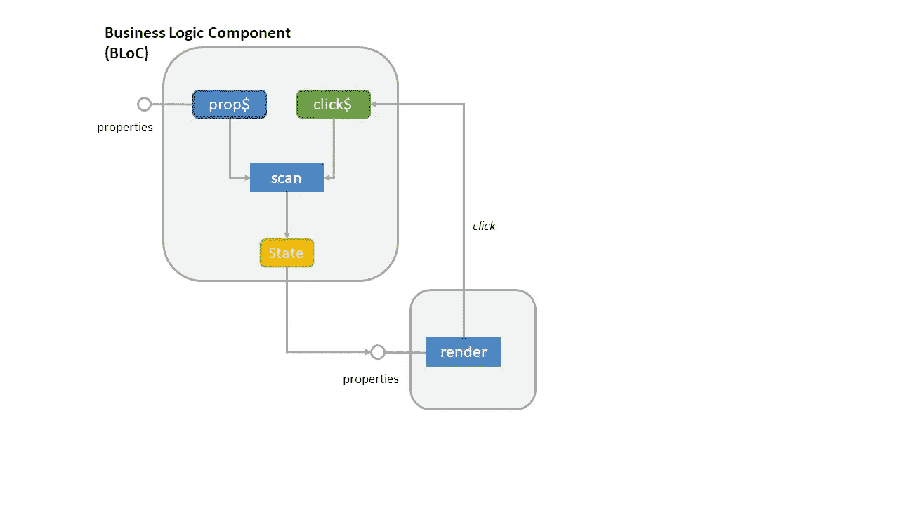
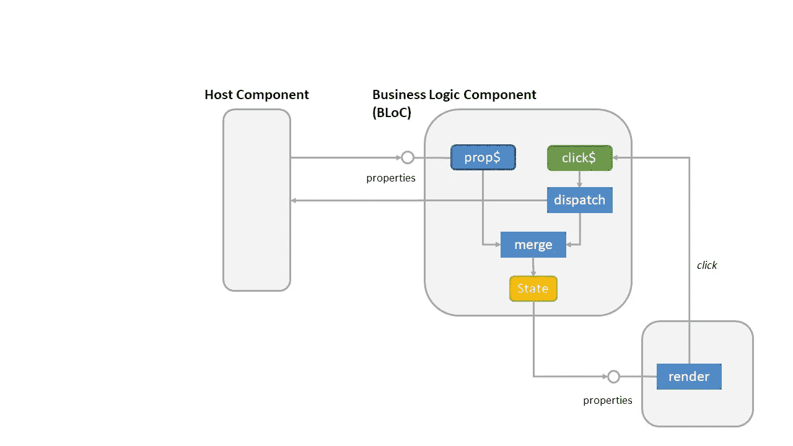

# 利用 RxJS 轻松创建高效的 React 组件

> 原文：<https://betterprogramming.pub/make-use-of-rxjs-to-create-efficient-react-components-with-ease-def018644e23>

Joel Filipe 在 [Unsplash](https://unsplash.com?utm_source=medium&utm_medium=referral) 上拍摄的照片

# 介绍

React 组件基于[属性](https://reactjs.org/docs/components-and-props.html)和[状态](https://reactjs.org/docs/state-and-lifecycle.html)的概念。属性表示来自其他(主机)组件的输入值，而状态表示组件的内部条件。状态可以从属性中导出，甚至可以异步计算——例如..作为进行 HTTP 调用的结果。

React 库确保在对属性或状态的更新会产生视觉效果时重新呈现组件。

从性能角度来看，我们希望确保:

*   组件的`render`方法的执行应该尽可能快——也就是说，我们希望避免进行昂贵的计算或对象分配
*   调用`render`方法的次数应该尽可能少。每次调用`render`时，React 必须运行它的[协调](https://reactjs.org/docs/reconciliation.html)算法来比较更新和现有状态的虚拟 DOM。尽管这种方法实现起来非常有效，但是完全避免[和解](https://reactjs.org/docs/reconciliation.html)会更有效。

# 最小化渲染时间

我们通过预先预计算所有需要的数据结构来最小化花费在`render`方法中的时间。这包括潜在的昂贵计算以及对象分配。

我们使用 RxJS 操作符对输入的变化做出反应，并使用`state`概念将我们的计算和对象创建的结果传递给`render`方法。

# 避免和解

组件开发人员有责任判断属性或状态的修改是否会导致应用程序的重新呈现。对于简单的用例，这通常通过覆盖`shouldComponentUpdate`方法或从`PureComponent`派生来完成。

默认情况下，如果属性或状态改变，React 将重新呈现组件。从`PureComponent`派生通过对属性进行简单的比较，假设对象本身的不变性，稍微改善了这种情况。这种方法仍然会导致不希望的重新呈现操作，因为:

*   组件的呈现可能不直接依赖于属性，而是依赖于该属性的派生信息。尽管资产发生了变化，但这种情况可能会保持稳定。
*   对于受控组件，我们经常通过属性传入回调函数。我们有时可以观察到(反)模式，即主机组件将成员函数绑定到它们的`render`调用中的回调，或者它们使用呈现期间生成的 Lambda 函数。这将在每次宿主呈现时创建新的函数对象，导致子组件不必要的重新呈现。

所以为了避免这些问题，我们的策略是确保组件的呈现不直接使用属性——而只使用来自`state`的信息。

这是组件开发人员可以完全控制的信息。我们还要求组件`state`中的对象是[不可变的](https://reactjs.org/docs/optimizing-performance.html#the-power-of-not-mutating-data)，这样我们可以通过简单的等号检查来判断状态是否改变。

# 关注点分离

讨论的优化模式围绕着为组件的呈现计算理想的`state`的思想。

这使我们有机会将计算该状态的任务分离到一个[业务逻辑组件(BLoC)](https://www.raywenderlich.com/4074597-getting-started-with-the-bloc-pattern) 中，并将实际呈现分离到一个表示组件中。

# 例子

在我们开始解释该方法之前，让我们添加一个非常简单的“Hello，World！”举例。

我们将使用所讨论模式的 [rx-react-component](https://www.npmjs.com/package/rx-react-component) 实现:

“你好，世界！”例子

解释:

1.  构造一个以`HelloWorldProps`为输入的组件。该组件将实现一些简单的业务逻辑(用`'Hello'`作为输入的前缀)，然后将结果传递给一个表示组件。
2.  将输入属性转换为状态的业务逻辑层。注意 [distinctUntilChanged](https://rxjs-dev.firebaseapp.com/api/operators/distinctUntilChanged) 操作符是如何确保只有在输入真正改变时才更新状态的。
3.  呈现组件被实现为功能组件。

# 方法

我们为性能优化的电抗组件实现了一个匿名类。本课程的目的是:

*   公开一种从属性计算`state`的反应式 RxJS 方法，包括对生命周期方法的反应式访问
*   通过实施`shouldComponentUpdate`方法来最小化[协调](https://reactjs.org/docs/reconciliation.html)

组件设计，RxJS 业务层在块中，视图层分离成一个哑表示组件

# 最小化渲染时间

我们将[反应生命周期方法](https://reactjs.org/docs/react-component.html)表示为[可观测量](https://rxjs-dev.firebaseapp.com/guide/observable)，并使用[反应运算符](https://rxjs-dev.firebaseapp.com/guide/operators)导出组件状态。

抽象类采用一个函数将属性转换成可观察的状态。然后，它将确保正确地挂钩到生命周期方法来订阅和取消订阅。

调用者基于输入属性(通过`props$`可观察值)或者通过使用 RxJS 机制异步计算状态来构造`state$`可观察值。

## 初态

在调用`componentDidMount`方法之前，由`state$`可观察对象发出的任何状态都被自动视为初始化状态。您可以使用 [startWith](https://rxjs-dev.firebaseapp.com/api/operators/startWith) 操作符来确保这样的状态存在。没有必要(也没有办法)显式设置`this.state`。

## 来自主机组件的输入

我们的 React 组件将通过[属性](https://reactjs.org/docs/components-and-props.html)从其主机接收输入。这些属性可以通过`props$`观察得到。

使用[puck](https://rxjs-dev.firebaseapp.com/api/operators/pluck)和 [distinctUntilChanged](https://rxjs-dev.firebaseapp.com/api/operators/distinctUntilChanged) 等操作符访问单个属性，仅当这些属性改变时才改变状态。

## 来自子组件的输入

从子组件到父组件的通信通常通过将回调函数作为事件处理程序经由属性传递给子组件来实现。

我们区分[受控](https://reactjs.org/docs/forms.html#controlled-components)或非受控组件。受控组件将其状态委托给其宿主组件，并期望通过其属性将状态更改镜像回来。不受控制的组件保持其自身的状态。

因为我们将组件分成了块组件和表示组件，所以表示组件应该总是由块组件控制，而块组件可以是受控的，也可以是不受控的。

**控制表现组件**:我们为视图组件的状态变化定义回调函数，并在块的状态中管理它们。这些函数被绑定到 [Subject](https://rxjs-dev.firebaseapp.com/api/index/class/Subject) 上的`next`调用，这允许 BLoC 将这些回调集成到可观察管道中。

**非受控闭锁**:非受控闭锁通常通过[扫描](https://rxjs-dev.firebaseapp.com/api/operators/scan)操作器维持其状态。

非受控组件的布局。BLoC 通过扫描操作符维护其状态，并在被点击主体触发时更新它。

**举例:**想象一个维护计数器值的组件。视图组件显示该值，并呈现一个按钮来增加该值。

不受控制的计数器组件示例

**受控块**:受控块通过其属性中的回调函数将状态管理委托给其主机。

受控组件的布局。反应层将输入属性转换为状态，并将点击发送回控制器。

**例子:**同样，我们有一个带按钮的计数器来增加它的值。与上一个示例相比，本示例使用相同视图实现。

受控计数器组件的示例

# 避免和解

抽象类实现了`shouldComponentUpdate`，并使用简单的`equals`检查将新状态与当前状态进行比较。属性被完全忽略。这行得通，因为

*   对象是不可变的
*   所有来自属性的信息都应该通过`state$`可观察值转换成`state`

# 关注点分离

我们使用`rxComponent`函数来创建我们的组件。该函数接受一个函数来计算属性的`state$`可观察值、生命周期可观察值，以及对接受状态作为其输入属性的表示组件的引用。

这种方法具有以下优点:

*   清楚地将业务逻辑与呈现逻辑分开
*   不需要为每个组件创建一个自定义类，从而减少了应用程序的整体大小

# 摘要

*   将组件分成一个业务逻辑组件(BLoC)和一个表示组件
*   使用 RxJS 实现块，将属性和上下文转换成状态
*   使用内置的 RxJS 操作符进行初始化(`startWith`)、最小化更新(`distinctUntilChanged`)、维护状态(`scan`)、与上下文相关的潜在异步数据结合(`merge`、`switch`等。).
*   将结果状态作为输入属性传递给表示组件

# **资源**

*   [引用实现](https://www.npmjs.com/package/rx-react-component)
*   [React 文档](https://reactjs.org/docs/getting-started.html)
*   [RxJS 文档](https://rxjs-dev.firebaseapp.com/api)
*   [阻塞模式](https://www.raywenderlich.com/4074597-getting-started-with-the-bloc-pattern)