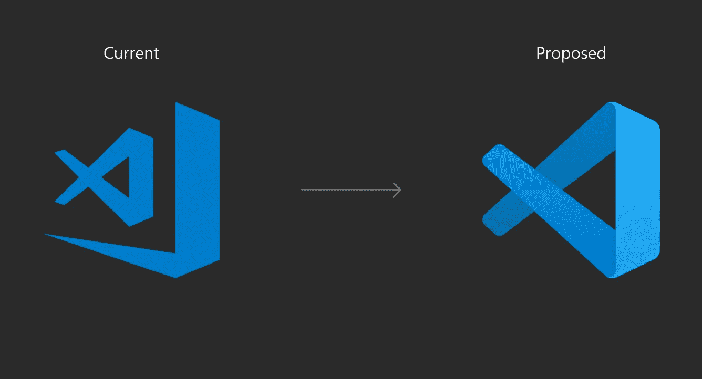
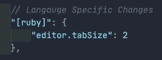

# 用这些设置和工具让 VS 代码变得更好

> 原文：<https://betterprogramming.pub/make-vs-code-even-better-with-these-settings-and-tools-95144650d8c5>

## 改善您最喜欢的 IDE 的外观

VS 代码图标

我在这里发表的关于中等/更好编程的第一篇文章是关于一些我至今仍在使用的 VS 代码扩展。我一直想创建一些关于配置 VS 代码的附加部分，但是一直没有时间去做。因为上一篇文章更关注扩展，所以这篇文章将更关注设置。

许多人已经在使用 VS Code，因为它有太多的扩展，可以通过 extensions 选项卡轻松获得。然而，有很多东西你可以直接定制，而不需要下载任何扩展。这将是我们的首要关注点。您可以通过单击命令和逗号(cmd +，或通过在“代码”>“首选项”>“设置”下导航到它来快速访问您的首选项。

到了那里，你会看到一个编辑器设置的漂亮用户界面。如果您愿意，您可以在这里调整您的设置，VS Code 还在顶部为您提供了一个小小的搜索栏，帮助您搜索您正在寻找的任何字段。或者，您可以点击右上角的按钮打开您的`settings.json`文件。不管你的偏好是什么，你都应该能够跟上。

提示:对于那些在`settings.json`文件中编辑他们的设置的人，你可以按下 control 和 space 来查看建议的代码完成。

# 自动保存

你注意到你的代码中有一个错误，并去修复它。当你去测试你的补丁时，什么都没有改变…错误仍然存在。奇怪的是，你确定你的逻辑是正确的，但还是要反复检查。沮丧之余，你尝试了其他方法，但还是没有成功。这个循环不断重复，你在这个问题上浪费的时间比你想象的要多。为什么你的解决方案不起作用？哦，你忘了存钱。

通过启用自动保存来避免上述情况。VS 代码为您提供了一些如何处理 autosave 的选项。我选择了一个基本时间延迟，延迟设置为`1000`。这确保了我永远不用担心手动保存我的更改。

如果您使用 UI，您会发现自动保存是您可以使用的第一个选项。如果您正在编辑`setting.json`文件，您可以通过将`files.autoSave`设置为`afterDelay`并将`files.autoSaveDelay`设置为`1000`来启用该功能。

# 光标设置

这可能看起来很奇怪，但是你可以对你在 VS 代码中看到的闪烁行做一些改变。字段`editor.cursorBlinking`接受`blink`、`expand`、`smooth`、`phase`或`solid`作为有效值。

`blink`是默认设置，为您提供一个不断闪烁的光标。`expand`用从全高到消失再回到全高的动画代替闪烁。`phase`使光标渐亮渐暗。`smooth`顾名思义，是更流畅的眨眼动画。最后，`solid`让你的光标始终可见。如果你喜欢流畅的动画，你也可以将`editor.smoothCaretAnimation`设置为`true`。

您也可以通过将字段`editor.cursorStyle`设置为六个值中的一个来改变光标的样式。`line`值是默认值，您可能很熟悉。使用`block`，线条变粗并包围其后的字符，在此过程中突出显示该字符。有了`block-outline`，你可以有效地得到同样的东西，只是没有高光。`underline`值将光标从竖条变为横条。您可以给任何一行添加一个`-thin`或给它加下划线，使光标变细。

更实际的是，您可以使用`editor.multiCursorModifier`指定键绑定来创建多个光标。它接受两个值之一。`alt`可让您按住 option 键并点击任意位置，使更多光标出现在编辑器上。与此同时，`ctrlCmd`值会使你按住 command 键并点击来创建额外的光标。

您可以使用光标进行更多的定制。如果你选择`line`作为你的光标样式，那么你可以调整`editor.cursorWidth`来定制光标的宽度。使用`editor.multiCursorPaste`，您可以调整当您有多个活动光标时将文本粘贴到 VS 代码中的行为。使用`full`，每个光标将粘贴所有内容，而使用`spread`，每个光标将粘贴单行文本。

# 语言特定的设置

如果用多种语言编写代码，您可能更喜欢为不同的语言设置特定的编辑器。

考虑一下 Ruby 和 JavaScript。传统上，Ruby 代码的风格是缩进宽度为两个空格。另一方面，JavaScript 使用传统的制表符(四个空格)进行缩进。每当你切换到一种不同的语言时，就不得不切换你的缩进，这可能会很烦人。幸运的是，VS 代码有一个特性，可以为特定的语言设置设置。

要启用此功能，只需遵循图像中的格式。在引号和括号内，指定要应用设置的语言，然后将其设置为一个对象。

从那里，您可以访问想要为该特定语言更改的常规编辑器首选项。每当您打开/保存具有这种语言扩展名的文件时，VS 代码都会用这些设置覆盖默认设置。

# 首选字体

除了 VS 代码，我还花了大量时间在 JetBrains 开发的几个 ide 上编码。他们最近发布了一种叫做 JetBrains Mono 的新字体。这种字体在他们所有的 ide 上都可以使用，但是 JetBrains 友好地将这种字体免费(并且开源)发布给公众。这对我来说是一个很大的优势，因为为了一致性，我喜欢让我所有的编辑器使用相同的字体。在 JetBrains Mono 之前，我用的是 Fira 代码，可以在这里[找到](https://github.com/tonsky/FiraCode)。

JetBrains 的网站提供了一些与其他字体的深入比较，以及对其功能的细分。但这里有一些我喜欢的亮点:

1.  顾名思义，这是一种等宽字体——意味着每个字符占据相同的宽度。
2.  与其他字体相比，小写字母更高。
3.  它有一个非常简单的外观。像 *g* 或 *r.* 这样的字符没有花哨的弯曲笔画
4.  它支持连字。
5.  特别注意确保像1、l 和 I 这样的字符——以及 0 和 O——易于区分。

不用说，对于任何程序员来说，拥有一个舒适易读的字体都是非常重要的。

一旦你下载了你的字体，打开 VS 代码并导航到你的首选项。从这里，如果您使用 UI 编辑器，查找 Editor: Font Family，并键入您的字体(注意匹配大小写和任何空格)。

或者，您可以在`settings.json`文件中访问这个字段——关键字是`editor.fontFamily`。既然我们在这里，现在是设置你的字体大小的好时机(例如，`editor.fontSize’: 14`)，如果你是连字的粉丝，你现在也可以启用它们(`editor.fontLigatures’: true`)。

# 小小的个人感动

您可以通过为字段`workbench.settings.editor`设置一个值来改变 VS 代码打开其首选项的方式。默认设置是`ui`，但是如果您愿意，可以将其更改为 JSON。如果您将它改为 JSON，那么下次您打开首选项时，VS 代码将自动打开`settings.json`文件，而不是向您显示 UI。

默认情况下，VS 代码会在右边出现一个小的小地图。这个特性显示了当前文件中代码的迷你版本。您可以使用小地图来快速查看您在文件中的位置，并且您可以单击小地图上的任意位置来快速到达文件的该部分。

我觉得这个功能不是很有用。您可以禁用此功能，这将给您更多的空间。为此，设置`editor.minimap.enabled`，并将值设置为`false`。

面包屑允许您快速查看文件结构。要进行设置，只需将`breadcrumbs.enable`设置为`true`，然后将`breadcrumbs.filePath`设置为`on`。然后，在右上角(在您打开的文件下)，您应该会看到一个指向您当前位置的文件路径。

最新版本的 macOS 将默认终端从 Bash 换成了 Zsh。但是，对于没有更新 OS 但仍然喜欢使用 Zsh 的个人，您仍然可以这样做。您可以使用`terminal.integrated.shell.osx`将您的终端路径设置为 Zsh。

虽然我在这里没有提到任何扩展，但我确实想提到一个快速设置来帮助您更新扩展。通过将字段`extensions.autoCheckUpdates`设置为`true`，每当有新版本可用时，VS 代码会自动将扩展标记为过期。您将能够在扩展视图中看到这一点。

更好的是，通过将`extensions.autoUpdate`设置为`true`，可以让 VS 代码自动安装扩展的更新。这两个命令都使用微软的在线服务来获取更新。

# 实验

众所周知，VS 代码是一个非常可定制的编辑器。微软在编辑器的每一个方面都投入了太多的心思，这简直是疯了。当我第一次发现这些小东西时，就像所有不同的光标设置一样，让我大吃一惊。更令人惊奇的是，这里所涵盖的只是可供编辑的一小部分内容。只要你有机会，我鼓励你打开你的`settings.json`档案，四处摆弄。

最后，虽然我提到了我将关注设置，但我仍然想提到一个相关的扩展。遗憾的是，在我的 VS 代码扩展文章中，我没有提到设置同步这个扩展。一个相对简单的扩展，Settings Sync 跨多个设备同步编辑器的各个方面(包括`settings.json file` ——以及扩展和它们的配置)。如果您在多台计算机上工作，或者只想与朋友或同事共享您的设置，这是完美的。[这里](https://gist.github.com/JsnGmz/5a9891f7efbf127ecd27347c8cc02445)是我的设置，如果你想看看的话。

希望你能在这里找到有用的东西。令人印象深刻的是，即使在考虑扩展之前，VS 代码也是可定制的。