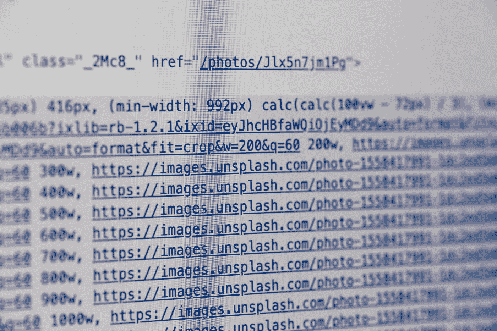
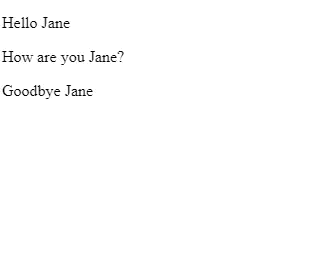

# 通过操作 DOM 使网页动态化

> 原文：<https://betterprogramming.pub/make-web-pages-dynamic-by-manipulating-the-dom-d85a281da185>



照片由[马库斯·斯皮斯克](https://unsplash.com/@markusspiske?utm_source=medium&utm_medium=referral)在 [Unsplash](https://unsplash.com?utm_source=medium&utm_medium=referral) 拍摄

对于很多网站来说，使网站动态化是很重要的。很多都有动画，动态显示数据。要在不刷新页面的情况下更改数据，我们必须操作正在显示的文档。通过在被称为文档对象模型(DOM)的树模型中解析网页，在浏览器中显示网页。

DOM 树由单独的组件组成，称为*节点。所有网页的 DOM 都从根节点开始，也就是文档节点。文档节点下的节点是根元素节点。*

对于网页，根元素节点是 HTML 节点。在此之下，每隔一个节点在 HTML 节点之下，并且在链接到父节点的一些节点之下存在节点。这些节点合在一起，就像一棵倒置的树。

DOM 中有几种类型的节点:

*   文档节点—所有 HTML 文档中 DOM 的根
*   元素节点 HTML 元素
*   属性节点—元素节点的属性
*   文本节点 HTML 元素的文本内容
*   注释节点—文档中的 HTML 注释

# 节点关系

DOM 是一棵树，有一个根节点和链接到根节点的元素。

除了根节点，每个节点都有一个父节点。每个节点可以有一个或多个子节点。节点还可以有位于给定节点同一级别的兄弟节点。

如果有多个相同类型的元素，那么您可以通过获取相同类型的节点作为节点列表来获取节点，然后通过其索引来获取您想要的节点。节点列表看起来像一个数组，但它不是。您可以遍历节点列表的元素，但是数组方法在节点列表中不可用。

例如，如果我们有下面的 HTML 文档…

```
<html>
  <head>
    <title>HTML Document</title>
  </head>
  <body>
    <section>
      <p>First</p>
      <p>Second</p>
      <p>Third</p>
    </section>
  </body>
</html>
```

…然后我们可以通过添加以下内容来获得文档`p`标签:

```
const list = document.body.childNodes[1].childNodes;
for (let i = 0; i < list.length; i++) {
  console.log(list)
}
```

在获取节点的文档的脚本中，脚本获取主体，然后获取第二个子节点(也就是`section`标签)。然后它通过再次访问`childNodes`属性获得子节点，这将获得`p`标签。

我们共同拥有:

```
<html>
  <head>
    <title>HTML Document</title>
  </head>
  <body>
    <section>
      <p>First</p>
      <p>Second</p>
      <p>Third</p>
    </section>
    <script>
      const list = document.body.childNodes[1].childNodes;
      for (let i = 0; i < list.length; i++) {
        console.log(list)
      }    
    </script>
  </body>
</html>
```

访问给定节点元素的第一个和最后一个子元素和兄弟元素也很方便。

在节点元素中，我们使用`firstChild`属性来获取节点的第一个子节点。在`lastChild`属性中，我们可以得到给定节点的最后一个子节点。`nextSibling`获取同一父节点中的下一个子节点，`previousSibling`获取同一父节点的上一个子节点。

每个节点都有一些属性和方法，允许我们获取和设置节点的属性。它们是:

*   `anchors`获取文档中所有锚的列表，这些锚是带有名称属性的元素
*   `applets`获取文档中所有小程序的有序列表
*   `baseURI`获取文档的基 URI
*   `body`获取单据体的`<body>`或`<frameset>`节点
*   `cookie`获取/设置浏览器 cookie 中的键值对
*   `doctype`获取文档的文档类型声明
*   `documentElement`获取根文档元素
*   `documentMode`获取浏览器用于呈现文档的模式
*   `documentURI`获取/设置文档的位置
*   `domain`获取加载文档的服务器的域名
*   `embeds`获取文档中的所有`embed`元素
*   `forms`获取文档中的所有`form`元素
*   获取文档的`head`元素
*   `images`获取文档中所有的`img`元素
*   `implementation`获取处理文档的`DOMImplementation` 对象
*   `lastModified`获取文档被修改的最新日期和时间
*   `links`获取所有包含`href`属性的`area`和`a`标签
*   `readyState`获取文件的加载状态。`readyState`是文档加载时的`loading`，文档解析完成时的`interactive`，完成加载时的`complete`。
*   `referrer`获取加载当前文档的 URL
*   `scripts`获取文档中的`script`元素
*   `title`获取文档的`title`元素
*   `URL`获取文档的 URL

DOM 有获取和操作元素的方法，并通过附加事件处理程序来处理事件。这些方法如下:

*   `addEventListener()`给文档附加一个事件处理程序
*   `adoptNode()`从另一个文档中采用一个节点
*   `close()`关闭之前用`document.open()`打开的文档的输出写入流
*   `createAttribute()`创建一个属性节点
*   `createComment()`创建一个公共节点
*   `createDocumentFragment()`创建一个空文档片段
*   `createElement()`创建一个元素节点
*   `createTextNode()`创建一个文本节点
*   `getElementById()`获取文档中具有给定 ID 的元素
*   `getElementByClassName()`获取具有给定类名的所有元素
*   `getElementByName()`获取具有给定名称属性的所有元素
*   `getElementsByTagName()`获取具有给定标记名的所有元素
*   `importNode()`从另一个文档导入节点
*   `normalize()`清除文本节点并将相邻节点连接在一起
*   `querySelector()`用给定的 CSS 选择器获取一个元素
*   使用给定的 CSS 选择器获取所有元素
*   `removeEventListener()`从文档中删除使用`addEventListener()`方法添加的事件处理程序
*   `renameNode()`重命名现有节点
*   将 JavaScript 或 HTML 代码写入文档
*   将 JavaScript 或 HTML 代码写入文档，并在每个语句后添加一个新行

元素对象具有特殊的属性，可以获取或设置这些属性来修改给定的元素。它们是:

*   `accessKey`获取/设置元素的`accessKey`属性
*   获取一个节点的所有属性
*   `childElementCount`获取一个节点的子元素数量
*   `childNodes`获取一个节点的子节点
*   `children`获取一个元素的子元素
*   `classList`获取一个元素的所有类名
*   `className`获取或设置一个元素的类名
*   `clientHeight`获取包含填充的元素的高度
*   `clientLeft`获取元素的左边界宽度
*   `clientTop`获取元素的上边框宽度
*   `clientWidth`获取元素的宽度，包括填充
*   获取或设置内容是否可编辑
*   `dir`获取或设置元素的`dir`属性
*   `firstChild`获取元素的第一个子节点
*   `firstElementChild`获取元素的第一个子元素
*   `id`获取或设置元素的 ID
*   `innerHTML`获取或设置元素的内容
*   `isContentEditable`获取内容 ID 是否可编辑为布尔值
*   `lang`获取或设置元素或属性的语言
*   `lastChild`获取元素的最后一个子节点
*   `lastElementChild`获取元素的最后一个子元素
*   `namespaceURI`获取元素的第一个节点的名称空间 URI
*   `nextSibling`获取同一节点级别的下一个节点
*   `nextElementSibling`获取同一级别的下一个元素
*   `nodeName`获取所选节点的名称
*   `nodeType`获取节点类型
*   `nodeValue`获取节点的值
*   获取节点的高度，包括填充、边框和滚动条
*   获取节点的宽度，包括填充、边框和滚动条
*   `offsetLeft`获取元素的水平偏移量
*   `offsetParent`获取元素的偏移量容器
*   `offsetTop`获取元素的垂直偏移量
*   `ownerDocument`获取元素的根元素
*   `parentNode`获取元素的父节点
*   `parentElement`获取元素的父元素
*   `previousSibling`获取元素的前一个节点
*   `previousElementSibling`获取同一级别元素的前一个元素
*   `scrollHeight`获取元素的高度，包括填充
*   `scrollLeft`获取水平滚动的元素的像素数
*   `scrollTop`获取垂直滚动的元素的像素数
*   `scrollWidth`获取元素的宽度，包括填充
*   `style`获取元素的 CSS 样式
*   `tabIndex`获取元素的`tabindex`属性
*   `tagName`获取元素的标签名
*   `textContent`获取或设置元素的文本内容
*   `title`获取或设置元素的`title`属性
*   `length`获取节点列表中的节点数

元素有以下几种操作方法:

*   `addEventLIstener()`将事件处理程序附加到元素
*   `appendChild()`在元素末尾添加子节点
*   `blur()`从元素上移除焦点
*   `click()`点击一个元素
*   `cloneNode()`克隆给定的节点
*   `compareDocumentPosition()`比较两个元素的位置
*   `contains()`检查一个元素是否有给定的节点
*   `focus()`关注一个元素
*   获取一个元素的属性
*   `getAttributeNode()`获取元素的属性
*   获取具有给定类名的元素
*   获取具有给定标记名的元素
*   `getFeature()`获取实现给定特性的 API 的对象
*   如果元素具有给定的属性，则`hasAttribute()`返回`true`，否则返回`false`
*   如果元素具有给定的属性，则`hasAttributes()`返回`true`，否则返回`false`
*   如果元素有子节点，则`hasChildNodes()`返回`true`，否则返回`false`
*   `insertBefore()`在给定元素前添加子节点
*   如果所述的`namespaceURI`为默认值，则`isDefaultNamespace()`返回`true`，否则返回`false`
*   `isEqualNode()`检查两个节点是否相等
*   `isSameNode()`检查两个节点是否相同
*   如果元素支持给定的特性，则`isSupported()`返回`true`
*   `querySelector()`用给定的 CSS 选择器获取第一个元素
*   `querySelectorAll()`用给定的 CSS 选择器获取所有元素
*   `removeAttribute()`从给定元素中删除属性
*   `removeAttributeNode()`从给定元素中删除属性节点
*   `removeChild()`删除第一个子节点
*   `replaceChild()`用另一个子节点替换指定的子节点
*   `removeEventListener()`删除指定的事件处理程序
*   `setAttribute()`将指定属性设置为指定值
*   `setAttributeNode()`设置所述属性节点
*   `toString()`将一个元素转换成一个字符串
*   `item()`获取节点列表中具有给定索引的节点


由 [Berkay Gumustekin](https://unsplash.com/@berkaygumustekin?utm_source=medium&utm_medium=referral) 在 [Unsplash](https://unsplash.com?utm_source=medium&utm_medium=referral) 上拍摄的照片

# 改变元素含量

如果我们选择一个元素，我们可以设置`innerHTML`属性来设置元素的内容。例如，如果我们有一个`element` DOM 元素，那么我们可以写:

```
element.innerHTML = 'content';
```

我们在元素内部设置内容，其余部分保持不变。

# 获取元素

处理元素最方便的方法是用上面列出的方法获取它们。最常用的有`getElementById`、`getElementsByTagName`、`getElementsByClassName`和`querySelector`、`querySelectorAll`。

## getElementById

顾名思义，让我们通过 ID 获取元素。元素在哪里并不重要，浏览器将搜索 DOM，直到找到具有给定 ID 的元素，如果不存在，则返回`null`。

我们可以如下使用它:

```
<html> <head>
    <title>Hello</title>
  </head> <body>
    <p>
      Hello <span id='name'>
      </span>
    </p>
    <script>
     const nameEl = document.getElementById('name');
     nameEl.innerHTML = 'Jane';
    </script> </body></html>
```

在上面的代码中，我们获得了 ID 为`name`的元素，并将内容设置为 Jane，因此我们在屏幕上看到了“‘你好，简’”。

## getElementsByTagName

为了获得具有给定标记名的所有元素，我们使用`getElementsByTagName`函数来获得具有给定标记名的所有元素。

我们可以如下使用它:

```
<html> <head>
    <title>How are You</title>
  </head> <body>
    <p>
      Hello <span>
      </span>
    </p>
    <p>
      How are you <span>
      </span>?
    </p>
    <p>
      Goodbye <span>
      </span>
    </p>
    <script>
      const spanEls = document.getElementsByTagName('span');
      for (let i = 0; i < spanEls.length; i++) {
        spanEls[i].innerHTML = 'Jane';
      }
    </script>
  </body>
</html>
```

在上面的代码中，我们用`getElementsByTag`得到所有的`span`元素，从而得到所有的`span`元素。然后我们通过将`innerHTML`属性设置为 Jane 来设置内容。所以我们得到:



## getElementsByClassName

为了获得具有给定类名的所有元素，我们使用了`getElementsByClassName`函数。

我们可以如下使用它:

```
<html><head>
    <title>How are You</title>
  </head><body>
    <p>
      Hello <span class='name'>
      </span>
    </p>
    <p>
      How are you <span class='name'>
      </span>?
    </p>
    <p>
      Goodbye <span class='name'>
      </span>
    </p>
    <script>
      const nameEls = document.getElementsByClassName('name');
      for (let i = 0; i < nameEls.length; i++) {
        nameEls[i].innerHTML = 'Jane';
      }
    </script>
  </body>
</html>
```

# 将元素追加到现有元素

我们可以创建一个新元素，并通过使用`createElement`方法，然后使用`appendChild`方法，将使用`createElement`创建的元素作为`appendChild`函数的参数，将其作为子元素附加到现有元素上。我们可以像下面的例子一样使用它:

```
<html> <head>
    <title>Hello</title>
  </head> <body>
    <h1>
      Hello,
    </h1>
    <ul id='helloList'> </ul> <script>
      const names = ['Mary', 'John', 'Jane'];
      const helloList = document.getElementById('helloList');
      for (let name of names) {
        const li = document.createElement('li');
        li.innerHTML = name;
        helloList.appendChild(li);
      }
    </script>
  </body></html>
```

# 移除元素

我们可以用`removeChild`功能删除元素。这意味着您必须找到想要删除的子节点，然后获取该节点的父节点。然后您可以将该元素对象传递给`removeChild`函数来移除它。

下面是一个例子:

```
<html> <head>
    <title>Remove Items</title>
  </head> <body>
    <ul>
      <li id='1'>One <button onclick='remove(1)'>
          remove
        </button></li>
      <li id='2'>Two <button onclick='remove(2)'>
          remove
        </button></li>
      <li id='3'>Three <button onclick='remove(3)'>
          remove
        </button></li>
    </ul> <script>
      remove = function(id) {
        const el = document.getElementById(id);
        el.parentNode.removeChild(el);
      }
    </script>
  </body></html>
```

如您所见，我们必须获得我们想要移除的节点，然后通过使用`parentNode`属性获得该节点的父节点。然后我们在那上面调用`removeChild`。没有比直接删除节点更简单的方法了。

既然我们可以创建、操作和删除节点，我们就可以轻松地制作简单的动态 web 页面。对于复杂的页面来说，直接操作 DOM 是不太可持续的，因为 DOM 中的许多元素都会发生变化，这使得直接获取 DOM 元素变得困难且容易出错。DOM 树变化太多，所以如果我们用这种方式制作复杂的动态网站，它是非常脆弱的。