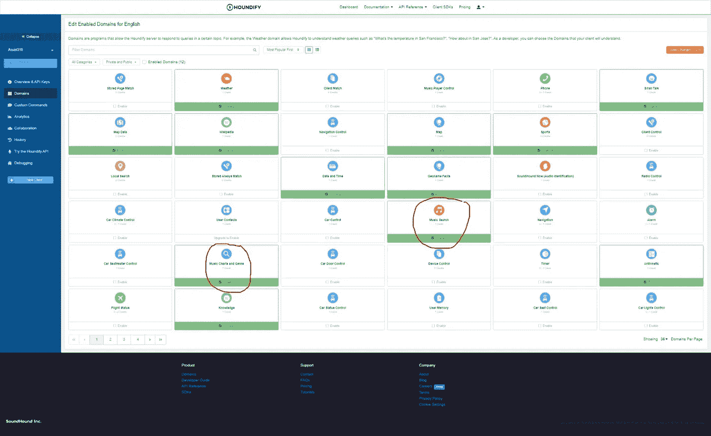
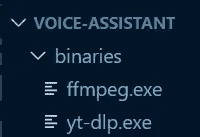

# 让你的人工智能个人助理播放音乐！(以 Web3 为特色)

> 原文：<https://betterprogramming.pub/make-your-ai-powered-personal-assistant-play-music-featuring-web3-a1e7eec68f4a>

## 整合 Houndify API，做一个类似 Alexa 或者 Siri 的个人助理


在上一篇文章中，我们用`Wave.js`设置了我们的应用程序并添加了音频可视化。现在我们让客户端播放音乐。下面的演示展示了我们正在努力做的事情。

首先，服务器从 YouTube 下载歌曲。然后，它将文件上传到一个分散的存储网络。最后，客户端检索文件并播放它。

# 安装

如果您没有阅读该系列的最后一篇文章，我建议您先阅读它。

在本文中，我将向您展示如何集成 Houndify API，在您的 PC 上制作一个类似 Alexa 或 Siri 的个人助理。

但是如果你想重新开始，启动代码可以在这里找到。

还记得 Houndify 指示板是如何拥有需要客户端集成才能运行的域的吗？这里有两个例子:



启用这两个域，然后单击页面右上角的保存更改。这将允许用户请求某首歌曲，播放音乐排行榜上的歌曲，或者指定流派。

# 启动命令处理程序

现在这些域已经启用，回到您的编辑器，打开`src/App.tsx`并插入以下代码:

如果用户的命令需要额外的逻辑，`handleCommand`将转换结果。

在新的`src/handlers`目录下创建一个名为`index.ts`的文件，并插入以下代码:

首先，`COMMANDS`存储客户机能够处理的 Houndify 命令。`MusicCommand`是允许音乐播放和图表功能的命令。

然后该函数接受我们的结果对象并查看命令。如果我们可以处理它，我们可以从文件夹中导入处理程序并使用它。如果没有，它将返回相同的结果和默认响应。

# 处理音乐命令

等等，这是怎么回事？

当用户请求一首歌曲时，结果包含诸如曲目名称和艺术家之类的信息。它还包含一个结果的两个新版本。当客户要播放歌曲时，我们使用它们。如果成功，我们返回`AutoPlayResult`和`AutoPlayFailedResult`否则。

然后，我们将使用曲目名称和艺术家来查找相应的 YouTube 视频。然后我们把它上传到服务器。然后在前端，我们检索文件并播放音频。

首先，定义这两个常数:

```
const SUCCESS_RESULT = "AutoPlayResult";
const FAILED_RESULT = "AutoPlayFailedResult";
```

然后，创建一个`handle`函数，这将是处理程序的主要部分。代码如下:

然后，添加下面的代码，它概括了我们讨论的内容:

我们稍后将回到`cid`变量。这是 web3 奖金的一部分！

然后，我们可以创建一个助手功能，从曲目信息中创建一个优化的搜索查询。然后一个额外的函数从我们的服务器调用新的端点。

我们将不得不使用 YouTube 数据 API 来搜索视频，并返回第一个端点的视频 ID。那么，让我们跳到上次创建的服务器上来做这件事。

# 使用 YouTube 数据 API

你可以在这里找到设置 API 和获取 API 密钥的指南[。](https://developers.google.com/youtube/v3/getting-started#before-you-start)

设置好之后，将 API 密钥添加到`.env`文件中，如下所示:

```
...
YOUTUBE_DATA_API_KEY={YOUR_API_KEY}
```

让我们首先安装`body-parser`来解析来自请求的 JSON 数据。然后用`youtube-search`来包装 API。

```
npm i body-parser youtube-search
```

然后，将以下代码添加到`server.js`文件中:

现在，我们可以定义从 YouTube 下载视频的路径，并返回对文件的引用。

# 下载 YouTube 视频

在服务器端，我们将使用一个名为`yt-dlp`的程序从 YouTube 中提取视频。然后，它使用[ffmpeg]将视频转换为音频。

这里可以下载`yt-dlp`的二进制文件，这里可以获取`ffmpeg` [。](https://ffmpeg.org/download.html)

将二进制文件保存到项目中名为`binaries`的文件夹中。该文件夹应该如下所示:



现在我们必须安装`yt-dlp-wrap`库来处理对`yt-dlp`命令的执行:

```
npm i yt-dlp-wrap
```

然后，下面的代码将根据 ID 从 YouTube 下载任何给定的视频:

但是将所有的歌曲文件上传到服务器的`public`文件夹并不是一个好主意。有一些第三方服务针对文件存储进行了更好的优化。在本教程中，我们将使用 [Web3。存储](https://web3.storage/)使用分散式网络存储文件。我使用它有两个原因:

1.  您可以获得完全免费的 1 TB 存储空间(是的，免费！)
2.  看完快速入门[这里](https://web3.storage/docs/#quickstart)就很简单上手了。

# 奖励—分散存储

将您的 API 密钥添加到。env 文件如下:

```
REACT_APP_WEB3_STORAGE_TOKEN={YOUR_KEY}
```

# 正在安装 Web3。储存；储备

现在使用以下命令安装 web3.storage:

```
npm i web3.storage
```

# 上传 YT 视频到 Web3。储存；储备

我们可以首先定义一个函数，用`yt-dlp`下载一个视频，并将输出流式传输到我们的存储提供商。

现在，我们可以添加本教程的最终 API 路径了:

现在移到前端。添加以下代码以在`MusicCommand`处理程序中检索文件:

# 回忆以前的歌曲

此时此刻，你可能在想这样效率有多高。每次我们调用路由时，服务器都会下载视频，不管我们请求的是哪个视频。因此，如果我们再次请求相同的歌曲，服务器将花费相同的时间来响应。

我们可以通过存储一个名为`song_cids.json`的 JSON 文件来加快速度。它将包含 YouTube IDs 到存储 cid(内容标识符)的映射。因此，如果我们请求的视频 ID 在文件中，我们可以为文件返回一个合适的 CID。

将以下内容添加到服务器代码中:

现在，像这样延伸路线:

# Toast 通知

如果你现在启动开发服务器，试着点一首歌。至少要等五秒钟，而且根本不知道发生了什么！为了提供额外的视觉反馈，我们可以使用`react-toastify`库。有了它，我们可以轻松地添加优雅的吐司通知。使用以下代码行安装它:

```
npm i react-toastify
```

打开`src/App.tsx`，导入我们需要的文件:

```
import { ToastContainer } from "react-toastify";
import "react-toastify/dist/ReactToastify.css";
```

然后在组件中添加`ToastContainer`，如下所示:

现在打开`src/handlers/MusicCommand.ts`并改变`handle`功能:

# 包扎

仅此而已！我们用`yt-dlp`从 YouTube 下载视频，用`web3.storage`存储下载的歌曲。你可以在我的 repo 的这个[分支](https://github.com/WoolDoughnut310/houndify-voice-assistant/tree/part2)中找到本教程的所有代码，并可以随意使用。请继续关注该系列的下一部分，我们将能够暂停歌曲。这样，如果你后来觉得这首歌不适合你，你就不必听整首歌了。尽情享受吧！

# 资源

使用 Web3 在 IPFS 上存储数据。存储！

[处理承诺|应对承诺](https://fkhadra.github.io/react-toastify/promise)

[MusicCommand API 参考| Houndify 文档](https://docs.houndify.com/reference/MusicCommand)

[问题#30102 ytdl-org/youtube-dl](https://github.com/ytdl-org/youtube-dl/issues/30102#issuecomment-943849906)

[YouTube 数据 API 概述|谷歌开发者](https://developers.google.com/youtube/v3/getting-started)

*原发布于*[*https://cs 310 . hash node . dev*](https://cs310.hashnode.dev/build-your-own-ai-powered-virtual-assistant-on-the-web-part2)*。*