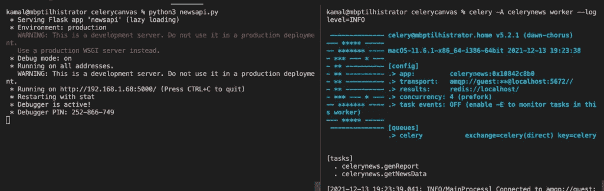
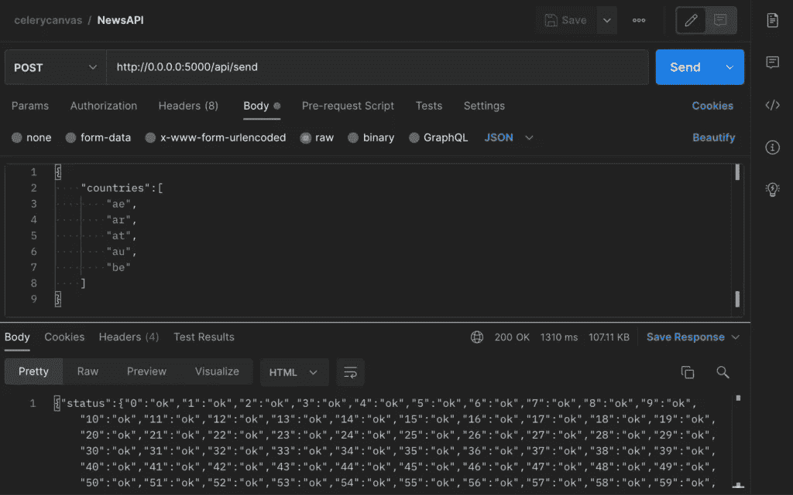
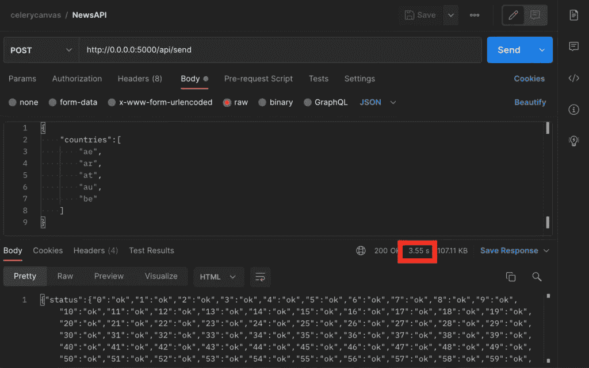

# 使用这个简单的 Python 库，让您的代码速度提高 2 倍

> 原文：<https://betterprogramming.pub/make-your-code-2x-faster-with-this-simple-python-library-83d92bf29aec>

## 了解如何在 Python 中轻松并行化任务以提升性能


照片来源:作者

Celery 是一个用 Python 编写的异步任务队列框架。Celery 使执行后台任务变得容易，但也提供了并行执行和任务协调的工具。

在上一篇文章中，我们谈到了 Python 的 Celery 框架的基本原则。你可以点击查看上一篇文章[。](/slow-http-response-times-celery-to-the-rescue-76346eb4212c)

在这篇文章中，我们将讨论一种在 Celery 中构建工作流并轻松并行执行任务的方法。

当涉及大量后台任务时，监控和协调它们的执行是一项挑战。如果任务是独立的，执行顺序并不重要，那么它们可以并行执行而不会产生任何后果。Celery 提供了一种既设计协调工作流又并行执行任务的方法。不用说，并行执行提供了显著的性能提升，应该尽可能地实现。

我们将在本帖中讨论以下主题:

*   从后台任务中检索结果
*   访问 NewsAPI
*   带有签名的任务协调
*   密码
*   基准
*   结论

在这篇文章结束时，你将学会如何让几乎所有的 Python 代码更快，以及如何在这个过程中组织任务。

让我们开始吧！

# 从后台任务中检索结果

后台任务可以定义如下:

```
[@celery](http://twitter.com/celery).task()
def add(num1, num2):
    return num1 + num2
```

可以使用以下语法执行后台任务:

```
add.delay(4, 4)
```

为了检索任务的结果，我们需要使用一个允许 Celery 存储结果的后端。有很多选择，但对于这篇文章，我们将使用 *Redis* 。
*请注意:Windows 上不支持 Redis。*

> 根据 [redis](https://redis.io/) 的说法，“Redis 是一个开源(BSD 许可的)、内存中的数据结构存储，用作数据库、缓存和消息代理”

作为内存中的数据存储意味着对 Redis 的读写操作特别快，使其适合于需要频繁读写操作的任务。

[安装 Redis 的 Linux 指南](https://flaviocopes.com/redis-installation/)。

对于 MacOS，你可以用自制软件安装 Redis。
打开终端并运行:

```
brew install redis
```

然后使用以下命令启动服务:

```
brew services start redis
```

要检查服务是否正在运行，您可以运行:

```
brew services list
```

芹菜实例现在可以这样定义:

```
from celery import Celerycelery = Celery(
        'calc',
        backend='redis://localhost',
        broker='pyamqp://guest@localhost//'
    )
```

后台任务的结果可以很容易地用如下的`get()`来检索:

```
res = add.delay(4, 4)
res.get()
>> 8
```

# 访问 NewsAPI

出于本教程的目的，我们需要从 API 调用中检索数据。
我们将从 [NewsAPI](https://newsapi.org) 中检索数据。您可以在此注册从[获取 API 密钥。注册后，您可以在此](https://newsapi.org/register)查看 top headlines API 调用[的文档。我们将使用 top headlines 端点，每次用一个国家代码名称来称呼它。](https://newsapi.org/docs/endpoints/top-headlines)

假设我们需要五个国家的头条新闻。通过并行调用来加速该过程比进行五次顺序调用要快得多。但是首先，我们需要查看芹菜中的`signatures`以及用`chord`函数协调结果的方法。

# 芹菜的任务协调

> 签名以某种方式包装单个任务调用的参数、关键字参数和执行选项，以便将其传递给函数，甚至序列化并通过网络发送来自[芹菜](https://docs.celeryproject.org/en/stable/userguide/canvas.html#canvas-chord)

基本上，签名允许我们创建并传递对 Celery 任务对象的引用。
这意味着我们可以这样做:

```
task = add.s(2, 2)
```

然后我们可以简单地用`delay()`调用这个函数，并像以前一样对它调用`get()`:

```
res = task.delay()
res.get()
>> 8
```

现在你可能想知道为什么我们需要签名。签名允许我们将命令链接在一起，并使用 Celery 提供的工作流功能。假设我们想并行调用`add()`多次并存储结果。你将如何着手做那件事？没有签名，就无法保存对芹菜任务对象的引用。

芹菜中的`group`函数将签名作为参数并并行执行，将结果存储在一个列表中。如果我们希望并行执行`add()`调用，我们可以用`group()`这样做:

```
g = group(add.s(1, 1), add.s(3, 3))
res = g()
res.get()
>> [2, 6]
```

另一个有用的功能是`chord()`。这类似于`group()`命令，但是允许我们定义一个回调。因此，不是返回结果列表，而是使用结果列表作为参数调用回调函数。我们自己定义回调函数。当所有任务都被执行时，回调函数被调用。这意味着我们不必跟踪哪个任务仍在运行，以及所有任务是否都已完成。

在获得结果后必须对其进行操作的情况下,`chord()`函数非常有用。例如，如果必须合并先前任务的结果以生成 PDF 报告。或者从几个 API 调用中检索的数据需要合并。

我们现在将从 NewsAPI 中并行检索头条新闻，并汇总呼叫结果。

我们来编码吧！

如果你感兴趣，你可以在这里查看 Celery [提供的工作流功能的完整列表。](https://docs.celeryproject.org/en/stable/userguide/canvas.html)

# 定义芹菜应用程序

确保在您的 newsAPI 帐户中用 API 密钥替换`<API_KEY>`。

我们定义一个芹菜应用程序，然后用`@`符号定义两个芹菜任务。在`getNewsData`中，我们执行一个简单的 GET 请求来检索作为参数提供的国家的头条新闻。这是将被并行化的函数。

我们希望检索所有调用的结果并将它们连接起来。为此，我们定义`genReport`作为回调函数。在`genReport`中，我们只是将 JSON 对象转换成 Pandas 数据帧，这样它们就可以很容易地连接起来。

一旦它们被连接，我们重置索引以避免 JSON 转换错误，然后将连接的`dataframe`作为 JSON 返回。Celery 任务函数的返回类型必须是 JSON serializable，这就是我们为什么回转型为 JSON 的原因。

# 定义 API

记得用您的 API 密钥替换`<API_KEY>`。

我们获得我们想要从中检索新闻的国家列表，然后创建一个任务签名列表。每个签名函数都是对`getNewsData`任务的引用，其中一个国家作为参数提供。签名函数列表作为参数传递给`chord`函数。最后，`genReport`函数作为回调函数传递。

`chord`函数将并行执行任务，然后用结果列表调用`genReport`。

# 测试和基准

太好了！现在让我们测试代码，确保一切正常。

确保 Redis 服务正在运行。在项目根目录中打开一个终端窗口，然后使用以下命令运行 Flask 应用程序:

```
python3 newsapi.py
```

接下来，打开一个新的终端窗口，运行 Celery 应用程序:

```
celery -A celerynews worker --loglevel=INFO
```

一切都应该像这样运行:



烧瓶应用程序在左边运行。芹菜应用程序在右边运行。

让我们使用 Postman 调用 API，看看它是否有效！
我们将数据编码为一个 JSON 对象，传递一个国家列表，使用国家代码指定每个国家。确保选择 POST 作为请求类型，并插入正确的 url: `[*http://0.0.0.0:5000/api/send*](http://0.0.0.0:5000/api/send)`



使用 Postman 测试并行 API 调用

点击发送，你应该会在一两秒钟后看到一些回应。

我认为看看这种并行化实际上有多快会很有趣。标题为“慢速版本”的代码文件中有一些注释代码。你可以把“快速版”下的代码放在注释里，把“慢速版”下的代码注释掉。注释后保存文件，Flask 将自动重启网络服务器。

我们现在可以复制之前使用的 Postman 中的选项卡，并再次点击 Send。

你会注意到得到回应的时间会稍长一些。我们可以在 Postman 中查看响应窗口的右上角，查看响应用了多少时间。如果您将它与快速版本进行比较，您会注意到它大约快了 1.5 倍。



不使用和弦功能时，响应时间较慢。

在我的例子中，使用`chord`函数的并行化产生的代码比我没有使用它时快了 2.5 倍以上。考虑到只涉及 5 个 API 调用，这是一个相当显著的性能提升。对于更多的调用，性能提升会更大，因为如果调用是连续的，响应时间会线性增长。

# 不仅仅是 API 调用

希望你喜欢这篇文章的内容！

我们已经看到了如何使用 Redis 作为芹菜的后端存储来检索后台任务的结果。此外，我们看到了在 Celery 中使用签名，以及如何使用内置的 Celery 函数(如`chord`和`group`)来协调和并行化任务。

这个话题超级有意思，也很有用。我相信它值得不仅仅是一个单一的职位。在离开之前，我想再谈一些使用案例。

为了便于演示，我在本教程中使用了 API 调用。然而，这种技术可以用于大量不同的情况。只要单个任务是无序的，也就是说，如果执行的顺序不重要，它们就可以并行化。

我想到了以下三个案例:

*   机器学习任务——在同一个数据集上训练多个不同的模型。
*   网页抓取任务。
*   自动化脚本

在第一种情况下，不同的模型可以被独立地训练。然后可以根据累积的结果计算验证分数。然后，可以保存给出最佳验证分数的模型以供将来使用。在这种情况下，使用`chord`函数是最理想的。

在第二种情况下，可以独立抓取多个网站并存储结果。如果只需要存储结果而不需要进一步操作，我们可以使用类似于`group`函数的东西。

最后，Celery 中可用的各种函数可以在自动化脚本中使用。自动化脚本通常需要一堆需要执行和协调的重复性任务。使用内置的 Celery 工作流函数来编写脚本会产生更干净、更易维护的代码。

这个帖子到此为止。希望你学到了一些东西。
下次见！

*最初发表于*[T5【https://haseebkamal.com】](https://haseebkamal.com/2021/12/14/make-your-code-2x-faster-with-this-simple-python-library/)*。*