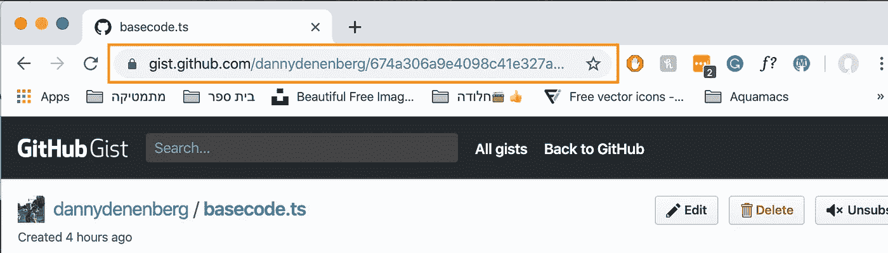
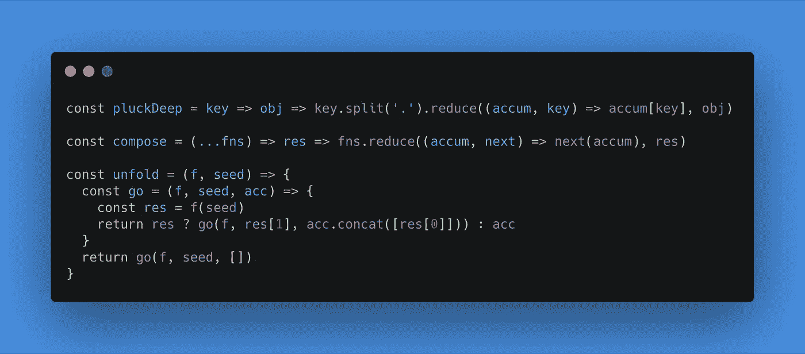
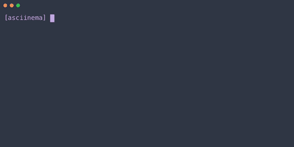

# 让你的代码在中等水平上看起来很流畅

> 原文：<https://betterprogramming.pub/make-your-code-look-slick-on-medium-367444556523>

## 漂亮展示代码的快速技巧

由[凯文·Ku](https://unsplash.com/@ikukevk?utm_source=unsplash&utm_medium=referral&utm_content=creditCopyText)在 [Unsplash](https://unsplash.com/search/photos/computer-program?utm_source=unsplash&utm_medium=referral&utm_content=creditCopyText) 上拍摄的照片

对介质上代码的支持从来都不好——但是下面是如何让它变得更好的方法。

# 如果你想让别人复制/粘贴你的代码…

…一定要用 GitHub gists 或者 [JSFiddle](https://jsfiddle.net/) 片段。

要使用 gists，我强烈推荐安装 [Code Medium](https://chrome.google.com/webstore/detail/code-medium/dganoageikmadjocbmklfgaejpkdigbe) Chrome 扩展。它消除了创建、命名和将代码放入要点的麻烦。

要真正将要点插入你的中间部分，不要将嵌入脚本复制粘贴到你的文章中。

你必须从中间段落选项中选择代码符号(`<>`)，将要点的 URL 粘贴到该行中，然后按 enter 键，你的代码就会出现在文章中。

如果你正在用 JavaScript、TypeScript、CoffeeScript、JSX、HTML 或 CSS 编写代码，我会推荐使用 JSFiddle snippet**。**

在我看来，他们看起来更酷。

去 jsfiddle.net 插入它们。编写/保存您的代码并复制 URL。像 gists 一样，你必须选择“插入代码”段落选项，粘贴小提琴的 URL，然后按回车键。您的格式化代码应该出现在下面。像这样:

JSFiddle

现在，如果您有一个快速的代码片段要分享，想要将您的代码内联，或者根本不在乎您的代码看起来是否像完整的、未突出显示的垃圾，您可以使用 Medium 的默认代码块。

若要插入块，请创建一个新段落并键入三个反勾号(` ``)。

要写`inline code`,使用一个反勾号开始，另一个结束。

# 如果你只是想要漂亮的代码…

…只需看看[碳](https://carbon.now.sh)就够了。

Carbon 是一个开源项目，它允许你拍摄代码的快照。它包括许多定制选项，并支持你能想到的任何语言。它会让你的代码真正流行起来。

碳也是一个伟大的资源，用于你的文章的英雄形象。

## 如果您想要动画代码演示…

…使用[asci NEMA](https://asciinema.org/)。

Asciinema 允许您记录您的终端会话。

> 忘记屏幕录制应用程序和模糊视频。享受一个轻量级的，纯粹基于文本的终端记录方法。—asci NEMA

用`brew install asciinema`安装 asciinema。用`asciinema rec`开始录音。

# 快速链接

*   对于复制/粘贴代码: [gists](https://gist.github.com/) 或 [jsfiddles](https://jsfiddle.net/)
*   对于美丽的图像:[碳](https://carbon.now.sh)
*   对于动画终端会话:[asci NEMA](https://asciinema.org/)