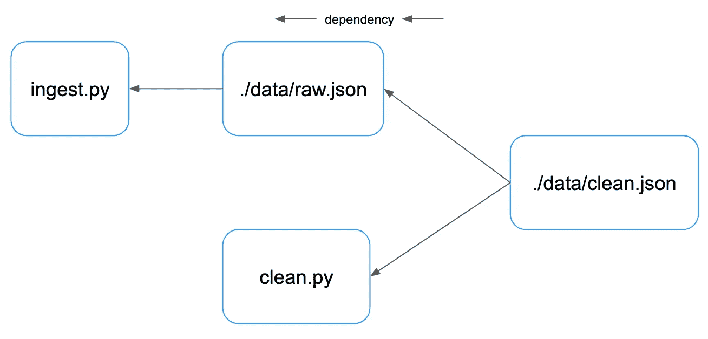

# 使用这款经典的 Unix 工具改善您的工作流程

> 原文：<https://betterprogramming.pub/make-your-data-science-workflows-better-with-this-classic-unix-tool-d9adc87ae2f5>

## 数据管道的生成和生成文件


意大利佛罗伦萨。图片作者。

`make`是与`grep`和`ssh`同辈的经典命令行程序。

一个经受住时间考验的强大工具，`make`可以在任何进行严肃计算的终端中使用。最初用作构建自动化工具— `make`可以用于任何涉及运行程序和制作文件的工作流。

`make`是一款智能工具，支持强大的工作流和数据管道管理。

在数据项目中并不常用——作为一名数据工程师，我发现它对于管理和运行数据工作流非常有价值。这篇文章主要关注在数据科学项目中使用`make`——同样的一般原则也适用于其他涉及运行命令和制作文件的软件项目。

本文将向您展示如何在现代数据项目中使用这一经典工具。

# 最终目的地

我们从我们将结束的地方开始，在`Makefile`我们将在这篇文章中共同发展:

```
# Makefile

all: ./data/clean.json

./data/raw.json: ./data/raw.json ./ingest.py
	mkdir -p data
	./ingest.py

./data/clean.json: ./data/raw.json ./clean.py
	./clean.py
```

现在说不通也不用担心。

到最后你会明白这一切是如何运作的！

# 注释

简单地说一下，确保我们在同一页上。

Shell 命令以`$`开头，shell 输出显示如下。

文件名位于代码块的顶部，与文件的开头相隔一行。

```
file.name first_line_of_file - commonly a shebang like #!/usr/bin/env python3 
second_line_of_file
```

外壳代码块与`zsh`一起在`MacOS`上运行，并且与`bash`兼容。使用`3.8.10`运行 Python 代码。

# Makefile 的剖析

`Makefile`由三部分组成:

1.  目标——您试图创建的文件(或一个`PHONY`目标——稍后将详细介绍)，
2.  依赖项—需要在目标之前运行的其他目标，
3.  工作流程——实现目标所需的一系列步骤。

```
target: dependencies
<TAB>workflow step 1
<TAB>workflow step 2
```

一个`Makefile`的强大之处在于能够让目标依赖于其他目标。

下面这个简单的`Makefile`展示了一个简单的管道，有一个依赖关系——`end`*依赖* `begin`。

`begin`和`end`都是`PHONY`目标——这意味着它们不创建文件:

```
# Makefile

.PHONY: begin end

begin:
  echo "The beginning is the end"

end: begin
  echo "Der Anfang is das Ende"
```

一个`Makefile`可以代表&管理复杂的数据管道。

单个工作流可以做任何您可以用 shell 做的事情，甚至使单个工作流变得任意强大。

# 运行 Makefile

以下面的`Makefile`为例，它创建了一个空的`data.html`文件:

```
# Makefile

data.html:
	echo "making data.html"
	touch data.html
```

运行没有目标的`make`将运行第一个目标——在我们的例子中是唯一的目标，`data.html`。

`make`打印出它运行的命令:

```
$ make
making data.html
touch data.html
```

如果我们再次运行这个，我们会看到`make`以不同的方式运行——它不会再次生成`data.html`:

```
$ make
make: `data.html' is up to date.
```

如果我们重置了我们的管道(通过删除`data.html`，运行`make`将再次运行我们的管道:

```
$ rm data.html; make
making data.html
touch data.html
```

上面我们已经展示了`make` - **智能重新执行流水线**的一个有用特性。

在幕后，`make`利用文件上的时间戳来理解运行(或不运行)什么。

在我们过于兴奋之前，让我们设定一下在数据项目中使用`make`的动机。

# 为什么数据科学要用`make`？

## 1.工作流文档

记录项目工作流程是一个好的数据项目的基本素质。

大多数项目只需要一个`Makefile`——让这个文件成为你的项目的一个自然的中心位置(仅次于`README.md`)。这是你的项目围绕的一个锚。

A `Makefile`是优秀的文档——机器可读和可执行的——最好的文档。像任何文本文件一样，在 git 这样的源代码控制工具中跟踪变化是很容易的。

在一系列`make`目标中创建您的数据科学工作流还有一个好处，就是使您的管道更加模块化——鼓励 shell 或 Python 脚本的功能分解。

## 2.免费 CLI

一个`Makefile`与它运行的 shell 环境紧密集成。

我们可以通过 shell 环境变量或命令行参数在运行时轻松配置变量。

下面的`Makefile`有两个变量- `NAME`和`COUNTRY`:

```
# Makefile

all:
	echo "$(NAME) is from $(COUNTRY)"
```

我们可以用两种不同的方法设置两个变量:

*   `EXPORT name=adam` -将我们的变量`NAME` by 设置为一个 shell 环境变量，
*   `COUNTRY=NZ` -我们的`COUNTRY`变量通过一个参数传递给`make`命令。

```
$ export NAME=adam; make COUNTRY=NZ 
echo "$(NAME) is from $(COUNTRY)"
adam is from NZ
```

## 3.智能流水线重新执行

我们已经看到了智能管道重新执行的功能——这是一种不重新运行不需要运行的代码的强大方法。

`make`使用文件上的时间戳来跟踪要重新运行(或不重新运行)的内容——它不会重新运行已经运行过的代码，如果目标的依赖关系发生变化，它会重新运行。

这可以为您节省大量时间——在选择模型时，无需重新运行昂贵的数据接收和清理步骤。

# 我们的管道

我们将构建一个数据管道——使用 Python 脚本模拟真实的数据任务——数据从左向右流动。

我们的摄取步骤创建原始数据，我们的清理步骤创建干净的数据。


我们可以根据管道的数据工件和源代码之间的依赖关系来看同一个管道——依赖关系从右向左流动:



我们的干净数据依赖于用来生成它的代码和原始数据。我们的原始数据只依赖于摄取 Python 脚本。

# 在`Makefile`发展我们的管道

## 0.我们的管道组件

让我们看看管道中的两个组件——摄取步骤和清理步骤，这两个步骤都是 Python 脚本。

`ingest.py`将一些数据写入 JSON 文件:

```
#  ingest.py

#!/usr/bin/env python3
from datetime import datetime
import json
from pathlib import Path

fi = Path.cwd() / "data" / "raw.json"
fi.parent.mkdir(exist_ok=True)
fi.write_text(json.dumps({"data": "raw", "ingest-time": datetime.utcnow().isoformat()}))
```

我们可以运行这个 Python 脚本并使用`cat`来查看它的 JSON 输出:

```
$ ./ingest.py; cat data/raw.json
{"data": "raw", "ingest-time": "2021-12-19T13:57:53.407280"}
```

`clean.py`获取生成的原始数据，并将`data`字段更新为`clean`:

```
#  clean.py

#!/usr/bin/env python3
from datetime import datetime
import json
from pathlib import Path

data = json.loads((Path.cwd() / "data" / "raw.json").read_text())
data["data"] = "clean"
data["clean-time"] = datetime.utcnow().isoformat()
fi = Path.cwd() / "data" / "clean.json"
fi.write_text(json.dumps(data))
```

我们可以再次使用`cat`来查看我们清理步骤的结果:

```
$ ./clean.py; cat data/clean.json
{"data": "clean", "ingest-time": "2021-12-19T13:57:53.407280", "clean-time": "2021-12-19T13:59:47.640153"
```

## 1.跟踪管道依赖关系

让我们从运行两级数据管道的`Makefile`开始。

我们已经利用了在我们的管道阶段之间创建依赖关系的能力，使得我们的`clean`目标依赖于我们的`raw`目标。

我们还包含了一个顶级元目标`all`，它依赖于我们的`clean`步骤:

```
#  Makefile

all: clean

raw:
	mkdir -p data
	./ingest.py

clean: raw
	./clean.py
```

我们可以通过运行`make`从终端使用这个`Makefile`，这将运行我们的元目标`all`:

```
$ make
mkdir -p data
./ingest.py
ingesting {'data': 'raw', 'ingest-time': '2021-12-19T14:14:54.765570'}
./clean.py
cleaning {'data': 'clean', 'ingest-time': '2021-12-19T14:14:54.765570', 'clean-time': '2021-12-19T14:14:54.922659'}
```

如果我们只运行管道的`clean`步骤，我们将再次运行摄取和清理步骤。这是因为我们的清理步骤取决于数据接收的输出:

```
$ make clean
mkdir -p data
./ingest.py
ingesting {'data': 'raw', 'ingest-time': '2021-12-19T14:15:21.510687'}
./clean.py
cleaning {'data': 'clean', 'ingest-time': '2021-12-19T14:15:21.510687', 'clean-time': '2021-12-19T14:15:21.667561'}
```

如果我们只想重新运行我们的清洗步骤呢？我们的下一次`Makefile`迭代将避免这种不必要的重复执行。

## 2.跟踪管道输出

现在让我们改进我们的`Makefile`，将我们的目标变成实际的文件——由目标生成的文件。

```
all: clean

./data/raw.json:
	mkdir -p data
	./ingest.py

./data/clean.json: ./data/raw.json
	./clean.py
```

用`rm -rf ./data`删除之前运行的任何输出，我们可以用`make`运行完整的管道:

```
$ rm -rf ./data; make
mkdir -p data
./ingest.py
ingesting {'data': 'raw', 'ingest-time': '2021-12-27T13:56:30.045009'}
./clean.py
cleaning {'data': 'clean', 'ingest-time': '2021-12-27T13:56:30.045009', 'clean-time': '2021-12-27T13:56:30.193770'}
```

现在，如果我们第二次运行`make`，什么也不会发生:

```
$ make
make: Nothing to be done for `all'.
```

如果我们只想重新运行我们的清理步骤，我们可以删除之前的输出并再次运行我们的管道——因为`make`知道它只需要使用现有的原始数据再次运行清理步骤:

```
$ rm ./data/clean.json; make 
./clean.py
cleaning {'data': 'clean', 'ingest-time': '2021-12-27T13:56:30.045009', 'clean-time': '2021-12-27T14:02:30.685974'}
```

## 3.跟踪源代码依赖关系

我们将对管道进行的最后一项改进是跟踪对源代码的依赖。

让我们更新我们的`clean.py`脚本来跟踪`clean-date`:

```
#  clean.py

#!/usr/bin/env python3
from datetime import datetime
import json
from pathlib import Path

data = json.loads((Path.cwd() / "data" / "raw.json").read_text())
data["data"] = "clean"
data["clean-time"] = datetime.utcnow().isoformat()
data["clean-date"] = datetime.utcnow().strftime("%Y-%m-%d")
fi = Path.cwd() / "data" / "clean.json"
fi.write_text(json.dumps(data))
```

现在是我们最后的管道:

```
# Makefile

all: ./data/clean.json

./data/raw.json: ./data/raw.json ./ingest.py
	mkdir -p data
	./ingest.py

./data/clean.json: ./data/raw.json ./clean.py
	./clean.py
```

我们的最后一步，仅更新我们的`clean.py`脚本后，`make`将再次运行我们的清理步骤:

```
$ make
./clean.py
ingesting {'data': 'clean', 'ingest-time': '2021-12-27T13:56:30.045009', 'clean-time': '2021-12-27T14:10:06.799127', 'clean-date': '2021-12-27'}
```

# 摘要

就是这样！我们希望您喜欢学习一些关于`make` & `Makefile`的知识，并乐于在您的数据工作中尝试它。

`make`和`Makefile`有更多的深度和复杂性——到目前为止你所看到的足以鼓励你在自己的项目中使用`Makefile`时进行更多的实验和学习。

这篇文章的要点是:

*   `make`是一个强大的、普遍可用的工具，可以运行任意的 shell 工作流，
*   一个`Makefile`形成了一个项目执行的自然中心点，一个简单的 CLI 与 shell 很好地集成，
*   `make`可以智能地重新执行您的数据管道，跟踪代码和数据之间的依赖关系，避免重新运行已经运行的任务，成本高昂。

感谢阅读！

*原载于 https://www.datasciencesouth.com*[](https://www.datasciencesouth.com/blog/make)**。**