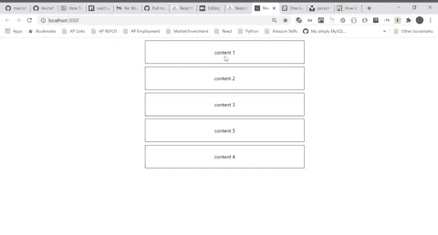

# 使您的 React 组件可排序

> 原文：<https://betterprogramming.pub/make-your-react-components-sortable-7ef479085dd8>

## 简单有效的分类


由 [Cathryn Lavery](https://unsplash.com/@cathrynlavery?utm_source=unsplash&utm_medium=referral&utm_content=creditCopyText) 在 [Unsplash](https://unsplash.com/s/photos/list?utm_source=unsplash&utm_medium=referral&utm_content=creditCopyText) 上拍摄的照片。

我最近在做一个代码挑战，包括从列表中添加/删除项目，以及按照特定的顺序组织它们。为了避免任何无关的导航或元素，我决定实现拖放逻辑，以便使我的项目易于从一个位置移动到另一个位置。

React 中有很多很棒的拖放功能库，但是其中一些需要更多的配置，提供的功能也比我需要的多。最终我还是用了`react-sortable-hoc`。

# 反应-可排序-特定

当您需要一个可排序的组件列表时,`[react-sortable-hoc](https://www.npmjs.com/package/react-sortable-hoc)`是一个易于使用的库。我能够在几分钟内将它与我自己的组件结合起来。对于这个演示，我们将创建一个 to-do React 应用程序(据我所知是原创的)。让我们从安装带有`npm i react-sortable-hoc`的包开始。

对于本文，我还将安装`[array-move](https://www.npmjs.com/package/array-move)`，这是一个方便的包，可以帮助您将项目移动到数组中的不同位置。`react-sortable-hoc`不依赖`array-move`。我只是为了方便而使用它。

下面是一系列待办事项:

对于应用程序，我们有两个组件。`ToDoItem`将是待办事项的组件。`ToDoList`是呈现`ToDoItems`列表的组件。现在针对`react-sortable-hoc`提供的两个组件。

## 可分类集装箱

`SortableContainer`包装我们的`ToDoList`组件，使其能够包含可拖动的组件:

```
import {SortableContainer} from 'react-sortable-hoc';
import ToDoList from './components/ToDoList';const SortableList = SortableContainer(ToDoList);
```

有许多它可以接受的道具，但是在这个例子中，我们只使用两个。`items`将是我们的待办事项数组。另一个道具是`onSortEnd`，这是一个在拖动/排序结束时被调用的函数。下面是我们的`App`组件，它包含了我们的`onSortEnd`函数和`SortableList`:

`arrayMove`接受数组、原始索引和新索引作为参数。新旧索引可以在`onSortEnd`捕获的事件中找到。一旦创建了新数组，我们就将其设置为`todos`的新值。这将我们带到我们将使用的第二个`react-sortable-hoc`组件。

## 排序元素

`SortableElement`的用法与`SortableContainer`相似，它包装一个组件，使其可排序。我们可以用它来包装`ToDoList`中的`ToDoItem`组件，如下所示:

```
import {SortableElement} from 'react-sortable-hoc';
import ToDoItem from './ToDoItem';const SortableItem = SortableElement(ToDoItem)
```

在我们的 return 语句中，我们可以映射到`items`，而不是为每个`item`呈现`ToDoItem`，我们使用`SortableItem`。参见下面的`ToDoList`组件:

对于我们的用例，我们需要传递给`SortableItem`的唯一道具是`todo`(因为`ToDoItem`需要它)以及`index`和`key`。这些道具确保组件可以准确、干净地分类。如果你不包括这些道具，你就不会过得愉快。

既然我们已经将组件包装在了`react-sortable-hoc`组件中，我们的最终产品应该是这样的:



本文附带的代码可以在 [GitHub](https://github.com/macro6461/medium-react-sortable) 上找到。

在这里将你的免费中级会员升级为付费会员，每月只需 5 美元，你就可以获得数以千计作家的无限量、无广告的故事。这是一个附属链接，你的会员资格的一部分帮助我为我创造的内容获得奖励。谢谢大家！

# 参考

[](https://www.npmjs.com/package/react-sortable-hoc) [## 反应-可排序-特定

### 一套高阶组件，将任何列表变成一个动画，可访问和触摸友好的可排序列表更高…

www.npmjs.com](https://www.npmjs.com/package/react-sortable-hoc) [](https://www.npmjs.com/package/array-move) [## 数组移动

### 将阵列项目移动到不同的位置$ npm 安装阵列-移动克隆给定的阵列，将项目移动到新的…

www.npmjs.com](https://www.npmjs.com/package/array-move) [](https://github.com/macro6461/medium-react-sortable) [## macro 6461/中等反应-可分类

### 这个项目是用 Create React App 引导的。在项目目录中，您可以运行:在…中运行应用程序

github.com](https://github.com/macro6461/medium-react-sortable)