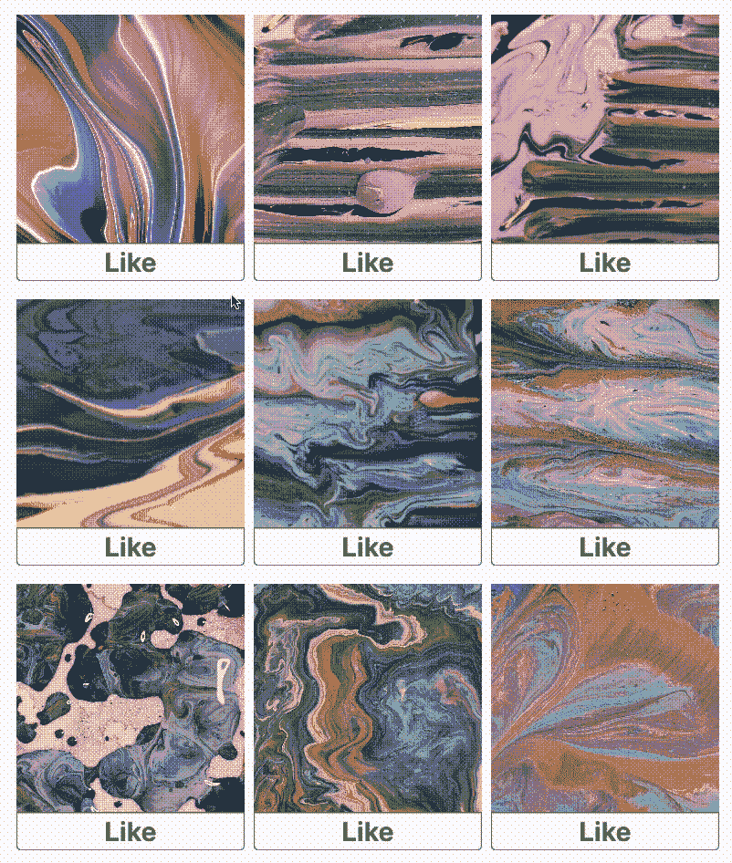
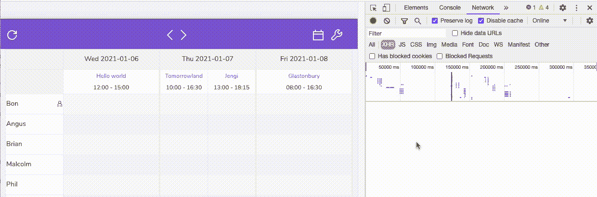
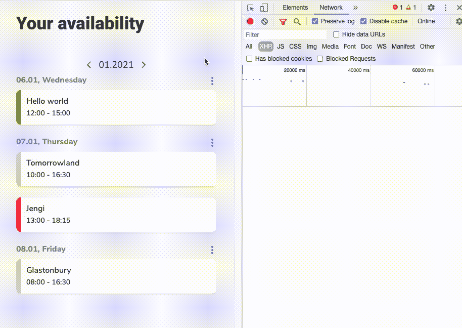
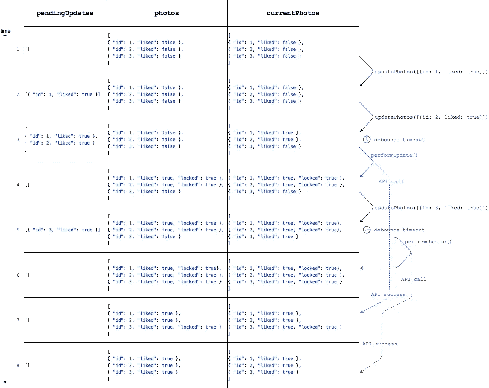

# 使用 React 让您的 UI 即时更新，无需等待后端

> 原文：<https://betterprogramming.pub/make-your-ui-updates-instant-without-waiting-for-a-backend-with-react-bc81147c3c32>

## React 中请求批处理的乐观 UI 更新


即时照片会留下美好的回忆。即时用户界面是很好的体验。(照片由[雅各布·欧文斯](https://unsplash.com/@jakobowens1?utm_source=unsplash&utm_medium=referral&utm_content=creditCopyText)在 [Unsplash](https://unsplash.com/?utm_source=unsplash&utm_medium=referral&utm_content=creditCopyText) 上拍摄)

在本教程中，我想分享我的解决方案，来创建非常具有交互性的用户界面，在这样的界面中，用户感觉所有的事情都是立即完成的。用户等待界面响应的时间越短越好。我们避免沮丧，因此吸引了更多的用户。

目标是让用户感觉后端正在立即响应，并使更新达到最佳，而不是用太多的请求淹没 API。

为了实现这两个目标，我将介绍在 API 请求批处理之后进行乐观 UI 更新。所有这些都将作为 React 组件来实现。出于本文的目的，我们将有一个照片列表作为示例。

# 词汇表

首先，我想澄清一些我们将在整篇文章中使用的概念。

所谓的*乐观 UI 更新，*我指的是在与用户交互后立即在 UI 中完成的更新，而不需要等待后端响应。在任何错误的情况下，我们可以有一个回退逻辑，通常重置回它们的原始状态。

通过*请求批处理*，我的意思是发送一个带有更新列表的请求，而不是对每个更新进行一个 API 调用。这要求后端处理这样的请求。

我们还将使用*去抖*功能。简而言之，这是一个

> 函数，只要它继续被调用，就不会被触发。该函数将在停止调用 N 毫秒后被调用。—来自 https://davidwalsh.name/javascript-debounce-function[的定义](https://davidwalsh.name/javascript-debounce-function)

我们将使用它，但有一点小小的不同，那就是我们将在一段时间后调用这个函数，不管它是否还在被调用。这种方式也非常类似于节流(但我认为节流时间是可变的)。

# 目标

在本教程中，我们将实现一个你喜欢的图片的照片网格。负责喜欢照片的按钮会在点击后立即切换状态。在后台，应用程序将等待其他类似的按钮点击，然后在一个批处理中将多个更新发送到后端。

因为一幅图像胜过千言万语，所以看一下下面这个我们将要实现的例子:



交互式照片网格。所有图片均来自 pexels.com

你可以看到一个用户在第一行喜欢了两张照片，超时后，一个更新请求被发送。照片被标记为正在更新。与此同时，一个用户喜欢第二行的另外两张照片，另一个请求被发送。

注意:“正在更新…”状态只是为了本教程而显示的，但在实际情况下，它可能会被隐藏，使 UI 感觉即时响应。

# 问题

*如果你想了解教程的核心，可以跳过这一部分。在这里，我将进一步强调促使我创建解决方案的问题，以及本文后面的内容。*

一段时间以前，当我在我的软件产品(员工日程安排产品)中实现一个组件时，我偶然发现了一个需要解决的重要问题。我创建了一个交互性很强的表格，每个单元格代表一个员工在给定班次的可用性。起初，我采取了一种天真的方法，只是为了让事情正常运行:细胞是相互独立的，在点击每个细胞后，有一个请求被发送到后端。



在图中，您可以看到 DevTools 的 Network 选项卡中发生了什么。这肯定是可行的，但是随着负载的增加，这可能会很快造成一些麻烦，并使后端充满不必要的请求。

由于任何超时或滞后都会使这个表很难使用，所以 UI 需要尽快更新。



基本上，我们想要实现这张图片中的内容。您可以单击多个项目，它们的状态会立即更新，并且只有一个请求会发送到后端。

如果出现任何错误，给定批次中的项目将被重置为其原始状态。

# 解决办法

## 要求

这些是我希望我的解决方案满足的要求:

1.  UI 更新瞬间完成，很乐观。
2.  为一批更新发送一个 API 请求(给定的 API 本身已经为此做好了准备)。
3.  应该同时处理多个批处理请求(例如，如果进行了一个 API 调用，但是响应还没有到来，则可以处理另一批项目)。
4.  如果出现任何 API 错误，项目将恢复到其原始状态。
5.  跳过不必要的请求(例如，当您第一次喜欢照片，然后很快不喜欢照片时，不需要将任何请求发送到后端)。

## 解决方法解释

我们将在组件(`photos`变量)中保存照片列表，但是每当我们想要修改照片时，我们将修改添加到待更新列表中。该列表可以增长，直到一段时间过去(去抖动)，然后执行更新。然后刷新列表，准备接受另一批更新。

当执行更新时，我们调用 API。在处理 API 调用时，我们将向照片添加一个`locked: true`属性(例如，如果我们想在 UI 中禁用一些与之相关的控件)。

负责向未决更新列表添加修改的函数将被称为`updatePhotos`，而用于执行更新的函数将被简单地命名为`performUpdates`。后者是一个实现细节，将只在内部调用。这是为了让我们的解决方案的界面尽可能简单。外部组件只需要调用`updatePhotos`，而不需要知道内部发生了什么。

将修改添加到待定更新列表不会立即修改照片列表。为了模拟这种情况，更新按以下方式进行。我们将创建一个临时变量`currentPhotos`，它将保存照片的“当前”版本，并应用更新。换句话说，它将把`photos`列表和`pendingUpdates`列表合并，创建一个实际的项目列表。我们将使用`useMemo`来确保它更高的性能。

API 调用完成后，挂起的更新将永久应用于`photos`列表。

这样，使用`currentPhotos`，我们将创建一个“乐观更新”机制——立即应用更新，但调用 API 时会有一些超时，假设 API 调用成功后手动更新的状态是相同的。

为了进一步阐明这种机制，我创建了下面的表格/调用图混合来显示在调用`updatePhotos`和`performUpdates`之后，所提到的状态是如何变化的(`pendingUpdates, photos, currentPhotos`)。



在图像中，我们可以看到两个`performUpdate`呼叫:蓝色和红色。它们由`updatePhotos`调用触发(在去抖超时后)。蓝色的正在更新 id 为`1`和`2`的照片。当蓝色 API 调用仍在处理时，`pendingUpdates`“队列”是清晰的，所以我们调用另一个`updatePhotos`，现在就像 id 为`3`的照片。

当我们还在等待蓝色的回应时，红色的`performUpdate`被调用。最后，两个请求都完成，并且从照片中移除了`locked`标志。

在每一步中，`currentPhotos`代表来自`photos`和`pendingUpdates`的合并状态，以模仿在`photos`列表上即时完成的更新。

## 解决方案的核心逻辑

让我们展示一下该解决方案的核心功能。下面的要点显示了第一个，`performUpdates`:

为了尽可能清楚地显示意图和流程，它被简化了一点，没有了辅助变量。我们稍后将讨论更多细节。

负责更新`pendingUpdates`列表的第二个函数是这里的`updatePhotos`:

`getItemsToResetAndUpdate`将传入的`itemsUpdates`与当前状态进行比较，以决定该项是否需要实际更新。这满足了需求 5(不做不必要的更新)。在函数中，我们更新待更新的列表，然后调用`performUpdates`(去抖)。

# 一些技术细节和使用的方法

## 关闭

我们将使用 [JavaScript 闭包](https://developer.mozilla.org/en-US/docs/Web/JavaScript/Closures)来将一些信息保存在内存中，而不是手动将其添加到一些状态变量中。这样，我们可以只有一个`pendingUpdates`变量，但可以用于多个批处理。

在调用`performUpdates`时，它会记住`pendingUpdates`的副本，即使它是异步的。这样我们将知道一旦 API 调用完成，哪些照片需要移除`locked`标志，或者如果我们得到一个 API 错误，将它们重置为原始状态。

## 钩住

通过我们的解决方案设计，我们允许多个异步调用同时运行。为了在进行状态更新时(从`useState`开始的`setState`)总是拥有最新的状态，我们将主要使用[功能状态更新](https://reactjs.org/docs/hooks-reference.html#functional-updates):

```
const [state, setState] = useState({});
setState(photos => /* ... */)
```

这样，这里的`photos`变量将总是引用最新的照片，而不是过时的引用。

如果你想了解更多关于功能更新如何工作以及何时需要更新的信息，[请查看我的另一篇文章](https://medium.com/better-programming/you-dont-know-usestate-until-you-ve-used-functional-updates-5da52117620f)，在那里我会在更广泛的背景下解释这一点。

# 履行

我不会从头开始创建一个完整的应用程序，因为这篇文章本身的主题已经足够大了。相反，我将关注解决方案的实现。

如果您想用一个示例照片网格运行整个工作项目，请克隆这个 [GitHub repo](https://github.com/tfiechowski/optimisic-react-batching-tutorial) 。一切都在里面，包括实现的解决方案、样式、应用程序设置和测试！

按照存储库中的项目结构，实现将在`src/batching/usePhotos.js`中完成。让我们看一下`usePhotos`的一个精简的“初始”版本，以帮助我们理解我们将要实现的组件的框架和结构:

我们使用`useState`来保存`photos`列表和`pendingUpdates`对象。

为什么反对？我们将使用照片 id 作为密钥，以便更快、更方便地访问待定更新项目。该对象将具有以下形状:

```
{ [id: string]: { [id: string}, /* photo modifications */ }}
```

我们将实现上述功能，并逐个添加必要的实用程序，以满足所有需求。

## 添加待定更新列表-更新照片

先实现`updatePhotos`吧:

作为一个参数，`itemsToUpdate`，我们正在传递一个具有以下形状的对象数组:`{ id: string, /* photo modifications */ }`，例如:`{id: 1, liked: true}`如果我们想将 id 为:`1`的照片标记为喜欢。

通过`getItemsToResetAndUpdate`,我们满足了跳过不必要更新的要求 5。如果一张照片在短时间内被喜欢和不喜欢，该函数将检测到这一点，并从`pendingUpdates`对象中删除该更新。

我们在这里使用`immutability-helper`中的`update`函数。简而言之，它将从`pendingUpdates`中删除`$unset`中指定的所有键，并将它与`toUpdate`对象合并。这样，我们删除了所有不必要的更新，并添加了有效的更新。

最后，我们调用`performUpdates.callback`——这是来自`useDebouncedCallback`的值应该如何使用。

让我们转移到`performUpdate`。我们稍后将回到`getItemsToResetAndUpdate`和其他实用函数。

## 执行更新—执行更新

这是大多数必要逻辑发生的函数。它是通过以下方式实现的:

在检查了是否没有未完成的更新需要提前返回后，我们清除`pendingUpdates`，这样我们就可以接受下一批更新，而不会干扰当前的更新。

接下来，更新被应用到`photos`以反映`pendingUpdates`的修改。然后，我们调用 API ( `onUpdate`)并在成功时从照片中移除`locked`标志，或者在出现任何异常的情况下将照片恢复到原始状态。

## 公用事业

我们现在将讨论实用函数。先从提到的`getItemsToResetAndUpdate`说起。我们还将在这里介绍`isUpdateNeeded`。

我们使用该实用程序来检查哪些`pendingUpdates`需要执行，哪些可以丢弃。我们使用`partition`根据是否需要执行将`pendingUpdates`分成两组。

然后我们把它们转换成合适的格式:`toReset`会和`$unset`一起使用，所以它需要是一个 photo IDs 的数组，`toUpdate`只是一个和`pendingUpdates`形状相同的对象来与之合并。

`isUpdateNeeded`功能检查在应用`itemUpdate`后照片是否需要更新。基本上，它检查`itemUpdate`中的字段是否与原始照片中的相应字段不同。如果它们相同，则不需要更新。

现在让我们实现在`performUpdate`中使用的所有剩余的实用程序。它们是相当简单的状态操作函数:

*   `**removePhotosLockedFlag**` 以`pendingUpdates`为参数，如果照片中有对应的`pendingUpdate`，则从照片中移除`locked`标志。
*   `**revertPhotosToOriginalState**`将原始照片列表作为参数，并将当前照片与其原始版本交换。它还删除了`locked`标志，以防万一。
*   `**applyUpdatesToPhotos**`将`pendingUpdates`的修改应用到`photos`列表。
*   `**clearPendingUpdates**`清除待定更新列表。它也可以被称为`setPendingUpdates({})`，但是我想将其提取到一个具有更有意义的名称的函数中。

# 解决方案使用

现在，随着我们的解决方案的实现，我们可以创建一个简单的组件来利用`usePhotos`。

同样，我将重点展示如何使用`usePhotos`,而不是挖掘关于样式和运行整个应用程序的细节。您可以检查 GitHub repo，所有这些东西都已实现，应用程序已准备好运行。

我们可以创建一个简单的`PhotoList`组件，如下所示:

从`usePhotos`挂钩上仅使用`photos`和`updatePhotos`。我们呈现列表`photos`并调用适当的处理程序进行相似/不相似操作。他们在后面叫`updatePhotos`。

Dummy `onUpdate`只是一个函数，它会在随机超时后成功解析，以模拟需要一些时间才能完成的实际异步 API 调用。

现在我们应该能够创建一个网格，如下图所示:


交互式照片网格。所有图片均来自 pexels.com

# 摘要

在请求批处理的同时进行乐观 UI 更新可能会很快变得复杂。希望我分享的解决方案能帮到你。

解决这个问题肯定还有其他方法，但我发现这个方法对我来说效果最好。在这种情况下，API 调用是对常规端点(如 REST)进行的。如果您正在使用 [GraphQL](https://graphql.org/) ，由于该解决方案的“单端点”性质，您有一些开箱即用的更广泛的可能性，特别是当您将其与类似 [Apollo Client](https://www.apollographql.com/docs/react/) with cache 的东西挂钩时。如果你想看关于 GraphQL 批量请求的乐观更新的类似教程，请告诉我。

## 谢谢！

最后——感谢你坚持到最后！欢迎在评论中发表你的观点。我非常开放，渴望听到你的反馈，无论是积极的还是消极的(或者说，建设性的)！