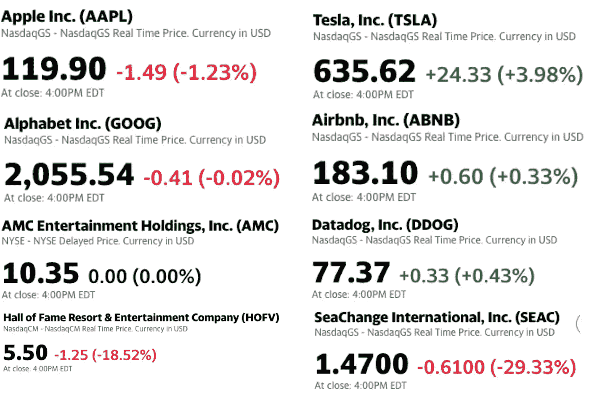
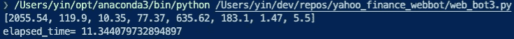
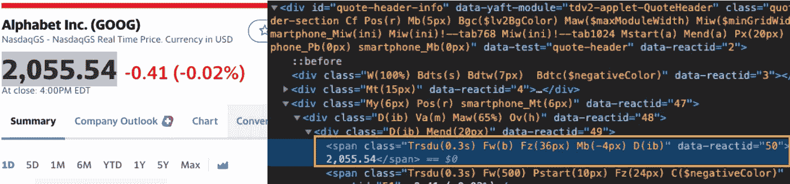
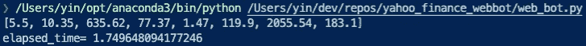

# 如何利用多线程将 Python Web Scraper 速度提高 10 倍

> 原文：<https://betterprogramming.pub/make-your-web-scraper-10x-faster-with-multi-threadings-223708c39016>

## 构建一个股市网络机器人，它可以更快地获取价格

由[弗拉德·希利塔努](https://unsplash.com/@vladhilitanu)在 [Unsplash](https://unsplash.com/) 拍摄的照片。

在我的上一篇文章中，我们讨论了 Python web 抓取。现在，我们能够从页面中获取我们想要的任何数据。

但是如果我们想从多个页面获取数据，需要多长时间？答案是，你想抓取的页面越多，需要的时间就越长。今天，我将向你展示所有酷孩子是如何大大加快整个过程的。

# 获取多只股票的当前价格

截图来自[雅虎财经](https://finance.yahoo.com/)。

假设我们想要获得上面截图中所有股票的当前价格。最直观的方法是运行一个`for`循环，最后收集所有返回值。

输出和经过时间

下面是我们的第一种方法。我计算了获得所有这些价格所需的时间。现在是 11.34 秒，如果你想获得更多的当前价格，可能需要更长的时间。

## 我是如何抓取当前价格的

检查页面以定位我们的目标。

在我们深入多线程之前，我想充分解释一下我是如何获得当前价格数据的。

如果你点击`inspect`，你会看到当前的价格数据在这里:`2,055.54`。我们可以使用 class 属性直接访问这一行，因为当前价格(2，055.54)应用的样式在整个页面上是唯一的。

# 是时候加入我们的魔法酱了——多线程

如果我们的第一种方法是一场接力赛，你只能在一个车道上跑，那么多线程就像是让你想跑多少就跑多少，在不同的车道上跑。每个线程都被分配了一项任务，但多线程允许您同时完成所有任务，而不是一个接一个地完成任务。

[马特·李](https://unsplash.com/@mattlee)在 [Unsplash](https://unsplash.com/) 上的照片。

现在只需要 1.74 秒！

我想先指出结果，因为没有理由不使用多线程。快了差不多十倍！要应用这项技术，我们只需调整`current_price_fetcher`功能。

在第 17 行，我们给每个线程分配一个任务，并将返回值存储在一个队列中。一旦我们完成赋值，我们就可以告诉线程开始运行。在第 20-21 行，我们等待这些线程穿过终点线并加入它们。最后，在第 22-23 行，我们`get`了队列中的所有数据，并将它们附加到我们的价格表中。

这就对了。我们刚刚优化了我们的网络机器人，现在它的运行速度比以前快了十倍！

# 参考

1.  [美汤文档](https://www.crummy.com/software/BeautifulSoup/bs3/documentation.html#arg-attrs)
2.  堆栈溢出— [如何在 python 中获取线程的返回值？](https://stackoverflow.com/questions/6893968/how-to-get-the-return-value-from-a-thread-in-python)