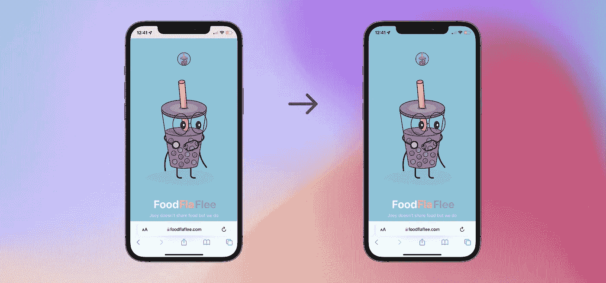
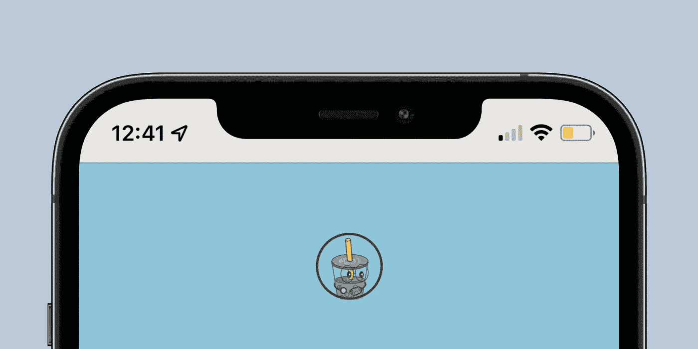
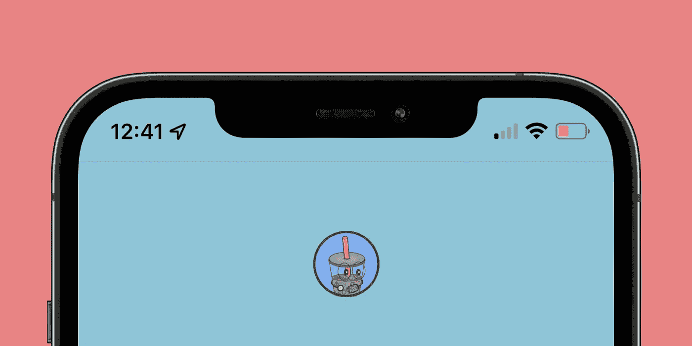
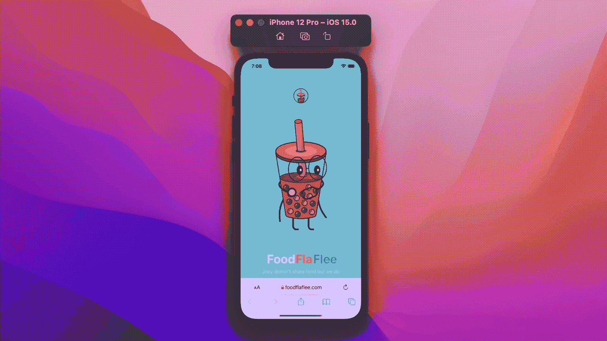

# 如何让你的网站适应 iOS 15 Safari 的设计

> 原文：<https://betterprogramming.pub/make-your-website-iphone-ready-19ccd8547da0>

## 在您的网站上手动设定 Safari 浏览器的标签颜色

在 WWDC 21 期间，苹果修改了 Safari 的设计。他们采取了一种极简主义的方法，在屏幕底部有一个工具栏，只有几个控件。用户界面更加关注手势，旨在更好地利用 iPhone 的边到边无边框显示屏。

对于 web 开发者来说，它提供了更多的区域来展示他们的内容。以及将他们的网站设计与 Safari 自己的界面相融合的机会。

这个实现同样适用于 macOS 和 iPadOS 平台上的 Safari。

# Safari 15

对于 iPhone 上的 [Safari 15](https://www.apple.com/safari/) 和更高版本，标签栏将 Safari 窗口与 iPhone 上凹槽的底层区域分开。这有助于避免剪切凹口下方的内容。和电池状态等几个重要信息。

对网站开发者来说，好消息是它的颜色可以改变，以匹配网站的主题。Safari 会自动处理，我们需要做的就是给网站提供主题颜色。

# 向网站添加颜色主题

为网站设置颜色主题非常简单明了。我们需要做的就是在项目的根目录下添加一个 meta 标签。

在**内容**属性下添加你网站的主题颜色作为十六进制值。重新构建您的项目，您可以看到它的运行

# 适应黑暗模式

使用通用的颜色主题，无论设备的配色方案如何，标签栏的背景颜色都将保持不变。Safari 提供了一个选项来设定替代颜色以适应黑暗模式。使用这些单独的主题颜色可以交替地用于亮和暗模式。

用以下内容替换之前的 meta 标记。并分别为浅色和深色方案添加首选主题颜色。

您可以通过更改设备的配色方案来测试应用程序，Safari 的标签栏会自动适应它。

# **就是这样！**

所以，你有它。您的网站现在可以适应 Safari 的极简 UI。如果您有任何与实施相关的问题，您可以随时通过 [Twitter](https://twitter.com/amolkmr05) 联系我。再见。