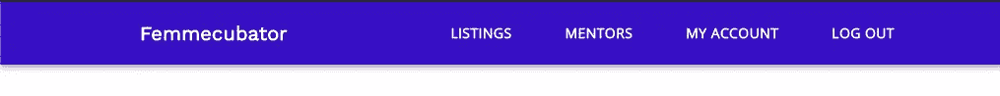
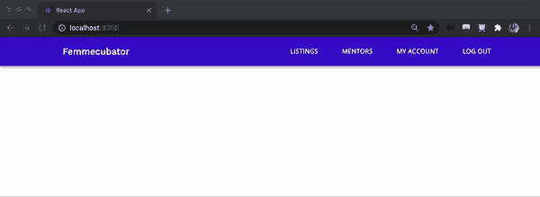
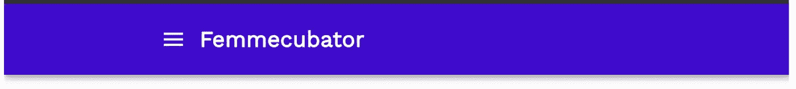
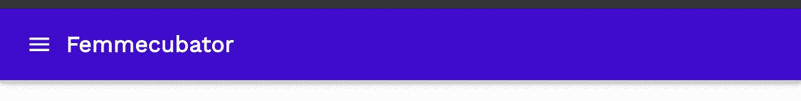

# 用 MaterialUI 和 React 制作响应式标题

> 原文：<https://betterprogramming.pub/making-a-basic-header-responsive-with-materialui-and-react-2198fac923c8>

## 第二部分


[伊万·班杜拉](https://unsplash.com/@unstable_affliction?utm_source=medium&utm_medium=referral)在 [Unsplash](https://unsplash.com?utm_source=medium&utm_medium=referral) 上的照片。

嗨！之前，我们学习了[如何使用材质 UI 和 React 构建一个基本的](https://medium.com/better-programming/building-a-basic-header-with-materialui-and-react-js-d650f75b4b0a) `[Header](https://medium.com/better-programming/building-a-basic-header-with-materialui-and-react-js-d650f75b4b0a)` [组件](https://medium.com/better-programming/building-a-basic-header-with-materialui-and-react-js-d650f75b4b0a)来实现下面的静态结果:



图片来源:作者

在本教程中，当用户调整屏幕大小时，让我们将这个静态桌面版本变成一个移动视图。响应式设计很重要，因为当用户在他们的移动设备上浏览你的 web 应用时，你不会想剥夺他们的良好体验。如果你还没有这样做，在继续之前，看看我之前的教程来构建一个基本的桌面标题！

在本教程结束时，我们将实现以下目标:



GIF 鸣谢:作者

我们开始吧！仅供参考:你可以访问 GitHub 上的[源代码来跟进。](https://github.com/vuonga1103/responsive-header-tutorial/blob/master/src/Header.js)

# 1.使用 useEffect()和 useState()挂钩来设置响应性

将以下代码添加到`Header`组件中:

让我们来分解一下:

*   首先，我们设置函数`setResponsiveNess`，并在内部调用它`useEffect()`。这负责根据窗口的`innerWidth`将`mobileView`状态设置为`true`或`false`。
*   我们在`useEffect`回调中返回一个清理函数。将调用这个返回的函数来执行所需的清理。当组件卸载时，我们希望删除我们的 resize 事件侦听器。
*   然后，我们向窗口对象添加一个事件监听器，监听用户何时调整窗口大小，并添加一个调用`setResponsiveness`的回调函数。
*   我们在我们的`useState()`钩子中设置了状态`mobileView`,并从状态中解构了`mobileView`,这样我们可以在以后引用它。
*   最后，我们确保已经从 React 导入了`useEffect`和`useState`。

现在，在我们的`Header`组件的返回语句中，添加`{mobileView ? displayMobile() : displayDesktop()}`，这样我们就有了:

*   根据状态`mobileView`是否设置为`true`或`false`，我们将调用`displayMobile()`或`displayDesktop()`。之前，我们编写了`displayDesktop()`，它返回必要的 JSX 来显示桌面版的标题。我们现在来写`displayMobile()`！

# 2.添加显示移动工具栏的功能

首先，我们导入`@material-ui/icons`库来访问我们将要使用的菜单图标。运行`npm i @material-ui/icons`，然后将`import MenuIcon from “@material-ui/icons/Menu”;`添加到我们的`Header`组件中。从`@material-ui/core`导入`IconButton`。然后将以下代码添加到我们的`Header`组件中:

我们来消化一下:

*   我们将从`@material-ui/icons/Menu`库中导入的`MenuIcon`(又名抽屉图标)包装在`IconButton`包装器中。
*   我们将一些道具传递给`IconButton`组件(这是使用 ES6 语法构造的):`edge: "start"`允许按钮位于工具栏的开始位置。`color: "inherit"`让图标继承最接近的顶层组件指定的颜色。`“aria-label": “menu"`和`“aria-haspopup": “true"`分别用于让屏幕阅读器通知有视觉障碍的用户这个元素是一个菜单和一个弹出窗口。
*   然后，我们将先前定义的`femmecubatorLogo`放入，并将其包装在`div`中。

现在，如果我们调整屏幕大小，我们应该有:



图片来源:作者

要去掉移动视图中的填充，只需将下面的内容添加到我们的 header 类的`makeStyles()`钩子中:

```
"[@media](http://twitter.com/media) (max-width: 900px)": {
      paddingLeft: 0,
    },
```

这样屏幕小于 900px 时，`paddingLeft`就会是`0`。我们应该有:

填充固定:



图片来源:作者

不错！现在，让我们添加一些逻辑，以便当我们单击菜单图标时，我们在应用程序的一侧显示抽屉菜单。

# 3.添加逻辑来处理抽屉按钮的点击

*   将`onClick: handleDrawerOpen`添加到`IconButton`的道具列表中:

*   在`displayMobile()`内编写`handleDrawerOpen`函数:

```
const displayMobile = () => {
    const handleDrawerOpen = () =>
    setState((prevState) => ({ ...prevState, drawerOpen: true }));
...
```

*   将`drawerOpen`添加到我们的`useState()`钩子中，将其初始化为`false`。此外，从 state 中解构`drawerOpen`,以便我们稍后可以引用该变量。

```
const [state, setState] = useState({
    mobileView: false,
    drawerOpen: false
  });const { mobileView, drawerOpen } = state;
```

所以现在，每当我们点击菜单图标按钮时，`drawerOpen`就会被设置为`true`。

# 4.将抽屉组件添加到工具栏

接下来，我们向我们的`Toolbar`添加一个`Drawer`组件。确保从`@material-ui/core`导入:

让我们来分析一下`Drawer`到底是怎么回事:

*   `anchor: “left”`将抽屉固定在屏幕左侧。
*   `open: drawerOpen`:根据我们的状态`drawerOpen`是`true`还是`false`，我们的`Drawer`要么显示，要么不显示。
*   `onClose: handleDrawerClose`确保当我们点击抽屉外的任何东西时，会调用`handleDrawerClose`函数。这会将`drawerOpen`状态设置为`false`，从而关闭抽屉。

然后我们在抽屉中添加了一个名为`getDrawerChoices()`的`div`，它负责显示供用户点击的菜单选项。让我们来编写`getDrawerChoice`函数:

这是怎么回事:

*   我们映射`headersData`集合中的每个项目，从每个项目中解构`label`和`href`键。
*   每个对象被映射到一个`Link`并从`@material-ui/core`导入。
*   我们指定该组件是我们之前从`react-router-dom`导入的`RouterLink`。
*   `to: href`允许用户点击导航到`href`路线。
*   我们确保指定了`color`和`key`，并将`textDecoration`设置为`none`以删除链接的默认下划线。
*   最后，我们使用`MenuItem`(从`[@material](http://twitter.com/material)-ui/core`导入)并在其中添加我们的`label`。

当我们现在点击菜单图标时，我们看到:


图片来源:作者

点击这些菜单选项会将我们带到相应的路线。

现在要做的最后一件事是给我们的抽屉添加一些衬垫。

*   将`drawerContainer`类添加到保存抽屉选择的`div`中:

```
<Drawer anchor="left" open={drawerOpen} onClose={handleDrawerClose}>
   <div className={drawerContainer}>{getDrawerChoices()}</div>
</Drawer
```

*   然后在`makeStyles()`中样式`drawerContainer`:

```
const useStyles = makeStyles(() => ({
...
  drawerContainer: {
    padding: "20px 30px",
  }
}));
```

瞧啊。


图片来源:作者

# 结论

访问 GitHub 上的[源代码。随意定制你喜欢的！](https://github.com/vuonga1103/responsive-header-tutorial/blob/master/src/Header.js)

此外，更多信息可在[材料 UI 文档](https://material-ui.com)中找到。

感谢您的关注。希望这篇教程对你有帮助！