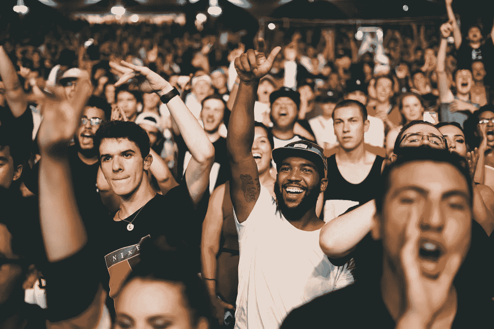
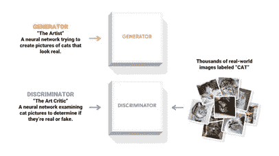
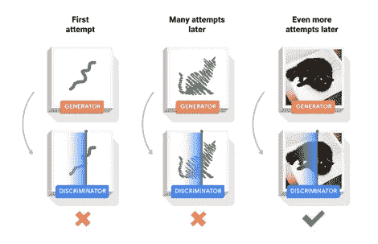
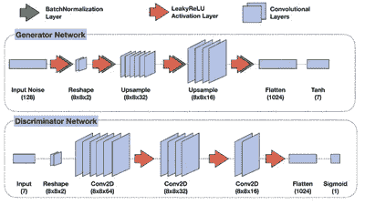
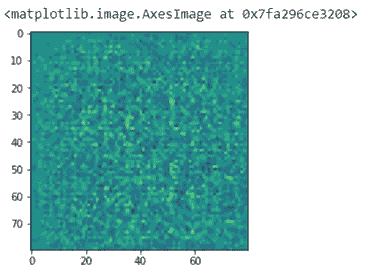
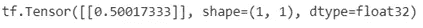
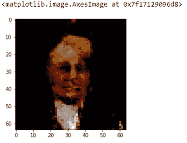

# 用张量流做鬼脸

> 原文：<https://betterprogramming.pub/making-a-face-gan-with-tensorflow-23b4b79b4de7>

## 训练你的大脑识别人脸



我一直对机器学习能够实现的奇迹着迷。我最近的发现之一是生成敌对网络(GANs)。计算机可以在没有任何图像信息的情况下制作任何图像，这个想法让我很惊讶。给它一个 100×1 的随机、正常数字阵列，GAN 将生成一个随机图像(根据它已经被训练过的图像)。因此，我探索了它是如何工作的，并变得更加兴奋——它不是一个，而是两个网络相互竞争并使自己变得更好的组合。



图片来自[https://www.tensorflow.org/tutorials/generative/dcgan](https://www.tensorflow.org/tutorials/generative/dcgan)

第一个模型制作一个随机生成的图像，并试图欺骗另一个模型认为这是一个真实的图像。然后，第二个模型试图区分真实图像和第一个模型创建的图像。第一个模型称为“生成器”，是生成模型的主模型。第二个模型称为“鉴别器”，它试图捕捉生成的图像。随着训练的进行，网络会调整自己的权重来完成任务。最后，发电机模型变得足够好，以欺骗鉴别器模型，并给出合理的低损失分数。



图片来自[https://www.tensorflow.org/tutorials/generative/dcgan](https://www.tensorflow.org/tutorials/generative/dcgan)

# **架构**



这两种网络的架构都非常简单。生成器网络使用`Upsamle`或卷积转置层将输入重新整形为所需的高维数据空间。

鉴别器网络是一个普通的 CNN，它使用卷积层，然后是最后的`Dense`层来预测图像。

# **损失函数**

用于 GANs 的最简单和最常用的损失公式之一是“最小最大”损失，由下式给出:

`Ex[log(D(x))]+Ez[log(1−D(G(z)))]`

在此功能中:

*   `D(x)`是鉴别器对真实数据实例 x 为真实的概率的估计。
*   `Ex`是所有真实数据实例的期望值。
*   `G(z)`是给定噪声时发电机的输出`z`。
*   `D(G(z))`是鉴别者对假实例为真的概率的估计。
*   `Ez`是对生成器的所有随机输入的期望值(实际上，是对所有生成的假实例`G(z)`的期望值)。
*   该公式源自真实分布和生成分布之间的[交叉熵](https://developers.google.com/machine-learning/glossary#cross-entropy)。

发电机不能直接影响函数中的`log(D(x))`项，所以，对于发电机来说，最小化损耗相当于最小化`log(1 — D(G(z)))`。

# **代码**

完整的代码可以在我的 [Github repo](https://github.com/RahulBarman101/Face-Gan) 上找到。

好了，现在让我们进入有趣的部分:实现用于创建人脸的 GAN 网络。

从最终结果接收的人脸将是模糊的和低分辨率的，因为该模型是针对 64x64 图像大小训练的，并且持续时间非常短。要获得更多高清图像，请提高分辨率并训练更长时间。

首先，获取[数据集](http://vis-www.cs.umass.edu/lfw/lfw.tgz):

```
!wget [http://vis-www.cs.umass.edu/lfw/lfw.tgz](http://vis-www.cs.umass.edu/lfw/lfw.tgz)
**import** **tarfile**my_tar = tarfile.open('lfw.tgz')my_tar.extractall('./lfw') *# specify which folder to extract to*my_tar.close()
```

提取文件的内容:

```
**import** **tensorflow** **as** **tf**
**import** **numpy** **as** **np**
**import** **matplotlib.pyplot** **as** **plt**
**import** **PIL**
**from** **tensorflow.keras** **import** layers
**import** **os**
%matplotlib inline
```

导入必要的库:

```
images = []
**for** i **in** os.scandir('lfw/lfw'):
  **for** j **in** os.scandir(i.path):
    images.append(j.path)
images = tf.data.Dataset.from_tensor_slices(images)
```

在这里，我们保存所有要使用的图像的文件名，并创建一个`tf.data`变量，这将有助于构建训练过程的输入管道，以避免内存过载。

```
**def** get_ds(path):
  img = tf.io.read_file(path)
  img = tf.image.decode_jpeg(img,channels=3)
  img = tf.image.convert_image_dtype(img,tf.float32)
  img = tf.divide(tf.subtract(tf.multiply(img,255),127.5),127.5)
  **return** tf.image.resize(img,(64,64))
```

这是一个简单的函数来接收图像的路径，读取它，规范化它，并调整它的大小。

```
BATCH_SIZE = 64train_images = images.map(get_ds,num_parallel_calls=tf.data.experimental.AUTOTUNE).batch(BATCH_SIZE).shuffle(60000)
```

这是相当简单的代码，它映射每个图像的路径，并使用前面的函数将其转换为所需的形式。`num_parallel_calls=tf.data.experimental.AUTOTUNE`参数用于批量向函数发送数据，CPU 无需过度扩展即可处理这些数据。

上面的函数是生成器模型。第一层是`Dense`模型，它将接受一个 100 行的随机正常数字数组。`Reshape`层将`Dense`层的输出转换成 3D 向量，以传入卷积转置层。这些图层放大输入的大小，并最终以所需的形状输出结果。

```
generator = make_generator_model()noise = tf.random.normal([1,100])generated_image = generator(noise,training=**False**)plt.imshow(generated_image[0]*127.5+127.5)
```



训练前发电机模型的图像输出

这是没有经过训练的生成器产生的图像。它产生一个标准化的矢量，需要对其进行缩放以生成 RGB 颜色。

这个函数是`Discriminator`模型，它预测图像是真的还是假的:

```
discriminator = make_discriminator_model()decision = discriminator(generated_image)print(decision)
```



训练前鉴别器模型的输出

如果图像是假的——即由生成器模型创建的图像——则鉴别器模型的输出将更负，而如果是真实图像，则输出为正。

```
cross_entropy = tf.keras.losses.BinaryCrossentropy(from_logits=**True**)
**def** discriminator_loss(real_output,fake_output):
  real_loss = cross_entropy(tf.ones_like(real_output),real_output)
  fake_loss = cross_entropy(tf.zeros_like(fake_output),fake_output)
  total_loss = real_loss + fake_loss
  **return** total_loss
**def** generator_loss(fake_output):
  **return** cross_entropy(tf.ones_like(fake_output),fake_output)
```

两个模型的损失函数。它使用交叉熵损失来创建“最小最大”损失函数。

```
generator_optimizer = tf.keras.optimizers.Adam(1e-4)
discriminator_optimizer = tf.keras.optimizers.Adam(1e-4)
```

对于优化器，两者都使用`Adam`优化器。

这是主要的训练功能。它创建一个随机的 100 行数组，作为生成器模型的输入。

这是一个小函数，在调用时生成生成器模型的输出。

这是调用训练函数的主循环，并在每个时期后调用`generate_images`函数。

这是一个小模块，用于制作训练完成后保存的图像的 gif。

```
new_image = generator(tf.random.normal([1,100]),training=**False**)plt.imshow(new_image[0,:,:,:])
```



来自训练后的生成器模型输出的图像

*瞧，*生成人脸的 GAN 完成了！我希望你喜欢它。

正如我前面所说，所有的代码都在我的 [Github repo](https://github.com/RahulBarman101/Face-Gan) 中。请随意评论和提问。另外，看看我的[网站](http://www.rahulbarman.com)上其他很酷的项目。