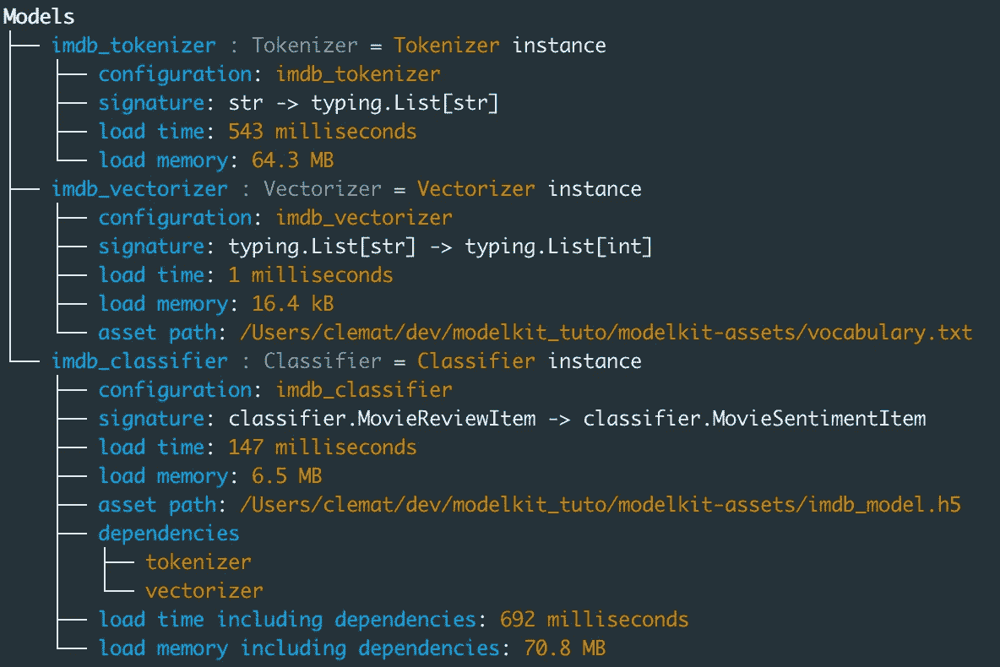
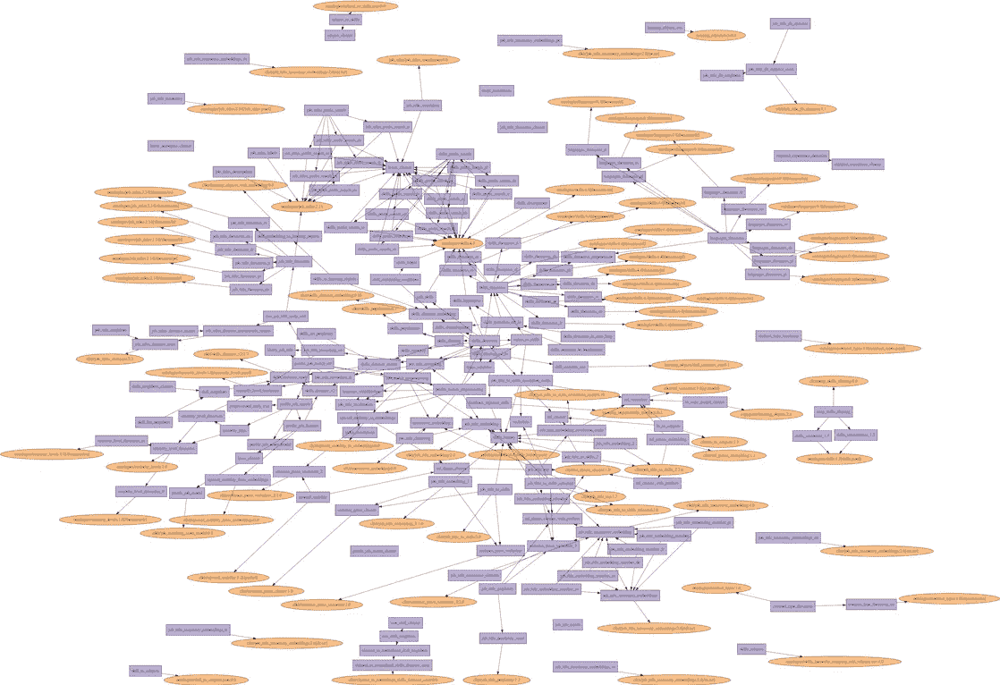

# 使用我们的 MLOps Python 库“modelkit”制作生产就绪的 ML 模型

> 原文：<https://betterprogramming.pub/making-a-ml-models-production-ready-with-modelkit-our-mlops-python-library-af877cda0ca1>

## 了解我们的 MLOps 框架的强大功能


照片由 [Atakan Narman](https://unsplash.com/@narmanatakan?utm_source=medium&utm_medium=referral) 在 [Unsplash](https://unsplash.com?utm_source=medium&utm_medium=referral) 上拍摄

我们有开源的 [modelkit](https://github.com/Cornerstone-OnDemand/modelkit) ，一个 python MLOps 框架，旨在使 ML 模型可重用、健壮、高性能并易于在各种环境中部署(参见其故事[这里](https://medium.com/@cyrillemat/why-we-built-and-open-sourced-our-mlops-python-framework-f0c27d57fa7b))。

在本教程中，我们将通过一个常见的 NLP 任务来展示 Modelkit 的强大功能:情感分析。

计划是这样的:

1.  利用空间实现标记器
2.  利用 Scikit-Learn 实现矢量器
3.  构建分类器，利用 Keras 预测评论是负面还是正面
4.  探索 Modelkit 的功能，帮助我们的模型投入生产

# 初始化

开始之前，请安装以下软件:

## 第一个模型

在这一节中，让我们介绍一下`modelkit`的 API 的基础知识，并使用 spaCy 作为 NLP 管道的标记器。

让我们先造一个`modelkit.Model`:

`_predict`方法很简单:它实现了推理方法。

在对象实例化时调用`_load`方法。它的目标是加载/计算模型所需的任何资产、工件和其他复杂对象，为此`modelkit`提供了诸如延迟加载和依赖管理等特性。

## 完整的模型

现在我们已经了解了基础知识，让我们编写这个模型的更高级版本:

让我们看看我们添加了什么:

*   **批处理**:我们实现了一个`_predict_batch`方法来一次处理一个输入列表，以便利用矢量化来加速(在这个例子中，标记一批数据所需的时间除以 2)。
*   **测试**:我们在`Model`类定义旁边添加了测试用例，以确保它的行为符合预期(是的，我们与`pytest`兼容)。这里测试意味着简单的检查，也可以作为文档。
*   **输入和输出规范**:通过子类化`Model[input_type, output_type]`，调用将被验证，从而确保调用、依赖关系、服务之间的一致性，并在`Models`未按预期调用时发出警报。这也有利于文档，理解如何使用给定的模型，并在开发过程中受益于静态类型检查(例如使用 [mypy](https://github.com/python/mypy) )。`modelkit`允许你定义你的模型的预期输入和输出类型。

# 2.利用 Scikit-Learn 实现矢量器

我们现在将创建一个矢量器，并说明 modelkit 的“资产”概念。在这里，我们使用`sklearn`训练一个`TfIdf`矢量器，并将其存储在本地:

前面代码的输出是一个`self.vocabulary.txt`文件。然后，我们创建一个模型，并将该文件定义为“资产”:

我们在这里看到，模型可以使用`self.asset_path`加载资产。为什么`modelkit`有用？它提供了几个特点:

*   **远程存储:**在真实场景中，您的资产不会存储在本地，而是可以通过文件存储(例如:AWS s3、GCS 等)进行访问。).modelkit 使用 env 变量来提取该连接，并且可以在和`_load`之前检索和缓存 ta 本地磁盘*上的资产。对于本教程，如果您将资产文件保存在当前目录中，您可以简单地定义`export MODELKIT_ASSETS_DIR=.`*
*   推送: modelkit 有 cli 将新资产推送至资产存储
*   版本化: modelkit 可以处理您资产的版本化

# 3.利用 Keras 构建一个简单的分类器

现在让我们使用 IMDB 数据集和我们以前的模型来训练一个 Keras 分类器。(由于这里的代码有点长，我采样了最重要的部分。如果你想在本地运行，请点击[这里](https://cornerstone-ondemand.github.io/modelkit/examples/nlp_sentiment/classifier/)

一旦模型被训练，让我们创建一个`modelkit`模型，它使用以前的输出作为资产:

我们现在有一个分类器，它是:

*   composed:分类器加载记号赋予器和矢量器。Modelkit 确保只创建一个类的实例
*   与文件存储同步:在这个例子中，存储是本地的，但是使用 env_var 作为`MODELKIT_STORAGE_PROVIDER`可以让你使用任何存储
*   测试:我们有第一级测试。显然这还不够，但这是记录模型的好方法
*   完全类型化:这不是免费的，因为确保类型化需要时间，但是这对代码的清晰性和健壮性很有帮助
*   针对批处理进行优化:因为我们实现了自己的批处理方法，所以我们可以轻松地优化代码

# 4.推动我们模型的可扩展性和健壮性

这也是支持工业化的目标。以下是 modelkit 在这方面帮助你的几种方法

## **模型负载描述**

你可以调用一个库的`describe()`方法来查看许多关于加载时间和内存的信息



## **预测剖析**

是为了描述所有子模型的净持续时间。下面的代码片段显示了`SimpleProfiler`的用法。

哪些输出:


## **缓存**

您可以通过将 t `{"cache_predictions": True}`添加到配置中并设置`MODELKIT_CACHE_PROVIDER` env 变量(通过缓存工具或 redis 缓存的本地缓存)来为模型添加缓存

## **FastAPI 服务**

modelkit 模型可以轻松添加到 FastAPI 应用程序中:

## **多处理**

您可以扩展前面的示例，使用 modelkit 进行多处理，因为`ModelLibrary`确保在实例化不同的 workers 之前创建所有模型(例如，使用`gunicorn --preload`)，这很方便，因为所有模型将共享相同的模型对象，并且不会增加内存。

## **异步**

这是`modelkit`的异步支持大放异彩的环境，请务必在这里使用您的`AsyncModel`:

# 临终遗言

正如我们在本教程中看到的，可以用 modelkit 做很多事情。而且你的模型库越先进，越强大。

举例来说，我们的 10 人团队目前拥有:

*   大约 200 个模型，深度互联(90%的模型与其他模型相连。我们依赖关系树达到 5 层深度)
*   大约 100 个资产(有些模型不使用资产，有些使用几个资产)，所有资产都在世界各地的 AWS 存储桶中进行版本控制(我们部署在许多环境中)。
*   3 个不同的 FastAPI 服务，每个服务都有大约 50%的模型子集&我们每天都在 Sparks 脚本中使用我们的模型。



我们的模型和资产图表的(自愿的模糊)视图

如果你想更多地了解这个项目，请测试它，并加入[不和谐](https://discord.gg/ayj5wdAArV)给我们你的想法！

感谢帮助；-)

```
Want to Connect?PS: Huge thanks to the ModelKit team, composed of [Victor Benichoux](https://www.linkedin.com/in/victor-benichoux-3a251316b/) (that wrote most of ModelKit), [Antoine Jeannot](https://www.linkedin.com/in/antoinejeannot/) (who built this tutorial for the documentation), [Thomas Genin](https://www.linkedin.com/in/tgenin/), [Quentin Pradet](https://www.linkedin.com/in/quentin-pradet/), [Louis Deflandre](https://www.linkedin.com/in/louis-deflandre-35035a21/), [Lu Lin](https://www.linkedin.com/in/lu-lin-8301/) and [Mathilde Léval](https://www.linkedin.com/in/mathildeleval/)
```