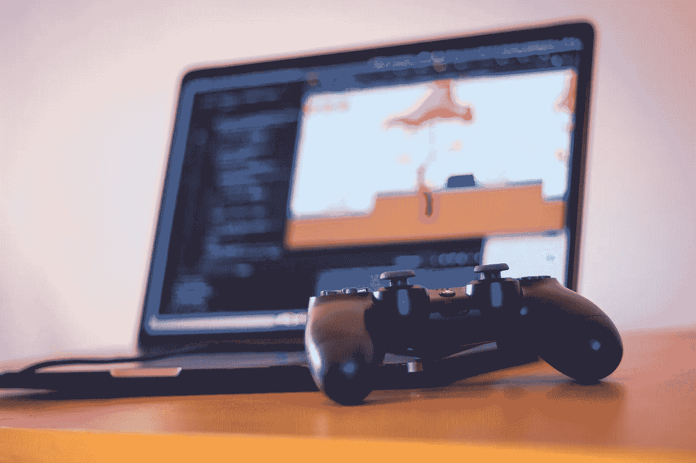
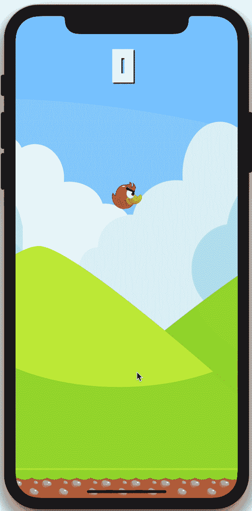
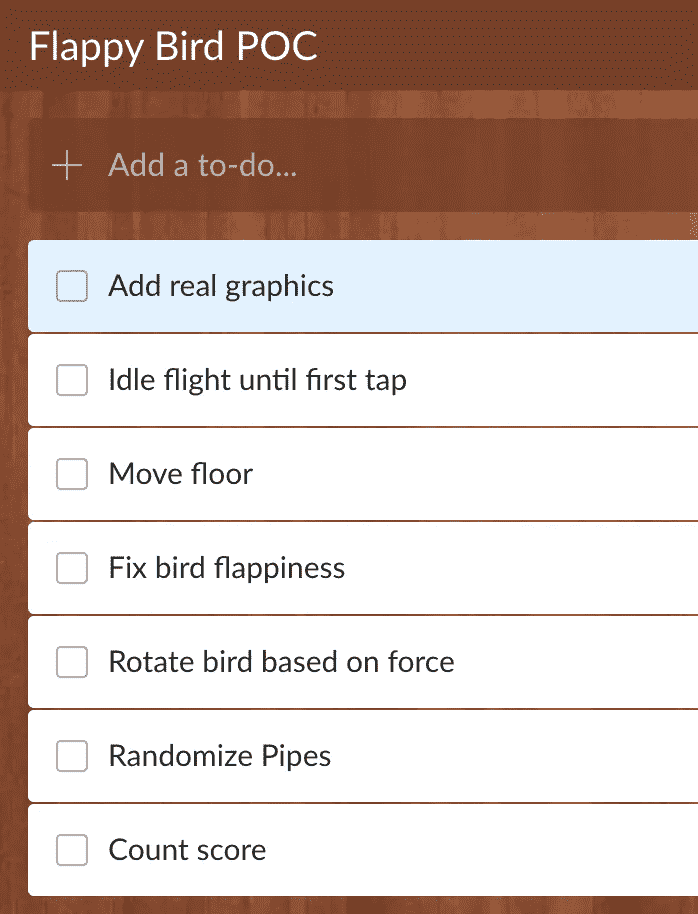
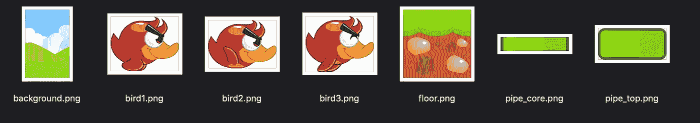

# 在 React Native 中制作准备就绪的 Flappy Bird

> 原文：<https://betterprogramming.pub/making-a-production-ready-flappy-bird-in-react-native-751713661a60>

## 制作一个有趣的，可玩的，好看的热门游戏的复制品



照片由 [Unsplash](https://unsplash.com/search/photos/casual-gaming?utm_source=unsplash&utm_medium=referral&utm_content=creditCopyText) 上的 [Hello 灯泡](https://unsplash.com/@hellolightbulb?utm_source=unsplash&utm_medium=referral&utm_content=creditCopyText)拍摄

在[上一篇](https://medium.com/better-programming/flappy-bird-with-react-native-game-engine-and-matter-js-d5673f50eb9)中，我们使用 react-native-game-engine 和 Matter.js 创建了 Flappy Bird 的概念验证版本。虽然它很有趣，但它甚至不是任何正常用户都会喜欢或使用超过 10 秒钟的那种游戏。

今天，我们的目标是使游戏(或多或少)为生产做好准备。

TL；博士 1:看看我是如何在 Youtube 上制作这个的。

TL；DR #2:在 [Github](https://github.com/lepunk/react-native-videos/tree/master/FlappyBird) 上抓取源代码

这是我们要做的:



我喜欢处理列表，所以我创建了一个小任务列表来完成上面的任务:



# 添加图形

一款游戏的好坏取决于它的画面。通常我会问我的设计师或雇人为我创造一个独特的设计，但在这种情况下，我很高兴有一个预先制作的模板。我上了 GraphicRiver，花了 7 美元买了一个 [Flappy Duck](https://graphicriver.net/item/flappy-duck-game-assets/8915443) 包，这个包非常适合演示。

我做了一点切割，最终得到了以下资产:



我将这些文件移动到我的项目中的`/assets/img`文件夹，并在`/assets`中创建了一个 Images.js 文件，以便以后方便地引用它们。

```
export default Images = {
    background: require('./img/background.png'),
    floor: require('./img/floor.png'),
    pipeCore: require('./img/pipe_core.png'),
    pipeTop: require('./img/pipe_top.png'),
    bird1: require('./img/bird1.png'),
    bird2: require('./img/bird2.png'),
    bird3: require('./img/bird3.png'),
}
```

在前一集中，我们为`Pipe`和`Floor`对象使用了相同的`Wall.js`组件。但是现在我们希望这些行为稍微不同，所以我们需要创建一个单独的`Floor`组件。

```
import React, { Component } from "react";
import { View, Image } from "react-native";
import Images from "./assets/Images";

export default class Floor extends Component {
    render() {
        const width = this.props.body.bounds.max.x - this.props.body.bounds.min.x;
        const height = this.props.body.bounds.max.y - this.props.body.bounds.min.y;
        const x = this.props.body.position.x - width / 2;
        const y = this.props.body.position.y - height / 2;

        const imageIterations = Math.ceil(width / height);

        return (
            <View
                style={{
                    position: 'absolute',
                    left: x,
                    top: y,
                    width: width,
                    height: height,
                    overflow: 'hidden',
                    flexDirection: 'row'
                }}>
                {Array.apply(null, Array(imageIterations)).map((el, idx) => {
                    return <Image style={{ width: height, height: height }} key={idx} source={Images.floor} resizeMode="stretch" />
                })}
            </View>
    );
  }
}
```

好了，我需要在这里解释一些事情:

*   我们曾经从传入的道具中获得*宽度*和*高度*。这变得很不方便，所以在这个组件中，我决定从底层的 Matter.js 主体中获取宽度和高度。所有物体都有边界，所以你用 *bounds.max.x 减去 bounds.min.x* 来计算宽度和高度
*   我们的地板背景图像是正方形的，所以我们需要应用多个图像来覆盖地板。所需的迭代次数由 *Math.ceil(宽度/高度)*定义
*   由于上面的计算可能会导致比我们需要的多一次迭代，我们必须将 *overflow: hidden* 添加到容器中

现在说说我们的鸟…

小鸟图形是一组 120x99 的透明 png 文件。然而，我们最初的鸟，由一个矩形表示，是一个 50x50 点的正方形——如果我们只应用图像，它会变形。让我们通过添加一些常量来解决这个问题:

```
import { Dimensions } from 'react-native';

export default Constants = {
    MAX_WIDTH: Dimensions.get("screen").width,
    MAX_HEIGHT: Dimensions.get("screen").height,
    GAP_SIZE: 220,
    PIPE_WIDTH: 100,
    BIRD_WIDTH: 50,
    BIRD_HEIGHT: 41
}
```

我们仍然将我们的`BIRD_WIDTH`设置为 50，但是将通过 50 / 120(图像宽度)x 99(图像高度)= 41 来计算`BIRD_HEIGHT`

现在我们需要更新 Bird.js，使其具有与我们的 Floor.js 相同的逻辑来获得宽度/高度:

```
import React, { Component } from "react";
import { View, Image } from "react-native";
import Images from './assets/Images';

export default class Bird extends Component {

    render() {
        const width = this.props.body.bounds.max.x - this.props.body.bounds.min.x;
        const height = this.props.body.bounds.max.y - this.props.body.bounds.min.y;
        const x = this.props.body.position.x - width / 2;
        const y = this.props.body.position.y - height / 2;

        let image = Images['bird' + this.props.pose];
        return (
            <Image
                style={{
                    position: "absolute",
                    left: x,
                    top: y,
                    width: width,
                    height: height,
                }}
                resizeMode="stretch"
                source={image} />
    );
  }
}
```

我还添加了对“姿势”道具的支持。我们稍后将使用动画制作鸟的翅膀。

现在，让我们更新我们的`App.js,`的`setupWorld`方法，将这一切联系在一起:

```
setupWorld = () => {
        let engine = Matter.Engine.create({ enableSleeping: false });
        let world = engine.world;
        world.gravity.y = 0.0;

        let bird = Matter.Bodies.rectangle( Constants.MAX_WIDTH / 2, Constants.MAX_HEIGHT / 2, Constants.BIRD_WIDTH, Constants.BIRD_HEIGHT);
        //bird.restitution = 20;

        let floor1 = Matter.Bodies.rectangle(
            Constants.MAX_WIDTH / 2,
            Constants.MAX_HEIGHT - 25,
            Constants.MAX_WIDTH + 4,
            50, { isStatic: true }
        );
        let floor2 = Matter.Bodies.rectangle(
            Constants.MAX_WIDTH + (Constants.MAX_WIDTH / 2),
            Constants.MAX_HEIGHT - 25,
            Constants.MAX_WIDTH + 4,
            50, { isStatic: true }
        );

        Matter.World.add(world, [bird, floor1]);
        Matter.Events.on(engine, 'collisionStart', (event) => {
            var pairs = event.pairs;

            this.gameEngine.dispatch({ type: "game-over"});

        });

        return {
            physics: { engine: engine, world: world },
            floor1: { body: floor1, renderer: Floor },
            floor2: { body: floor2, renderer: Floor },
            bird: { body: bird, pose: 1, renderer: Bird},
        }
    }
```

请注意以下事项:

*   我们一开始就把世界引力改成了 0。这阻止了鸟在开始时落下(待办事项#2)。我们将从我们的 Physics.js 中控制这个值
*   移除管道的初始化。我们也会在 Physics.js 中处理它。
*   现在我们有两层楼。这在我们处理待办事项 3 时会很有用

给我们的游戏添加背景很容易。我们只是将它添加到我们的渲染方法中:

```
<Image style={styles.backgroundImage} resizeMode="stretch" source={Images.background} />
```

并将它添加到 App.js 中的样式表中:

```
backgroundImage: {
    position: 'absolute',
    top: 0,
    bottom: 0,
    left: 0,
    right: 0,
    width: Constants.MAX_WIDTH,
    height: Constants.MAX_HEIGHT
},
```

我们再来加一个分数指标。我已经安装了一个自定义字体[，使用了本文](https://medium.com/react-native-training/react-native-custom-fonts-ccc9aacf9e5e)中概述的过程。在 GameEngine 定义之后，我在 App.js 的 render 方法中添加了以下代码:

```
<Text style={styles.score}>{this.state.score}</Text>
```

当然，将状态初始化更改为:

```
this.state = {
    running: true,
    score: 0
};
```

并应用了以下样式

```
score: {
    color: 'white',
    fontSize: 72,
    fontFamily: '04b_19',
    position: 'absolute',
    top: 50,
    left: Constants.MAX_WIDTH / 2 - 24,
    textShadowColor:'#222222',
    textShadowOffset:{width: 2, height: 2},
    textShadowRadius:2,
},
```

最后，我们去掉了 Physics.js 中的所有内容，除了返回实体部分。我们稍后将重新设计整个系统。

如果一切都做得很好，现在你应该有一个好看的，但非常稳定的游戏。

# 制作鸟翅膀的动画

您可能还记得，我们在鸟组件中添加了一个姿势道具来控制鸟的图像。

为了这样做，让我们修改一下我们的`Physics.js`:

```
let tick = 0;
let pose = 1

const Physics = (entities, { touches, time, dispatch }) => {
    let engine = entities.physics.engine;
    let world = entities.physics.world;
    let bird = entities.bird.body;

    Matter.Engine.update(engine, time.delta);

    tick += 1;
    if (tick % 5 === 0){
        pose = pose + 1;
        if (pose > 3){
            pose = 1;
        }
        entities.bird.pose = pose;
    }

    return entities;
};
```

这里发生的事情非常简单。每第五次滴答，我们增加鸟的姿势。如果姿态大于 3，我们将其重置回 1。

现在，我们应该有一个漂亮的动画翅膀的鸟。

# 移动地板

在我们进入重力和管道之前，让我们先看看地板。移动的地板应该给用户一种我们的鸟在移动的错觉。

在我们的 Physics.js 中添加以下代码:

```
Object.keys(entities).forEach(key => {
    if (key.indexOf("floor") === 0){
        if (entities[key].body.position.x <= -1 * (Constants.MAX_WIDTH / 2)){
            Matter.Body.setPosition( entities[key].body, {x: Constants.MAX_WIDTH + (Constants.MAX_WIDTH / 2), y: entities[key].body.position.y});
        } else {
            Matter.Body.translate( entities[key].body, {x: -2, y: 0});
        }
    }
});

Matter.Engine.update(engine, time.delta);
```

我们在这里所做的就是遍历我们的实体。如果实体名称以“floor”开头，我们将它们的 x 位置移动-2。如果这块地板移出屏幕，我们会快速将其向右移动一个屏幕。

这应该可以解决活动地板的问题。

# 解决鸟的松弛问题

在我们之前的迭代中，当用户点击屏幕时，这只鸟表现出一些奇怪的行为。我们用 Matter.js 的 applyForce 方法去撞红方。这种方法的问题是，您可以对已经施加了力的对象施加力。

我意识到使用 setVelocity 是一个更好的解决方案。让我们将下面的代码添加到我们的`Physics.js`中:

```
let hadTouches = false;
touches.filter(t => t.type === "press").forEach(t => {
    if (!hadTouches){
        if (world.gravity.y === 0.0){
            // first press really
            world.gravity.y = 1.2;

        }
        hadTouches = true;
        //Matter.Body.applyForce( bird, bird.position, {x: 0.00, y: -0.05});
        Matter.Body.setVelocity(bird, {
          x: bird.velocity.x,
          y: -10
        });
    }
});
```

这里有几样东西需要打开:

*   touches 变量包含触摸事件列表。使用多个手指可能会导致多个“按压”事件。为了防止这种情况，并且每次点击只撞击鸟一次，我们定义了`hadTouches`
*   如果`world.gravity.y`值为 0，则表示游戏刚刚开始。我们应该把世界引力设为 1.2
*   `setVelocity`与`applyForce`非常相似，除了它限制了我们的鸟可以拥有的速度，所以它对这个游戏更好。

好了，我们的鸟正在振翅高飞，重力已经施加。它甚至会撞到地板。

# 管道

我们之前的 Pipe 迭代是一个单一的矩形。对于这个游戏，我们想更有趣一点，所以让我们定义两个组件:管道(管道的核心)和管道顶部(惊喜，惊喜，管道的顶部)

```
import React, { Component } from "react";
import { View, Image } from "react-native";
import Images from "./assets/Images";

export default class Pipe extends Component {
    render() {
        const width = this.props.body.bounds.max.x - this.props.body.bounds.min.x;
        const height = this.props.body.bounds.max.y - this.props.body.bounds.min.y;
        const x = this.props.body.position.x - width / 2;
        const y = this.props.body.position.y - height / 2;

        const pipeRatio = 160 / width; // 160 is the original image size
        const pipeHeight = 33 * pipeRatio;
        const pipeIterations = Math.ceil(height / pipeHeight);

        return (
            <View
                style={{
                    position: "absolute",
                    left: x,
                    top: y,
                    width: width,
                    height: height,
                    overflow: 'hidden',
                    flexDirection: 'column'
                }}>
                {Array.apply(null, Array(pipeIterations)).map((el, idx) => {
                    return <Image style={{ width: width, height: pipeHeight }} key={idx} source={Images.pipeCore} resizeMode="stretch" />
                })}
            </View>
        );
    }
}import React, { Component } from "react";
import { View, Image } from "react-native";
import Images from "./assets/Images";

export default class PipeTop extends Component {
    render() {
        const width = this.props.body.bounds.max.x - this.props.body.bounds.min.x;
        const height = this.props.body.bounds.max.y - this.props.body.bounds.min.y;
        const x = this.props.body.position.x - width / 2;
        const y = this.props.body.position.y - height / 2;

        return (
            <Image
                style={{
                    position: "absolute",
                    left: x,
                    top: y,
                    width: width,
                    height: height,
                }}
                resizeMode="stretch"
                source={Images.pipeTop}
            />
    );
  }
}
```

我觉得这些不需要任何解释。管道使用的是我们在地板上使用的瓷砖解决方案，但是这次是垂直的。管顶是一个无聊的，旧的，静态的形象。

要将管道添加到我们的世界，我们必须修改 Physics.js。下面的代码片段可能看起来很吓人，但是不要担心，我会解释的！

```
import Matter from "matter-js";
import Constants from './Constants';
import Pipe from './Pipe';
import PipeTop from './PipeTop';

let tick = 0;
let pose = 1;
let pipes = 0;

export const randomBetween = (min, max) => {
    return Math.floor(Math.random() * (max - min + 1) + min);
}

export const generatePipes = () => {
    let topPipeHeight = randomBetween(100, (Constants.MAX_HEIGHT / 2) - 100);
    let bottomPipeHeight = Constants.MAX_HEIGHT - topPipeHeight - Constants.GAP_SIZE - 50;

    let sizes = [topPipeHeight, bottomPipeHeight]

    if (Math.random() < 0.5) {
        sizes = sizes.reverse();
    }

    return sizes;
}

export const resetPipeCount = () => {
    pipes = 0;
}

export const addPipesAtLocation = (x, world, entities) => {
    let [pipe1Height, pipe2Height] = generatePipes();

    let pipeTopWidth = Constants.PIPE_WIDTH + 20;
    let pipeTopHeight = (pipeTopWidth / 205) * 95; // original image is 205x95

    pipe1Height = pipe1Height - pipeTopHeight;

    let pipe1Top = Matter.Bodies.rectangle(
        x,
        pipe1Height + (pipeTopHeight / 2),
        pipeTopWidth,
        pipeTopHeight,
        { isStatic: true }
    );

    let pipe1 = Matter.Bodies.rectangle(
        x,
        pipe1Height / 2,
        Constants.PIPE_WIDTH,
        pipe1Height,
        { isStatic: true }
    );

    pipe2Height = pipe2Height - pipeTopHeight;

    let pipe2Top = Matter.Bodies.rectangle(
        x,
        Constants.MAX_HEIGHT - pipe2Height - 50 - (pipeTopHeight / 2),
        pipeTopWidth,
        pipeTopHeight,
        { isStatic: true }
    );

    let pipe2 = Matter.Bodies.rectangle(
        x,
        Constants.MAX_HEIGHT - (pipe2Height / 2) - 50,
        Constants.PIPE_WIDTH, pipe2Height,
        { isStatic: true }
    );

    Matter.World.add(world, [pipe1, pipe1Top, pipe2, pipe2Top]);

    entities["pipe" + (pipes + 1)] = {
        body: pipe1, scored: false, renderer: Pipe
    }

    entities["pipe" + (pipes + 1) + "Top"] = {
        body: pipe1Top, scored: false,  renderer: PipeTop
    }

    entities["pipe" + (pipes + 2)] = {
        body: pipe2, scored: false,  renderer: Pipe
    }

    entities["pipe" + (pipes + 2) + "Top"] = {
        body: pipe2Top, scored: false,  renderer: PipeTop
    }

    pipes += 2;
}

const Physics = (entities, { touches, time, dispatch }) => {
    let engine = entities.physics.engine;
    let world = entities.physics.world;
    let bird = entities.bird.body;

    let hadTouches = false;
    touches.filter(t => t.type === "press").forEach(t => {
        if (!hadTouches){
            if (world.gravity.y === 0.0){
                // first press really
                world.gravity.y = 1.2;

                addPipesAtLocation((Constants.MAX_WIDTH * 2) - (Constants.PIPE_WIDTH / 2), world, entities)
                addPipesAtLocation((Constants.MAX_WIDTH * 3) - (Constants.PIPE_WIDTH / 2), world, entities)

            }
            hadTouches = true;
            //Matter.Body.applyForce( bird, bird.position, {x: 0.00, y: -0.05});
            Matter.Body.setVelocity(bird, {
              x: bird.velocity.x,
              y: -10
            });
        }
    });

    Object.keys(entities).forEach(key => {
        if (key.indexOf("pipe") === 0 && entities.hasOwnProperty(key)){
            Matter.Body.translate( entities[key].body, {x: -2, y: 0});

            if (key.indexOf("Top") === -1 && parseInt(key.replace("pipe", "")) % 2 === 0){
                let pipeIndex = parseInt(key.replace("pipe", ""));
                if (entities[key].body.position.x < entities.bird.body.position.x && !entities[key].scored){
                    entities[key].scored = true;
                    dispatch({ type: "score"})
                }

                if (entities[key].body.position.x <= -1 * (Constants.PIPE_WIDTH / 2)){
                    addPipesAtLocation((Constants.MAX_WIDTH * 2) - (Constants.PIPE_WIDTH / 2), world, entities)

                    delete(entities["pipe" + (pipeIndex - 1)]);
                    delete(entities["pipe" + (pipeIndex - 1) + "Top"]);
                    delete(entities["pipe" + pipeIndex]);
                    delete(entities["pipe" + pipeIndex + "Top"]);
                }
            }

        } else if (key.indexOf("floor") === 0){
            if (entities[key].body.position.x <= -1 * (Constants.MAX_WIDTH / 2)){
                Matter.Body.setPosition( entities[key].body, {x: Constants.MAX_WIDTH + (Constants.MAX_WIDTH / 2), y: entities[key].body.position.y});
            } else {
                Matter.Body.translate( entities[key].body, {x: -2, y: 0});
            }
        }
    });

    Matter.Engine.update(engine, time.delta);

    tick += 1;
    if (tick % 5 === 0){
        pose = pose + 1;
        if (pose > 3){
            pose = 1;
        }
        entities.bird.pose = pose;
    }

    return entities;
};

export default Physics;
```

这是一个很大的包袱，但不要担心。

*   我们定义了一个`pipes = 0`变量来跟踪我们世界中管道(集合)的数量。
*   我们向我们的主世界公开了一个`resetPipeCount`函数来重置活动管道，以防用户死亡。
*   `generatePipes`和上次一样。它生成两组高度，它们之间有一组间隙。
*   `addPipesAtLocation`在给定的 x 位置向我们的世界和实体添加一组管道。它将创建以下实体:`pipe1`、`pipe1Top`、`pipe2`、`pipe2Top`(当然，根据我们的 pipes 变量的值，名称会发生变化)
*   当用户第一次点击屏幕时，我们添加了两组管道。一个在第三个屏幕的末尾，一个在第四个屏幕的末尾

```
addPipesAtLocation((Constants.MAX_WIDTH * 2) - (Constants.PIPE_WIDTH / 2), world, entities)
addPipesAtLocation((Constants.MAX_WIDTH * 3) - (Constants.PIPE_WIDTH / 2), world, entities)
```

*   每一个以单词“pipe”开头的实体，我们每一次都向左移动两个单位:

```
Matter.Body.translate( entities[key].body, {x: -2, y: 0});
```

*   在每个底部管道(偶数管道 id)上，我们检查鸟的位置是否已经通过管道的位置，如果是，我们发出一个“得分”事件:

```
if (entities[key].body.position.x < entities.bird.body.position.x && !entities[key].scored){
    entities[key].scored = true;
    dispatch({ type: "score"})
}
```

*   此外，在每个底部管道上，我们检查给定管道是否已经离开屏幕。如果是这样，我们删除整个管道集并生成一个新的管道集:

```
if (entities[key].body.position.x <= -1 * (Constants.PIPE_WIDTH / 2)){
    addPipesAtLocation((Constants.MAX_WIDTH * 2) - (Constants.PIPE_WIDTH / 2), world, entities)delete(entities["pipe" + (pipeIndex - 1)]);
    delete(entities["pipe" + (pipeIndex - 1) + "Top"]);
    delete(entities["pipe" + pipeIndex]);
    delete(entities["pipe" + pipeIndex + "Top"]);
}
```

也就这样了！剩下唯一要做的就是修改我们的`App.js`来监听“score”类型的事件:

```
onEvent = (e) => {
    if (e.type === "game-over"){
        //Alert.alert("Game Over");
        this.setState({
            running: false
        });
    } else if (e.type === "score"){
        this.setState({
            score: this.state.score + 1
        })
    }
}
```

我们完了。你现在有一个功能齐全的 Flappy Bird 类型的游戏，玩起来很有趣。

感谢您的阅读。

如果你对源代码感兴趣，你可以[点击这里](https://github.com/lepunk/react-native-videos/tree/master/FlappyBird)