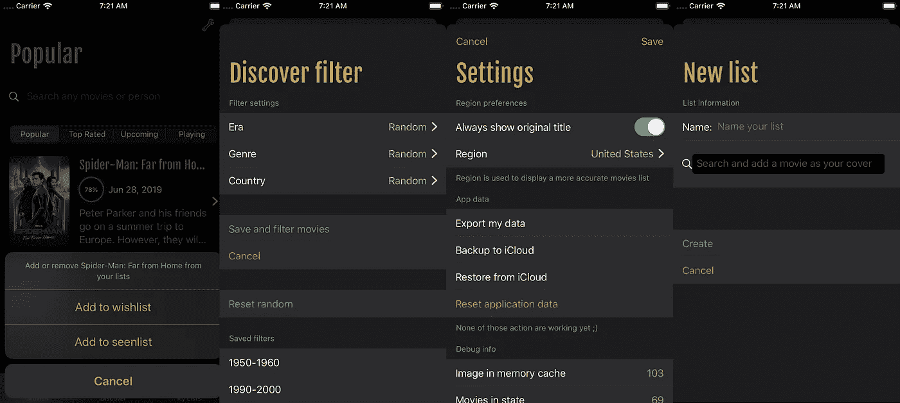
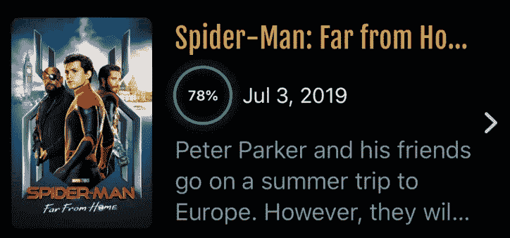
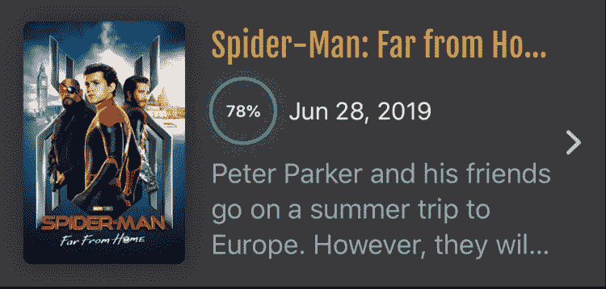
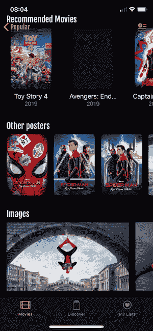

# 使用 SwiftUI 制作真实世界的应用程序

> 原文：<https://betterprogramming.pub/making-a-real-world-application-with-swiftui-3b643ddfae22>

## 第三部分:导航和演示

应用程序导航示例

本文是关于制作 SwiftUI 应用程序的系列文章的第三部分。我建议你先读第一部分和第二部分；他们将向您概述应用程序、其功能、特性和架构。

 [## 使用 SwiftUI 制作真实世界的应用程序

### 第一部分:数据流和冗余

medium.com](https://medium.com/better-programming/making-a-real-world-application-with-swiftui-cb40884c1056)  [## 使用 SwiftUI 制作真实世界的应用程序

### 第二部分:异步数据和远程映像

medium.com](https://medium.com/@dimillian/making-a-real-world-application-with-swiftui-ba9e9682889c) 

在本文中，我们将看到**导航**和**呈现**流如何在 SwiftUI **中工作。**在当前 UIKit 模型发展了近十年之后，这已经成为一股新鲜空气，并且在概念上很难理解。最后，很简单，你只需要放弃任何 UIKit 命令式导航的概念。

你需要丢掉的第一个概念是，每一个新的全功能视图都应该是模态的或者被推到堆栈上。这一点很重要，因为 SwiftUI 比 UIKit 灵活得多，只需几行代码，您就可以在当前视图的顶部(或底部)附加一个完整的视图层次结构。

不需要`addChildViewController`、`addSubview`，或者添加约束等。这就是为什么 UIKit 经常让在`UINavigationController`堆栈上呈现一个模态或者推出一个新的控制器比实际尝试让它与你当前的视图层次一起工作要简单得多。我不是在说`containedViewController` ，这是一个很好的模式，也是一个组成大`UIViewController.`的完美方式

# 导航和演示的一点介绍

## 航行

`NavigationView`相当于`**UINavigationController**`，在这个时间点上，它仍然有一个支持，但绝对不能保证几个月或几年后仍然如此。您不应该真正关心底层的实现。在 SwiftUI **，**中，你需要把一切都看成一个契约。导航流程向您保证，无论它在什么平台上可用，它都能够将视图堆叠在另一个视图之上，并带有后退按钮和标题。

例如在 macOS 和 iPadOS 上，一个`NavigationView`支持两个视图作为它的根。渲染时，它会自动转换为带有主/细节图案的`UI/NS/SplitViewController`。您可以检查视图层次结构，并从 Xcode 中亲自查看。

这种抽象级别意味着苹果负责使 SwiftUI 原始组件工作，无论它们在什么平台上可用。他们可以随时交换实现，同时保持组件顶层 API 不变。

但是让我们回到我们的`NavigationView` **。**

 [## 导航视图

### 一种视图，用于呈现一堆视图，这些视图表示导航层次结构中的可见路径。

developer.apple.com](https://developer.apple.com/documentation/swiftui/navigationview) 

如果你当前的视图——或者整个——应用程序被打包到一个`NavigationView`中，你可以在任何你想去的地方使用`NavigationLink`。

它需要目的地视图和主体。主体是显示在链接内容中的内容(可以是任何与视图相关的内容)，目的地是当你点击按钮时在堆栈上显示的视图。

您的`NavigationLink`内容内部的整个视图将是交互式的。在列表的情况下，如果您将`NavigationLink`作为一行包含在视图中，您将得到一个带有活动/悬停状态的漂亮的细节指示器。

导航链接示例

还有`[DynamicDestinationLink](https://developer.apple.com/documentation/swiftui/dynamicnavigationdestinationlink)`，以防您直到稍后在视图主视图中才知道哪些数据将被传递到您的详细视图。这样，您就可以动态地设置您的 DetailView 并随意更改绑定数据。我真的没有机会在我的应用程序中使用它，但这里有一个非常好的教程。

 [## 使用动态导航定位链接

### 编辑描述

igorcferreira.dev](https://igorcferreira.dev/swiftui/2019/06/28/dynamicnavigationdestionationlink/) 

还有一点，这里还有一个教程。如果您想以编程方式推送一个视图，您可以使用`NavigationDestinationLink`——例如，如果您想做一个路由器，这很有用。

 [## 如何在 SwiftUI 中用 NavigationDestinationLink | Ryan 以编程方式推送和弹出视图…

### 如果您不需要以编程方式关闭模式或导航，链接视图是很好的选择。的…

ryanashcraft.me](https://ryanashcraft.me/swiftui-programmatic-navigation/) 

## 介绍会；展示会

呈现是指所有有模式地呈现的东西，它可以是一个视图层次结构(可以与 UIKit `presentViewController`进行比较)，也可以是`Alert`、`ActionSheet`、**、**等等

与**导航**不同，由于 SwiftUI 是声明性的，您必须管理您所呈现视图的**呈现**状态。非常无缝；你创建一个`@State var isSomethingPresented` *:* `Bool` 属性，在`.sheet(), .actionSheet(), etc..` 函数中，你可以把它作为绑定来传递。所以你可以控制你的工作表(你可以把它比作一个模态的全视图控制器)或者你的动作表是否应该被显示。

然后你只需要在你喜欢的地方切换它，例如，当用户触摸应该呈现模式/表单或动作表单**、**的按钮时。

在上面的代码中，您可以看到两个演示示例。一个是动作表，绑定到它的表示，另一个是全屏幕表/模态视图的表示。然后，如果你看一下`onAddButton()`函数，它切换一个布尔值，我的动作表将被有效地呈现。您需要做完全相同的事情来呈现模态。这就是你所需要的。

不要忘了切换`ActionSheet`按钮中的布尔值来关闭它。

在作为任何演示调用的一部分呈现的视图中，您可以访问一个环境变量来访问它的`isPresented`状态。

它是由 SwiftUI 公开的——**你也可以切换——在不转发任何回调的情况下关闭你的模态。**

**关于`Environment`，我邀请你跟随这个关于使用控件的[苹果教程](https://developer.apple.com/tutorials/swiftui/working-with-ui-controls)。它将揭示一些关于编辑状态环境变量的信息，这是非常强大的。**

**SwiftUI 公开了各种各样的`Environment`属性。你可以用他们的`keypath`访问他们中的任何一个。目前，你可以看看这个[文档](https://developer.apple.com/documentation/swiftui/environment)；它们还没有全部被引用。最好的来源仍然是在`SwiftUI`原型中寻找它们。**

# **其他演示和过渡方法**

**正如我在上面所说的，您不一定需要使用导航或显示模式来切换或显示视图。**

**为了说明我的观点，下面是我如何在电影细节屏幕中呈现我的旋转木马。**

****

**只要你一触摸电影备用海报，它就会切换。**

**现在我们来看看代码。**

**MovieDetail 视图摘录。**

**以上是我`MovieDetail`的一部分看法。呈现效果分两部分完成，由`@State var SelectedPoster`属性控制。一旦它被设置并且不为零，`List`将会变得模糊。然后`ImageCarouselView`会出现在屏幕中间。**

**`ImageCarouselView`是一个填充屏幕边界的 ZStack，它嵌入了一个`ScrollView`作为它的中心。仅此而已。**

**我可以把它添加到我的列表中，因为我的视图有一个 ZStack 作为它的根。因此您可以堆叠任意数量视图。你甚至可以使用`zindex()`修改器来玩层次。**

**最重要的是，在 SwiftUI 中，我得到了这个漂亮的淡入和淡出模糊效果，因为我已经在我的`List`上添加了动画修改器。作为一个整体，你感觉旋转木马就像是“呈现”在屏幕上，但这只是两个简单的效果同时切换。**

**你可以在`[MovieSwiftUI](https://github.com/Dimillian/MovieSwiftUI/blob/master/MovieSwift/MovieSwift/views/shared/images/ImagesCarouselView.swift)` [仓库这里](https://github.com/Dimillian/MovieSwiftUI/blob/master/MovieSwift/MovieSwift/views/shared/images/ImagesCarouselView.swift)查看`ImagesCarouselView`的代码。**

**在 UIKit 世界中，呈现一个全屏`UIViewController`然后实现一个自定义过渡，或者放一个`UIVisualEffectView`作为背景视图来获得模糊效果，这本来会更简单。然后将演示上下文设置为当前上下文……嗯，你知道该怎么做。**

**请注意，当视图出现和消失时，您也可以使用过渡修改器自定义过渡动画，但这将在另一篇文章中介绍。我主要用它来转换屏幕上和屏幕外的小视图。但是你可以跟着这个[苹果教程](https://developer.apple.com/tutorials/swiftui/animating-views-and-transitions)开始玩！**

**希望这篇文章对你有用，一如既往，我在这里回答任何问题。**

**请继续关注第四部分:动画和手势！**