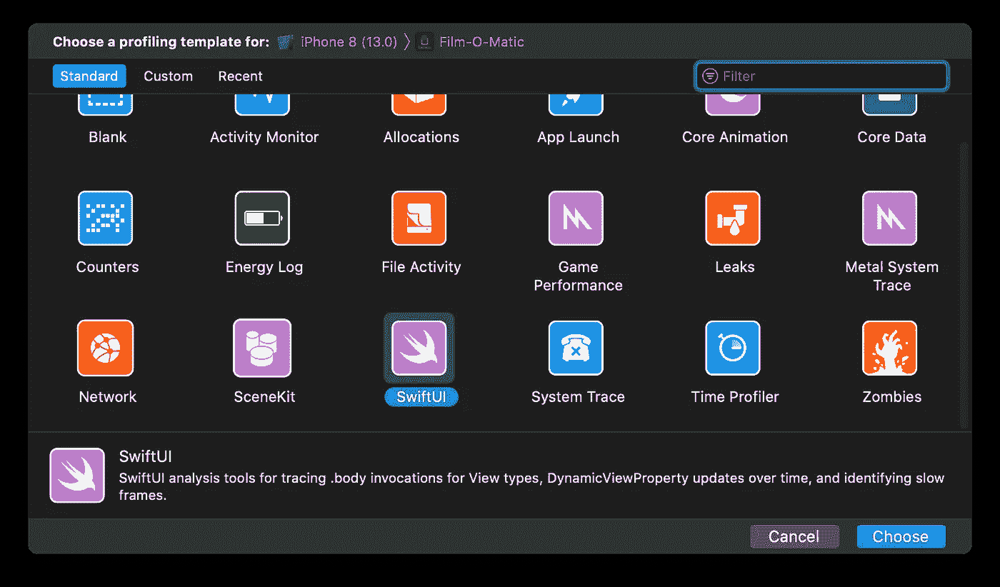
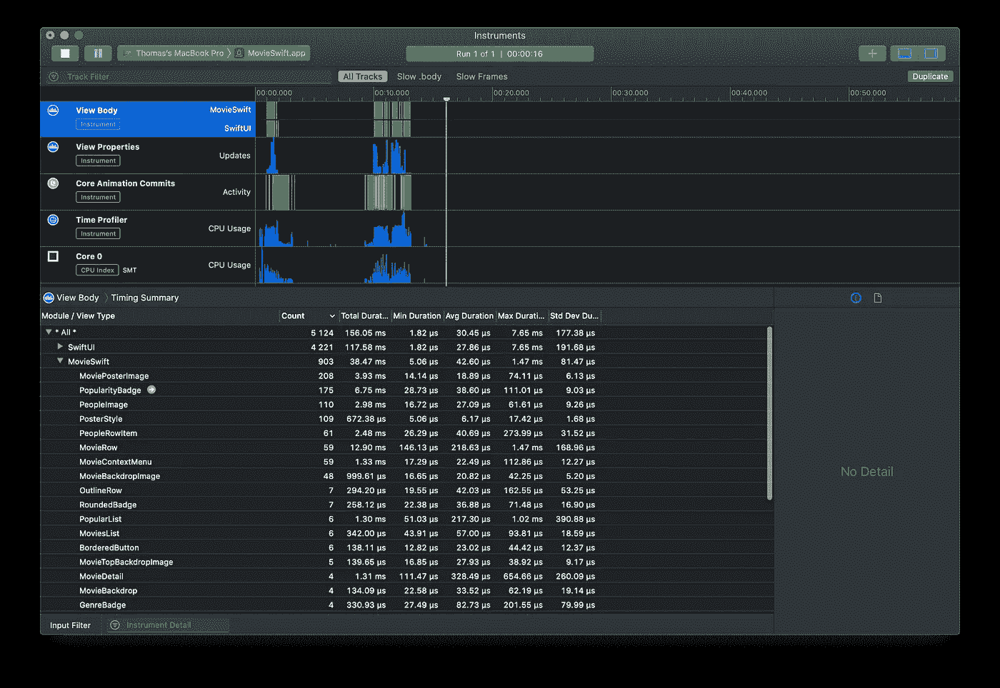
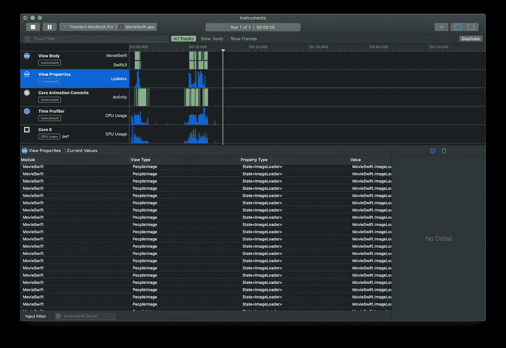
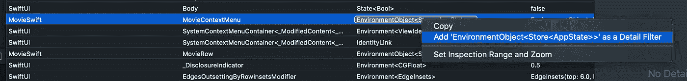
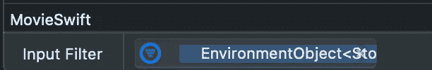
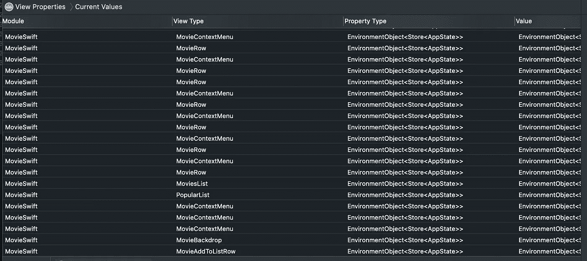
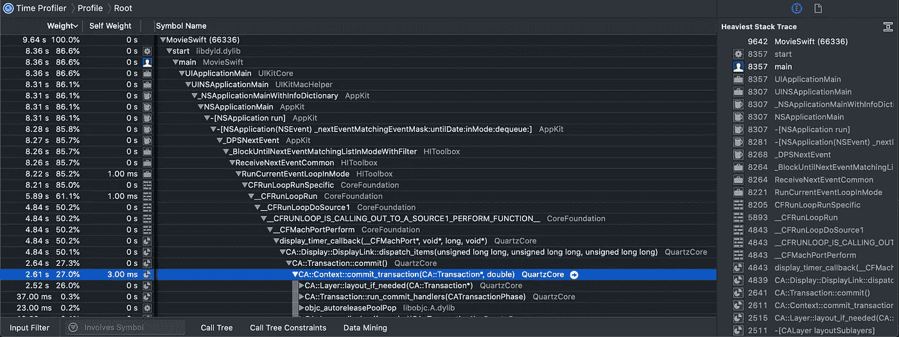
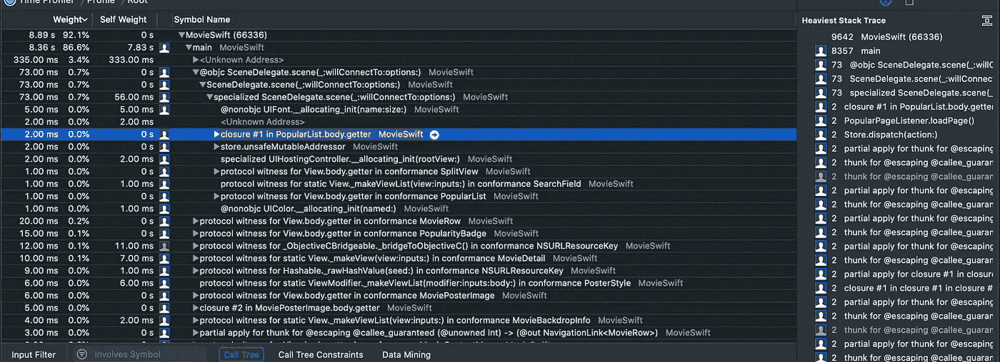
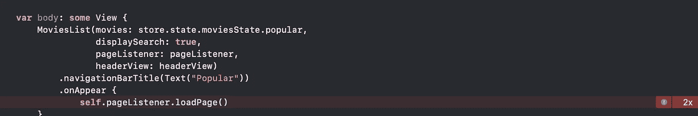

# 使用 SwiftUI 制作真实世界的应用程序

> 原文：<https://betterprogramming.pub/making-a-real-world-application-with-swiftui-54e71d9e6042>

## 第五部分:提示和技巧，剖析，以及我所学到的

苹果的 SwiftUI 标志

我想在过去几周的空闲时间里，用这篇文章作为对用 [SwiftUI](https://developer.apple.com/xcode/swiftui/) 编程的一种回顾。这是一个很好的机会来写下并让你知道我对 SwiftUI 的想法，并分享我在这里和那里写的小代码片段，以使一切都能一起工作。

[应用](https://github.com/Dimillian/MovieSwiftUI)远未完成。我想在 9 月份与 iOS 13 一起在 App Store 上发布——如果 SwiftUI 同时退出测试的话。我还有很多功能需要改进，还有一些 UI 需要改进。但是主 SwiftUI 工作了，演示方面大部分完成了。

我对社区感激不尽。我现在有将近 2800 颗恒星在资料库里。我从没想过它会长那么大。这更激励我制作 SwiftUI 代码并与大家分享，并向应用程序添加功能，使其成为一个真正的产品，并成为一个漂亮的 SwiftUI 演示。

我已经添加了自定义动画(手势)。我广泛使用了导航和演示系统。我使用表单组件创建了一些表单。我使用 Redux 作为定制架构。我获取异步数据并加载远程图像。我认为该应用程序覆盖了 SwiftUI 现有组件的 90%,满足了一般开发人员制作真实应用程序的需求。

现在让我们来看看这个应用程序中我最纠结的几个部分。然后，我们将深入剖析和优化您的 SwiftUI 代码。在本文的最后一部分，我将比较 SwiftUI 和 UIKit。

# 页码

我经常听到这样的问题:如何在我的`List`上分页？这是一种相当粗糙的方法，但是，到目前为止，我不知道更好的方法。

做好准备——你会大吃一惊的。

如果您在[存储库](https://github.com/Dimillian/MovieSwiftUI)上查看`MoviesList.swift`，您可能会看到类似这样的内容:

是的，没错，我在我的行后面添加了一个不可见的`[Rectangle](https://developer.apple.com/documentation/swiftui/rectangle)`。向下滚动时，会触发`onAppear`。从那里，它触发所需的任何逻辑，将下一页追加到数据源。

在我使用 Redux 架构的情况下，我分派了一个动作来获取下一个页面，并将其添加到我的 reducer 中的 datasource。当我的`MoviesList`连接到我的商店时，它会优雅地添加行，用户将能够继续下一页。

我想花时间研究一种更好的方法来使用`[GeometryReader](https://developer.apple.com/documentation/swiftui/geometryreader)`

额外的好处是在到达`List`的末尾之前触发下一页的获取。现在，您必须让最底部的不可见视图出现，以便触发获取。而且，有点太晚了。

# 实时搜索

我很早就着手解决的事情之一就是搜索。我在 live search 上做了很多努力，因为我需要读取作为绑定传递给`TextField`的值。现在，你不能在`@State`属性上使用`didSet`。因此，我对传递的值进行了包装，以便在更新时读取文本值。它可以这样使用:

现在，我们来看看`SearchTextWrapper` `[BindableObject](https://developer.apple.com/documentation/swiftui/bindableobject)`类。

如果你看上面的代码，你会看到我在内部使用了一个`[PassthroughSubject](https://developer.apple.com/documentation/combine/passthroughsubject)`，并在我的类的`init`中订阅了它的发布者。所以当 my `searchText`发布它的`newValue`时，它在`TextField`中接收它作为用户类型。然后，使用 Combine 操作符，我首先去抖，然后删除重复项，最后过滤任何空字符串。一旦我在`.sink`操作符中收到值，我就可以分派一个函数调用。

在这里，我叫`onUpdateTextDebounced()`。我还在设置值时立即调用了一个`onUpdateText()`，因此该类也提供了一个实时回调。

有了基类，就很好用了。让我们看看我是如何在应用程序的主搜索中使用它的。

我在文本更新时获取关键字，没有任何抖动。这是一个非常轻量级的`[String]`调用和响应，您可以将其视为自动完成助手。然后，当用户停止输入至少 500 毫秒后，我会发送电影和人物搜索。

让我们来看看它的实际应用:

# 分析和优化

我在仪器上花费的时间比我预期的多得多，一方面是因为我想看看我所做的是否足够有效，另一方面是因为这是一个很好的了解 SwiftUI 内部工作的方式。

您可以看到系统调用堆栈，并了解视图体是如何以及何时被渲染或重新渲染的，例如，`@State`或`@ObjectBinding`发生了变化。

苹果专门为 SwiftUI 引入了一个新的工具模板

如果您点击它，然后点击记录按钮，您的应用程序将启动，您将开始有一些数据。

第一部分将向您展示在这段时间内创建了多少个视图，更重要的是，创建它们花费了多长时间。

SwiftUI 看起来很有趣，但你应该更多地关注你自己的视图类型，因为如果有瓶颈，那也是在你自己的视图结构中。我的建议是按照总时长对它们进行排序。在列表视图的顶部，您会看到哪些创建时间最长(或者刷新/渲染时间最长)。如果您看到总持续时间与计数相比异常地高，那么您应该开始查看这个视图的主体，看看是什么占用了时间。

数据的第二部分是关于属性更新的。你的观点所依赖的都是`@State`、`BindableObject`等等。它将显示哪个视图类型与哪个属性类型相关联。它会随着您的属性的更新而更新。

尝试在应用程序中显示您的一个视图。您将看到仪器中的属性得到更新。如果您看到对一个属性的调用太多，或者更新太多，深入探究原因是一个好的开始。

您可以添加过滤器来过滤特定的视图类型、属性类型等。

上面，我在过滤我的`EnvironmentObject`，这是我的整个 Redux `AppState`。

我从那里优化了很多东西。我把我的观点束缚得太紧了。因此，在某些视图中，我已经删除了对`@EnvironmentObject **var** store: Store<AppState>`的引用，直接将最终对象作为构造函数参数传递，而不仅仅是对象 id。

在这种情况下，这是可以的，因为这个视图不需要获得后来传递的对象的更新引用。所以，如果我在我的 AppState 中更新一些东西，它不会触发更新。

第三段数据是关于 CoreAnimation 的，我还没有深入挖掘，所以我不能告诉你任何关于它的事情。

最有趣的部分是大家熟悉的时间分析器部分。它在任何其他乐器模板中都能正常工作。

你可以很容易地在你的应用中看到在主线程上花费太多时间执行的代码。根据权重对行进行排序，然后在您的调用堆栈中挖掘。您可以过滤掉系统库，只调试您自己的函数调用。

在这里，我展示了当我在 macOS 上滚动我的电影列表时，有太多的重新渲染。这是文本组件的一个 bug，我已经向苹果公司报告了。

通过查看调用堆栈，双击该行就可以转到代码。仪器甚至会向您显示罪魁祸首行。

我不会在这里打扰，因为这是一个两毫秒的事情。

我希望这将有助于你用 SwiftUI 使用仪器。这是一个相当短的介绍，但如果你熟悉乐器，开始分析你的 SwiftUI 应用程序只是一个很少的新事物的问题。

# 与 UIKit 相比

这对 UIKit 意味着什么？我应该停止用 UIKit 编写我的应用程序吗？比 UIKit 好吗？比 UIKit 快吗？

所有这些问题的答案都是视情况而定。您的应用程序需要实现什么？你的目标是什么？只支持 iOS 13 和 macOS 10.15 就足够好了吗？

SwiftUI 肯定更快。一旦你开始精通，它比 UIKit 迭代起来要快得多。但是我再怎么强调这一点也不为过——达到熟练需要时间。如果你做了一些反应，或者使用了一些其他的声明性框架，它一点也不会感到陌生。但是如果你所做的只是命令式编程，那么在编写 UI 代码时，你需要改变你的整个思路。

但是为什么用 SwiftUI 构建应用程序实际上更快呢？我们来看一个具体的例子。

在 UIKit 中，假设我们制作了一个`UITableView`，它显示电影列表。然后，稍后，我们决定在一些单元格中添加一些电影的水平交叉线，同时在其他一些行中保持每个单元格一部电影。

所以，我们创建一个`MovieCrosslineTableViewCell`，然后在里面放一个带有`UICollectionViewFlowLayout`的`UICollectionView`。我们将它的`delegate`和`datasource`连接到我们的单元并实现它们。我们还需要创建一个`MovieCollectionViewReusableCell`。

现在，几天后，你意识到这是一个垃圾 UX，所以你想重构它完全是别的东西。也许是一个纯粹的`UITableView`，也许是一个纯粹的`UICollectionView`，或者也许是一个里面有一些自定义视图的`UIViewPager`。

所以你写的所有布局和意大利面代码现在大部分都没用了，你需要重新开始。当然，也许你很聪明，你写了漂亮的、可重用的组件。嗯，你仍然有很多代码需要修改，因为你很多组件都与`UITableViewCell`或`UICollectionViewCell`实现相关联。

在 SwiftUI 中，上面所有的布局都需要大约十行代码，你可以随意试验和重构/预览它。

它看起来像一个`List`，里面有一些`MovieRow`，还有一些`ScrollView`，包裹着一个`HStack`，显示着一个`MovieRow`的`ForEach`。你想用标题显示吗？你只要把你的`List`包在`VStack`里，然后加上你的`HeaderView`，再加上你的`List`。

您可以将其全部包装在 NavigationView 中，也可以不包装。只需要添加或删除一行。如果您想在顶行添加一个`SegmentedControl`，只需`List { SegmentedControl() }`即可。

[我这里还有一个例子。](https://twitter.com/Dimillian/status/1152906349069709312?s=20)

我无法告诉你我在 MovieSwiftUI 中重构了多少次用户界面。我做了很多实验。使用 UIKit，我可能会使用其他工具来完成。

我真的希望这个例子能和我一样引起你的共鸣，我在 UIKit 有将近十年的包袱。

不管你喜不喜欢，SwiftUI 是苹果的未来。这将是一个统一的 UI 框架，在未来几年我们会越来越多地使用它。

当然，它还没有准备好投入生产，而且实际上，它与 UIKit 弃用或类似的事情没有任何关系。在这次 WWDC 上，苹果在 UIKit 中添加了令人敬畏的 API，SwiftUI 由许多 UIKit 组件支持。

苹果已经使得在 SwiftUI 应用中导入和使用任何 UIKit 组件变得非常容易。我们将在未来几年利用这一点，因为 SwiftUI 仍然缺乏相当多的原生高阶组件。

至于我个人的看法，我迫不及待地想在我的商业 UIKit 应用程序中发布 SwiftUI 中的一些 iOS 13 专用功能，在未来几年中，我仍然需要支持 iOS 10，然后是 11 和 12。

希望这篇作品能让你对 SwiftUI **更加炒作。**感谢阅读！