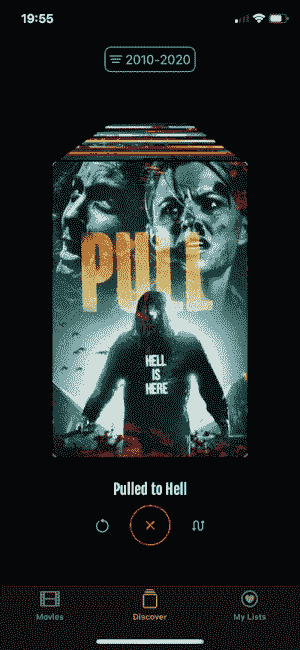
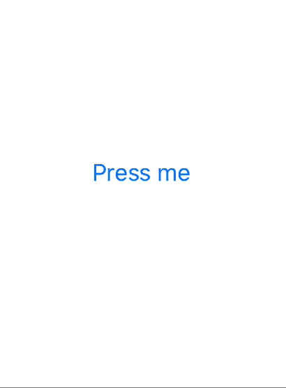

# 使用 SwiftUI 制作真实世界的应用程序

> 原文：<https://betterprogramming.pub/making-a-real-world-application-with-swiftui-63a198fc23c9>

## 第四部分:动画、过渡和手势

这个故事是关于制作一个真实世界的 SwiftUI 应用程序的系列文章的第四部分。我建议您先阅读第一、第二和第三部分——它们将为您提供应用程序、其功能、特性和架构的概述。

 [## 使用 SwiftUI 制作真实世界的应用程序

### 第一部分:数据流和冗余

medium.com](https://medium.com/better-programming/making-a-real-world-application-with-swiftui-cb40884c1056)  [## 使用 SwiftUI 制作真实世界的应用程序

### 第二部分:异步数据和远程映像

medium.com](https://medium.com/better-programming/making-a-real-world-application-with-swiftui-ba9e9682889c)  [## 使用 SwiftUI 制作真实世界的应用程序

### 第三部分:导航和演示

medium.com](https://medium.com/@dimillian/making-a-real-world-application-with-swiftui-3b643ddfae22) 

在本文中，我们将看看动画和手势在 **SwiftUI** 中是如何工作的。

[MovieSwiftUI](https://github.com/Dimillian/MovieSwiftUI) 在熟悉的 UX 中结合了多种手势和动画。我将使用它的电影发现功能，并带您了解它的内部工作原理。

# 动画片

但首先让我给你介绍一下 **SwiftUI** 中的动画概念。

`.animation()`修改器可以添加到任何`View`中，在任何之前的修改器之后。

例如，在上面的代码中，我们有一个按钮，您可以打开和关闭它。因为我们在视图上添加了一个.`spring()`动画，所以`.scaleEffect()`修改器将被动画化。当你点击按钮时，它触发它的动作，这将更新`isOn`属性。

还有另一种方法——记住这一点很重要，因为在某些情况下，您可能只想制作一个状态变化的动画，而不想制作其他状态变化的动画。我们可以提供完全相同的效果，但方式稍有不同:

在`withAnimation()`块中包装`@State`属性突变使用提供的动画更新视图。通过这种方式，我可以拥有其他对视图有影响的`@State`属性，并且在不激活视图的情况下改变它们。

您还可以将动画放在属性中并重复使用，这在动画具有自定义参数时非常有用。

# 过渡

还有另一个你可以与动画结合的特性——过渡。如果您想要在屏幕上和屏幕外转换视图，可以使用这些选项。让我们稍微修改一下我们的按钮，这样当你按下它的时候就会出现一个视图:

现在让我们看一下代码:

我们只在状态为 on 时显示`Text`视图“我在这里”,并添加我们的`transition`作为修饰符。现在，当我们按下按钮并更新状态时，它会在视图层次结构中添加或删除视图时自动管理转换，并将其与我们的动画相结合。很神奇，不是吗？

现在我们已经看到了基础，让我们再深入一点，看看一个更复杂的例子——上面 gif 中的例子。

# 结合手势和动画

首先，我们将向海报添加一个拖动手势，使其可拖动。为了让初次接触有冲击力，我们将结合一个非常短的长按手势。用户首先必须按下海报，然后他将能够拖动它。

这个手势可以在我们还体之前定义。所以我们首先初始化我们的`LongPressGesture`和`DragGesture`，并通过使用。`sequenced`功能我们要确保在`dragGesture`开始之前`longPressGesture`必须被识别。

你可以看一下 Apple 的文档来编写手势——我的实现只是他们例子的一个发展。他们会比我更好地解释它是如何工作的。

 [## 编写 SwiftUI 手势| Apple 开发者文档

### 当您同时组合手势修饰符时，SwiftUI 必须同时识别所有子手势模式，以便…

developer.apple.com](https://developer.apple.com/documentation/swiftui/gestures/composing_swiftui_gestures) 

我们还引用了一个`dragState`属性。让我们看看它是如何定义的，因为这是一个重要的部分。这是您稍后将在视图修改器中使用的属性，实际上是在手势旁边设置动画。

所发生的是，我们使用`.updating()`回调绑定我们的`dragState`属性，并将其设置为所需的值，这样存储在我们视图中的本地状态将反映我们手势的组合和当前状态。

`.updating()`功能会向您转发两个手势。`.first(true)`情况是当长按手势被验证时，而`.second`情况让我们在`DragGesture`被更新时获得关于它的信息——即当用户在屏幕上拖动附加的视图时。当手势被取消或者当用户完成与我们的视图的交互时，默认情况下，状态被重置为非活动。

我们的`dragState`将存储当前的拖动手势转换以及预测的结束位置。

现在，让我们看看如何将它与我们的视图协调起来:

正如您在上面的代码中看到的，一旦手势就位，这只是根据手势状态更新视图中的修饰符的问题。现在最有趣的部分是玩`computeOffset()`和`computeAngle()`功能，如果你想增加一些阻力的话。

这是来自 **MovieSwiftUI** discover 功能的一个小而简化的摘录，但它完全可以工作，并将从手势开始。你可以在这里看到[全部功能的代码](https://github.com/Dimillian/MovieSwiftUI/tree/master/MovieSwift/MovieSwift/views/components/discover)。它包括带有缩放效果的堆叠海报，还将向您展示如何检测手势的结束状态。如果用户取消了它，或者如果在左边或右边有足够的速度来触发一个动作。

如果我包括这个特性的所有流程和代码，这篇文章就太长了，这就是为什么我只使用了一个简化的例子。

在 **SwiftUI 中，你可以用动画、过渡和手势做许多其他事情。在我看来，简单的声明式 API 允许我们更快地迭代，并且很容易调整、改变和更新我们的动画和手势。要在 **UIKit** 中实现同样的功能，我可能要花很多时间和更多代码。**

我在这本集子里还计划了一些文章，但是它们会晚一点来。随着苹果在 swift ui API 中增加稳定性，它主要是关于如何在相同的目标中提供一个漂亮的 macOS UX。目前， **SwiftUI** 还不能在共享的 iOS/macOS 目标上编译(从 beta 3 开始)。

感谢阅读！