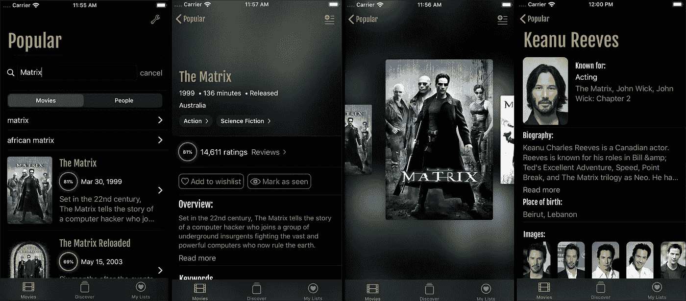

# 使用 SwiftUI 制作真实世界的应用程序

> 原文：<https://betterprogramming.pub/making-a-real-world-application-with-swiftui-ba9e9682889c>

## 第二部分:异步数据和远程映像

黑客帝国，更多的黑客帝国，黑客帝国海报，还有黑客帝国的家伙，实际上是疾速追杀扮演的山谬·里维

这是我的关于仅使用 SwiftUI 制作真实应用程序的系列文章的第二部分。第 1 部分是对数据流和 Redux 的介绍，以及对应用程序的概述——如果你想完全理解这篇文章，这是一篇重要的阅读材料。

这篇文章详细介绍了如何从 API 获取数据，并在 SwiftUI 中显示远程图像。

由于 [MovieSwiftUI](https://github.com/Dimillian/MovieSwiftUI) 依赖于 [TMDb API](https://developers.themoviedb.org/3) 来显示关于电影的信息，因此获取远程数据是一个关键点。而用户的自定义电影列表、愿望列表和在线列表、设置等。在本地处理和保存，其他信息则远程获取。

# 异步数据

由于我使用的是 Redux 模式，所以这一部分没有太多关于 SwiftUI 的内容。提取的数据基本上减少到我的应用程序状态，然后状态被发布，因此视图用新数据更新。但是这到底是怎么回事呢？让我们来看看。

我制作了一个非常简单的 APIService 类，它使用 [URLSession](https://developer.apple.com/documentation/foundation/urlsession) 来发出请求。我的所有模型都符合 [Codable](https://developer.apple.com/documentation/foundation/archives_and_serialization/encoding_and_decoding_custom_types) ，并且几乎是来自 TMDb API 的模型的一对一表示。这样我就不需要定制的解码器或者视图的瞬态模型。在应用程序中有几个地方我使用了纯视图模型，但是在大多数情况下，响应在应用程序状态中由 reducers 以一种逻辑方式(如果您愿意，可以像内存中的数据库一样)序列化。

从我的非常基本的 HTTP 客户端提取，MovieSwiftUI 存储库上的全部代码。

然后我有一个 AsyncAction，它是 Redux 动作，您可以像往常一样调度，但是它们没有被 reducer 减少(例如，它们可以提供加载状态)，而是由中间件执行，以触发它们在 execute()函数中实现的请求。一旦请求完成，它们就链接另一个动作，根据响应中包含的数据更新状态。

行动:

中间件由我的 [SwiftUIFlux](https://github.com/Dimillian/SwiftUIFlux) Swift 包提供。调度时从 AsyncAction 中触发 execute 函数。

最后，reducer 将电影添加到状态电影属性中。

那么景色怎么样呢？让我们来看看我的电影细节:

我使用 environment object-accessible 检索我的存储，因为它是在我的应用程序的根视图中注入的。然后，当。视图的 onAppear()被触发( [Chris Eidhof](https://medium.com/u/285040680274?source=post_page-----ba9e9682889c--------------------------------) 有另一个[方法](https://gist.github.com/chriseidhof/e56128e4421ab59504153fb5f575fd0b)，当 SwiftUI 订阅他的 ObservableObject 时，他触发资源加载)。因为我将属性从我的状态映射到视图计算属性，所以由 AsyncAction 更新的电影对象中的任何内容都将在我的 MovieDetail 视图及其各种组件中更新。

我希望这一部分清楚地概述了我是如何进行 API 调用和将远程数据加载到 SwiftUI 应用程序中的。现在，我们将更深入地研究 SwiftUI，使用 Apple 提供的图像组件，以及如何使其与远程图像无缝协作。

# 远程图像

苹果公司的[图像](https://developer.apple.com/documentation/swiftui/image)组件非常好——它支持一系列的输入格式，如数据、UIImage 和 [SF 符号](https://developer.apple.com/design/human-interface-guidelines/sf-symbols/overview/)。但是，它不支持 URL 为的 init(还没有？我已经向苹果提供了反馈，希望它能在 9 月发布前或未来发布时添加进来。)

要显示从远程位置获取的图像，就像 UIImageView 一样，您需要创建自己的系统。由于 ObservableObject 和@ObservedObject 属性包装器，这变得很容易。

类似于网络调用，我做了一个 ImageService。(与本帖不太相关，所以[下面不包含代码](https://github.com/Dimillian/MovieSwiftUI/blob/master/MovieSwift/MovieSwift/services/ImageService.swift))。这是一个基本的管理器，它从 URL 异步下载数据，并使用 Combine 框架将其发布给任何订阅者。

有趣的部分是它如何与 SwiftUI 集成。为此，我创建了一个符合 ObservableObject 协议的 ImageLoader 类，这样 SwiftUI 就可以得到任何@Published 属性更改的通知。

你用一个路径，一个大小来实例化它，它将调用 ImageService 从互联网上获取图像。然后，它将在 ImageLoader image (UIImage)属性上本地设置它，这将向订阅它的任何人发布它的更改。又能订阅什么呢？一个观点！

上面我也有一个 ImageLoaderCache，它将缓存我的 ImageLoader 实例，因为它们可能被销毁，因为没有被任何 SwiftUI 重载视图体引用。它还避免多次下载相同的图像，并允许重复使用。

下面是一个视图的具体实现，您可以在任何 SwiftUI 应用程序中直接使用它。它使用 ImageLoader，image loader 使用 ImageService 显示图像。它甚至提供了一个占位符，一旦图像加载了基本的淡入动画，就可以平滑地替换它。

下面是一个列表中的例子，图像被顺利下载并显示为行出现。

它触发图像加载器。loadImage()调用。SwiftUI 框架中的 onAppear()函数。

需要注意的是，只有 List 组件的行为类似于 UITableView。这意味着当您滚动时，列表中的视图会入队和出列/重用。所以。onAppear()只会在视图实际出现在屏幕上时被调用(当你滚动时)。这正是我们想要的行为。

对于任何其他组件(如 HStack、VStack、ScrollView ),只要显示了父视图，所有视图都将出现在屏幕上。即使您必须滚动到内容的深处，正文也会被加载。onAppear()将被调用。一旦父视图出现在屏幕上，它将开始加载您的所有图像。更糟糕的是，在 ScrollView 案例中。onAppear()调用顺序将从层次结构中最远的视图调用到第一个视图。换句话说，视图底部或尾部的图像将首先加载。

Xcode Beta 3 还没有解决办法，但我希望苹果会对它做出一些改变。也许我们会得到与 ScrollView 中的 List 相同的行为，或者也许我们会得到一种 HList/VList 或 aGrid 组件，它将在它的主体中对视图进行排队和重用。或者他们会打电话给。onAppear()的正确顺序。

我希望你对这篇文章感兴趣，如果你有任何问题或反馈，我就在这里。

 [## 使用 SwiftUI 制作真实世界的应用程序

### 第三部分:导航和演示

medium.com](https://medium.com/@dimillian/making-a-real-world-application-with-swiftui-3b643ddfae22)