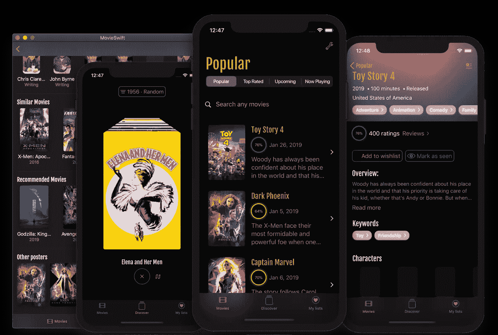
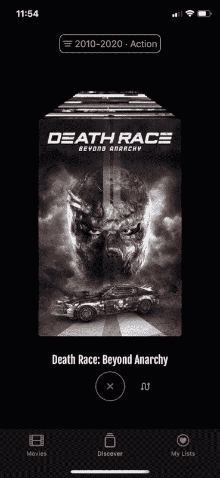
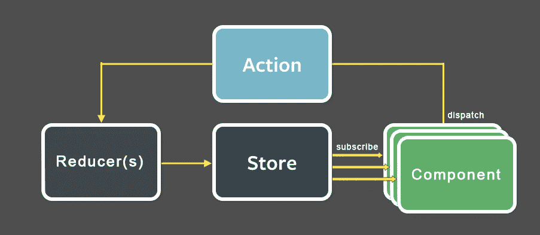

# 使用 SwiftUI 制作真实世界的应用程序

> 原文：<https://betterprogramming.pub/making-a-real-world-application-with-swiftui-cb40884c1056>

## 第一部分:数据流和冗余

自从 2019 年 WWDC 的国情咨文会议以来，我一直专注于 [SwiftUI](https://developer.apple.com/xcode/swiftui/) 。我几乎把所有的业余时间都用来玩了。现在，我决定做一个真实世界的应用程序。

但是什么定义了真实世界的应用程序呢？

好吧，让我深入研究一下我专门用 SwiftUI 开发的一个开源应用程序的细节。这是[movieswiftui](https://github.com/Dimillian/MovieSwiftUI)——一个使用 [TMDB API](https://developers.themoviedb.org/3) ️.浏览、收集和发现电影的应用程序我一直很喜欢电影，很久以前我就围绕着电影做了一个公司。虽然效果不是很好，但是这个应用(一个围绕电影的社交网络)非常棒！

回到正题，MovieSwiftUI 技术上是做什么的？

*   它与 API 对话，这是目前大多数客户端应用程序所做的事情。
*   它按需加载异步数据，并使用 [Codable](https://developer.apple.com/documentation/foundation/archives_and_serialization/encoding_and_decoding_custom_types) 将 JSON 解析成 Swift 模型。
*   它显示按需下载的图像，并缓存它们。
*   这是一个单一目标 iOS、iPadOS 和 macOS 应用程序，具有条件 UI 实现，可在 iOS、iPadOS 和 macOS 上提供最佳 UX。将来可能会转移到特定的 macOS 目标。
*   用户可以生成数据并创建自己的电影列表。该应用程序将保存和恢复用户数据。
*   由于应用程序使用 Redux 模式的自定义实现，视图、组件和模型被清晰地分离。它是真实的单一来源，是整个应用程序状态的单向数据流。它可以完全缓存、恢复和倒带。
*   它使用基本的 SwiftUI 组件，TabbedView，SegmentedControl，NavigationView，Form，Modal 等。它还提供非常定制的视图，手势和 UI/UX。是的，它也是一个 SwiftUI 游乐场/演示，因为它是一个全功能的应用程序。

动画在现实中是流畅的，这只是一个低劣的 GIF 在这里:)

到目前为止，这是一次非常成功的经历。我已经能够编写一个全功能的应用程序，我将在 9 月份 iOS 13 发布时在 App Store 上发布。

## Redux、ObservableObject 和 EnvironmentObject

Redux 流程图来自[https://engineering . we work . com/reading-redux-easy-38d 2d 30d 6972](https://engineering.wework.com/reading-redux-easy-38d2d30d6972)

我已经和 [Redux](https://redux.js.org/) 合作两年了，所以我对这种模式相当熟悉。我们在所有的前端、我们的 [React](http://reactjs.org) 网站以及我们的原生 iOS (Swift)和 Android (Kotlin)应用程序上使用它。

对于 SwiftUI，选择 Redux 作为数据流架构是完全正确的。在 UIKit 应用程序中使用 Redux 时，一些最复杂的部分是如何订阅您的商店，以及如何从您的状态中导出和提取数据，并将它们映射到您的视图/组件属性。为此，我们必须构建一种连接器库(在 ReSwift 和 ReKotlin 之上)。它工作得很好，但是代码相当多。遗憾的是，还没有开源。

好消息。使用 SwiftUI，如果您想使用 Redux 模式，您唯一需要担心的是您的存储、状态和 reducers。由于`@[EnvironmentObject](https://developer.apple.com/documentation/swiftui/environmentobject)`属性包装器和我们的商店是`[ObservableObject](https://developer.apple.com/documentation/combine/observableobject)`，订阅部分完全由 SwiftUI 处理。

我做了一个简单的 Swift 包， [SwiftUIFlux](https://github.com/Dimillian/SwiftUIFlux) ，它提供了 Redux 的一个非常基本的实现。我用这个作为 MovieSwiftUI 的一部分。我还在[自述文件中添加了一个关于如何使用它的全面的逐步指南](https://github.com/Dimillian/SwiftUIFlux/blob/master/README.md)。

它是如何工作的？

我的 SwiftUIFlux 库中 Store.swift 的一个非常小的摘录。

每当你发出一个动作，你就会触发你的减速器。它会根据你当前的应用状态评估你的操作，并根据你的操作类型和数据返回新的修改状态。

因为`Store`是一个`[ObservableObject](https://developer.apple.com/documentation/combine/observableobject)`，并且`state`属性被包装在一个`[@Published](https://developer.apple.com/documentation/combine/published)`属性包装器中，所以只要设置了`state`属性，SwiftUI 就会得到通知。这是 Combine 框架中一个非常强大的助手。SwiftUI 将调用您的视图主体，并根据您状态的变化对其进行区分。从您的状态获得不同数据的视图部分将相应地重新呈现。

这就是 SwiftUI + Redux 的用心和神奇之处。现在，在任何订阅了 store.state 属性的视图中，视图将根据它从状态中获得的数据和更改的内容重新呈现。

一个 SwiftUI 应用程序的非常基本的例子，其中注入了 redux store。

当应用程序启动时，商店作为一个`EnvironmentObject`被注入，然后使用`@EnvironmentObject`属性包装器在任何视图中可用。如果从应用程序状态中快速提取或计算您的派生属性，不会对性能造成影响。

在上面的代码中，如果电影海报发生变化，图像也会相应地更新。

你的观点实际上与你的状态一致。您只编写了一行代码来连接它，还编写了一行代码来将属性提取/映射到视图属性。如果你在 iOS 上使用过[RES swift](https://github.com/ReSwift/ReSwift)，甚至在 React 上使用过@connect，你会很快明白 SwiftUI 为何如此神奇。

那么，如何触发一个动作并发布一个新的状态呢？让我们看一个更复杂的例子。

在上面的代码中，我对每个 API 使用 SwiftUI 中的`.onDelete`动作。它允许列表中的行显示要删除的标准 iOS 滑动。因此，当用户触摸删除按钮时，它会在我的状态上触发一个动作，并从列表中删除该电影。

由于列表属性是从状态中派生出来的，状态是一个`ObservableObject`并被注入为一个`EnvironmentObject`，SwiftUI 将更新列表，因为`[ForEach](https://developer.apple.com/documentation/swiftui/foreach)` 被绑定到了`movies` 计算属性。

这里是`MoviesState`的减速器的一部分:

如上所述，当您调度一个动作并返回一个新状态时，reducer 就会被执行。

我不会深究 SwiftUI 实际上是如何知道要呈现什么的，但是视图差异是在视图级别完成的。它比较了以前的版本和新版本。因此，它将保持非常高效，无论你的国家的大小！重要的是如何从状态和视图的复杂性中提取属性，而不是状态的大小。

我希望这篇文章能启发你如何用 SwiftUI 构建你的数据流。当然还有很多其他有效的架构，苹果提供了很多 SwiftUI 和 Combine 的工具。没有什么能像 Redux 那样强迫你将整个应用程序状态放入一个大结构中。这只是方法之一，在我看来，它在 SwiftUI 中很有意义。

我邀请您观看这个关于 SwiftUI 中数据流的宝贵的 [WWDC 会议](https://developer.apple.com/videos/play/wwdc2019/226/)。这是一个很好的解释，有助于理解为什么以及何时恰当地使用`@State`、`@Binding`、`@ObservedObject`和`EnvironmentObject` 。

如果您有任何问题或反馈，请告诉我。我很乐意回答他们，并相应地更新文章。

 [## 使用 SwiftUI 制作真实世界的应用程序

### 第二部分:异步数据和远程映像

medium.com](https://medium.com/@dimillian/making-a-real-world-application-with-swiftui-ba9e9682889c)