# 在 Spring Boot 轻松创建 RESTful API

> 原文：<https://betterprogramming.pub/making-a-restful-api-creation-easy-in-spring-boot-dc56c0ede725>

## 探索 Feign client 和其他有用的库

戈兰·艾沃斯在 [Unsplash](https://unsplash.com?utm_source=medium&utm_medium=referral) 上拍摄的照片。

您是否遇到过向几个不同的应用程序编程接口(API)发出 HTTP 请求的麻烦？将这些不同的 API 中您需要的东西组合成一个 API 不是更容易吗？

创建一个中间件可以解决这个问题。软件应用程序中间件允许我们拥有单一的定制数据源。拥有中间件的主要好处之一是它将许多不同的产品和服务连接在一个共享系统中。那么，到底什么是中间件呢？根据[微软 Azure](https://azure.microsoft.com/en-in/overview/what-is-middleware/) 的说法，中间件是一种软件，作为操作系统和其上运行的应用程序之间的隐藏翻译层。它为分布式应用程序提供数据管理和通信。

在这篇文章中，我将展示如何使用 [Spring Boot](https://spring.io/projects/spring-boot) 在一些依赖项的帮助下创建一个中间件，比如 [Feign client](https://github.com/OpenFeign/feign) 。Feign 是一个由网飞创建的声明性 web 服务，它为进行表述性状态转移(REST) API 调用提供了高度的抽象。同样，它消除了编写基本 HTTP 请求代码的需要，同时为源代码提供了效率和整洁。

为了简单起见，我们将调用一个名为 JSONPlaceholder 的用于测试和原型制作的伪在线 REST API 服务。参观 https://jsonplaceholder.typicode.com/的不同路线。在这个练习中，我将使用“todo”路线。

在本文结束时，读者应该理解什么是中间件，并知道何时以及如何使用它。同样，他们应该熟悉 Feign web 服务客户端。

如果您是 Spring 的新手，或者只是需要复习一下，请参考本文[中解释一些基本概念的文章](https://medium.com/better-programming/demystifying-spring-boot-245e71feffc0)。

# **开始吧！**

首先，我们需要创建一个 Spring Boot 项目。为此，我们将使用[弹簧初始值](https://start.spring.io/)。下面的屏幕截图突出显示了我们将使用的配置和依赖关系。现在，让我们保持简单，只使用 Spring Web 依赖。随着我们的进展，我们将为我们的项目手动添加所有其他依赖项。点击“生成”，将下载一个 zip 文件夹。提取内容，然后用 IDE 打开项目。我将使用的 IDE 是 IntelliJ。

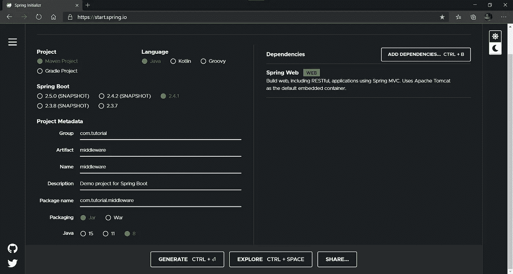

截图来自 [Spring Initializr](https://start.spring.io/) 。

# **了解数据**

如前所述，我们将使用一个名为 JSONPlaceHolder 的伪在线 REST API。这个在线 API 有诸如帖子、待办事项和评论等资源。我们将在这个项目中使用 todos 资源。下图突出显示了使用 Postman 对 todos 资源的不同 HTTP 请求和响应:

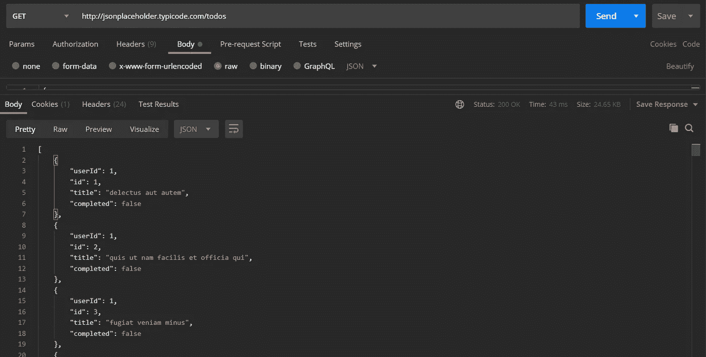

作者显示从假的在线 REST API get all todos 端点返回的数据的截图。

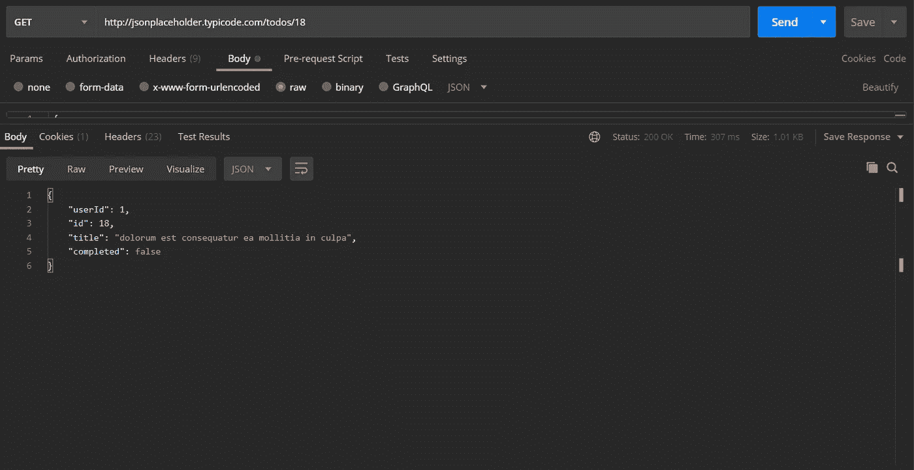

作者展示 REST API 获得单个 todos 端点的数据返回的屏幕截图。

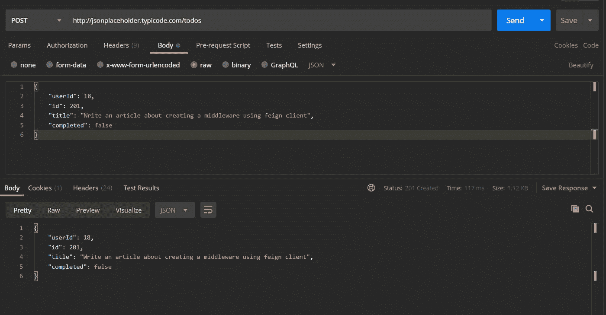

作者显示 todo 创建的屏幕截图。

# **开始编码吧！**

我们将首先创建一个类来模拟从 API 返回的数据。为了保持项目结构的优雅，我们将创建一个名为`Model`的文件夹来包含我们的类。我们将调用这个类`Todo`，它将有四个属性:

*   `private Integer userId`
*   `private Integer id`
*   `private String title`
*   `private Boolean completed`

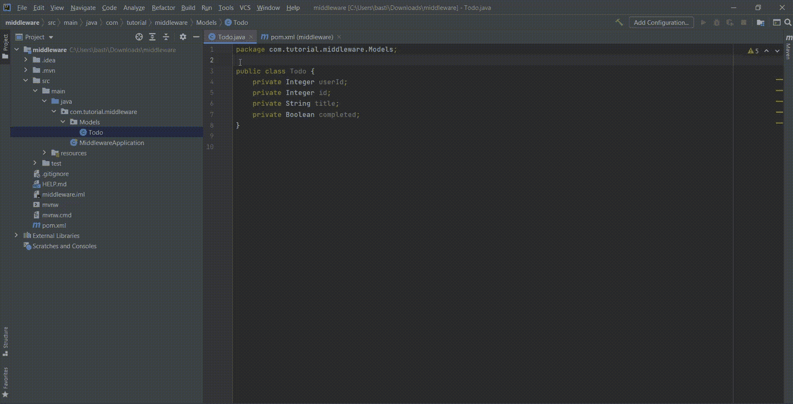

作者分享的屏幕。

上面的`@Data`注释来自我们手动添加和导入的 Lombok 依赖项，如上所示。这个库允许减少为类编写的公共 Java 代码。`@Data`注释自动生成 setters、getters、`toStrings`等。对于`Todo`类。从本质上讲，Lombok 简化了创建普通旧 Java 对象(POJO)的过程。

# **创建虚拟客户端接口**

让我们首先将伪在线 REST API 的基本 URL 存储在我们的`application.properties`文件中。下面显示了一个示例:

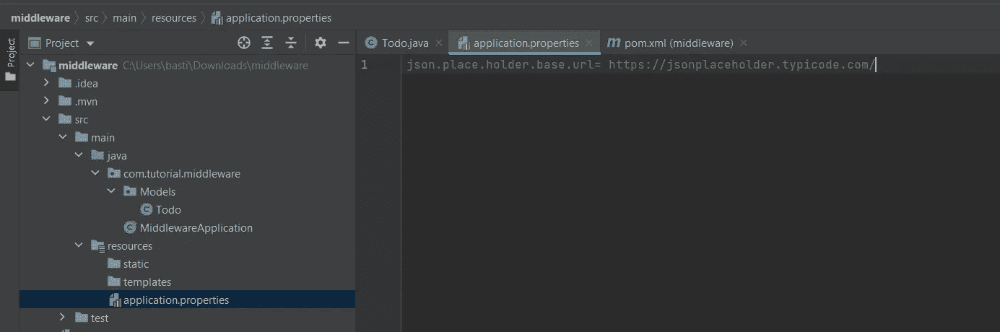

作者截图。

下一步是创建一个名为`Client`的包(文件夹)，它将包含我们的假扮客户端界面。我们将创建三个端点。第一个将用于获取所有 todo，第二个将用于通过在 URL 中提供一个数字作为路径变量来获取单个 todo，第三个将是一个以 todo 对象作为请求主体来创建 todo 的 post 请求。

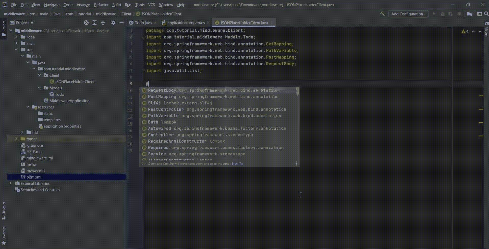

作者的屏幕共享。

让我们关注一下假动作，如上面的 GIF 所示。“假装”注释可以接受多个参数，例如名称、值、URL 和配置。但是，名称或值必须是提供的参数之一。URL 参数将是存储在我们的`application.properties`文件中的基本 URL，并且假装客户端将向它发出 HTTP 请求。请注意，如果 API 需要任何形式的身份验证，我们可以为处理身份验证的 API 资源创建一个配置类，然后提供该类作为配置参数的值。例如:我们分配`configuration = JSONPlaceHolderConfig.class`。

`GetMapping`注释根据提供的 URL 执行 GET HTTP 请求。请注意，当提供给这个注释的 URL 与传递给假装客户端的基本 URL 组合在一起时，就成为了 REST API 的实际资源端点。该接口有两个 get request 方法:一个将返回所有 todo，另一个将返回与提供的路径变量相关的单个 todo。POST 方法接受类型为`Todo`的请求体，并允许使用指定的端点进行 HTTP POST 请求。

# **创建服务**

秉承关注点分离设计原则，我们将创建一个名为`Service`的包，其中包含我们的服务类(`TodoService`)。该服务利用之前在假扮客户端界面中声明的方法。

让我们稍微消化一下代码。

`@Service`注释是更大的`@Component`注释的一部分，也包括`@Controller`注释。`@Service`注释将我们的`TodoService`类声明为一个 spring bean，因此它可以由 spring 应用程序上下文来维护。这个注释将我们的`TodoService`类标记为包含应用程序业务逻辑的服务层。

此外，日志记录对于这种实现非常有用——尤其是在调试或少量审计时。`@Slf4j`(Java 的简单日志门面)注释是 Lombok 库的一部分，它允许我们使用`log.info()`方法轻松地将信息记录到控制台。

第三个注释，`@Autowired`，通过使用依赖注入，消除了对 setters、getters 和 constructors 的需求。这是通过将对象插入到其他对象中来实现的，从而导致组件的松散耦合。因此，我们不需要实例化 Feign client 接口。

# **创建控制器**

外界使用 HTTP 请求与控制器类通信。这是我们的 Spring Boot 应用程序的入口点。当我们将来向应用程序发出 HTTP 请求时，它将直接指向控制器类，在控制器类中进行请求映射以识别和调用所需的方法。

上面的要点展示了位于`Controller`包中的控制器类。注意到什么新情况了吗？上面使用的三个注释不是强制性的，而是个人偏好。它们确保我不必编写额外的代码行。

让我们简要地看一下`@RestController`的注解。`@RestController`是`@Controller`和`@ResponseBody`注释的组合。默认情况下，`@RestController`注释执行映射方法的扫描和检测(`@Controller`注释的功能)。它还自动将控制器类中的方法返回的对象(数据)序列化为 JSON，这将形成 HTTP 响应体(`@ResponseBody`的函数)。

此外，`@RequestMapping`注释相当简单。它将 HTTP 请求映射到不同的方法和类。将`@RequestMapping`注释添加到我们的类定义中，可以确保我们的控制器基本 URL 是我们作为参数传递给所述注释的任何值(在本例中是`todo-list`)。

Lombok 库中的`@RequiredArgsConstructor`注释非常有用。构造函数有时会让我们被许多行代码弄糊涂。`@RequiredArgsConstructor`为任何提供的用 final 关键字声明的类字段创建构造函数(例如`private final TodoService todoService`)。

控制器类中定义的方法使用由服务层(我们的服务类)提供的各自的业务逻辑。每个方法都映射到一个指定的 URL(端点),并从指定的服务方法返回一个响应。

# **整理完毕！**

如果我们执行应用程序，您认为它会像预期的那样工作吗？嗯，不。为什么不呢？原因很简单，我们还没有在应用程序主类上启用 Feign。我们可以通过简单地用`@EnableFeignClients`注释我们的主类来获得成功。这个注释负责扫描所有声明的伪客户端接口。

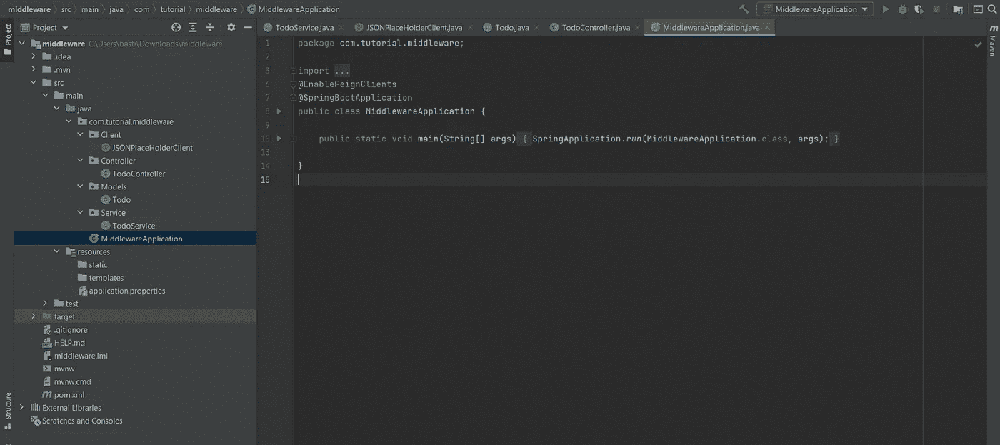

作者展示项目结构和 MiddlewareApplication 类的截图。

下图展示了在我们的中间件应用程序中使用 Postman(客户端)与不同的路由进行通信。

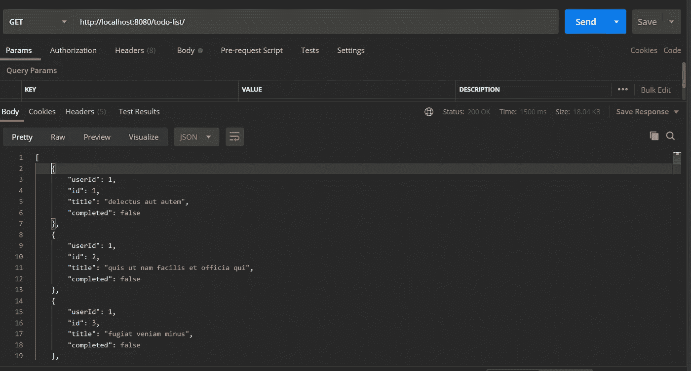

作者展示 get all todos 端点结果的屏幕截图。

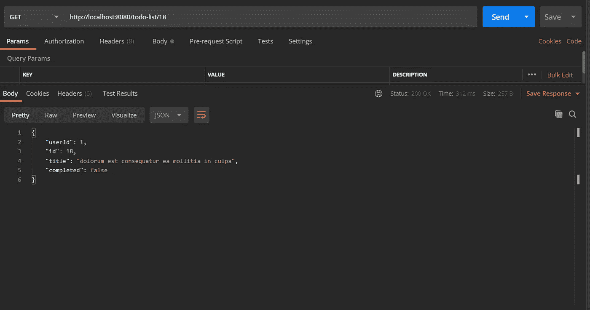

作者突出显示与 get single todo 端点通信的结果的屏幕截图。

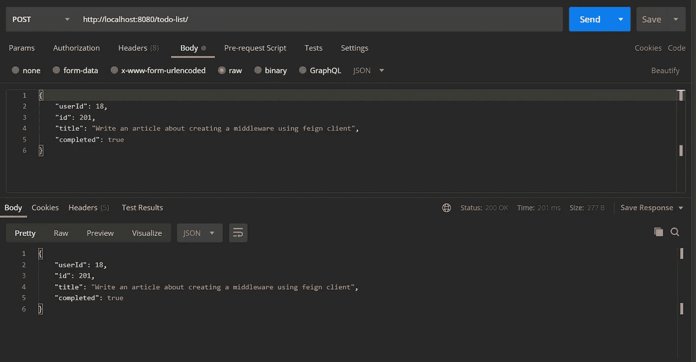

作者演示使用 create todo 端点创建 todo 的屏幕截图。

# 结论

现在我们已经做到了:我们已经开发了一个功能性的应用程序，通过 HTTP 请求来促进通信。我们现在可以通过我们的应用程序与假的在线 REST API 进行通信。应用程序本质上是客户机(Postman)和伪 REST API 之间的中间人，满足中间件的一个定义角色。

这个当前的应用程序只集成了一个 API 服务，但是它有可能与许多提供数据的不同服务进行通信。下一次您必须使用许多不同的数据源时，中间件可以让您的生活变得更容易——特别是使用诸如 Feign 和 Lombok 之类的库。

# **资源**

 [## JSONPlaceholder

### 免费使用假冒的在线 REST API 进行测试和原型开发。截至 2020 年 12 月，由 JSON 服务器+ LowDB 提供支持，服务于…

jsonplaceholder.typicode.com](https://jsonplaceholder.typicode.com/)  [## 什么是中间件-定义和示例|微软 Azure

### 中间件是位于操作系统和运行于其上的应用程序之间的软件。本质上…

azure.microsoft.com](https://azure.microsoft.com/en-in/overview/what-is-middleware/)