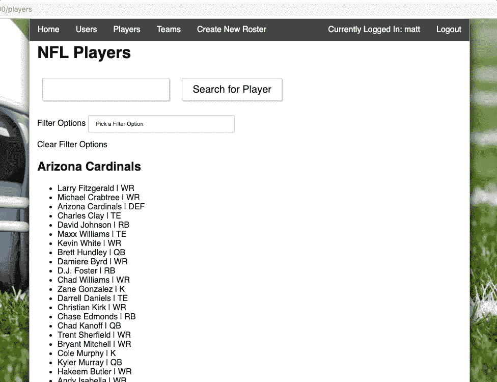

# 在 Ruby on Rails 中创建搜索和过滤功能

> 原文：<https://betterprogramming.pub/making-a-search-and-filter-function-in-rails-a7858987f6f6>

## 学习 cookies 的巧妙使用，减少对影响性能的脚本的依赖

Christian Holzinger 在 [Unsplash](https://unsplash.com/s/photos/rails?utm_source=unsplash&utm_medium=referral&utm_content=creditCopyText) 上拍摄的照片

[Ruby on Rails](https://rubyonrails.org/) 非常适合轻松创建强大而灵活的后端。随着 JavaScript 的流行和灵活性， [Ruby](https://www.ruby-lang.org/en/) 不常被用来创建前端。然而，我认为限制你自己使用 HTML、Ruby 和 CSS 可以帮助开发者学习建立更好的网站。通过测试在没有 JavaScript 的情况下，我们可以将网页的动态性推进到什么程度，我们可以了解 cookies 的巧妙使用，并减少对影响性能的脚本的依赖。

练习在 Rails 中使用 cookies 的一个好方法是为网站创建一个简单的搜索和排序功能。让我们来看看使这两种操作同时成为可能的组件。

# 代码

对于这个例子，我们将使用一个非常基本的梦幻足球花名册应用程序，如果你想按照所示的代码进行操作，可以在这里找到完整的代码。

上述方法处理来自数据库的玩家响应。第一种方法，`handle_search_name`获取一个保存用户搜索输入的 cookie，并使用它来选择名字与搜索项相似的球员，使用`activerecord`方法:其中`@players = Player.where("name LIKE ?", "%#{session[:search_name].titleize}%")`

方法`handle_filters`获取当前可用的玩家列表，然后通过适当的选项“`@players = @players.where(position: session[:filter_option])`进行过滤

这两种方法都依靠*会话*。这个会话实际上只是一个 cookies 的集合。这些 cookies 是通过作为表单的`get`请求的一部分发送回服务器的参数来传递的。所以我们来看看那些是怎么发的。

上面的表单将一个`get`请求发送回同一个页面，但是将用户的搜索词作为一个名为`search_name`的参数传入。

然后在我们的 Rails 控制器中，我们使用:

上面一行代码将传递的参数`search_name`存储为我们的会话的一部分，然后由`handle_search_name`方法使用。虽然我们可以简单地使用参数使我们的搜索工作，但参数的问题是它们不会在请求之间持续。

# 为什么是会话？

如果一个参数没有在多次请求中保持不变，当我们选择过滤器选项(向服务器发出请求)时，用户的搜索词为空。这就是为什么我们必须把这个参数作为会话的一部分存储起来。

Rails 中的会话实际上是一组加密的 cookies。如果我们不希望用户能够手动编辑单个 cookies，我们使用会话。在这种特殊的情况下，我们希望控制特定的 cookies 什么时候持续存在，什么时候被清除。为此，我们将把 cookie 放在一个会话中，而不是作为单独的 cookie 保存。

## 同时搜索和过滤

现在，用户已经给了我们一个要存储的搜索词，我们可以使用过滤器进一步缩小搜索范围。在我们的 HTML 中，每个过滤器选项都有一个表单，让我们看看下面的一个:

上面的代码创建了一个下拉菜单，当它被更改时，将使用所选选项的参数向服务器提交一个请求。回到 Rails 的控制器端，我们处理参数并将其保存到我们的会话中。既然我们有了搜索词和过滤器选项，我们就有了显示结果所需的一切。

# 显示结果

最令人满意的部分是将这些结果显示在页面上。

假设您的路由配置正确，我们需要做的就是在您的控制器中调用这些搜索和过滤处理程序。这将处理每次参数的检查，在我们的会话中存储适当的参数，然后从我们的数据库中组织数据。

然后在我们的 HTML 中，我们必须创建在新排序的数据集中返回的元素。

维奥拉。最终结果应该类似于下面的 gif:

Gif 信用 [@mrwerner392](http://twitter.com/mrwerner392)

使用这个项目中应用的相同原则，我们可以推动 Rails 作为前端感觉更具交互性，并训练自己更好地利用 cookies 等工具。