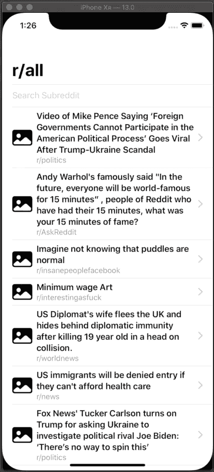

# 用 SwiftUI 制作简单的 Reddit 应用程序

> 原文：<https://betterprogramming.pub/making-a-simple-reddit-app-with-swiftui-d0a3e76d980a>

## 我创建一个经典的初级 iOS 应用程序的经历:一个 Reddit 客户端

由 [Unsplash](https://unsplash.com/search/photos/reddit?utm_source=unsplash&utm_medium=referral&utm_content=creditCopyText) 上的 [Con Karampelas](https://unsplash.com/@conkarampelas?utm_source=unsplash&utm_medium=referral&utm_content=creditCopyText) 拍摄的照片

请注意，本文是使用 macOS Catalina GM 版本、Xcode 11.0 和 Swift 5.1 编写的。因此，某些材料可能会发生变化。

既然 Xcode 11 终于发布了，SwiftUI 看起来也稳定了，我觉得有必要创建一个简单的应用程序，写下我这样做的经历，也许还可以教给那些不怎么使用新框架的人一些东西。

为此，我决定做一个经典的初学 iOS 应用:一个 Reddit 客户端。

# 我们在做什么

正如你在上面的 GIF 中看到的，这个 Reddit 应用程序只允许用户查看单页帖子，点击一行以在网络视图中加载该帖子，并搜索特定的子编辑以查看该子编辑中帖子的第一页。

就是这样！听起来很简单，对吗？

嗯，如果你以前做过应用程序，这很容易！但是，后退一步，想想用 UIKit 实现这个应用程序需要做的一切。

您需要创建一个带有`UITableView`、实现`UITableViewDataSource`和`UITableViewDelegate`的视图控制器，添加一个`UITextField` *、*实现`UITextFieldDelegate`、*、*，然后继续使用 SFSafariViewController 或带有嵌入式`WKWebView`的视图控制器。

除此之外，我们需要在故事板或代码中创建所有的视图。很明显，我们需要编写大量的视图和控制器代码来创建这个简单的应用程序。

然而，有了 SwiftUI，许多视图和控制器代码就消失了。使用 SwiftUI，我们只需创建三个视图:

1.  每行代表一篇 Reddit 帖子。
2.  另一个用于显示帖子的整个列表，以及顶部的搜索文本字段。
3.  第三个显示网页内容。

此外，几乎所有的控制器代码都被转移到视图模型中。

然而，在我们深入 SwiftUI 视图层之前，让我们首先创建我们的模型和视图模型代码，因为这对于 UIKit 和 SwiftUI 实现几乎完全相同。

# 创建模型

为了创建我们的模型，我们首先必须知道当数据来自 Reddit 的 API 时会是什么样子。为此，请打开一个新的选项卡并转到此 [URL](https://www.reddit.com/.json) 。这就是为 Reddit 提供动力的数据的样子。

不幸的是，它可能看起来很难看，所以我建议将它复制并粘贴到一个程序中，如 [JSON Formatter](https://jsonformatter.org) ，它可以用一种程序员更可读的方式格式化 JSON。

对于这个简单的应用程序，我们将去掉所有不需要的东西，只创建两个模型。一个代表一个`Post` ，一个代表我们称之为`Listing`的帖子列表。

## 海报模特

如果你以前用过 iOS 应用程序，这里的一切对你来说应该很熟悉，除了一点:符合`Identifiable`协议。

`Identifiable`协议强迫我们添加 ID 属性，并假设该 ID 的值对于该类型的每个实例都是唯一的。我们这样做是为了让 SwiftUI 能够高效地布局我们的`Posts`列表。

## 上市模式

`Listing`型很直白。它基本上只是保持着`Posts`的列表。

# 创建服务层

与模型一样，这部分代码适用于该应用程序的 UIKit 和 SwiftUI 版本。

## RedditService

这个类也非常简单。它接受一个`URLSession` 来执行网络请求**，一个**`JSONDecoder`**来解析响应，并且它在一个函数中使用这两个函数来执行获取、解析数据，并将数据或错误发送给它的完成处理程序。**

# **创建视图模型**

**这就是事情可能开始变得更奇怪的地方。你可以在顶部看到，我们导入了苹果全新的`Combine` 库，本质上是他们对函数式反应式编程的采用。**

**导入`Combine`允许我们使我们的视图模型符合`ObservableObject` 协议，这反过来允许我们在我们的视图模型和我们的视图之间建立反应绑定。**

**您还会注意到`@Published` 属性包装器。该属性包装器为其关联属性提供了一种快捷方式，以便每当其值发生变化时自动通知其观察者。**

**除了具有可观察的属性之外，这个视图模型还为视图提供了一个接口，用于从 Reddit 的服务器获取帖子。与模型和服务层一样，该方法对于该应用程序的 UIKit 和 SwiftUI 版本是相同的。**

**现在，SwiftUI 有趣的生物…**

# **创建文章行**

**如果在*预览*窗口中运行，您会注意到以下内容:**

****

**我们来分析一下。**

**`PostRow`符合`View` 协议，这意味着我们必须实现`var body: some View`。**

**我不打算深入讨论这到底意味着什么，而是尽可能简洁地总结一下，我们放入计算属性的内容就是视图呈现的内容。**

**在主体中，最外面的视图是一个`HStack` (水平堆栈)，它从左到右水平对齐其中的视图。在`HStack`内部，我们有一个`Image`和一个`VStack`(垂直堆栈)。**

**`Image`是苹果全新的[科幻符号](https://developer.apple.com/design/human-interface-guidelines/sf-symbols/overview/)之一，这是一个简单、易用、日常图标的扩展库。我决定在这个项目中使用一个，只是为了玩玩新的 SF 符号，正如你所看到的，就像图像已经在你的资产目录中一样简单。**

**在`VStack`中，我们有两个`Text` 对象，你猜对了，它们是垂直堆叠的。顶部标签使用标题字体呈现我们的`Post`的标题，底部标签使用副标题字体呈现我们的`Post`的子编辑名称，文本颜色设置为灰色。**

**如您所见，SwiftUI 语法极具表现力，易于阅读，即使您以前从未使用过 SwiftUI。**

# **创建帖子列表**

**最后，这是呈现文章列表的视图。这显然比`PostRow`要复杂一点，所以我们来分解一下，从顶部开始。**

**在这个结构的顶部，我们有之前创建的视图模型，它有属性包装器`@ObservedObject`。**

**这个属性包装器与`ObservableObject` 携手并进，并且允许我们的视图和我们的视图模型绑定在一起，以便它们总是保持同步。**

**然后我们在视图中又多了两个属性:`query` 和`subredditTitle`。这两个都有`@State` 属性的包装器。**

**这个属性包装器的工作方式与`@ObservedObject`非常相似，它保持视图和相关属性的值同步，但是它通常用于我们的视图模型不关心的属性。**

**接下来，我们身体中最外层的视图是一个`NavigationView`，它创建了一个标准的 iOS 导航栏。**

**在我们的`NavigationView`里面，有一个`List`。列表给了我们创建任意组合的垂直滚动列表的能力。**

**在`List`的顶部是搜索`TextField`。初始化器将占位符文本设置为“Search Subreddit”，将文本字段中的值绑定到`query`属性，当用户点击 return 时，它执行结尾的闭包。在这种情况下，更新`subredditTitle`属性并执行提取。**

**在`TextField`下面，我们遍历视图模型中的帖子数组，为每个帖子创建一个`PostRow` 并将其包装在一个`NavigationLink`中。**

**将每一行包装在`NavigationLink` 中会将公开指示符添加到每一行的尾部，并自动添加往返于目的地的推送和弹出功能`View`。**

**最后，我们需要两个修改器来完成这个`View`。首先，`List`需要修饰符`.navigationBarTitle(Text(subredditTitle))` 将导航视图中的标题设置为`subredditTitle`属性的值。**

**第二，`NavigationView` 需要修饰符`.onAppear(perform: fetchListing)` ，这样当这个视图出现在屏幕上时，文章列表就会被获取。**

# ****创建网络视图****

**不幸的是，SwiftUI 没有为我们提供它自己版本的 web 视图(还没有)，但是它确实为我们提供了一个很好的协议，让普通的`UIView`像 SwiftUI 视图一样工作:`UIViewRepresentable`。**

**这个协议要求我们实现`makeUIView`和`updateUIView`。**

**`makeUIView` 是一个需要我们定义正在创建的`UIView`的类型，然后创建它的函数。**

**`updateUIView` 每当我们的视图需要更新自身以响应它所呈现的数据的变化时就会被调用。然而，在这种情况下，当视图被创建时，它只被调用一次，它所做的就是在`WKWebView`中加载 URL。**

# **更新场景代理**

**最后，为了让整个应用程序在我们按下 play 时工作，我们需要更新`SceneDelegate`来创建我们需要的所有初始数据，并将其传递给应用程序的第一个`View`:T10。**

**就是这样！这就是使用 SwiftUI 和 Combine 创建一个简单应用程序的全部内容。**

# **结论**

**应该清楚 SwiftUI 在多大程度上简化和减少了我们需要为视图和控制器层编写的代码。**

**当您也使用 Combine 框架时，整个代码库变得更加声明性、简洁和自文档化。然而，它确实感觉 SwiftUI 仍然处于婴儿期，因为随着你越来越多地使用它并试图在界限之外着色，会有随机的错误出现。**

**从好的方面来看，我们已经可以用 SwiftUI 优先的方法制作真实世界的工作应用程序，这让我对未来的更新充满希望。我希望，从现在起的一两年内，SwiftUI 将为黄金时间做好准备。**

**要查看整个项目，请查看我的 GitHub 上的[回购。](https://github.com/etlasky/Reddit-SwiftUI)**