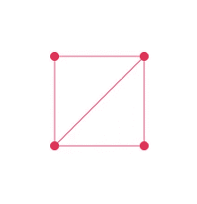
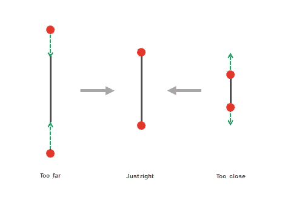
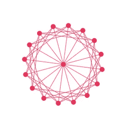
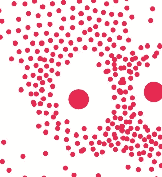
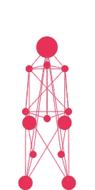
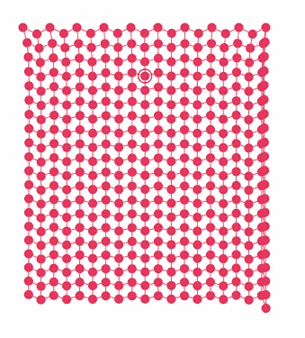

# 用 JavaScript 制作一个 Verlet 物理引擎

> 原文：<https://betterprogramming.pub/making-a-verlet-physics-engine-in-javascript-1dff066d7bc5>

## 在物理引擎的引擎盖下看一看

有没有想过用 JavaScript 能不能做出自己的物理引擎？如果是这样，你来对地方了。我们打算用 JavaScript 从头开始构建一个物理引擎。

照片由[查德·科尔乔夫](https://unsplash.com/@cakirchoff?utm_source=medium&utm_medium=referral)在 [Unsplash](https://unsplash.com?utm_source=medium&utm_medium=referral) 上拍摄

在我们开始之前，我应该提到这个教程假设你对向量有很好的理解。

如果您还没有理解这一点，请不要担心——向量很简单:[获取 Vector.js](https://anuraghazra.github.io/CanvasFun/src/lib/Vector.js)

# **什么是 Verlet 物理？**

根据维基百科:

> **Verlet 积分**是一种用于积分牛顿运动方程的数值方法。在分子动力学模拟和计算机图形学中，它经常被用来计算粒子的轨迹。该算法于 1791 年由德朗布尔首次使用，此后被多次重新发现，最近一次是由 Loup Verlet 在 20 世纪 60 年代用于分子动力学。

简单来说，Verlet 物理学只是一个由点连接而成的系统。

## 在 Verlet 系统中，我们有两个主要组件:

一个盒子。用点和棒连接

1.  点(圆点)
2.  约束(棒(

## 点

这些点应用了非常简单的物理原理。

我们必须跟踪这些点的当前和旧的**位置**来给它们添加物理行为——当我们实际实现时你会看到这一点。

点. js

我们有了基本的设置，现在让我们渲染点*和*让它们移动。

Dot.js - update()

更新函数将更新位置并处理点的物理特性。

基本上，要做 Verlet 积分，我们必须根据点的旧位置计算速度。

在第一行中，我们用旧位置减去当前位置得到期望的速度。计算出速度后，我们对这些点施加摩擦力，使它们停止运动，而不是永远滑动。

然后，我们通过说`this.oldpos.setXY(this.pos.x, this.pos.y)` 来更新旧的位置，并将速度和重力添加到位置。

我们还想让它们留在画布内，所以我们必须添加一些检查。我们还将添加另一个功能:`constrain()`:

dot . js-constraint()

让我们添加渲染方法:

Dot.js - render()

设置:

index.js -设置示例

我们在随机位置添加了更多的点，然后`update() constrain() render()`它们。

让我们看看这是什么样子:

Verlet Physics — Dot.js

很好——这只是一个开始，但我们终于有所收获了。

现在我们要添加棍子了！

## 插入

棍子是小柱物理学的核心。棍子确保点彼此不会太远或太近——它们将点限制在一定的距离内。

[https://slsdo.github.io/blob-family/#constraint](https://slsdo.github.io/blob-family/#constraint)

**Stick.js** 类相当简单。它需要两个**点**作为参数和长度。但是如果长度没有定义，我们将根据点的位置来计算长度。

Stick.js

现在让我们添加算法的实际核心。这将根据棍子的距离来解析和更新点的位置，最终将它约束到与所有其他点的特定距离。

Stick.js - update()

好了，我想我们可以走了！让我们添加渲染功能:

Stick.js - render()

设置:

设置-创建盒子

让我们看看结果:

一个简单的盒子

如你所见，我们有一个盒子！不管怎样，一个看起来像果冻做的盒子。这是因为在单个帧中，每根棍子更新一次不足以让点停留在它们的长度上。我们必须尽可能多地迭代模拟——迭代次数越多，刚性盒就越多。

将这几行代码添加到现有代码中会使该框变得僵化:

好了，让我们来看一个更新的例子:

VerletPhysics —更新示例

看起来很神奇，不是吗？

# Entity.js:在一个地方管理点和棒

好了，现在我们有了 Dot.js 和 Stick.js。它们都运行得很好，但问题是我们无法控制如何使用它们。

我们将创建一个实体类，它将轻松处理 Verlet 对象的更新和呈现。我将把整个代码粘贴到这里—这没什么特别的:

Entity.js —基本 OOP

使用实体类:

是的，这看起来非常干净和易于管理！

让我们来看看最后的结果:

现在我们可以用这个 Entity.js 类创建许多有趣的 Verlet 形状！

# Verly.js:我写的一个物理引擎

js 是我写的一个健壮的 Verlet 物理引擎。它有许多很酷的功能:

1.  吸引-排斥行为
2.  基本形状
3.  盒子，六角形，布，绳子，布娃娃
4.  布料撕裂
5.  排版和文本

使用 Verly.js，您只需 15 行代码就能制作出可撕裂的布料:

Verly.js 行代码的可撕布

演示:[https://anuraghazra.github.io/Verly.js/](https://anuraghazra.github.io/Verly.js/)

源代码:[https://github.com/anuraghazra/Verly.js](https://github.com/anuraghazra/Verly.js)

例子:[https://anuraghazra.github.io/Verly.js/examples](https://anuraghazra.github.io/Verly.js/examples)

看看我前段时间创建的物理引擎中的一些例子。我几乎把所有东西都加进了那个引擎。

球形 [anuraghazra.github.io](https://anuraghazra.github.io/Verly.js/examples)

吸引排斥行为 [anuraghazra.github.io](https://anuraghazra.github.io/Verly.js/examples)

布娃娃 [anuraghazra.github.io](https://anuraghazra.github.io/Verly.js/examples)

[anuraghazra.github.io](https://anuraghazra.github.io/Verly.js/examples)

Codepen 示例:

Verly.js 的 API 因为是实体组件结构，所以易用灵活。

感谢阅读——我希望你学到了一些东西！

**其他了解 Verlet 物理的地方:**

1.  [Keith Peter 的 CodingMath Verlet 物理视频](https://www.youtube.com/watch?v=3HjO_RGIjCU)。
2.  http://datagenetics.com/blog/july22018/index.html 数据遗传[的惊人文章](http://datagenetics.com/blog/july22018/index.html)