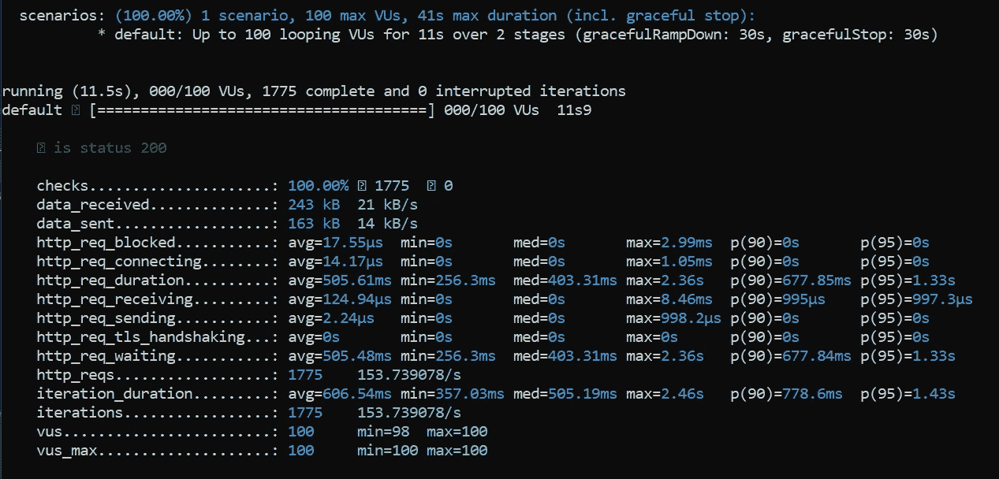
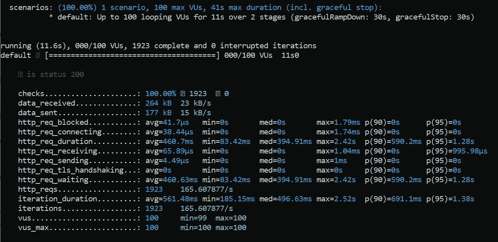
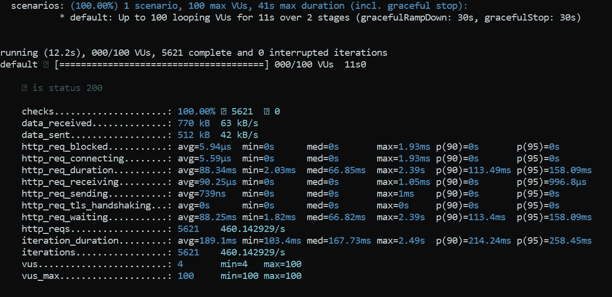

# 在 Python 中进行 API 请求:aiohttp 客户端与请求

> 原文：<https://betterprogramming.pub/making-api-requests-in-python-aiohttp-client-vs-requests-26a7025c39a6>

## 探索基本语法并比较性能


作者图片

本教程重点比较 Python 中调用 API 请求的两个主要包。

第一个是 [Requests: HTTP for Humans](https://requests.readthedocs.io/en/master/) ，这是开发人员最常用的包之一。这是一个相当简单明了的 Python HTTP 库。此外，它为 HTTP 1.1 和 HTTP 连接池的完全自动化提供了强大的支持。

另一方面， [aiohttp](https://github.com/aio-libs/aiohttp) ，是一个用于客户端和服务器端的异步 http 框架。它旨在以非阻塞方式充分利用网络操作。此外，现在大多数服务器都是使用 ASGI 服务器构建的。异步调用 API 在性能方面具有优势，尤其是当 I/O 操作构成项目中的大部分进程时。然而，与请求相比，语法要冗长得多，这使得新开发人员很难实现。

在本教程中，我们将:

1.  实现一个简单的 [FastAPI](https://fastapi.tiangolo.com/) 服务器，用 GET route 操作作为获取数据的外部 API
2.  用两个 GET route 操作实现另一个 FastAPI 服务器，这两个操作将使用请求和 aiohttp 模块调用外部 API
3.  在第二台服务器上创建一个负载测试脚本，以评估每秒的请求数

我将使用 [k6](https://k6.io/docs/) 包进行负载测试。请随意使用您自己的负载测试工具，例如:

*   [K6 介绍:一个 API 负载测试工具](https://medium.com/better-programming/an-introduction-to-k6-an-api-load-testing-tool-132a0d87827d)
*   [Locust 简介:Python 中的一个开源负载测试工具](https://medium.com/better-programming/introduction-to-locust-an-open-source-load-testing-tool-in-python-2b2e89ea1ff)

让我们继续下一部分，开始安装必要的模块。

# Python 包

强烈建议您在继续安装之前设置一个虚拟环境。

## FastAPI

运行以下命令进行安装。

```
pip install fastapi
```

## 紫玉米

为了运行 FastAPI，你需要一个 ASGI 服务器，比如[uvicon](https://www.uvicorn.org/)或者 [Hypercorn](https://pypi.org/project/Hypercorn/) 。我在这个教程中使用的是 Uvicorn。您可以安装最低版本，如下所示:

```
pip install uvicorn
```

如果您正在寻找标准版本，您应该运行以下代码。

```
pip install uvicorn[standard]
```

# k6

k6 的安装取决于您机器的操作系统。

## Windows 操作系统

Windows 用户应该使用可用的 MSI 安装程序。前往下面的链接并下载安装程序。然后通过运行它来正常安装。

*   [k6 安装器](https://dl.bintray.com/loadimpact/windows/k6-v0.29.0-amd64.msi)

## 苹果个人计算机

[在 Mac 中安装时，Brew](https://brew.sh/) 是首选。运行以下命令来安装 k6。

```
brew install k6
```

## Debian/Ubuntu

apt-get 可以用来在你的 Debian 或者 Ubuntu 操作系统中安装 k6。

```
sudo apt-key adv --keyserver hkp://keyserver.ubuntu.com:80 --recv-keys 379CE192D401AB61echo "deb [https://dl.bintray.com/loadimpact/deb](https://dl.bintray.com/loadimpact/deb) stable main" | sudo tee -a /etc/apt/sources.listsudo apt-get updatesudo apt-get install k6
```

可能会出现由于防火墙或代理而无法获得密钥的问题。在这种情况下，请改用以下命令。

```
wget -q -O - [https://bintray.com/user/downloadSubjectPublicKey?username=bintray](https://bintray.com/user/downloadSubjectPublicKey?username=bintray) | sudo apt-key add -
```

## 红帽/CentOS

对于 CentOS 用户，您可以按如下方式轻松安装它:

```
wget [https://bintray.com/loadimpact/rpm/rpm](https://bintray.com/loadimpact/rpm/rpm) -O bintray-loadimpact-rpm.reposudo mv bintray-loadimpact-rpm.repo /etc/yum.repos.d/sudo yum install k6
```

# FastAPI 服务器作为外部 API

创建一个名为`external_api.py`的新 Python 脚本，并在其中添加以下代码。我们将使用它作为外部 API 服务器。它包含一个简单的 GET route 操作，该操作接受一个名为`id`的字符串输入并将 JSON 返回给调用者。

```
from fastapi import FastAPIapp = FastAPI()@app.get("/user/")
async def user(id: str):
    return {"id": id}
```

保存文件并在命令行中运行以下命令来启动服务器。默认情况下，它将使用端口 8000 运行。如果其他程序正在使用该端口，请对其进行相应的修改。

```
uvicorn external_api:app
```

# 用于测试 aiohttp 和请求的 FastAPI 服务器

## 导入

创建一个名为`myapp.py`的新 Python 文件，并在文件顶部添加以下 import 语句。

```
from fastapi import FastAPI
import requests
import aiohttpapp = FastAPI()
```

## 启动和关闭事件

继续添加以下启动和关闭事件。startup 事件负责为请求和 aiohttp 初始化会话对象。我们将使用会话对象来重用底层的 TCP 连接。当向同一主机发出请求时，这可以显著提高性能。某些参数将在每个请求中保持不变。

作为清理过程的一部分，shutdown 事件负责调用内置的`close`函数来关闭 aiohttp 客户端会话。

```
@app.on_event("startup")
async def startup_event():
    app.requests_session = requests.Session()
    app.aiohttp_session = aiohttp.ClientSession()@app.on_event("shutdown")
async def shutdown_event():
    await app.aiohttp_session.close()
```

## 路线操作

定义以下路由操作，该操作在被请求时对我们的外部 API 进行 HTTP GET 调用。结果将作为 JSON 直接返回。

```
@app.get("/requests_api")
async def requests_api():
    r = app.session.get('http://localhost:8000/user/?id=001') return r.json()
```

接下来，让我们定义另一个路由操作，但是这次我们将使用 aiohttp 会话对象。您需要将它包装在上下文管理器中才能正常工作。

请注意，我们在启动事件中只创建了一次`aiohttp_session`对象。您不应该为每个请求创建一个新的会话，因为这样做的成本非常高。对于调用多个服务器的复杂情况，最佳实践是为每个服务器定义一个会话。

```
@app.get("/aiohttp_api")
async def aiohttp_api():
    async with app.aiohttp_session.get('http://localhost:8000/user/?id=001') as response:
        return await response.json()
```

## 正在启动 FastAPI 服务器

完成后，保存文件并打开一个新的终端。激活所需的虚拟环境，并指向您的工作目录。接下来，运行以下命令来启动它。

```
uvicorn myapp:app --port 8001
```

由于我们的外部 API 运行在默认端口 8000 上，我们需要为它指定一个新端口。在本教程中，我使用端口 8001。请随意相应地修改它。

# 使用 k6 加载测试脚本

在本节中，我们将使用 JavaScript 创建加载测试脚本。这允许我们评估请求和 aiohttp 之间的性能。创建一个名为`test_scripts.js`的新文件。

## 导入

在文件顶部添加以下 import 语句。

```
import http from 'k6/http';
import { check, sleep } from 'k6';
```

## 选择

继续追加下面的代码，它表明了我们测试的选项。

```
export let options = {
  stages: [
    { duration: '1s', target: 100 },
    { duration: '10s', target: 100 },
  ],
};
```

它会在一秒钟内产生 0 到 100 个 VUs，并在接下来的十秒钟内保持相同的 VUs 数量。随意修改阶段或 vu 的数量。

## 根据请求测试功能

之后，定义一个新的函数作为我们测试的默认函数。每个 VU 都会反复调用这个函数，直到测试结束。我们先调用`requests_api`，测试它的性能。

```
export default function () {
  let res = http.get('http://localhost:8001/requests_api');
  check(res, {
   'is status 200': (r) => r.status === 200,
 });
  sleep(0.1);
}
```

在函数内部，我们将进行检查，以确定返回的响应是否为状态 200。此外，我已经添加了一个迷你睡眠，以正确模拟我们的用户将如何发送请求。

## 运行测试脚本

保存文件并打开另一个终端。将它指向您的测试脚本的位置。运行以下命令开始测试。

```
k6 run test_scripts.js
```

在测试结束时，您应该会得到以下输出。



作者图片

根据上图，我们的测试在整个测试中总共发出了 1，775 个请求。这导致使用请求模块每秒大约有 153 个请求。

如果您有疑问，只需重新运行测试来验证您的结果的平均每秒请求数。我第二次运行得到了以下结果。



作者图片

## aiohttp 上的测试函数

完成后，让我们将测试 URL 修改为`aiohttp_api`。只需更改以下内容:

```
let res = http.get('http://localhost:8001/requests_api');
```

对此:

```
let res = http.get('http://localhost:8001/aiohttp_api');
```

保存您的测试脚本，并重新运行以下命令。

```
k6 run test_scripts.js
```

测试完成后，您的终端将显示以下结果。



作者图片

每次运行的实际结果可能会有很大差异。平均下来，结果应该比我们在`requests_api`上的第一次测试要高。这表明，在对 ASGI 服务器的`async`路由操作进行 API 调用时，aiohttp 比 Requests 稍有优势。

说到这里，请注意，如果瓶颈不是主要由 I/O 操作引起的，aiohttp 不会提高您的性能。假设你的机器学习 API 在使用请求的时候，性能大概是每秒十个请求。即使您将其切换到 aiohttp，它仍然会或多或少地保持不变。

# 结论

让我们回顾一下今天所学的内容。

我们首先详细解释了请求和 aiohttp 模块之间的区别。

然后我们继续创建一个简单的 FastAPI 服务器作为外部 API，它将被我们的第二个服务器调用。我们实现了第二个服务器，它包含两个路由操作，用于请求和 aiohttp。

我们继续用 JavaScript 编写 k6 负载测试脚本。我们在`requests_api`开始测试，然后是`aiohttp_api`。这使我们能够评估和比较他们的表现。

感谢你阅读这篇文章。希望在下一篇文章中再见到你！

# 参考

*   [aiohttp 客户端快速入门](https://docs.aiohttp.org/en/stable/client_quickstart.html)
*   [aiohttp GitHub 页面](https://github.com/aio-libs/aiohttp)
*   [请求—会话对象](https://requests.readthedocs.io/en/master/user/advanced/#session-objects)