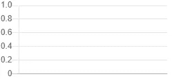
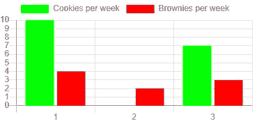
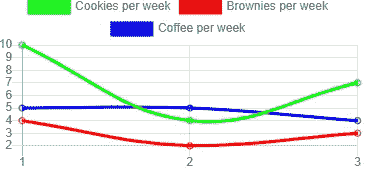

# 用图表制作漂亮的图表

> 原文：<https://betterprogramming.pub/making-beautiful-charts-with-chartjs-46a045465c24>

## *简单灵活的 JavaScript 图表*


照片由[卢克·切瑟](https://unsplash.com/@lukechesser?utm_source=unsplash&utm_medium=referral&utm_content=creditCopyText)在 [Unsplash](https://unsplash.com/s/photos/chart?utm_source=unsplash&utm_medium=referral&utm_content=creditCopyText) 上拍摄

到处都是图表。广告信息图、媒体统计数据、YouTube 统计数据、你的锻炼统计数据，甚至你的 K/D 比率都可以在图表中看到。如果您正在开发一个带有仪表板的应用程序，我确信您将需要一些图表来显示各种统计数据。

有许多不同的图表、图表库和创建图表的方法。ChartJS 是最大的 HTML5 / Canvas 图表创建库之一。它有一些漂亮的图表，也有很好的个性化。而且是开源的！

我将使用一个 NextJS 项目作为一个基于 React 的开始网页，但是你可以使用你喜欢的任何东西，因为 ChartJS 是本文的主题，所以我不会说得太详细。

# 装置

让我们从初始化 npm 开始，通过逐个运行以下命令来安装我们需要的所有包，包括 ChartJS。以下是命令:

```
npm init
npm i next react react-dom
npm i chart.js --save
```

接下来的步骤是针对 NextJS 的。我们需要更新我们的`package.json`文件中的脚本，并创建一个`pages`目录，其中包含我们的`index.js`，我们将在其中使用图表。您可以使用以下命令:

```
"scripts": {  
  "dev": "next dev",
  "build": "next build",
  "start": "next start"
}
```

在新的`pages/index.js`中，您可以复制粘贴最小页面的以下代码，如下所示:

当你运行`npm run dev`时，你应该能够浏览到`localhost:3000`来查看你的最小页面。

# 创建您的第一个图表

我们首先需要一块画布。HTML `canvas`元素就可以了。我们也需要参考它。在 React 中你会使用一个`ref`，在普通的 HTML 和 JS 中你会使用`document.getElementById('myChart')`。代码如下:

我们创建对 canvas 元素的引用，并将图表类型设置为条形图。如果运行这段代码，您将看到一个空的响应图表。



如果你把屏幕变小，空的图表

要添加数据，我们需要向图表对象添加一个`data`对象。在这个数据对象中，我们可以声明所有的统计数据、标签等等。让我们首先使用下面的代码添加一些关于我们每周吃的饼干数量的统计数据:

我们添加了一个带有标签、颜色和数据的数据集。我们可以添加更多的数据集，以创建更有用的图表来比较数据。



如果我们复制粘贴当前的数据集对象并做一些修改，我们将得到这个图表。请注意，图表的最低值将决定最低的 Y 轴。把第二周的饼干数量换成另一个数字来看这个。

# 选择

要更改 Y 轴上的刻度或其他选项，我们需要使用图表对象中的`options`对象。对于这一部分，我们将使用[这个数据集](https://gist.github.com/mbvissers/1bf07733fa7d440fa31ae612b7249d2c)。它有一些细微的变化，我不会深入探讨。下面是一个简单的折线图，与上面的非常相似。



你现在可以注意到 Y 轴从两点开始。但是当然，我们希望它从零开始。为此，我们需要添加`options.scales.yAxes.ticks.beginAtZero`选项。这些都是嵌套对象。代码如下:

你可以看到这个物体可以快速增长。幸运的是，您可以像预期的那样以编程方式添加、更改和删除这些值。它甚至将大多数数据操作动画化，并提供开箱即用的工具提示。

# 结论

ChartJS 是一个用于创建图表的漂亮且制作精良的库。这些图表看起来轻巧而结实，因为制作这些图表很容易。该对象可以快速增长，但非常易于管理，我肯定会在未来的项目中使用这个库。

想了解更多信息，我推荐看一下[官方文档](https://www.chartjs.org/docs/latest/)。

感谢您的阅读，祝您愉快。