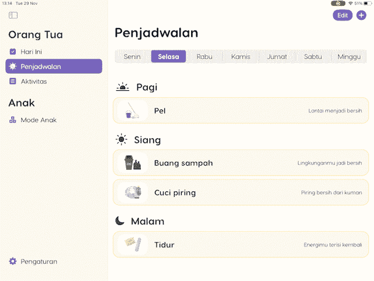
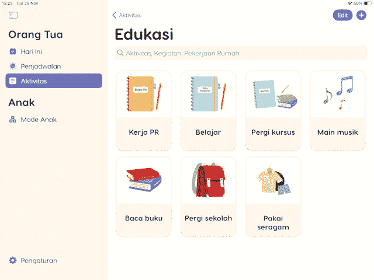
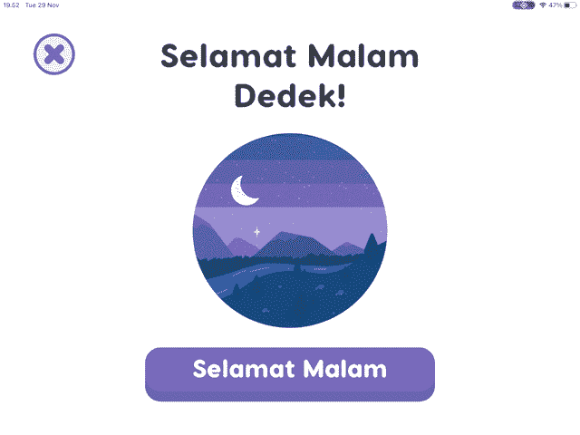

# 如何使用 UIKit 创建摆动动画

> 原文：<https://betterprogramming.pub/making-components-go-alive-using-uikit-animations-24fa11d19c02>

## 让组件在你的 iOS 应用中活起来


[Alex Wing](https://unsplash.com/@alexjwing?utm_source=medium&utm_medium=referral) 在 [Unsplash](https://unsplash.com?utm_source=medium&utm_medium=referral) 上拍摄的照片

在本文中，我将分享一些我在按钮和 UICollectionView 单元格等简单组件上进行微交互的经验。

这些在我们的宏观挑战应用中实现的微观互动——OTIN 最初是设计团队的一个挑战，我们的技术团队构建了它。

# 关键词:

*   UIView 动画
*   `CGAffineTransform`
*   `CAKeyFrameAnimation`

# 什么是微互动？

微交互是小但功能性的动画，它向用户提供关于用户界面内组件的当前状态或条件的反馈。像加载动画和按钮收缩这样的事情可以被认为是微交互。

看看下面一些微交互的例子:



这是默认的编辑模式动画，当`tableView.isEditing`设置为`true`时触发。缩小单元左右部分的动画给人一种感觉，在单元的两边都有东西可以交互——在我们的例子中就是删除和重新排序。

当主屏幕处于编辑模式时，下面的摆动动画受默认 iOS / iPadOS 动画的启发。



定义说得够多了，让我们看看更多的例子以及如何制作它们。

# 动画 UITableView 编辑模式

要创建像上面第一个例子那样的编辑模式动画，实际上不需要任何动画代码。这是`UITableView`的默认状态。您只需要根据自己的需要实现委托。

创建一个处理编辑状态切换的按钮:

```
@objc private func editButtonAction() {
    tableView.setEditing(!tableView.isEditing, animated: true)
    // You can also use the .toggle() function
}
```

通过实现委托，`UITableView`将自动调用激活的适当编辑模式。

当通过`tableView.deleteRows(...)`删除和通过`tableView.insertRows(...)`插入时，您还可以浏览每个单元格的动画:

```
extension ParentRoutineViewController: UITableViewDelegate, UITableViewDataSource {
		...
    // Defines the editing style for each cell
    func tableView(_ tableView: UITableView, editingStyleForRowAt indexPath: IndexPath) -> UITableViewCell.EditingStyle {
        guard tableView.isEditing else { return .none }
        return .delete
    }

    func tableView(_ tableView: UITableView, commit editingStyle: UITableViewCell.EditingStyle, forRowAt indexPath: IndexPath) {

        if editingStyle == .delete {
            // What happens after clicking delete?
	    tableView.deleteRows(at: [indexPath], with: .left)
        }
    }		
}

extension ParentRoutineViewController: UITableViewDragDelegate {
  func tableView(_ tableView: UITableView, itemsForBeginning session: UIDragSession, at indexPath: IndexPath) -> [UIDragItem] {
        // What to do on drag?
    }

    func tableView(_ tableView: UITableView, moveRowAt sourceIndexPath: IndexPath, to destinationIndexPath: IndexPath) {
        // What to do after dropping?
    }
}
```

# 制作 UICollectionViewCell 动画

为了在`UICollectionViewCell`上创建摆动动画，我们可以使用`CAKeyframeAnimation`，因为我们想要控制在每个动画运动中变换发生的距离。

```
// Create wobble animation
let wobble = CAKeyframeAnimation(keyPath: "transform.rotation")
wobble.values = [0.0, -0.025, 0.0, 0.025, 0.0]
wobble.keyTimes = [0.0, 0.25, 0.5, 0.75, 1.0]
wobble.duration = 0.4
wobble.isAdditive = true
wobble.repeatCount = Float.greatestFiniteMagnitude
```

```
// Add wobble animation to each collection view cell
collectionView.indexPathsForVisibleItems.forEach { (indexPath) in
    let cell = parentActivityListDetailView.collectionView.cellForItem(at: indexPath) as! CustomCollectionViewCell
    cell.layer.add(wobble, forKey: "wobble")
}
```

完成编辑后，不要忘记移除动画:

```
collectionView.indexPathsForVisibleItems.forEach { (indexPath) in
    let cell = parentActivityListDetailView.collectionView.cellForItem(at: indexPath) as! CustomCollectionViewCell
    cell.layer.removeAllAnimations()
}
```

# 动画 UIButtons 收缩和增长

按钮是最常见的动画组件之一，尤其是在采用游戏化的时候。在这个例子中，让我们来看看`UIButton`上的收缩和增长动画。



你必须先创建一个按钮。您可以使用`@IBOutlet`通过故事板来创建它，或者通过编程来创建它。在这里我创建了一个名为 button 的标准`UIButton`。

我们使用`CGAffineTransform`是因为它常用于缩放和平移。使用`scaleX` 和`y`参数进行缩放操作，使用`translationX`和`y`进行平移操作。

```
button.addTarget(self, action: #selector(animateUp), for: .touchUpOutside)
button.addTarget(self, action: #selector(animateUp), for: .touchUpInside)
button.addTarget(self, action: #selector(animateDown), for: .touchDown)
```

```
// Set the default state with 1.0 scale on the up state
@objc func animateUp(_ sender: UIButton) {
    UIView.animate(withDuration: 0.1, animations: {
          button.transform = CGAffineTransform(sscaleX: 1.0, y: 1.0)
    }, completion: { _ in
      // Completion Handler
    })
}

// Scale down to 0.9 when on click
@objc func animateDown(_ sender: UIButton) {
    UIView.animate(withDuration: 0.1, animations: {
          button.transform = CGAffineTransform(scaleX: 0.9, y: 0.9)
    }, completion: { _ in
      // Completion Handler
    })
}
```

# UIView 动画— PIN 输入


## 引脚焊盘

这个项目中的 pin pad 实际上是一个 UICollectionView。所以为了模仿 UIButton 的状态，比如`.touchDown`、`.touchUpInside`和`.touchUpOutside`，我们必须使用集合视图本身的一些协议存根。有关详细信息，请查看下面的代码。

```
extension ChildPinUnlockViewController: UICollectionViewDelegate {

    // touchUpOutside
    public func collectionView(_ collectionView: UICollectionView, didUnhighlightItemAt indexPath: IndexPath) {
        let cell = collectionView.cellForItem(at: indexPath) ?? UICollectionViewCell()
        UIView.animate(withDuration: 0.05, animations: {
            button.transform = CGAffineTransform(scaleX: 1.0, y: 1.0)
        }, completion: { _ in
          // Completion Handler
        })

    }

    // touchDown
    public func collectionView(_ collectionView: UICollectionView, didHighlightItemAt indexPath: IndexPath) {
        let cell = collectionView.cellForItem(at: indexPath) ?? UICollectionViewCell()
        UIView.animate(withDuration: 0.05, animations: {
            button.transform = CGAffineTransform(scaleX: 0.9, y: 0.9)
        }, completion: { _ in
          // Completion Handler
        })
    }

    // touchUpInside
    func collectionView(_ collectionView: UICollectionView, didSelectItemAt indexPath: IndexPath) {
        let cell = collectionView.cellForItem(at: indexPath) ?? UICollectionViewCell()
        UIView.animate(withDuration: 0.05, animations: {
            button.transform = CGAffineTransform(scaleX: 1.0, y: 1.0)
        }, completion: { _ in
          // Completion Handler
        })
    }

}
```

当 PIN 码错误时，我们希望像在 iOS 锁定屏幕上一样左右摇动 PIN 码输入栏。为了实现这一点，我们想要指定关键帧平移，我们必须使用`CAKeyframeAnimation`

```
let shake = CAKeyframeAnimation(keyPath: "transform.translation.x")
shake.values = [0, 20, -20, 0]
shake.duration = 0.25
shake.repeatCount = 1
pinStackView.layer.add(shake, forKey: "shake")
```

仅此而已。感谢阅读。

我们的 Otin 应用程序帮助印度尼西亚自闭症谱系障碍(ASD)儿童的父母保持他们孩子的日常生活和一致性，以提高自我独立性。

*   [GitHub—gal-Bert/nuro:Petak 9 宏挑战](https://github.com/gal-bert/nuro)
*   [在试飞中加入欧廷测试版](https://testflight.apple.com/join/2DVnkWrx)